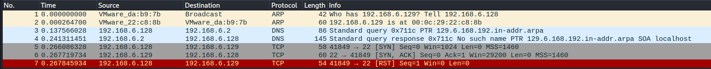
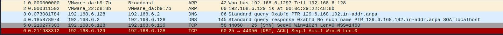
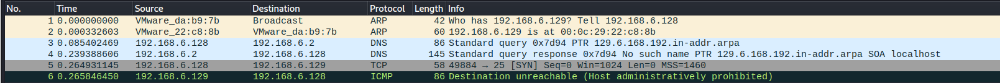
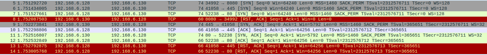

# Section 1: course 2: Assessment Methodologies: Footprinting & Scanning    

### Table of Contents

- [Host Discovery](#Host-Discovery)
- [Port Scanning](#Port-Scanning)
- [Firewall/IDS Evasion](#firewallids-evasion)
- [Optimizing nmap scan](#optimizing-nmap-scan)

<br />

---

### Host Discovery

```bash
└─# fping -a -g 192.168.6.0/24 2> /dev/null           
192.168.6.2
192.168.6.128
```

<br />

```bash
└─# nmap -sn 192.168.6.0/24  => only sends arp packets
Starting Nmap 7.94 ( https://nmap.org ) at 2023-12-30 07:42 EST
Nmap scan report for 192.168.6.1
Host is up (0.0013s latency).

Nmap scan report for 192.168.6.2
Host is up (0.00017s latency).

Nmap scan report for 192.168.6.132
Host is up (0.0014s latency).

Nmap scan report for 192.168.6.254
Host is up (0.00022s latency).

Nmap scan report for 192.168.6.128
Host is up.
Nmap done: 256 IP addresses (5 hosts up) scanned in 2.14 seconds

```

<br />

```bash
─# nmap -sn 192.168.6.0/24 --send-ip   => sends arp, icmp, tcp packets (to port 80,443)
Starting Nmap 7.94 ( https://nmap.org ) at 2023-12-30 08:58 EST
Nmap scan report for 192.168.6.2
Host is up (0.00017s latency).

Nmap scan report for 192.168.6.129
Host is up (0.0057s latency).

Nmap scan report for 192.168.6.128
Host is up.
Nmap done: 256 IP addresses (3 hosts up) scanned in 23.49 seconds

```

<br />

scan the IPs from text file

```bash
─# nmap -sn -iL targets.txt
```


by default, nmap sends a TCP SYN packet to port 80 to the target, if the port is closed, the host responds with RST packet,but if the port is open, the host responds with TCP SYN ACK packet

firewall may be configured to drop RST packets, and as a result, you may need to specify custom ports on the host that you want to send SYN probs to.


use -PS to perform TCP SYN packet to the target,

- if the host is online

  - and the port is open, it will respond with TCP SYN ACK packet, then the nmap will respond with RST packet

  - and the port is closed, it will respond with RST packet (on kali no response !!!)

- if the host is offline, it will not respond

so based on the response, we can determine if the host is online or not 

**Note:** if there is a firewall that configured to block RST packets, it may affect the accuracy of the scan result.

```bash
└─# nmap  -PS 192.168.6.129    => perform TCP SYN scan over 1000 ports
Starting Nmap 7.94 ( https://nmap.org ) at 2023-12-30 11:01 EST
Nmap scan report for 192.168.6.129
Host is up (0.00066s latency).
Not shown: 988 filtered tcp ports (no-response), 10 filtered tcp ports (host-prohibited)
PORT   STATE SERVICE
22/tcp open  ssh
80/tcp open  http

Nmap done: 1 IP address (1 host up) scanned in 5.38 seconds

---------------------------------------------------------------------------------------

─# nmap -sn -PS 192.168.6.129
-sn to skip the port scan and just focus on the host discovery
-PS to perform TCP SYN scan
and the scan will be fast and determine if the host is up or not with no port scanning

└─# nmap -sn -PS 192.168.6.129  => just host discovery not port scanning, scan using ARP packets
Starting Nmap 7.94 ( https://nmap.org ) at 2023-12-30 10:56 EST
Nmap scan report for 192.168.6.129
Host is up (0.00034s latency).
Nmap done: 1 IP address (1 host up) scanned in 0.15 seconds


```


**Note:** Mistake in `Host Discovery With Nmap - Part 2`   :clock1:10:00

the instructor said that you can determine the ports with that options but what happens that nmap scaned the target over 1000 ports in all cases showed down not with the specified ports in -PS(port). he also said that it will send the packet to port 80 by defaults and that's wrong 

```bash
still just host discovery only with arp packets
└─# nmap -sn -PS3389 192.168.6.129
└─# nmap -sn -PS22 192.168.6.129
└─# nmap -sn -PS1-1000 192.168.6.129
Starting Nmap 7.94 ( https://nmap.org ) at 2023-12-30 11:34 EST
Nmap scan report for 192.168.6.129
Host is up (0.00037s latency).
Nmap done: 1 IP address (1 host up) scanned in 0.24 seconds

---------------------------------------------------------------------------------------

TCP SYN port scanning over 1000 ports  not with the specified ports in -PS(port) 
└─# nmap -PS3389 192.168.6.129
└─# nmap -PS22 192.168.6.129
└─# nmap -PS1-1000 192.168.6.129
Starting Nmap 7.94 ( https://nmap.org ) at 2023-12-30 11:38 EST
Nmap scan report for 192.168.6.129
Host is up (0.00092s latency).
Not shown: 988 filtered tcp ports (no-response), 10 filtered tcp ports (host-prohibited)
PORT   STATE SERVICE
22/tcp open  ssh
80/tcp open  http

---------------------------------------------------------------------------------------


```


##### determine specific port with TCP SYN scan on open port 



```bash
└─# nmap -PS 192.168.6.129 -p22
Starting Nmap 7.94 ( https://nmap.org ) at 2023-12-30 11:40 EST
Nmap scan report for 192.168.6.129
Host is up (0.00046s latency).

PORT   STATE SERVICE
22/tcp open  ssh

Nmap done: 1 IP address (1 host up) scanned in 0.36 seconds

```


##### determine specific port with TCP SYN scan on closed port with no firewall, nmap will respond with `closed`



```bash
└─# nmap -PS 192.168.6.129 -p25
Starting Nmap 7.94 ( https://nmap.org ) at 2023-12-30 11:47 EST
Nmap scan report for 192.168.6.129
Host is up (0.00042s latency).

PORT   STATE    SERVICE
25/tcp closed smtp

Nmap done: 1 IP address (1 host up) scanned in 0.38 seconds
```


<br />

##### determine specific port with TCP SYN scan on closed port with firewall enabled, nmap will respond with `filtered`

“Nmap cannot determine whether the port is open because packet filtering prevents its probes from reaching the port. The filtering could be from a dedicated firewall device, router rules, or host-based firewall software. These ports frustrate attackers because they provide so little information. Sometimes they respond with ICMP error messages such as type 3 code 13 (destination unreachable: communication administratively prohibited), but filters that simply drop probes without responding are far more common. This forces Nmap to retry several times just in case the probe was dropped due to network congestion rather than filtering. This slows down the scan dramatically.”



```bash
└─# nmap -PS 192.168.6.129 -p25
Starting Nmap 7.94 ( https://nmap.org ) at 2023-12-30 11:47 EST
Nmap scan report for 192.168.6.129
Host is up (0.00042s latency).

PORT   STATE    SERVICE
25/tcp filtered smtp

Nmap done: 1 IP address (1 host up) scanned in 0.38 seconds

```


<br />

##### nmap ACK scan 14:36 (to be continue later)

nmap will send a TCP packet with ACK flag set to port 80 to the target 

if the host is

- offline, the host will not respond 
- online, it will respond with RST packet because if the 3-way handshake doesn't establish properly it sends RST packet because the ACK was send without an existing valid TCP connection


```bash
└─# nmap -sn -PA 192.168.6.129       
Starting Nmap 7.94 ( https://nmap.org ) at 2023-12-30 12:28 EST
Nmap scan report for 192.168.6.129
Host is up (0.00036s latency).
Nmap done: 1 IP address (1 host up) scanned in 0.15 seconds

```

<br />


#### host discovery with ping scan ICMP

```bash
└─# nmap  -sn -PE 192.168.6.130 --send-ip
Starting Nmap 7.94 ( https://nmap.org ) at 2023-12-30 13:00 EST
Nmap scan report for 192.168.6.130
Host is up (0.00032s latency).
Nmap done: 1 IP address (1 host up) scanned in 0.21 seconds

```


<br />

---


### Port Scanning

nmap by default performs host discovery and if the host is up, it performs port scanning using TCP SYN scan

```bash
└─# nmap 192.168.6.129
```

<br />

skip host discovery and perform the default port scan

```bash
└─# nmap -Pn 192.168.6.129
```

<br />

perform fast scan (scan 100 ports instead of 1000 ports)

```bash
└─# nmap -Pn -F 192.168.6.129
```

<br />

##### TCP SYN port scanning (the default scan if you are the root)

the SYN scan is considered stealthy because it does not complete the 3-way handshake and as a result, this avoids the creation of connection log entries on the target system because most OSes log the creation TCP sessions of the established TCP connection.

also because it does not complete the 3-way handshake, it is considered to be faster

```bash
└─# nmap -Pn -p80,445,8080 192.168.6.130
OR
└─# nmap -Pn -sS -p80,445,8080 192.168.6.130
Starting Nmap 7.94 ( https://nmap.org ) at 2023-12-31 12:18 EST
Nmap scan report for 192.168.6.130
Host is up (0.0016s latency).

PORT     STATE  SERVICE
80/tcp   open   http
445/tcp  open   microsoft-ds
8080/tcp closed http-proxy

Nmap done: 1 IP address (1 host up) scanned in 0.33 seconds

```


nmap will send SYN packet to the target, if the target is online and the port is

- open, the target will respond with SYN ACK, then nmap will respond with RST
- closed,  the target will respond with RST ACK


<br />

##### TCP connect port scanning (the default scan if you are not the root)

```bash
└─# nmap -Pn -sT  192.168.6.130 -p80,445,8080
Starting Nmap 7.94 ( https://nmap.org ) at 2023-12-31 13:02 EST
Nmap scan report for 192.168.6.130
Host is up (0.0013s latency).

PORT     STATE  SERVICE
80/tcp   open   http
445/tcp  open   microsoft-ds
8080/tcp closed http-proxy

Nmap done: 1 IP address (1 host up) scanned in 0.13 seconds

```



nmap will send SYN packet to the target, if the target is online and the port is

- open, the target will respond with SYN ACK, then nmap will respond with ACK to complete the the 3-way handshake and establish a TCP connection, then nmap will terminate the connection with RST ACK
- closed,  the target will respond with RST ACK

**Note: **it 's not recommended to use this option because it 's very loud on the network and easy to detect by IDS but if there is no concern for detection and the accuracy is required, you can use it 


<br />

##### UDP port scanning (the default scan if you are not the root)

```bash
└─# nmap -Pn -sU  192.168.6.130 -p22,53,80
Starting Nmap 7.94 ( https://nmap.org ) at 2023-12-31 13:38 EST
Nmap scan report for 192.168.6.130
Host is up (0.0044s latency).

PORT   STATE  SERVICE
22/udp closed ssh
53/udp open   domain
80/udp closed http

Nmap done: 1 IP address (1 host up) scanned in 0.34 seconds

```


<br />

##### service version & OS version detection

```bash
└─# nmap -sV -O 192.168.6.130                  
Starting Nmap 7.94 ( https://nmap.org ) at 2024-01-01 09:58 EST
Nmap scan report for 192.168.6.130
Host is up (0.0015s latency).
Not shown: 977 closed tcp ports (reset)
PORT     STATE SERVICE     VERSION
21/tcp   open  ftp         vsftpd 2.3.4
22/tcp   open  ssh         OpenSSH 4.7p1 Debian 8ubuntu1 (protocol 2.0
8009/tcp open  ajp13       Apache Jserv (Protocol v1.3)
8180/tcp open  http        Apache Tomcat/Coyote JSP engine 1.1
Device type: general purpose
Running: Linux 2.6.X
OS CPE: cpe:/o:linux:linux_kernel:2.6
OS details: Linux 2.6.9 - 2.6.33
Network Distance: 1 hop
Service Info: Hosts:  metasploitable.localdomain, irc.Metasploitable.LAN; OSs: Unix, Linux; CPE: cpe:/o:linux:linux_kernel

OS and Service detection performed. Please report any incorrect results at https://nmap.org/submit/ .
Nmap done: 1 IP address (1 host up) scanned in 14.67 seconds

```

<br />

if nmap can not determine the OS, we can tell nmap to try to guess it

```bash
└─# nmap -O --osscan-guess 192.168.6.130                                                         
```


specify the version intensity level (from 0 to 9) 

the higher intensity level increases the possibility of correctness 


<br />

##### nmap scripting engine (NSE)

to list all nmap scripts

```bash
root@attackdefense:~# ls -l /usr/share/nmap/scripts/
```

<br />

to list all nmap scripts related to http

```bash
root@attackdefense:~# ls -l /usr/share/nmap/scripts/ | grep -i "http"
```

<br />

##### gather system info with NSE

`-sC` option: whenever nmap has scripts that are applicable to run on the opened ports, it will run (if it is save to run and not exploit it or cause any damage)
with `-O` option we could not know accurate result of the OS, but because we know that mongodb runs on port 6421 and nmap ran **mongodb-databases**  script and gathered information related to mongodb, we found OS and the distribution and its version  

 sysInfo = Linux lgw01-12 3.19.0-25-generic #26~14.04.1-Ubuntu SMP Fri Jul 24 21:16:20 UTC 2015 x86_64 BOOST_LIB_VERSION=1_58

OS: Linux 

kernel version: 3.19.0-25-generic

distro: Ubuntu 14.04.1

we also found the name of databases (local, admin)

the host name of the target is victim-1:6421

mongodb version: 2.6.10

so now we can start looking for vulnerabilities that affect mongodb version or the version of ubuntu

```bash
root@attackdefense:~# nmap -Pn -sC -sV 192.206.203.3 -p- 
Starting Nmap 7.70 ( https://nmap.org ) at 2024-01-01 16:28 UTC
Nmap scan report for target-1 (192.206.203.3)
Host is up (0.0000080s latency).
Not shown: 65532 closed ports
PORT      STATE SERVICE VERSION
6421/tcp  open  mongodb MongoDB 2.6.10 2.6.10
| mongodb-databases: 
|   totalSize = 83886080.0
|   ok = 1.0
|   databases
|     1
|       name = admin
|       sizeOnDisk = 1.0
|       empty = true
|     0
|       name = local
|       sizeOnDisk = 83886080.0
|_      empty = false
| mongodb-info: 
|   MongoDB Build info
|     compilerFlags = -Wnon-virtual-dtor -Woverloaded-virtual -fPIC -fno-strict-aliasing -ggdb -pthread -Wall -Wsign-compare -Wno-unused-function -Wno-unused-variable -Wno-maybe-uninitialized -Wno-unknown-pragmas -Winvalid-pch -pipe -Werror -O3 -Wno-unused-local-typedefs -Wno-unused-function -Wno-deprecated-declarations -fno-builtin-memcmp
|     version = 2.6.10
|     ok = 1.0
|     sysInfo = Linux lgw01-12 3.19.0-25-generic #26~14.04.1-Ubuntu SMP Fri Jul 24 21:16:20 UTC 2015 x86_64 BOOST_LIB_VERSION=1_58
|     OpenSSLVersion = OpenSSL 1.0.2g  1 Mar 2016
|     maxBsonObjectSize = 16777216
|     debug = false
|  
|     host = victim-1:6421
41288/tcp open  achat   AChat chat system
55413/tcp open  ftp     vsftpd 3.0.3
MAC Address: 02:42:C0:CE:CB:03 (Unknown)
Service Info: OS: Unix
```

<br />

and to run more mongodb nmap scripts

```bash
root@attackdefense:~# ls -l /usr/share/nmap/scripts/ | grep -i "mongo"
-rw-r--r-- 1 root root  2578 Jan  9  2019 mongodb-brute.nse
-rw-r--r-- 1 root root  2583 Jan  9  2019 mongodb-databases.nse
-rw-r--r-- 1 root root  3663 Jan  9  2019 mongodb-info.nse
```

<br />

to know more about the script if it 's safe or not 

```bash
root@attackdefense:~# nmap --script-help=mongodb-databases
Starting Nmap 7.70 ( https://nmap.org ) at 2024-01-01 16:58 UTC

mongodb-databases
Categories: default discovery safe
https://nmap.org/nsedoc/scripts/mongodb-databases.html
  Attempts to get a list of tables from a MongoDB database.
```

Categories: **default discovery safe**

<br />

```bash
root@attackdefense:~# nmap --script-help=mongodb-brute.nse
Starting Nmap 7.70 ( https://nmap.org ) at 2024-01-01 16:58 UTC

mongodb-brute
Categories: intrusive brute
https://nmap.org/nsedoc/scripts/mongodb-brute.html
  Performs brute force password auditing against the MongoDB database.
```

Categories: **intrusive brute**

<br />

to run the script `--script=script_name` and determine the port number

```bash
root@attackdefense:~# nmap -Pn -sV  --script=mongodb-brute.nse 192.206.203.3 -p6421
Starting Nmap 7.70 ( https://nmap.org ) at 2024-01-01 17:02 UTC
Nmap scan report for target-1 (192.206.203.3)
Host is up (0.00011s latency).

PORT     STATE SERVICE VERSION
6421/tcp open  mongodb MongoDB 2.6.10
|_mongodb-brute: No authentication needed
MAC Address: 02:42:C0:CE:CB:03 (Unknown)

```

<br />

##### gather info about the target from the second port (port 41288)

```bash
root@attackdefense:~# nmap -Pn -sV  192.206.203.3 -p-
Starting Nmap 7.70 ( https://nmap.org ) at 2024-01-01 17:14 UTC
Nmap scan report for target-1 (192.206.203.3)
Host is up (0.0000080s latency).
Not shown: 65532 closed ports
PORT      STATE SERVICE   VERSION
6421/tcp  open  mongodb   MongoDB 2.6.10
41288/tcp open  memcached Memcached
55413/tcp open  ftp       vsftpd 3.0.3
MAC Address: 02:42:C0:CE:CB:03 (Unknown)
Service Info: OS: Unix

root@attackdefense:~# ls -l /usr/share/nmap/scripts/ | grep -i "memcache"
-rw-r--r-- 1 root root  5655 Jan  9  2019 memcached-info.nse

root@attackdefense:~# nmap -Pn -sV  --script=memcached-info.nse 192.206.203.3 -p41288
Starting Nmap 7.70 ( https://nmap.org ) at 2024-01-01 17:13 UTC
Nmap scan report for target-1 (192.206.203.3)
Host is up (0.000064s latency).

PORT      STATE SERVICE   VERSION
41288/tcp open  memcached Memcached
| memcached-info: 
|   Process ID: 27
|   Uptime: 4202 seconds
|   Server time: 2024-01-01T17:13:20
|   Architecture: 64 bit
|   Used CPU (user): 0.292532
|   Used CPU (system): 0.244622
|   Current connections: 2
|   Total connections: 7
|   Maximum connections: 1024
|   TCP Port: 41288
|   UDP Port: 0
|_  Authentication: no
MAC Address: 02:42:C0:CE:CB:03 (Unknown)

Service detection performed. Please report any incorrect results at https://nmap.org/submit/ .
Nmap done: 1 IP address (1 host up) scanned in 6.46 seconds
```

<br />

##### gather info about the target from the third port (port 55413 ftp) and run all nmap scripts related to FTP

```bash
root@attackdefense:~# nmap -Pn -sV  --script=ftp-* 192.206.203.3 -p 55413 
```


<br />


### Firewall/IDS Evasion

with `-sA` option: if there is a firewall, the result state will be **filtered**. if not it will be **unfiltered**

```bash
└─# nmap -Pn -sA 192.168.6.130 -p 445,3389                 
Starting Nmap 7.94 ( https://nmap.org ) at 2024-01-01 12:57 EST
Nmap scan report for 192.168.6.130
Host is up (0.00082s latency).

PORT     STATE      SERVICE
445/tcp  unfiltered microsoft-ds
3389/tcp unfiltered ms-wbt-server

```

<br />

to evade the IDS detection or to make it harder to detect the port scan is to utilize fragmented packets (take the nmap packets and fragment them into smaller packets)

```bash
└─# nmap -Pn -sS -F -f 192.168.6.130            
```

<br />

##### you can specify the MTU.

nmap will create 8-byte packets causing a confusion to the firewall. Have in mind that the MTU number must be a multiple of 8 (8,16,24,32 etc).

```bash
└─# nmap -Pn -sS -F -f --mtu 8 192.168.6.130            
```

<br />

##### Decoy ip address (spoofing)

the first ip in the network most common is reserved for the gateway. in the purpose of spoofing, we will make nmap looks like it comes from the gateway ip (the packets will be sent from the gateway ip (spoof the ip address of the gateway) ) with `-D ` option

```bash
└─# nmap -Pn -sS -sV -p445,3389 -f --data-length 200 -D 192.168.6.1 192.168.6.130       
```

<br />

##### spoof the src port with `-g` option

```bash
└─# nmap -Pn -sS -sV -p445,3389 -f --data-length 200 -g 53 -D 192.168.6.1 192.168.6.130       
```

<br />

### Optimizing nmap scan

if you need to slow down your scan in case of dealing with IDS to make the scan looks like less suspicious.


##### use `-T 0` or `-T 1`  

```bash
└─# nmap -Pn -T0 192.168.6.130       
```

<br />

##### use `--scan-delay`  to specify the amount of time between each packet

```bash
└─# nmap -Pn -sS --scan-delay 10s 192.168.6.130       
```

<br />

##### use `--host-timeout` to determine the max time that nmap tries to get info from the target. 

```bash
└─# nmap -Pn -sS -F --host-timeout 5s 192.168.6.0/24       
```
