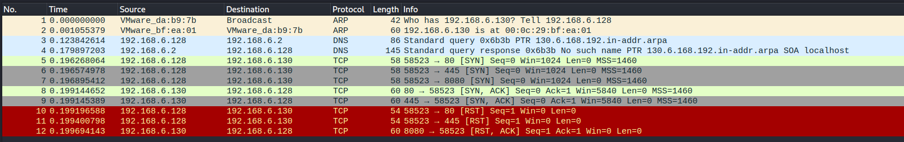

# Section 1: course 2: Assessment Methodologies: Footprinting & Scanning    

### Table of Contents

- [Host Discovery](#Host-Discovery)
- [Port Scanning](#Port-Scanning)
- [Firewall/IDS Evasion](#firewallids-evasion)
- [Optimizing nmap scan](#optimizing-nmap-scan)

<br />

---

### Host Discovery

```bash
└─# fping -a -g 192.168.6.0/24 2> /dev/null           
192.168.6.2
192.168.6.128
```

<br />

```bash
└─# nmap -sn 192.168.6.0/24  => only sends arp packets
Starting Nmap 7.94 ( https://nmap.org ) at 2023-12-30 07:42 EST
Nmap scan report for 192.168.6.1
Host is up (0.0013s latency).

Nmap scan report for 192.168.6.2
Host is up (0.00017s latency).

Nmap scan report for 192.168.6.132
Host is up (0.0014s latency).

Nmap scan report for 192.168.6.254
Host is up (0.00022s latency).

Nmap scan report for 192.168.6.128
Host is up.
Nmap done: 256 IP addresses (5 hosts up) scanned in 2.14 seconds

```

<br />

```bash
─# nmap -sn 192.168.6.0/24 --send-ip   => sends arp, icmp, tcp packets (to port 80,443)
Starting Nmap 7.94 ( https://nmap.org ) at 2023-12-30 08:58 EST
Nmap scan report for 192.168.6.2
Host is up (0.00017s latency).

Nmap scan report for 192.168.6.129
Host is up (0.0057s latency).

Nmap scan report for 192.168.6.128
Host is up.
Nmap done: 256 IP addresses (3 hosts up) scanned in 23.49 seconds

```

<br />

scan the IPs from text file

```bash
─# nmap -sn -iL targets.txt
```


by default, nmap sends a TCP SYN packet to port 80 to the target, if the port is closed, the host responds with RST packet,but if the port is open, the host responds with TCP SYN ACK packet

firewall may be configured to drop RST packets, and as a result, you may need to specify custom ports on the host that you want to send SYN probs to.


use -PS to perform TCP SYN packet to the target,

- if the host is online

  - and the port is open, it will respond with TCP SYN ACK packet, then the nmap will respond with RST packet

  - and the port is closed, it will respond with RST packet (on kali no response !!!)

- if the host is offline, it will not respond

so based on the response, we can determine if the host is online or not 

**Note:** if there is a firewall that configured to block RST packets, it may affect the accuracy of the scan result.

```bash
└─# nmap  -PS 192.168.6.129    => perform TCP SYN scan over 1000 ports
Starting Nmap 7.94 ( https://nmap.org ) at 2023-12-30 11:01 EST
Nmap scan report for 192.168.6.129
Host is up (0.00066s latency).
Not shown: 988 filtered tcp ports (no-response), 10 filtered tcp ports (host-prohibited)
PORT   STATE SERVICE
22/tcp open  ssh
80/tcp open  http

Nmap done: 1 IP address (1 host up) scanned in 5.38 seconds

---------------------------------------------------------------------------------------

─# nmap -sn -PS 192.168.6.129
-sn to skip the port scan and just focus on the host discovery
-PS to perform TCP SYN scan
and the scan will be fast and determine if the host is up or not with no port scanning

└─# nmap -sn -PS 192.168.6.129  => just host discovery not port scanning, scan using ARP packets
Starting Nmap 7.94 ( https://nmap.org ) at 2023-12-30 10:56 EST
Nmap scan report for 192.168.6.129
Host is up (0.00034s latency).
Nmap done: 1 IP address (1 host up) scanned in 0.15 seconds


```


**Note:** Mistake in `Host Discovery With Nmap - Part 2`   :clock1:10:00

the instructor said that you can determine the ports with that options but what happens that nmap scaned the target over 1000 ports in all cases showed down not with the specified ports in -PS(port). he also said that it will send the packet to port 80 by defaults and that's wrong 

```bash
still just host discovery only with arp packets
└─# nmap -sn -PS3389 192.168.6.129
└─# nmap -sn -PS22 192.168.6.129
└─# nmap -sn -PS1-1000 192.168.6.129
Starting Nmap 7.94 ( https://nmap.org ) at 2023-12-30 11:34 EST
Nmap scan report for 192.168.6.129
Host is up (0.00037s latency).
Nmap done: 1 IP address (1 host up) scanned in 0.24 seconds

---------------------------------------------------------------------------------------

TCP SYN port scanning over 1000 ports  not with the specified ports in -PS(port) 
└─# nmap -PS3389 192.168.6.129
└─# nmap -PS22 192.168.6.129
└─# nmap -PS1-1000 192.168.6.129
Starting Nmap 7.94 ( https://nmap.org ) at 2023-12-30 11:38 EST
Nmap scan report for 192.168.6.129
Host is up (0.00092s latency).
Not shown: 988 filtered tcp ports (no-response), 10 filtered tcp ports (host-prohibited)
PORT   STATE SERVICE
22/tcp open  ssh
80/tcp open  http

---------------------------------------------------------------------------------------


```


##### determine specific port with TCP SYN scan on open port 


```bash
└─# nmap -PS 192.168.6.129 -p22
Starting Nmap 7.94 ( https://nmap.org ) at 2023-12-30 11:40 EST
Nmap scan report for 192.168.6.129
Host is up (0.00046s latency).

PORT   STATE SERVICE
22/tcp open  ssh

Nmap done: 1 IP address (1 host up) scanned in 0.36 seconds

```


##### determine specific port with TCP SYN scan on closed port with no firewall, nmap will respond with `closed`


```bash
└─# nmap -PS 192.168.6.129 -p25
Starting Nmap 7.94 ( https://nmap.org ) at 2023-12-30 11:47 EST
Nmap scan report for 192.168.6.129
Host is up (0.00042s latency).

PORT   STATE    SERVICE
25/tcp closed smtp

Nmap done: 1 IP address (1 host up) scanned in 0.38 seconds
```


<br />

##### determine specific port with TCP SYN scan on closed port with firewall enabled, nmap will respond with `filtered`

“Nmap cannot determine whether the port is open because packet filtering prevents its probes from reaching the port. The filtering could be from a dedicated firewall device, router rules, or host-based firewall software. These ports frustrate attackers because they provide so little information. Sometimes they respond with ICMP error messages such as type 3 code 13 (destination unreachable: communication administratively prohibited), but filters that simply drop probes without responding are far more common. This forces Nmap to retry several times just in case the probe was dropped due to network congestion rather than filtering. This slows down the scan dramatically.”


```bash
└─# nmap -PS 192.168.6.129 -p25
Starting Nmap 7.94 ( https://nmap.org ) at 2023-12-30 11:47 EST
Nmap scan report for 192.168.6.129
Host is up (0.00042s latency).

PORT   STATE    SERVICE
25/tcp filtered smtp

Nmap done: 1 IP address (1 host up) scanned in 0.38 seconds

```


<br />

##### nmap ACK scan 14:36 (to be continue later)

nmap will send a TCP packet with ACK flag set to port 80 to the target 

if the host is

- offline, the host will not respond 
- online, it will respond with RST packet because if the 3-way handshake doesn't establish properly it sends RST packet because the ACK was send without an existing valid TCP connection


```bash
└─# nmap -sn -PA 192.168.6.129       
Starting Nmap 7.94 ( https://nmap.org ) at 2023-12-30 12:28 EST
Nmap scan report for 192.168.6.129
Host is up (0.00036s latency).
Nmap done: 1 IP address (1 host up) scanned in 0.15 seconds

```

<br />


#### host discovery with ping scan ICMP

```bash
└─# nmap  -sn -PE 192.168.6.130 --send-ip
Starting Nmap 7.94 ( https://nmap.org ) at 2023-12-30 13:00 EST
Nmap scan report for 192.168.6.130
Host is up (0.00032s latency).
Nmap done: 1 IP address (1 host up) scanned in 0.21 seconds

```


<br />

---


### Port Scanning

nmap by default performs host discovery and if the host is up, it performs port scanning using TCP SYN scan

```bash
└─# nmap 192.168.6.129
```

<br />

skip host discovery and perform the default port scan

```bash
└─# nmap -Pn 192.168.6.129
```

<br />

perform fast scan (scan 100 ports instead of 1000 ports)

```bash
└─# nmap -Pn -F 192.168.6.129
```

<br />

##### TCP SYN port scanning (the default scan if you are the root)

the SYN scan is considered stealthy because it does not complete the 3-way handshake and as a result, this avoids the creation of connection log entries on the target system because most OSes log the creation TCP sessions of the established TCP connection.

also because it does not complete the 3-way handshake, it is considered to be faster

```bash
└─# nmap -Pn -p80,445,8080 192.168.6.130
OR
└─# nmap -Pn -sS -p80,445,8080 192.168.6.130
Starting Nmap 7.94 ( https://nmap.org ) at 2023-12-31 12:18 EST
Nmap scan report for 192.168.6.130
Host is up (0.0016s latency).

PORT     STATE  SERVICE
80/tcp   open   http
445/tcp  open   microsoft-ds
8080/tcp closed http-proxy

Nmap done: 1 IP address (1 host up) scanned in 0.33 seconds

```




nmap will send SYN packet to the target, if the target is online and the port is

- open, the target will respond with SYN ACK, then nmap will respond with RST
- closed,  the target will respond with RST ACK


<br />

##### TCP connect port scanning (the default scan if you are not the root)

```bash
└─# nmap -Pn -sT  192.168.6.130 -p80,445,8080
Starting Nmap 7.94 ( https://nmap.org ) at 2023-12-31 13:02 EST
Nmap scan report for 192.168.6.130
Host is up (0.0013s latency).

PORT     STATE  SERVICE
80/tcp   open   http
445/tcp  open   microsoft-ds
8080/tcp closed http-proxy

Nmap done: 1 IP address (1 host up) scanned in 0.13 seconds

```


nmap will send SYN packet to the target, if the target is online and the port is

- open, the target will respond with SYN ACK, then nmap will respond with ACK to complete the the 3-way handshake and establish a TCP connection, then nmap will terminate the connection with RST ACK
- closed,  the target will respond with RST ACK

**Note: **it 's not recommended to use this option because it 's very loud on the network and easy to detect by IDS but if there is no concern for detection and the accuracy is required, you can use it 


<br />

##### UDP port scanning (the default scan if you are not the root)

```bash
└─# nmap -Pn -sU  192.168.6.130 -p22,53,80
Starting Nmap 7.94 ( https://nmap.org ) at 2023-12-31 13:38 EST
Nmap scan report for 192.168.6.130
Host is up (0.0044s latency).

PORT   STATE  SERVICE
22/udp closed ssh
53/udp open   domain
80/udp closed http

Nmap done: 1 IP address (1 host up) scanned in 0.34 seconds

```


<br />

##### service version & OS version detection

```bash
└─# nmap -sV -O 192.168.6.130                  
Starting Nmap 7.94 ( https://nmap.org ) at 2024-01-01 09:58 EST
Nmap scan report for 192.168.6.130
Host is up (0.0015s latency).
Not shown: 977 closed tcp ports (reset)
PORT     STATE SERVICE     VERSION
21/tcp   open  ftp         vsftpd 2.3.4
22/tcp   open  ssh         OpenSSH 4.7p1 Debian 8ubuntu1 (protocol 2.0
8009/tcp open  ajp13       Apache Jserv (Protocol v1.3)
8180/tcp open  http        Apache Tomcat/Coyote JSP engine 1.1
Device type: general purpose
Running: Linux 2.6.X
OS CPE: cpe:/o:linux:linux_kernel:2.6
OS details: Linux 2.6.9 - 2.6.33
Network Distance: 1 hop
Service Info: Hosts:  metasploitable.localdomain, irc.Metasploitable.LAN; OSs: Unix, Linux; CPE: cpe:/o:linux:linux_kernel

OS and Service detection performed. Please report any incorrect results at https://nmap.org/submit/ .
Nmap done: 1 IP address (1 host up) scanned in 14.67 seconds

```

<br />

if nmap can not determine the OS, we can tell nmap to try to guess it

```bash
└─# nmap -O --osscan-guess 192.168.6.130                                                         
```


specify the version intensity level (from 0 to 9) 

the higher intensity level increases the possibility of correctness 


<br />

##### nmap scripting engine (NSE)

to list all nmap scripts

```bash
root@attackdefense:~# ls -l /usr/share/nmap/scripts/
```

<br />

to list all nmap scripts related to http

```bash
root@attackdefense:~# ls -l /usr/share/nmap/scripts/ | grep -i "http"
```

<br />

##### gather system info with NSE

`-sC` option: whenever nmap has scripts that are applicable to run on the opened ports, it will run (if it is save to run and not exploit it or cause any damage)
with `-O` option we could not know accurate result of the OS, but because we know that mongodb runs on port 6421 and nmap ran **mongodb-databases**  script and gathered information related to mongodb, we found OS and the distribution and its version  

 sysInfo = Linux lgw01-12 3.19.0-25-generic #26~14.04.1-Ubuntu SMP Fri Jul 24 21:16:20 UTC 2015 x86_64 BOOST_LIB_VERSION=1_58

OS: Linux 

kernel version: 3.19.0-25-generic

distro: Ubuntu 14.04.1

we also found the name of databases (local, admin)

the host name of the target is victim-1:6421

mongodb version: 2.6.10

so now we can start looking for vulnerabilities that affect mongodb version or the version of ubuntu

```bash
root@attackdefense:~# nmap -Pn -sC -sV 192.206.203.3 -p- 
Starting Nmap 7.70 ( https://nmap.org ) at 2024-01-01 16:28 UTC
Nmap scan report for target-1 (192.206.203.3)
Host is up (0.0000080s latency).
Not shown: 65532 closed ports
PORT      STATE SERVICE VERSION
6421/tcp  open  mongodb MongoDB 2.6.10 2.6.10
| mongodb-databases: 
|   totalSize = 83886080.0
|   ok = 1.0
|   databases
|     1
|       name = admin
|       sizeOnDisk = 1.0
|       empty = true
|     0
|       name = local
|       sizeOnDisk = 83886080.0
|_      empty = false
| mongodb-info: 
|   MongoDB Build info
|     compilerFlags = -Wnon-virtual-dtor -Woverloaded-virtual -fPIC -fno-strict-aliasing -ggdb -pthread -Wall -Wsign-compare -Wno-unused-function -Wno-unused-variable -Wno-maybe-uninitialized -Wno-unknown-pragmas -Winvalid-pch -pipe -Werror -O3 -Wno-unused-local-typedefs -Wno-unused-function -Wno-deprecated-declarations -fno-builtin-memcmp
|     version = 2.6.10
|     ok = 1.0
|     sysInfo = Linux lgw01-12 3.19.0-25-generic #26~14.04.1-Ubuntu SMP Fri Jul 24 21:16:20 UTC 2015 x86_64 BOOST_LIB_VERSION=1_58
|     OpenSSLVersion = OpenSSL 1.0.2g  1 Mar 2016
|     maxBsonObjectSize = 16777216
|     debug = false
|  
|     host = victim-1:6421
41288/tcp open  achat   AChat chat system
55413/tcp open  ftp     vsftpd 3.0.3
MAC Address: 02:42:C0:CE:CB:03 (Unknown)
Service Info: OS: Unix
```

<br />

and to run more mongodb nmap scripts

```bash
root@attackdefense:~# ls -l /usr/share/nmap/scripts/ | grep -i "mongo"
-rw-r--r-- 1 root root  2578 Jan  9  2019 mongodb-brute.nse
-rw-r--r-- 1 root root  2583 Jan  9  2019 mongodb-databases.nse
-rw-r--r-- 1 root root  3663 Jan  9  2019 mongodb-info.nse
```

<br />

to know more about the script if it 's safe or not 

```bash
root@attackdefense:~# nmap --script-help=mongodb-databases
Starting Nmap 7.70 ( https://nmap.org ) at 2024-01-01 16:58 UTC

mongodb-databases
Categories: default discovery safe
https://nmap.org/nsedoc/scripts/mongodb-databases.html
  Attempts to get a list of tables from a MongoDB database.
```

Categories: **default discovery safe**

<br />

```bash
root@attackdefense:~# nmap --script-help=mongodb-brute.nse
Starting Nmap 7.70 ( https://nmap.org ) at 2024-01-01 16:58 UTC

mongodb-brute
Categories: intrusive brute
https://nmap.org/nsedoc/scripts/mongodb-brute.html
  Performs brute force password auditing against the MongoDB database.
```

Categories: **intrusive brute**

<br />

to run the script `--script=script_name` and determine the port number

```bash
root@attackdefense:~# nmap -Pn -sV  --script=mongodb-brute.nse 192.206.203.3 -p6421
Starting Nmap 7.70 ( https://nmap.org ) at 2024-01-01 17:02 UTC
Nmap scan report for target-1 (192.206.203.3)
Host is up (0.00011s latency).

PORT     STATE SERVICE VERSION
6421/tcp open  mongodb MongoDB 2.6.10
|_mongodb-brute: No authentication needed
MAC Address: 02:42:C0:CE:CB:03 (Unknown)

```

<br />

##### gather info about the target from the second port (port 41288)

```bash
root@attackdefense:~# nmap -Pn -sV  192.206.203.3 -p-
Starting Nmap 7.70 ( https://nmap.org ) at 2024-01-01 17:14 UTC
Nmap scan report for target-1 (192.206.203.3)
Host is up (0.0000080s latency).
Not shown: 65532 closed ports
PORT      STATE SERVICE   VERSION
6421/tcp  open  mongodb   MongoDB 2.6.10
41288/tcp open  memcached Memcached
55413/tcp open  ftp       vsftpd 3.0.3
MAC Address: 02:42:C0:CE:CB:03 (Unknown)
Service Info: OS: Unix

root@attackdefense:~# ls -l /usr/share/nmap/scripts/ | grep -i "memcache"
-rw-r--r-- 1 root root  5655 Jan  9  2019 memcached-info.nse

root@attackdefense:~# nmap -Pn -sV  --script=memcached-info.nse 192.206.203.3 -p41288
Starting Nmap 7.70 ( https://nmap.org ) at 2024-01-01 17:13 UTC
Nmap scan report for target-1 (192.206.203.3)
Host is up (0.000064s latency).

PORT      STATE SERVICE   VERSION
41288/tcp open  memcached Memcached
| memcached-info: 
|   Process ID: 27
|   Uptime: 4202 seconds
|   Server time: 2024-01-01T17:13:20
|   Architecture: 64 bit
|   Used CPU (user): 0.292532
|   Used CPU (system): 0.244622
|   Current connections: 2
|   Total connections: 7
|   Maximum connections: 1024
|   TCP Port: 41288
|   UDP Port: 0
|_  Authentication: no
MAC Address: 02:42:C0:CE:CB:03 (Unknown)

Service detection performed. Please report any incorrect results at https://nmap.org/submit/ .
Nmap done: 1 IP address (1 host up) scanned in 6.46 seconds
```

<br />

##### gather info about the target from the third port (port 55413 ftp) and run all nmap scripts related to FTP

```bash
root@attackdefense:~# nmap -Pn -sV  --script=ftp-* 192.206.203.3 -p 55413 
```


<br />


### Firewall/IDS Evasion

with `-sA` option: if there is a firewall, the result state will be **filtered**. if not it will be **unfiltered**

```bash
└─# nmap -Pn -sA 192.168.6.130 -p 445,3389                 
Starting Nmap 7.94 ( https://nmap.org ) at 2024-01-01 12:57 EST
Nmap scan report for 192.168.6.130
Host is up (0.00082s latency).

PORT     STATE      SERVICE
445/tcp  unfiltered microsoft-ds
3389/tcp unfiltered ms-wbt-server

```

<br />

to evade the IDS detection or to make it harder to detect the port scan is to utilize fragmented packets (take the nmap packets and fragment them into smaller packets)

```bash
└─# nmap -Pn -sS -F -f 192.168.6.130            
```

<br />

##### you can specify the MTU.

nmap will create 8-byte packets causing a confusion to the firewall. Have in mind that the MTU number must be a multiple of 8 (8,16,24,32 etc).

```bash
└─# nmap -Pn -sS -F -f --mtu 8 192.168.6.130            
```

<br />

##### Decoy ip address (spoofing)

the first ip in the network most common is reserved for the gateway. in the purpose of spoofing, we will make nmap looks like it comes from the gateway ip (the packets will be sent from the gateway ip (spoof the ip address of the gateway) ) with `-D ` option

```bash
└─# nmap -Pn -sS -sV -p445,3389 -f --data-length 200 -D 192.168.6.1 192.168.6.130       
```

<br />

##### spoof the src port with `-g` option

```bash
└─# nmap -Pn -sS -sV -p445,3389 -f --data-length 200 -g 53 -D 192.168.6.1 192.168.6.130       
```

<br />

### Optimizing nmap scan

if you need to slow down your scan in case of dealing with IDS to make the scan looks like less suspicious.


##### use `-T 0` or `-T 1`  

```bash
└─# nmap -Pn -T0 192.168.6.130       
```

<br />

##### use `--scan-delay`  to specify the amount of time between each packet

```bash
└─# nmap -Pn -sS --scan-delay 10s 192.168.6.130       
```

<br />

##### use `--host-timeout` to determine the max time that nmap tries to get info from the target. 

```bash
└─# nmap -Pn -sS -F --host-timeout 5s 192.168.6.0/24       
```


---

---

### Null Scan

The null scan does not set any flag; all six flag bits are set to zero. You can choose this scan using the `-sN` option. A TCP packet with no flags set will not trigger any response when it reaches an open port, as shown in the figure below. Therefore, from Nmap’s perspective, a lack of reply in a null scan indicates that either the port is open or a firewall is blocking the packet.


However, we expect the target server to respond with an RST packet if the port is closed. Consequently, we can use the lack of RST response to figure out the ports that are not closed: open or filtered.


Below is an example of a null scan against a Linux server. The null scan we carried out has successfully identified the six open ports on the target system. Because the null scan relies on the lack of a response to infer that the port is not closed, it cannot indicate with certainty that these ports are open; there is a possibility that the ports are not responding due to a firewall rule.

Pentester Terminal

```bash
pentester@TryHackMe$ sudo nmap -sN 10.10.169.246

Starting Nmap 7.60 ( https://nmap.org ) at 2021-08-30 10:30 BST
Nmap scan report for 10.10.169.246
Host is up (0.00066s latency).
Not shown: 994 closed ports
PORT    STATE         SERVICE
22/tcp  open|filtered ssh
25/tcp  open|filtered smtp
80/tcp  open|filtered http
110/tcp open|filtered pop3
111/tcp open|filtered rpcbind
143/tcp open|filtered imap
MAC Address: 02:45:BF:8A:2D:6B (Unknown)

Nmap done: 1 IP address (1 host up) scanned in 96.50 seconds
```

Note that many Nmap options require root privileges. Unless you are running Nmap as root, you need to use `sudo` as in the example above using the `-sN` option.


### FIN Scan

The FIN scan sends a TCP packet with the FIN flag set. You can choose this scan type using the `-sF` option. Similarly, no response will be sent if the TCP port is open. Again, Nmap cannot be sure if the port is open or if a firewall is blocking the traffic related to this TCP port.


However, the target system should respond with an RST if the port is closed. Consequently, we will be able to know which ports are closed and use this knowledge to infer the ports that are open or filtered. It's worth noting some firewalls will 'silently' drop the traffic without sending an RST.


Below is an example of a FIN scan against a Linux server. The result is quite similar to the result we obtained earlier using a null scan.

Pentester Terminal

```bash
pentester@TryHackMe$ sudo nmap -sF 10.10.169.246

Starting Nmap 7.60 ( https://nmap.org ) at 2021-08-30 10:32 BST
Nmap scan report for 10.10.169.246
Host is up (0.0018s latency).
Not shown: 994 closed ports
PORT    STATE         SERVICE
22/tcp  open|filtered ssh
25/tcp  open|filtered smtp
80/tcp  open|filtered http
110/tcp open|filtered pop3
111/tcp open|filtered rpcbind
143/tcp open|filtered imap
MAC Address: 02:45:BF:8A:2D:6B (Unknown)

Nmap done: 1 IP address (1 host up) scanned in 96.52 seconds
```


### Xmas Scan

The Xmas scan gets its name after Christmas tree lights. An Xmas scan sets the FIN, PSH, and URG flags simultaneously. You can select Xmas scan with the option `-sX`.

Like the Null scan and FIN scan, if an RST packet is received, it means that the port is closed. Otherwise, it will be reported as open|filtered.

The following two figures show the case when the TCP port is open and the case when the TCP port is closed.


The console output below shows an example of a Xmas scan against a Linux server. The obtained results are pretty similar to that of the null scan and the FIN scan.

Pentester Terminal

```bash
pentester@TryHackMe$ sudo nmap -sX 10.10.169.246

Starting Nmap 7.60 ( https://nmap.org ) at 2021-08-30 10:34 BST
Nmap scan report for 10.10.169.246
Host is up (0.00087s latency).
Not shown: 994 closed ports
PORT    STATE         SERVICE
22/tcp  open|filtered ssh
25/tcp  open|filtered smtp
80/tcp  open|filtered http
110/tcp open|filtered pop3
111/tcp open|filtered rpcbind
143/tcp open|filtered imap
MAC Address: 02:45:BF:8A:2D:6B (Unknown)

Nmap done: 1 IP address (1 host up) scanned in 84.85 seconds
```

One scenario where these three scan types can be efficient is when scanning a target behind a stateless (non-stateful) firewall. A stateless firewall will check if the incoming packet has the SYN flag set to detect a connection attempt. Using a flag combination that does not match the SYN packet makes it possible to deceive the firewall and reach the system behind it. However, a stateful firewall will practically block all such crafted packets and render this kind of scan useless.


### TCP ACK Scan

Let’s start with the TCP ACK scan. As the name implies, an ACK scan will send a TCP packet with the ACK flag set. Use the `-sA` option to choose this scan. As we show in the figure below, the target would respond to the ACK with RST regardless of the state of the port. This behaviour happens because a TCP packet with the ACK flag set should be sent only in response to a received TCP packet to acknowledge the receipt of some data, unlike our case. Hence, this scan won’t tell us whether the target port is open in a simple setup.


In the following example, we scanned the target VM before installing a firewall on it. As expected, we couldn’t learn which ports were open.

Pentester Terminal

```bash
pentester@TryHackMe$ sudo nmap -sA MACHINE_IP

Starting Nmap 7.60 ( https://nmap.org ) at 2021-08-30 10:37 BST
Nmap scan report for MACHINE_IP
Host is up (0.0013s latency).
All 1000 scanned ports on MACHINE_IP are unfiltered
MAC Address: 02:45:BF:8A:2D:6B (Unknown)

Nmap done: 1 IP address (1 host up) scanned in 1.68 seconds
```

This kind of scan would be helpful if there is a firewall in front of the target. Consequently, based on which ACK packets resulted in responses, you will learn which ports were not blocked by the firewall. In other words, this type of scan is more suitable to discover firewall rule sets and configuration.

After setting up the target VM `MACHINE_IP` with a firewall, we repeated the ACK scan. This time, we received some interesting results. As seen in the console output below, we have three ports that aren't being blocked by the firewall. This result indicates that the firewall is blocking all other ports except for these three ports.

Pentester Terminal

```bash
pentester@TryHackMe$ sudo nmap -sA MACHINE_IP

Starting Nmap 7.60 ( https://nmap.org ) at 2021-09-07 11:34 BST
Nmap scan report for MACHINE_IP
Host is up (0.00046s latency).
Not shown: 997 filtered ports
PORT    STATE      SERVICE
22/tcp  unfiltered ssh
25/tcp  unfiltered smtp
80/tcp  unfiltered http
MAC Address: 02:78:C0:D0:4E:E9 (Unknown)

Nmap done: 1 IP address (1 host up) scanned in 15.45 seconds
```


### Window Scan

Another similar scan is the TCP window scan. The TCP window scan is almost the same as the ACK scan; however, it examines the TCP Window field of the RST packets returned. On specific systems, this can reveal that the port is open. You can select this scan type with the option `-sW`. As shown in the figure below, we expect to get an RST packet in reply to our “uninvited” ACK packets, regardless of whether the port is open or closed.


Similarly, launching a TCP window scan against a Linux system with no firewall will not provide much information. As we can see in the console output below, the results of the window scan against a Linux server with no firewall didn’t give any extra information compared to the ACK scan executed earlier.

Pentester Terminal

```bash
pentester@TryHackMe$ sudo nmap -sW MACHINE_IP

Starting Nmap 7.60 ( https://nmap.org ) at 2021-08-30 10:38 BST
Nmap scan report for MACHINE_IP
Host is up (0.0011s latency).
All 1000 scanned ports on ip-10-10-252-27.eu-west-1.compute.internal (10.10.252.27) are closed
MAC Address: 02:45:BF:8A:2D:6B (Unknown)

Nmap done: 1 IP address (1 host up) scanned in 1.60 seconds
```

However, as you would expect, if we repeat our TCP window scan against a server behind a firewall, we expect to get more satisfying results. In the console output shown below, the TCP window scan pointed that three ports are detected as closed. (This is in contrast with the ACK scan that labelled the same three ports as unfiltered.) Although we know that these three ports are not closed, we realize they responded differently, indicating that the firewall does not block them.

Pentester Terminal

```bash
pentester@TryHackMe$ sudo nmap -sW MACHINE_IP

Starting Nmap 7.60 ( https://nmap.org ) at 2021-09-07 11:39 BST
Nmap scan report for MACHINE_IP
Host is up (0.00040s latency).
Not shown: 997 filtered ports
PORT    STATE  SERVICE
22/tcp  closed ssh
25/tcp  closed smtp
80/tcp  closed http
MAC Address: 02:78:C0:D0:4E:E9 (Unknown)

Nmap done: 1 IP address (1 host up) scanned in 14.84 seconds
```


### Custom Scan

If you want to experiment with a new TCP flag combination beyond the built-in TCP scan types, you can do so using `--scanflags`. For instance, if you want to set SYN, RST, and FIN simultaneously, you can do so using `--scanflags RSTSYNFIN`. As shown in the figure below, if you develop your custom scan, you need to know how the different ports will behave to interpret the results in different scenarios correctly.

x

Finally, it is essential to note that the ACK scan and the window scan were very efficient at helping us map out the firewall rules. However, it is vital to remember that just because a firewall is not blocking a specific port, it does not necessarily mean that a service is listening on that port. For example, there is a possibility that the firewall rules need to be updated to reflect recent service changes. Hence, ACK and window scans are exposing the firewall rules, not the services.


### Spoofing and Decoys

In some network setups, you will be able to scan a target system using a spoofed IP address and even a spoofed MAC address. Such a scan is only beneficial in a situation where you can guarantee to capture the response. If you try to scan a target from some random network using a spoofed IP address, chances are you won’t have any response routed to you, and the scan results could be unreliable.

The following figure shows the attacker launching the command `nmap -S SPOOFED_IP MACHINE_IP`. Consequently, Nmap will craft all the packets using the provided source IP address `SPOOFED_IP`. The target machine will respond to the incoming packets sending the replies to the destination IP address `SPOOFED_IP`. For this scan to work and give accurate results, the attacker needs to monitor the network traffic to analyze the replies.


In brief, scanning with a spoofed IP address is three steps:

1. Attacker sends a packet with a spoofed source IP address to the target machine.
2. Target machine replies to the spoofed IP address as the destination.
3. Attacker captures the replies to figure out open ports.

In general, you expect to specify the network interface using `-e` and to explicitly disable ping scan `-Pn`. Therefore, instead of `nmap -S SPOOFED_IP MACHINE_IP`, you will need to issue `nmap -e NET_INTERFACE -Pn -S SPOOFED_IP MACHINE_IP` to tell Nmap explicitly which network interface to use and not to expect to receive a ping reply. It is worth repeating that this scan will be useless if the attacker system cannot monitor the network for responses.

When you are on the same subnet as the target machine, you would be able to spoof your MAC address as well. You can specify the source MAC address using `--spoof-mac SPOOFED_MAC`. This address spoofing is only possible if the attacker and the target machine are on the same Ethernet (802.3) network or same WiFi (802.11).

Spoofing only works in a minimal number of cases where certain conditions are met. Therefore, the attacker might resort to using decoys to make it more challenging to be pinpointed. The concept is simple, make the scan appear to be coming from many IP addresses so that the attacker’s IP address would be lost among them. As we see in the figure below, the scan of the target machine will appear to be coming from 3 different sources, and consequently, the replies will go the decoys as well.


You can launch a decoy scan by specifying a specific or random IP address after `-D`. For example, `nmap -D 10.10.0.1,10.10.0.2,ME MACHINE_IP` will make the scan of MACHINE_IP appear as coming from the IP addresses 10.10.0.1, 10.10.0.2, and then `ME` to indicate that your IP address should appear in the third order. Another example command would be `nmap -D 10.10.0.1,10.10.0.2,RND,RND,ME MACHINE_IP`, where the third and fourth source IP addresses are assigned randomly, while the fifth source is going to be the attacker’s IP address. In other words, each time you execute the latter command, you would expect two new random IP addresses to be the third and fourth decoy sources.


### Fragmented Packets

### Firewall

A firewall is a piece of software or hardware that permits packets to pass through or blocks them. It functions based on firewall rules, summarized as blocking all traffic with exceptions or allowing all traffic with exceptions. For instance, you might block all traffic to your server except those coming to your web server. A traditional firewall inspects, at least, the IP header and the transport layer header. A more sophisticated firewall would also try to examine the data carried by the transport layer.

### IDS

An intrusion detection system (IDS) inspects network packets for select behavioural patterns or specific content signatures. It raises an alert whenever a malicious rule is met. In addition to the IP header and transport layer header, an IDS would inspect the data contents in the transport layer and check if it matches any malicious patterns. How can you make it less likely for a traditional firewall/IDS to detect your Nmap activity? It is not easy to answer this; however, depending on the type of firewall/IDS, you might benefit from dividing the packet into smaller packets.

### Fragmented Packets

Nmap provides the option `-f` to fragment packets. Once chosen, the IP data will be divided into 8 bytes or less. Adding another `-f` (`-f -f` or `-ff`) will split the data into 16 byte-fragments instead of 8. You can change the default value by using the `--mtu`; however, you should always choose a multiple of 8.

To properly understand fragmentation, we need to look at the IP header in the figure below. It might look complicated at first, but we notice that we know most of its fields. In particular, notice the source address taking 32 bits (4 bytes) on the fourth row, while the destination address is taking another 4 bytes on the fifth row. The data that we will fragment across multiple packets is highlighted in red. To aid in the reassembly on the recipient side, IP uses the identification (ID) and fragment offset, shown on the second row of the figure below.


Let’s compare running `sudo nmap -sS -p80 10.20.30.144` and `sudo nmap -sS -p80 -f 10.20.30.144`. As you know by now, this will use stealth TCP SYN scan on port 80; however, in the second command, we are requesting Nmap to fragment the IP packets.

In the first two lines, we can see an ARP query and response. Nmap issued an ARP query because the target is on the same Ethernet. The second two lines show a TCP SYN ping and a reply. The fifth line is the beginning of the port scan; Nmap sends a TCP SYN packet to port 80. In this case, the IP header is 20 bytes, and the TCP header is 24 bytes. Note that the minimum size of the TCP header is 20 bytes.


With fragmentation requested via `-f`, the 24 bytes of the TCP header will be divided into multiples of 8 bytes, with the last fragment containing 8 bytes or less of the TCP header. Since 24 is divisible by 8, we got 3 IP fragments; each has 20 bytes of IP header and 8 bytes of TCP header. We can see the three fragments between the fifth and the seventh lines.


Note that if you added `-ff` (or `-f -f`), the fragmentation of the data will be multiples of 16. In other words, the 24 bytes of the TCP header, in this case, would be divided over two IP fragments, the first containing 16 bytes and the second containing 8 bytes of the TCP header.

On the other hand, if you prefer to increase the size of your packets to make them look innocuous, you can use the option `--data-length NUM`, where num specifies the number of bytes you want to append to your packets.


### Idle/Zombie Scan

Spoofing the source IP address can be a great approach to scanning stealthily. However, spoofing will only work in specific network setups. It requires you to be in a position where you can monitor the traffic. Considering these limitations, spoofing your IP address can have little use; however, we can give it an upgrade with the idle scan.

The idle scan, or zombie scan, requires an idle system connected to the network that you can communicate with. Practically, Nmap will make each probe appear as if coming from the idle (zombie) host, then it will check for indicators whether the idle (zombie) host received any response to the spoofed probe. This is accomplished by checking the IP identification (IP ID) value in the IP header. You can run an idle scan using `nmap -sI ZOMBIE_IP MACHINE_IP`, where `ZOMBIE_IP` is the IP address of the idle host (zombie).

The idle (zombie) scan requires the following three steps to discover whether a port is open:

1. Trigger the idle host to respond so that you can record the current IP ID on the idle host.
2. Send a SYN packet to a TCP port on the target. The packet should be spoofed to appear as if it was coming from the idle host (zombie) IP address.
3. Trigger the idle machine again to respond so that you can compare the new IP ID with the one received earlier.

Let’s explain with figures. In the figure below, we have the attacker system probing an idle machine, a multi-function printer. By sending a SYN/ACK, it responds with an RST packet containing its newly incremented IP ID.


The attacker will send a SYN packet to the TCP port they want to check on the target machine in the next step. However, this packet will use the idle host (zombie) IP address as the source. Three scenarios would arise. In the first scenario, shown in the figure below, the TCP port is closed; therefore, the target machine responds to the idle host with an RST packet. The idle host does not respond; hence its IP ID is not incremented.


In the second scenario, as shown below, the TCP port is open, so the target machine responds with a SYN/ACK to the idle host (zombie). The idle host responds to this unexpected packet with an RST packet, thus incrementing its IP ID.


In the third scenario, the target machine does not respond at all due to firewall rules. This lack of response will lead to the same result as with the closed port; the idle host won’t increase the IP ID.

For the final step, the attacker sends another SYN/ACK to the idle host. The idle host responds with an RST packet, incrementing the IP ID by one again. The attacker needs to compare the IP ID of the RST packet received in the first step with the IP ID of the RST packet received in this third step. If the difference is 1, it means the port on the target machine was closed or filtered. However, if the difference is 2, it means that the port on the target was open.

It is worth repeating that this scan is called an idle scan because choosing an idle host is indispensable for the accuracy of the scan. If the “idle host” is busy, all the returned IP IDs would be useless.


### OS Detection and Traceroute

#### OS Detection

Nmap can detect the Operating System (OS) based on its behaviour and any telltale signs in its responses. OS detection can be enabled using `-O`; this is an *uppercase O* as in OS. In this example, we ran `nmap -sS -O 10.10.37.133` on the AttackBox. Nmap detected the OS to be Linux 3.X, and then it guessed further that it was running kernel 3.13.

Pentester Terminal

```bash
pentester@TryHackMe$ sudo nmap -sS -O 10.10.37.133

Starting Nmap 7.60 ( https://nmap.org ) at 2021-09-10 05:04 BST
Nmap scan report for 10.10.37.133
Host is up (0.00099s latency).
Not shown: 994 closed ports
PORT    STATE SERVICE
22/tcp  open  ssh
25/tcp  open  smtp
80/tcp  open  http
110/tcp open  pop3
111/tcp open  rpcbind
143/tcp open  imap
MAC Address: 02:A0:E7:B5:B6:C5 (Unknown)
Device type: general purpose
Running: Linux 3.X
OS CPE: cpe:/o:linux:linux_kernel:3.13
OS details: Linux 3.13
Network Distance: 1 hop

OS detection performed. Please report any incorrect results at https://nmap.org/submit/ .
Nmap done: 1 IP address (1 host up) scanned in 3.91 seconds
```

The system that we scanned and attempted to detect its OS version is running kernel version 3.16. Nmap was able to make a close guess in this case. In another case, we scanned a Fedora Linux system with kernel 5.13.14; however, Nmap detected it as Linux 2.6.X. The good news is that Nmap detected the OS correctly; the not-so-good news is that the kernel version was wrong.

The OS detection is very convenient, but many factors might affect its accuracy. First and foremost, Nmap needs to find at least one open and one closed port on the target to make a reliable guess. Furthermore, the guest OS fingerprints might get distorted due to the rising use of virtualization and similar technologies. Therefore, always take the OS version with a grain of salt.

#### Traceroute

If you want Nmap to find the routers between you and the target, just add `--traceroute`. In the following example, Nmap appended a traceroute to its scan results. Note that Nmap’s traceroute works slightly different than the `traceroute` command found on Linux and macOS or `tracert` found on MS Windows. Standard `traceroute` starts with a packet of low TTL (Time to Live) and keeps increasing until it reaches the target. Nmap’s traceroute starts with a packet of high TTL and keeps decreasing it.

In the following example, we executed `nmap -sS --traceroute 10.10.37.133` on the AttackBox. We can see that there are no routers/hops between the two as they are connected directly.

Pentester Terminal

```bash
pentester@TryHackMe$ sudo nmap -sS --traceroute 10.10.37.133

Starting Nmap 7.60 ( https://nmap.org ) at 2021-09-10 05:05 BST
Nmap scan report for 10.10.37.133
Host is up (0.0015s latency).
Not shown: 994 closed ports
PORT    STATE SERVICE
22/tcp  open  ssh
25/tcp  open  smtp
80/tcp  open  http
110/tcp open  pop3
111/tcp open  rpcbind
143/tcp open  imap
MAC Address: 02:A0:E7:B5:B6:C5 (Unknown)

TRACEROUTE
HOP RTT     ADDRESS
1   1.48 ms MACHINE_IP

Nmap done: 1 IP address (1 host up) scanned in 1.59 seconds
```


### Refernces:

- https://tryhackme.com/room/nmap03
