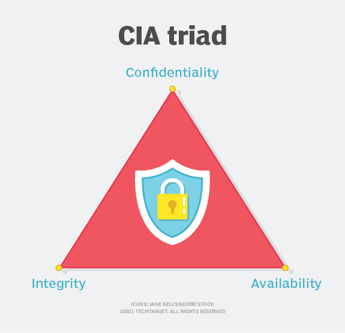
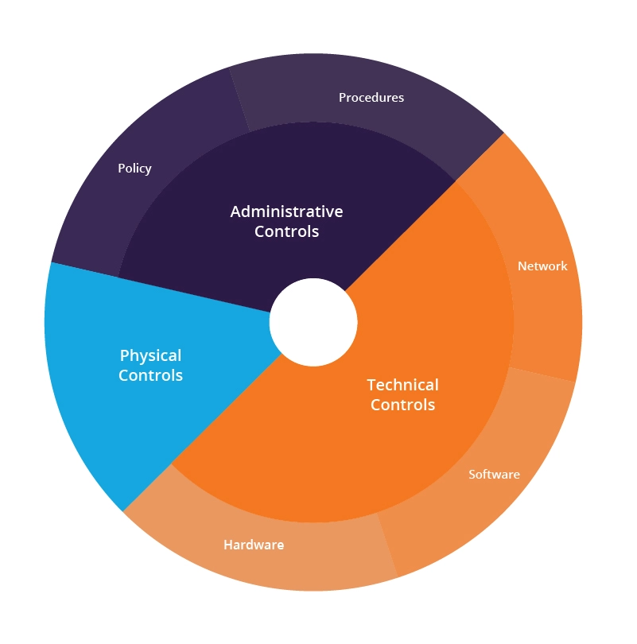

# Section 2 course 1: Assessment Methodologies: Auditing Fundamentals    

### Table of Contents

- [Auditing Fundamentals](#auditing-fundamentals)
- [Practice](#practice)

 

---

### Auditing Fundamentals

**What is cybersecurity?**

Cybersecurity is the protection of internet-connected systems such as  hardware, software and data from cyberthreats. The practice is used by  individuals and enterprises to protect against unauthorized access to  data centers and other computerized systems.

 

**What are the benefits of cybersecurity?**

The benefits of implementing and maintaining cybersecurity practices include:

- Business protection against cyberattacks and data breaches.
- Protection for data and networks.
- Prevention of unauthorized user access.
- Improved recovery time after a breach.
- Protection for end users and endpoint devices.
- Regulatory compliance.
- Business continuity.
- Improved confidence in the company's reputation and trust for developers, partners, customers, stakeholders and employees.

 

**What is the CIA triad (confidentiality, integrity and availability)?**

The CIA triad refers to confidentiality, integrity and availability, describing a model designed to guide policies for information security  (infosec) within an organization. The model is sometimes referred to as  the AIC triad -- which stands for availability, integrity and  confidentiality -- to avoid confusion with the Central Intelligence  Agency.

**Confidentiality.** Roughly equivalent to privacy,  confidentiality measures are designed to prevent sensitive information  from unauthorized access attempts. It's common for data to be classified according to the amount and type of damage that could be done if it  fell into the wrong hands. More or less stringent data security measures can then be implemented according to those categories.

**Integrity.** The consistency, accuracy and  trustworthiness of data must be maintained over its entire lifecycle.  Data must not be changed in transit, and steps must be taken to ensure  it can't be altered by unauthorized people -- for example, in data  breaches.

**Availability.** Information should be consistently and  readily accessible for authorized parties. This involves properly  maintaining hardware and technical infrastructure and systems that hold  and display the information.

---

 

**What is Defense-in-depth**

Defense-in-depth is an information assurance strategy that provides  multiple, redundant defensive measures in case a security control fails  or a vulnerability is exploited. It originates from a military strategy  by the same name, which seeks to delay the advance of an attack, rather  than defeating it with one strong line of defense.

"Defense in depth" (DiD) is a cyber security strategy that uses multiple security products and practices to safeguard an organization’s network, web properties, and resources. It is sometimes used interchangeably  with the term "layered security" because it depends on security  solutions at multiple control layers — physical, technical, and  administrative — to prevent attackers from reaching a protected network  or on-premise resource.

**Defense-in-depth architecture: Layered security**

Defense-in-depth security architecture is based on controls that are  designed to protect the physical, technical and administrative aspects  of your network.

Defense in depth, layered security architecture

- **Physical controls** – These controls include security measures that prevent physical access to IT systems, such as security guards or locked doors.
- **Technical controls** – Technical controls include  security measures that protect network systems or resources using  specialized hardware or software, such as a firewall appliance or  antivirus program.
- **Administrative controls** – Administrative controls  are security measures consisting of policies or procedures directed at  an organization’s employees, e.g., instructing users to label sensitive  information as “confidential”.

Additionally, the following security layers help protect individual facets of your network:

- **Access measures** – Access measures include authentication controls, biometrics, timed access and VPN.
- **Workstation defenses** – Workstation defense measures include antivirus and anti-spam software.
- **Data protection** – Data protection methods include data at rest encryption, hashing, secure data transmission and encrypted backups.
- **Perimeter defenses** – Network perimeter defenses include firewalls, intrusion detection systems and intrusion prevention systems.
- **Monitoring and prevention** – The monitoring and prevention of network attacks involves logging and auditing network activity, vulnerability scanners, sandboxing and security awareness training.

---

 

**What Is Cybersecurity Compliance?**

Cyber security compliance is the process of ensuring that a company  complies with industry standards, legislation, and regulations  pertaining to data privacy and information security. Most of the  companies handling digital assets may need to comply with various cyber  security rules and regulations. 

To get compliant, organizations must adopt risk-based controls to  safeguard the confidentiality, integrity, and availability (CIA) of  information. The information must be secured whether it is being kept,  processed, integrated, or transferred.

Although requirements for compliance vary by industry and sector,  they often ask for the use of a variety of particular organizational  processes and technologies to protect data. Controls are obtained from a variety of sources, including CIS, the [NIST cyber security Framework](https://sprinto.com/blog/nist-800-53-guide/), and [ISO 27001](https://sprinto.com/blog/iso-27001-compliance/).

Cyber compliance refers to the process of ensuring that an  organization adheres to industry regulations, standards, and laws  related to information security and data privacy. Many different types  of organizations may need to comply with various cyber security  regulations and standards. Some examples include:

- Healthcare organizations, which may need to comply with [HIPAA regulations](https://www.hhs.gov/hipaa/for-professionals/privacy/index.html) that protect patient health information.
- Financial institutions, which may need to comply with [PCI-DSS regulations](https://www.techtarget.com/searchsecurity/definition/PCI-DSS-Payment-Card-Industry-Data-Security-Standard) that protect credit card data.
- Retailers and e-commerce companies, which may need to comply with PCI-DSS  regulations if they accept credit card payments online.
- Companies that handle personal data of European citizens, which may need to comply with the [General Data Protection Regulation](https://gdpr-info.eu/art-4-gdpr) (GDPR).
- Companies that operate in certain industries, such as defense or energy, which  may be subject to regulations specific to their sector and industry  standards such as [ISO 27001](https://www.cssia.org/wp-content/uploads/2020/01/ISO_27001_Standard.pdf), [NIST](https://www.nist.gov/cyberframework) or [CMMC](https://dodcio.defense.gov/CMMC).

 

**Why Should Cyber Compliance Be a Top Priority**

It’s vital for businesses to be on top of their compliances for a variety of reasons, including:

- **To protect sensitive data**: Compliance with regulations and standards helps to ensure that an  organization is taking the necessary steps to protect sensitive  information, such as personal data and financial information. This can  help to prevent data breaches, which can result in significant financial losses and damage to an organization's reputation.
- **Being compliant for legal requirements:** Failing to comply with regulations and standards can result in  significant fines and penalties, as well as legal action. Compliance is  important to avoid these risks and ensure compliance with laws and  regulations.
- **To maintain customer trust**:  Compliance with regulations and standards can demonstrate to customers  and partners that an organization takes data security and privacy  seriously, which can help to build trust and maintain positive  relationships.
- **Improving overall security posture**: The process of achieving and maintaining compliance can also help to  improve an organization's overall security posture. This can include  identifying and addressing vulnerabilities, implementing best practices, and regularly assessing and testing security controls.
- **To obtain cyber insurance**: Many companies have cyber insurance that requires compliance with  certain standards and regulations. Non-compliance can lead to denial of  claims and can make companies more vulnerable to a cyberattack.

 

**What is PCI DSS (Payment Card Industry Data Security Standard)?**

The Payment Card Industry Data Security Standard (PCI DSS) is a  widely accepted set of policies and procedures intended to optimize the security of credit, debit and cash card transactions and protect cardholders  against misuse of their personal information. PCI DSS was designed to  prevent cybersecurity breaches of sensitive data and reduce the risk of  fraud for organizations that handle payment card information.

PCI DSS is not a law or legal regulatory requirement. However, it is often part of contractual obligations businesses that process and store credit, debit and other payment card transactions adhere to.  Contractually obligated organizations must meet the requirements of PCI  DSS to establish and maintain a secure environment for their clients.

---

**Cyber Security Audit Frameworks**

- ISO/IEC 27001
- NIST Cybersecurity Framework
- COBIT
- CIS
- CMMC
- ASD

 

---

### Practice

- [SCAP Scan and Stigviewer](https://www.youtube.com/watch?v=6ehIeAxzXSY)
- nmap
- [Nessus](https://www.youtube.com/watch?v=TA1rCRyHRsM&t=1788s)

 

---

**References**

- https://www.techtarget.com/whatis/definition/Confidentiality-integrity-and-availability-CIA
- https://www.imperva.com/learn/application-security/defense-in-depth/
- https://www.cloudflare.com/learning/security/glossary/what-is-defense-in-depth/
- https://www.in.gov/cybersecurity/blog/posts/cyber-compliance-101-what-it-is-and-why-its-needed/
- https://sprinto.com/blog/cyber-security-compliance/
- https://www.techtarget.com/searchsecurity/definition/PCI-DSS-Payment-Card-Industry-Data-Security-Standard
